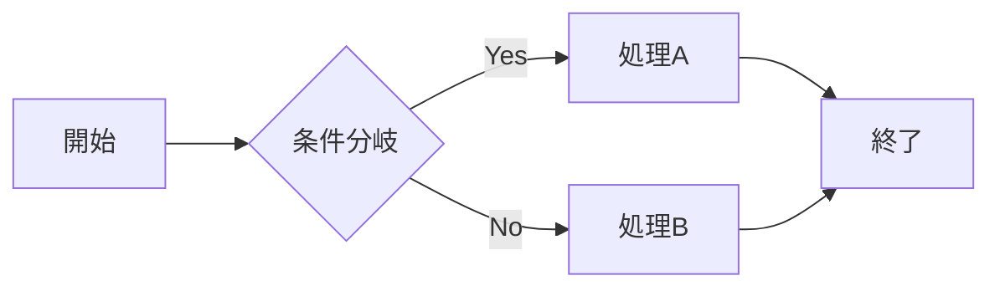

# 演習問題（exercises）作成ルール

exercises フォルダ内のマークダウンファイル作成・編集時に適用するルールです。

---

## 基本原則

1. **テンプレート遵守**: 必ず `exercises/templates/exercise-template.md` に従って作成する
2. **確認必須**: テンプレートにないセクションや形式を追加する場合は、必ずユーザーに確認を取ること
3. **一貫性**: 既存の演習ファイル（exercise-01.md など）と形式を揃える

---

## ファイル命名規則

- ファイル名: `exercise-XX.md`（XX は2桁のゼロ埋め番号）
- 例: `exercise-01.md`, `exercise-02.md`, `exercise-10.md`

---

## 番号の付け方

- 演習問題の連番は **難易度順** に振る（初級 → 中級 → 上級 → エキスパート）
- 番号は `exercises/ROADMAP.md` と整合性を保つこと
- 新しい演習を追加・削除した場合は、ROADMAP.md も合わせて更新する

---

## 図の記法ルール

### AWS構成図

AWS構成図は **Mermaid architecture-beta** 記法を使用する。

**重要な制約:**
- **ラベルは英語のみ**（日本語は非サポート、パースエラーになる）
- 図の直下に日本語の役割説明テーブルを追加する

```mermaid
architecture-beta
    group aws(cloud)[AWS Cloud]

    group api_layer(server)[API Layer] in aws
    group data_layer(server)[Data Layer] in aws

    service user(internet)[User]
    service apigw(logos:aws-api-gateway)[API Gateway] in api_layer
    service lambda(logos:aws-lambda)[Lambda] in api_layer
    service dynamodb(logos:aws-dynamodb)[DynamoDB] in data_layer

    user:R --> L:apigw
    apigw:B --> T:lambda
    lambda:R --> L:dynamodb
```



| コンポーネント | 役割 |
|----------------|------|
| **User** | ユーザー（APIを呼び出す） |
| **API Gateway** | APIエンドポイント |
| **Lambda** | ビジネスロジック実行 |
| **DynamoDB** | データ永続化 |

**使用可能なアイコン種別:**

| アイコン | 用途 |
|----------|------|
| `cloud` | クラウド全体のグループ |
| `server` | サーバー/コンピューティング |
| `database` | データベース |
| `disk` | ストレージ |
| `internet` | インターネット/ユーザー |

**AWSサービスアイコン（logos パック）:**

主要なAWSアイコンは `logos:aws-xxx` 形式で使用可能：

| アイコン名 | サービス |
|------------|----------|
| `logos:aws-lambda` | Lambda |
| `logos:aws-api-gateway` | API Gateway |
| `logos:aws-s3` | S3 |
| `logos:aws-dynamodb` | DynamoDB |
| `logos:aws-cloudwatch` | CloudWatch |
| `logos:aws-sns` | SNS |
| `logos:aws-sqs` | SQS |
| `logos:aws-ec2` | EC2 |
| `logos:aws-rds` | RDS |
| `logos:aws-cognito` | Cognito |
| `logos:aws-cloudfront` | CloudFront |
| `logos:aws-ecs` | ECS |
| `logos:aws-eks` | EKS |
| `logos:aws-kinesis` | Kinesis |
| `logos:aws-step-functions` | Step Functions |

アイコンがない場合は汎用アイコン（`server`, `database` 等）を使用する。

### その他の図（フローチャート、シーケンス図など）

- **推奨**: Mermaid記法（flowchart, sequenceDiagram, etc.）
- **許容**: 素のMarkdownテーブル
- **禁止**: アスキーアート（ASCII art）



---

## 必須セクション（テンプレート準拠）

以下のセクションは必須。テンプレートの順序・形式に従う：

1. **タイトルと難易度バッジ**
2. **分類情報**（テーブル形式）
3. **学習するAWSサービス**（メイン/補助に分けて記載）
4. **最終構成図**（Mermaid architecture-beta）
5. **シナリオ**（企業プロフィール、課題、KPI）
6. **達成目標**（技術的な学習ポイント、実務で活かせる知識）
7. **前提条件**（事前知識、準備するもの、IAM権限）

---

## オプションセクション

以下はオプション。必要に応じて追加：

- 使用するAWSサービス（詳細版）
- ヒント（details/summary形式）
- よくある間違い
- トラブルシューティング課題
- 設計の考察ポイント
- 発展課題
- 想定コストと削減方法
- クリーンアップチェックリスト
- 学習のポイント
- 次のステップ

---

## 難易度バッジ

以下から選択：

| バッジ | 難易度 | 目安 |
|--------|--------|------|
| 🟢 初級 | 初級 | AWS入門者向け |
| 🟡 中級 | 中級 | 基本サービスを理解している方向け |
| 🔴 上級 | 上級 | 複数サービスの連携経験がある方向け |
| 🟣 エキスパート | エキスパート | 本番運用経験がある方向け |

---

## テンプレート外の追加について

テンプレートに定義されていない以下の要素を追加する場合は、**必ずユーザーに確認を取ること**：

- 新規セクション
- テンプレートと異なるテーブル構造
- 独自のフォーマット・記法
- テンプレートにないメタ情報

確認例:
```
テンプレートにない「GCPとの比較」セクションを追加しようとしています。
追加してもよろしいですか？
```

---

## 企業名の表記

シナリオ内の企業名は具体名を伏せ、**「〇〇株式会社」** で統一する。

- OK: `〇〇株式会社`
- NG: `QuickEats株式会社`、`サンプル株式会社`、`ABC Corp`

---

## 禁止事項

- アスキーアート（ASCII art）の使用
- テンプレートの必須セクションの省略
- 難易度バッジの不統一な表記
- ユーザー確認なしでのテンプレート外要素の追加
- 具体的な企業名の使用（〇〇株式会社で統一）

---

## 参考

- テンプレート: [exercise-template.md](exercises/templates/exercise-template.md)
- 記法参考: [Mermaid Architecture Diagram](https://mermaid.js.org/syntax/architecture.html)
