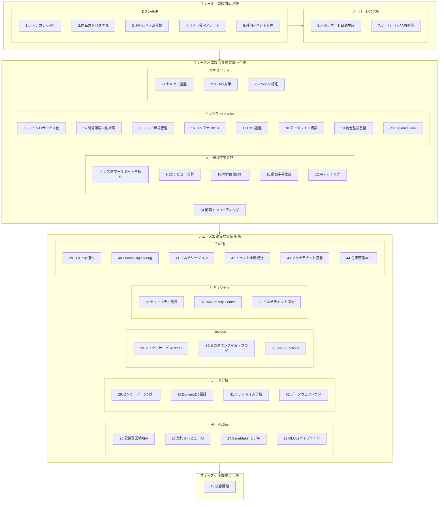

# AWS学習ロードマップ（45問・難易度順）

GCP経験者向けのAWS実践演習。初級から統合課題まで段階的にスキルアップできる構成です。

## 全体概要

| フェーズ | 問題数 | 推定学習時間 | 対象レベル |
|----------|--------|--------------|------------|
| フェーズ1: 基礎固め | 7問 | 24〜32時間 | 初級 |
| フェーズ2: 実践力養成 | 17問 | 85〜115時間 | 初級〜中級 |
| フェーズ3: 高度な実装 | 20問 | 115〜150時間 | 中級 |
| フェーズ4: 実践統合 | 1問 | 8〜10時間 | 上級 |
| **合計** | **45問** | **約232〜307時間** | - |

---

## フェーズ1: 基礎固め（初級）【7問】

AWSの基本サービスとモダンアーキテクチャの基礎を学びます。

### 1-1. サーバーレス・API入門（2問）

| # | タイトル | カテゴリ | 所要時間 |
|---|----------|----------|----------|
| 1 | [ランチガチャAPI](exercise-01.md) | サーバーレス / API | 3〜4h |
| 2 | [商品カタログ写真の自動アーカイブ](exercise-02.md) | ストレージ管理 / イベント駆動 | 3〜4h |

### 1-2. 監視・コスト管理入門（2問）

| # | タイトル | カテゴリ | 所要時間 |
|---|----------|----------|----------|
| 3 | [予約システムの死活監視](exercise-03.md) | 監視 / オブザーバビリティ | 3〜4h |
| 4 | [AWSコスト異常アラート](exercise-04.md) | コスト管理 / FinOps | 2〜3h |

### 1-3. コンテナ・データベース入門（1問）

| # | タイトル | カテゴリ | 所要時間 |
|---|----------|----------|----------|
| 5 | [社内イベント管理システム](exercise-05.md) | コンテナ / データベース | 5〜6h |

### 1-4. サーバーレス応用（2問）

| # | タイトル | カテゴリ | 所要時間 |
|---|----------|----------|----------|
| 6 | [FinanceFlow 月次レポート自動生成](exercise-06.md) | バッチ処理 / SaaS | 4〜5h |
| 7 | [旅行予約サイトのサーバーレスAPI基盤](exercise-07.md) | マイクロサービス・API | 4〜5h |

---

## フェーズ2: 実践力養成（初級〜中級）【17問】

本格的なアプリケーション構築とAIの実践的な活用パターンを学びます。

### 2-1. AI・機械学習入門（5問）

| # | タイトル | カテゴリ | 所要時間 |
|---|----------|----------|----------|
| 8 | [カスタマーサポート自動化システム](exercise-08.md) | AI / カスタマーサポート | 6〜8h |
| 9 | [ECレビュー分析・インサイト抽出](exercise-09.md) | AI / データ分析 / EC | 6〜7h |
| 10 | [物件画像自動分析システム](exercise-10.md) | AI / 画像分析 / 不動産テック | 5〜7h |
| 11 | [動画教材自動字幕生成](exercise-11.md) | AI / メディア処理 / EdTech | 5〜6h |
| 12 | [AIマッチング非同期処理](exercise-12.md) | バッチ処理 / AI / 人材サービス | 5〜6h |

### 2-2. マイクロサービス・API（1問）

| # | タイトル | カテゴリ | 所要時間 |
|---|----------|----------|----------|
| 13 | [ヘルスケアアプリのマイクロサービス化](exercise-13.md) | マイクロサービス・API | 6〜7h |

### 2-3. IaC・DevOps（2問）

| # | タイトル | カテゴリ | 所要時間 |
|---|----------|----------|----------|
| 14 | [スタートアップの開発環境自動構築](exercise-14.md) | IaC・DevOps | 4〜5h |
| 15 | [ゲーム会社のマルチ環境管理](exercise-15.md) | IaC・DevOps | 5〜6h |

### 2-4. コンテナ（2問）

| # | タイトル | カテゴリ | 所要時間 |
|---|----------|----------|----------|
| 16 | [スタートアップのコンテナCI/CD構築](exercise-16.md) | コンテナ | 4〜5h |
| 17 | [ニュースメディアのCMS基盤](exercise-17.md) | コンテナ | 5〜6h |

### 2-5. データ基盤（1問）

| # | タイトル | カテゴリ | 所要時間 |
|---|----------|----------|----------|
| 18 | [EC企業のデータレイク構築](exercise-18.md) | データ基盤 | 5〜6h |

### 2-6. オブザーバビリティ・ガバナンス（2問）

| # | タイトル | カテゴリ | 所要時間 |
|---|----------|----------|----------|
| 19 | [配車サービスの統合監視基盤](exercise-19.md) | オブザーバビリティ・監視 | 4〜5h |
| 20 | [AWS基盤設計（Organizations + Landing Zone）](exercise-20.md) | マルチアカウント戦略・ガバナンス | 5〜6h |

### 2-7. セキュリティ（3問）

| # | タイトル | カテゴリ | 所要時間 |
|---|----------|----------|----------|
| 21 | [金融系SaaSのセキュア基盤](exercise-21.md) | セキュリティ | 5〜6h |
| 22 | [グローバルWebサービスのDDoS対策](exercise-22.md) | セキュリティ | 4〜5h |
| 23 | [MedConnect Cognito認証基盤](exercise-23.md) | 認証・認可 / セキュリティ | 4〜5h |

### 2-8. メディア処理（1問）

| # | タイトル | カテゴリ | 所要時間 |
|---|----------|----------|----------|
| 24 | [動画エンコーディングパイプライン](exercise-24.md) | バッチ処理 / メディア | 5〜6h |

---

## フェーズ3: 高度な実装（中級）【20問】

IaC、CI/CD、セキュリティ、MLOpsなど高度なトピックを学びます。

### 3-1. AI・MLOps（4問）

| # | タイトル | カテゴリ | 所要時間 |
|---|----------|----------|----------|
| 25 | [設備異常検知AIモデル運用基盤](exercise-25.md) | AI / IoT / 製造業 / MLOps | 8〜10h |
| 26 | [契約書レビュー支援システム](exercise-26.md) | AI / ドキュメント処理 / リーガルテック | 8〜10h |
| 27 | [SageMaker モデル基盤（需要予測）](exercise-27.md) | 機械学習 / SageMaker | 6〜8h |
| 28 | [CreditAI MLOpsパイプライン](exercise-28.md) | MLOps / 機械学習パイプライン | 6〜8h |

### 3-2. データ基盤・分析（4問）

| # | タイトル | カテゴリ | 所要時間 |
|---|----------|----------|----------|
| 29 | [センサーデータ集計・異常検知レポート](exercise-29.md) | バッチ処理 / データ基盤 / IoT | 7〜9h |
| 30 | [DynamoDB実践設計（シングルテーブル）](exercise-30.md) | データベース / NoSQL設計 | 5〜6h |
| 31 | [モバイルアプリのリアルタイム分析基盤](exercise-31.md) | データ基盤 | 5〜6h |
| 32 | [小売業のデータウェアハウス](exercise-32.md) | データ基盤 | 6〜7h |

### 3-3. IaC・DevOps（3問）

| # | タイトル | カテゴリ | 所要時間 |
|---|----------|----------|----------|
| 33 | [広告テック企業のマイクロサービスCI/CD](exercise-33.md) | IaC・DevOps | 6〜7h |
| 34 | [Fintech企業のゼロダウンタイムデプロイ](exercise-34.md) | IaC・DevOps | 5〜6h |
| 35 | [PayEasy Step Functionsワークフロー](exercise-35.md) | サーバーレス / ワークフロー | 5〜6h |

### 3-4. セキュリティ・コンプライアンス（3問）

| # | タイトル | カテゴリ | 所要時間 |
|---|----------|----------|----------|
| 36 | [ヘルスケア企業のセキュリティ監視基盤](exercise-36.md) | セキュリティ・コンプライアンス | 5〜6h |
| 37 | [TechCorp IAM Identity Center](exercise-37.md) | 認証・認可 / セキュリティ | 5〜6h |
| 38 | [TeamHub マルチテナントSaaS認証](exercise-38.md) | 認証・認可 / セキュリティ | 5〜6h |

### 3-5. コスト管理・信頼性（2問）

| # | タイトル | カテゴリ | 所要時間 |
|---|----------|----------|----------|
| 39 | [マーケティングSaaSのAWSコスト最適化](exercise-39.md) | コスト管理・最適化 | 4〜5h |
| 40 | [ShopNow Chaos Engineering](exercise-40.md) | 信頼性エンジニアリング | 5〜6h |

### 3-6. グローバル・マルチリージョン（1問）

| # | タイトル | カテゴリ | 所要時間 |
|---|----------|----------|----------|
| 41 | [グローバル展開のマルチリージョン構成](exercise-41.md) | グローバルアーキテクチャ | 6〜7h |

### 3-7. マイクロサービス・コンテナ（3問）

| # | タイトル | カテゴリ | 所要時間 |
|---|----------|----------|----------|
| 42 | [物流企業のイベント駆動配送管理](exercise-42.md) | マイクロサービス・API | 5〜6h |
| 43 | [SaaS企業のマルチテナント基盤](exercise-43.md) | コンテナ | 6〜8h |
| 44 | [小売チェーンの在庫管理API](exercise-44.md) | マイクロサービス・API | 6〜7h |

---

## フェーズ4: 実践統合（上級）【1問】

複数の技術領域を統合した本格的なアーキテクチャを構築します。

| # | タイトル | カテゴリ | 所要時間 |
|---|----------|----------|----------|
| 45 | [統合課題 - AWSアーキテクチャ総合演習](exercise-45.md) | 統合課題 | 8〜10h |

---

## 学習パス早見表

---

## 推奨学習スケジュール

| 期間 | フェーズ | 問題数 | 1日2時間の場合 | 1日4時間の場合 |
|------|----------|--------|----------------|----------------|
| 第1-2週 | フェーズ1 | 7問 | 2週間 | 1週間 |
| 第3-9週 | フェーズ2 | 17問 | 7週間 | 3.5週間 |
| 第10-17週 | フェーズ3 | 20問 | 8週間 | 4週間 |
| 第18週 | フェーズ4 | 1問 | 1週間 | 3日 |
| **合計** | - | **45問** | **約4.5ヶ月** | **約2.5ヶ月** |

---

## 学習のコツ

1. **順番通りに進める** - 前の課題の知識が次の課題で活きます
2. **手を動かす** - 読むだけでなく実際にAWS環境で構築しましょう
3. **トラブルシューティング** - エラーが出ても諦めず、原因を調査する力をつけましょう
4. **コスト管理** - 課題39で学んだコスト意識を常に持ちましょう
5. **復習** - 各フェーズ終了時に振り返りチェックリストを確認しましょう
