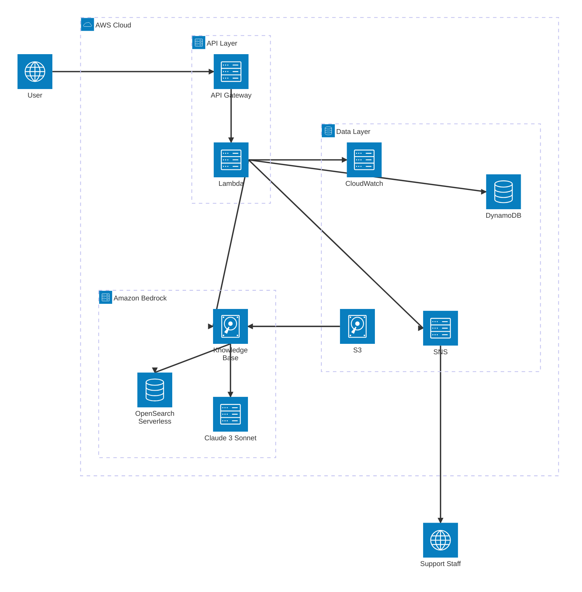

# 課題1: 〇〇株式会社のカスタマーサポート自動化システム構築

**難易度: 🟡 中級**

---

## 1. 分類情報

| 項目 | 内容 |
|------|------|
| 難易度 | 初級〜中級 |
| カテゴリ | AI / カスタマーサポート |
| 処理タイプ | リアルタイム / 非同期 |
| 使用IaC | CloudFormation |
| 所要時間 | 6〜8時間 |

---

## 2. 学習するAWSサービス

この演習では以下のAWSサービスを実践的に学習します。

### メインサービス

| サービス | 役割 | 学習ポイント |
|----------|------|-------------|
| **Amazon Bedrock** | 生成AIによる回答生成 | Claude 3モデルの呼び出し、プロンプトエンジニアリング |
| **Bedrock Knowledge Base** | FAQの検索・RAG | ベクトル検索、Retrieval-Augmented Generation |
| **Amazon OpenSearch Serverless** | ベクトルストア | Knowledge Baseのバックエンド、埋め込みベクトル管理 |
| **Amazon S3** | FAQドキュメント保存 | Knowledge Baseのデータソース |
| **Amazon DynamoDB** | 会話履歴・セッション管理 | NoSQLデータモデリング、TTL設定 |
| **AWS Lambda** | APIロジック処理 | サーバーレス関数、Python実装 |
| **Amazon API Gateway** | REST API提供 | REST API設計、Lambda統合 |

### 補助サービス

| サービス | 役割 |
|----------|------|
| **Amazon CloudWatch** | ログ・メトリクス・アラート監視 |
| **AWS IAM** | サービス間の権限管理 |
| **Amazon SNS** | エスカレーション通知 |

---

## 3. 最終構成図



### システム構成の説明

| レイヤー | コンポーネント | 説明 |
|----------|----------------|------|
| **API Layer** | API Gateway → Lambda | ユーザーからのリクエストを受け付け、処理を行う |
| **Amazon Bedrock** | Knowledge Base, OpenSearch Serverless, Titan Embeddings, Claude 3 | RAGによるFAQ検索と回答生成 |
| **Data Layer** | DynamoDB, S3, SNS | 会話履歴の保存、FAQデータ管理、エスカレーション通知 |
| **Monitoring** | CloudWatch | ログ収集、メトリクス監視、アラート |

---

## 4. シナリオ

### 企業プロフィール

**〇〇株式会社**は、都市部を中心に急成長中のフードデリバリースタートアップです。

| 項目 | 内容 |
|------|------|
| 業種 | フードデリバリー |
| 従業員数 | 50名（うちサポートスタッフ5名） |
| 月間アクティブユーザー | 10万人 |
| インフラ予算 | 月10万円以内 |

### 現状の課題

カスタマーサポートへの問い合わせが月間3,000件を超え、5名のサポートスタッフでは対応が追いつかなくなっています。急成長に伴い、サービス品質の低下が顧客離れを引き起こすリスクが高まっています。

### 数値で示された問題

| 指標 | 現状 | 業界平均 |
|------|------|----------|
| 平均初回応答時間 | 2時間 | 30分 |
| 平均解決時間 | 8時間 | 2時間 |
| サポートスタッフ残業 | 月平均50時間/人 | - |
| 顧客満足度（5段階） | 3.2 | 4.0 |
| 問い合わせ対応コスト | 月150万円 | - |

### 問い合わせ内訳分析

過去3ヶ月の問い合わせ3,000件を分析した結果：

| カテゴリ | 割合 | 件数/月 | 自動化可能性 |
|----------|------|---------|--------------|
| 注文状況確認 | 25% | 750件 | 高 |
| 配達時間の問い合わせ | 20% | 600件 | 高 |
| キャンセル・変更方法 | 15% | 450件 | 高 |
| クーポン・ポイント | 10% | 300件 | 高 |
| 商品の不備・クレーム | 15% | 450件 | 中（エスカレーション） |
| アプリの使い方 | 10% | 300件 | 高 |
| その他複雑な問題 | 5% | 150件 | 低 |

**定型的な問い合わせ（自動化可能）：約80%（2,400件/月）**

### 解決したいこと

1. 定型的な問い合わせの80%をAIチャットボットで自動応答
2. 平均初回応答時間を2時間から15分以内に短縮
3. サポートスタッフは複雑な問い合わせ・クレーム対応に集中
4. 24時間365日対応を実現
5. 顧客満足度を3.2から4.0以上に改善

### 成功指標（KPI）

| KPI | 現状 | 目標 |
|-----|------|------|
| AI自動応答率 | 0% | 80%以上 |
| 平均初回応答時間 | 2時間 | 15分以内 |
| 顧客満足度 | 3.2 | 4.0以上 |
| サポートコスト | 150万円/月 | 105万円/月（30%削減） |
| スタッフ残業時間 | 50時間/月 | 20時間/月以下 |

---

## 5. 達成目標

この演習で習得できるスキル：

### 技術的な学習ポイント

1. **Amazon Bedrockの実践的活用**
   - Claude 3モデルを使った自然言語処理
   - プロンプトエンジニアリングの基礎
   - RAG（Retrieval-Augmented Generation）パターンの実装

2. **サーバーレスアーキテクチャ設計**
   - Lambda + API Gatewayによるリアルタイム処理
   - DynamoDBを使ったセッション管理・履歴保存

3. **Knowledge Baseの構築と運用**
   - FAQデータのベクトル化と検索
   - Amazon OpenSearch Serverlessの活用

4. **CloudFormationによるIaC**
   - マルチリソースのテンプレート作成
   - 環境変数・パラメータ管理

### 実務で活かせる知識

- カスタマーサポート自動化の設計パターン
- 生成AIを業務システムに組み込む際のベストプラクティス
- チャットボットのUX設計（エスカレーションフロー含む）

### GCPとの比較

| 機能 | AWS | GCP |
|------|-----|-----|
| 生成AI | Amazon Bedrock | Vertex AI |
| ベクトルDB | OpenSearch Serverless | Vertex AI Vector Search |
| サーバーレス関数 | Lambda | Cloud Functions |
| APIゲートウェイ | API Gateway | API Gateway / Cloud Endpoints |

---

## 6. 使用するAWSサービス

### メインサービス

| サービス | 役割 | 選定理由 |
|----------|------|----------|
| Amazon Bedrock | 生成AIによる回答生成 | Claude 3モデルで高品質な日本語応答 |
| Bedrock Knowledge Base | FAQの検索・RAG | マネージドでベクトル検索を実現 |
| Amazon OpenSearch Serverless | ベクトルストア | Knowledge Baseのバックエンド |
| Amazon S3 | FAQドキュメント保存 | Knowledge Baseのソース |
| Amazon DynamoDB | 会話履歴・セッション管理 | 低レイテンシ、スケーラブル |
| AWS Lambda | APIロジック処理 | サーバーレスで運用負荷軽減 |
| Amazon API Gateway | REST API提供 | WebSocket対応、認証統合 |

### 補助サービス

| サービス | 役割 |
|----------|------|
| Amazon CloudWatch | ログ・メトリクス・アラート |
| AWS IAM | 権限管理 |
| AWS Secrets Manager | APIキー管理 |
| Amazon SNS | エスカレーション通知 |

---

## 7. 前提条件

### 必要な事前知識

- AWSマネジメントコンソールの基本操作
- REST APIの基本概念
- Python 3.9以上の基礎文法
- JSONの読み書き

### 準備するもの

1. **AWSアカウント**
   - Bedrockのモデルアクセス有効化（Claude 3 Sonnet）
   - 適切なIAM権限

2. **開発環境**
   - AWS CLI v2（設定済み）
   - Python 3.9以上
   - pip（boto3インストール用）
   - コードエディタ（VS Code推奨）

3. **テストデータ**
   - FAQドキュメント（演習で作成）
   - テスト用問い合わせデータ

### Bedrockモデルアクセスの有効化手順

```
1. AWSコンソール → Amazon Bedrock
2. 左メニュー「Model access」
3. 「Manage model access」クリック
4. 「Anthropic - Claude 3 Sonnet」にチェック
5. 「Request model access」
6. 数分で有効化完了
```

---

## 8. トラブルシューティング課題

### 問題1: Knowledge Baseからの検索結果が空

**症状:**
```
Knowledge Baseに問い合わせても、関連するFAQが返ってこない。
回答が一般的すぎて、〇〇固有の情報が含まれない。
```

**ヒント:**
1. Knowledge Baseの同期状態を確認してください
2. S3のFAQデータが正しいパスにあるか確認してください
3. OpenSearch Serverlessコレクションのステータスを確認してください

**解決方法:**
```bash
# 同期ジョブの状態確認
aws bedrock-agent list-ingestion-jobs \
  --knowledge-base-id <KB_ID> \
  --data-source-id <DS_ID> \
  --region ap-northeast-1

# 再同期実行
aws bedrock-agent start-ingestion-job \
  --knowledge-base-id <KB_ID> \
  --data-source-id <DS_ID> \
  --region ap-northeast-1
```

### 問題2: Lambda実行時にAccessDeniedエラー

**症状:**
```
Error: User: arn:aws:sts::xxx:assumed-role/quickeats-support-lambda-role/quickeats-chat-handler
is not authorized to perform: bedrock:InvokeModel
```

**ヒント:**
1. IAMロールにBedrockの権限が付与されているか確認
2. Bedrockのモデルアクセスが有効化されているか確認
3. リージョンが一致しているか確認

**解決方法:**
```bash
# IAMポリシー確認
aws iam list-attached-role-policies --role-name quickeats-support-lambda-role

# モデルアクセス確認（コンソールから）
# Bedrock → Model access → Claude 3 Sonnetが「Access granted」か確認
```

### 問題3: API Gatewayで504 Gateway Timeout

**症状:**
```
API呼び出しが30秒以上かかり、504エラーが返る
CloudWatch Logsには処理途中で終了した形跡がある
```

**ヒント:**
1. API Gatewayのタイムアウト設定を確認（デフォルト29秒）
2. Lambda関数のタイムアウト設定を確認
3. Bedrockの応答時間をログで確認

**解決方法:**
```bash
# Lambda タイムアウト延長（最大15分まで可能）
aws lambda update-function-configuration \
  --function-name quickeats-chat-handler \
  --timeout 60 \
  --region ap-northeast-1

# API Gatewayはコンソールから統合リクエストのタイムアウトを変更
# （最大29秒の制限あり。それ以上の場合はWebSocket APIを検討）
```

---

## 9. 設計の考察ポイント

### 1. なぜAPI Gateway + Lambdaのサーバーレス構成を選択したのか？

**考察ポイント:**
- EC2やECS常駐と比較したコスト効率
- トラフィックパターン（ピーク時と平常時の差）
- 運用負荷の軽減
- スケーラビリティの自動化

**代替案:**
- ECS Fargate: 常時接続が必要な場合
- EC2 + ALB: 大量の同時接続が必要な場合

### 2. DynamoDBを会話履歴に選択した理由は？

**考察ポイント:**
- セッションベースのアクセスパターン
- スケーラビリティ要件
- TTLによる自動削除の必要性
- コスト（オンデマンドモード）

**代替案:**
- ElastiCache (Redis): 高速だがセッション管理が複雑
- RDS: 複雑なクエリが必要な場合
- S3: 長期アーカイブ用途

### 3. RAG（Knowledge Base）を採用した利点と欠点は？

**利点:**
- FAQの更新がリアルタイムに反映
- ハルシネーションの軽減
- 根拠のある回答が可能

**欠点:**
- 検索精度の調整が必要
- OpenSearch Serverlessのコスト
- レイテンシーの増加

### 4. エスカレーション判定のロジックは適切か？

**考察ポイント:**
- キーワードベースの判定の限界
- 感情分析（Comprehend）の導入検討
- 閾値の調整方法
- False Positive/Negativeのバランス

### 5. セキュリティ面で考慮すべき点は？

**考察ポイント:**
- API Gatewayの認証（Cognito連携）
- 個人情報の取り扱い（DynamoDBの暗号化）
- ログに含まれる機密情報
- レート制限の必要性

---

## 10. 発展課題（オプション）

### 1. WebSocket APIへの移行
- リアルタイム双方向通信の実現
- ストリーミングレスポンス（タイピング中表示）
- プッシュ通知対応

### 2. Amazon Comprehendによる感情分析追加
- ユーザーの感情をリアルタイム検知
- ネガティブ判定時の自動エスカレーション
- 感情トレンドのダッシュボード化

### 3. マルチチャネル対応
- LINE公式アカウント連携
- Slack連携（社内サポート用）
- メール自動応答

### 4. A/Bテスト基盤構築
- プロンプトの改善サイクル
- 回答品質の定量評価
- CTR（クリック率）トラッキング

### 5. 多言語対応
- Amazon Translateとの連携
- 言語自動検出
- 言語別FAQ管理

---

## 11. 想定コストと削減方法

### 月額概算コスト（月間3,000リクエスト想定）

| サービス | 内訳 | 月額コスト |
|----------|------|------------|
| Amazon Bedrock (Claude 3 Sonnet) | 入力: 約300万トークン、出力: 約60万トークン | $12-15 |
| Bedrock Knowledge Base | 検索クエリ3,000回 | $0.50 |
| OpenSearch Serverless | 2 OCU（最小構成） | $350 |
| Lambda | 3,000回 × 10秒 × 256MB | $0.10 |
| API Gateway | 3,000リクエスト | $0.01 |
| DynamoDB | オンデマンド、1GB未満 | $1-2 |
| CloudWatch | ログ・メトリクス | $5 |
| **合計** | | **約$370（約55,000円）** |

### コスト削減のポイント

1. **OpenSearch Serverlessの代替検討**
   - Pinecone（無料枠あり）
   - PostgreSQL + pgvector（RDS活用）
   - → 最大$300/月削減可能

2. **Bedrockモデルの最適化**
   - Claude 3 Haikuへの切り替え（単純な質問向け）
   - → 約50%コスト削減

3. **キャッシング導入**
   - よくある質問の回答をElastiCacheにキャッシュ
   - Bedrock呼び出し回数削減

4. **Lambda Provisioned Concurrency**
   - コールドスタート対策（ただしコスト増）
   - 本番運用時のみ検討

### リソース削除手順

```bash
# 1. API Gateway削除
aws apigateway delete-rest-api --rest-api-id <API_ID> --region ap-northeast-1

# 2. Lambda関数削除
aws lambda delete-function --function-name quickeats-chat-handler --region ap-northeast-1

# 3. DynamoDBテーブル削除
aws dynamodb delete-table --table-name quickeats-chat-history --region ap-northeast-1

# 4. Knowledge Base削除（コンソールから）
# Bedrock → Knowledge bases → 削除

# 5. OpenSearch Serverlessコレクション削除（コンソールから）
# OpenSearch → Serverless → Collections → 削除

# 6. S3バケット削除
aws s3 rb s3://quickeats-support-kb-${AWS_ACCOUNT_ID} --force --region ap-northeast-1

# 7. IAMロール削除
aws iam delete-role-policy --role-name quickeats-support-lambda-role --policy-name BedrockAccess
aws iam delete-role-policy --role-name quickeats-support-lambda-role --policy-name DynamoDBAccess
aws iam delete-role --role-name quickeats-support-lambda-role

# 8. CloudWatchリソース削除
aws cloudwatch delete-alarms --alarm-names quickeats-chat-lambda-errors quickeats-chat-lambda-latency
aws cloudwatch delete-dashboards --dashboard-names 〇〇-Support-Dashboard
```

---

## 12. 学習のポイント

### 1. RAGパターンの理解
生成AIを業務システムに組み込む際の最重要パターン。外部知識（FAQ）を検索して、コンテキストとしてLLMに渡すことで、ハルシネーションを防ぎつつ正確な回答を実現する。

### 2. サーバーレスアーキテクチャの設計原則
Lambda + API Gateway + DynamoDBの組み合わせは、変動するトラフィックに対してコスト効率が高い。ただし、コールドスタートやタイムアウトの制約を理解する必要がある。

### 3. プロンプトエンジニアリングの基礎
システムプロンプトでAIの役割・制約・参考情報を明確に定義することで、回答品質を大幅に向上させられる。

### 4. エスカレーションフローの重要性
AIで100%対応することを目指さず、人間へのエスカレーションパスを最初から設計に組み込む。これが顧客満足度を維持する鍵。

### 5. オブザーバビリティの組み込み
本番運用を見据え、ログ・メトリクス・アラートを最初から設計に含める。問題発生時の原因特定を迅速に行えるようにする。
