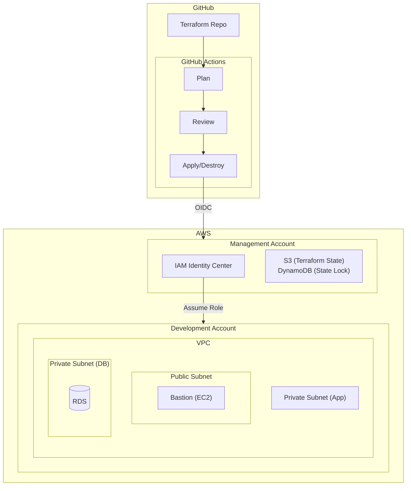

# 課題3: スタートアップの開発環境自動構築

**難易度: 🟡 中級**

---

## 1. 分類情報

| 項目 | 内容 |
|------|------|
| 難易度 | 初級〜中級 |
| カテゴリ | IaC・DevOps |
| 処理タイプ | バッチ |
| 使用IaC | Terraform |
| 想定所要時間 | 4-5時間 |

---

## 2. シナリオ

### 企業プロフィール
**〇〇株式会社**は、B2B SaaSプロダクトを開発するスタートアップです。現在エンジニアは15名で、毎月2-3名のペースで採用を進めています。

### 現状の課題
新規エンジニアのオンボーディング時、開発環境の構築に多大な時間がかかっています：

1. **環境構築の属人化**：手順書はあるが、個人のローカル環境差異で動作しないことが多い
2. **AWS権限設定の煩雑さ**：IAMユーザー作成、ポリシー設定を手動で実施
3. **開発用AWSリソースの管理不全**：個人の検証環境が乱立し、コスト管理が困難
4. **セキュリティリスク**：認証情報の共有や、過剰な権限付与が発生

### 数値で見る問題
- 新規エンジニアの環境構築時間：平均 **30分**（目標：5分）
- 環境構築での質問対応：月 **20時間**（シニアエンジニアの工数）
- 未使用の検証リソース：月額 **$500** の無駄なコスト
- セキュリティインシデント（権限関連）：四半期 **3件**

### 成功指標（KPI）
| 指標 | 現状 | 目標 |
|------|------|------|
| 環境構築時間 | 30分 | 5分以内 |
| 質問対応工数 | 20時間/月 | 5時間/月 |
| 無駄な検証リソースコスト | $500/月 | $100/月 |
| 権限関連インシデント | 3件/四半期 | 0件/四半期 |

---

## 3. 達成目標

### 主要な学習成果
1. Terraformによるマルチ環境インフラ管理の基礎を習得
2. GitHub Actionsを使ったインフラCI/CDパイプラインの構築
3. AWS IAM Identity Center（旧SSO）によるアクセス管理の理解
4. Terraform Stateの安全な管理方法の習得

### 習得するスキル
- Terraform modules による再利用可能なコード設計
- GitHub Actions workflow の作成と管理
- tfenv / terraform workspace の使い分け
- Pre-commit hooks による IaC コード品質管理
- OIDC を使った GitHub Actions ↔ AWS 認証

---

## 4. 学習するAWSサービス

### コアサービス
| サービス | 用途 | 重要度 |
|----------|------|--------|
| IAM Identity Center | エンジニアのAWSアクセス管理 | 高 |
| S3 | Terraform State 保存 | 高 |
| DynamoDB | Terraform State Lock | 高 |
| VPC | 開発環境ネットワーク | 高 |
| EC2 | 開発用踏み台サーバー | 中 |
| RDS | 開発用データベース | 中 |

### 補助サービス
| サービス | 用途 |
|----------|------|
| CloudWatch | リソース監視・アラート |
| SNS | 通知配信 |
| Secrets Manager | 認証情報管理 |
| CloudTrail | 操作ログ記録 |

---

## 5. 最終構成図

### システム構成図


### データフロー
1. エンジニアがTerraformコードをGitHubにPush
2. GitHub ActionsでPRにterraform planの結果をコメント
3. レビュー後、mainマージでterraform applyを自動実行
4. 開発者はIAM Identity Center経由で各環境にアクセス

---

## 6. 前提条件

### 必要な知識
- AWSの基本的なサービス理解（VPC、EC2、IAM）
- Gitの基本操作（clone, commit, push, PR）
- 基本的なLinuxコマンド

### 事前準備
1. AWSアカウント（Organizations設定済みが望ましい）
2. GitHubアカウント
3. Terraform CLI（v1.5以上）のローカルインストール
4. AWS CLI v2 のインストールと設定

### 環境要件
- macOS / Linux / WSL2
- VS Code + Terraform 拡張機能推奨

---

## 6. アーキテクチャ概要

### システム構成図


### データフロー
1. エンジニアがTerraformコードをGitHubにPush
2. GitHub ActionsでPRにterraform planの結果をコメント
3. レビュー後、mainマージでterraform applyを自動実行
4. 開発者はIAM Identity Center経由で各環境にアクセス

---

## 8. トラブルシューティング課題

### Challenge 1: State Lock問題
**状況**: terraform applyを実行中に別のエンジニアが同じ環境でapplyを実行しようとしてエラーが発生

```
Error: Error acquiring the state lock
Lock Info:
  ID:        xxxxxxxx-xxxx-xxxx-xxxx-xxxxxxxxxxxx
  Path:      devboost-terraform-state-XXXXX/environments/dev/terraform.tfstate
  Operation: OperationTypeApply
  Who:       user@ip-xxx-xxx-xxx-xxx
  Created:   2024-01-15 10:30:00.000000000 +0000 UTC
```

**調査ポイント**:
1. DynamoDBのLockテーブルを確認
2. 実行中のGitHub Actionsを確認
3. 必要に応じて強制解除

**解決手順の例**:
```bash
# 注意: 他のapplyが本当に実行されていないことを確認してから実行
terraform force-unlock LOCK_ID
```

### Challenge 2: OIDC認証エラー
**状況**: GitHub Actionsでterraform planが失敗

```
Error: Could not assume role with OIDC:
Not authorized to perform sts:AssumeRoleWithWebIdentity
```

**調査ポイント**:
1. IAMロールの信頼ポリシーを確認
2. GitHubリポジトリ名が正しいか確認
3. OIDCプロバイダーの設定を確認

### Challenge 3: モジュール変更の影響範囲
**状況**: VPCモジュールを変更したら、予期せず複数の環境に影響が出た

**調査ポイント**:
1. terraform planで全環境の変更を確認
2. モジュールのバージョニング戦略を検討
3. 破壊的変更のハンドリング方法

---

## 9. 設計考慮ポイント

### ディスカッション1: State管理戦略
**テーマ**: 単一State vs 環境別State vs サービス別State

| 戦略 | メリット | デメリット |
|------|----------|------------|
| 単一State | シンプル、依存関係の管理が容易 | スケールしにくい、ロック競合 |
| 環境別State | 環境の独立性、並列実行可能 | 環境間の依存管理が複雑 |
| サービス別State | マイクロサービス向け、チーム独立 | 依存関係の管理が複雑 |

**考慮すべき点**:
- チーム規模と成長見込み
- 環境間の依存関係
- デプロイ頻度

### ディスカッション2: モジュールバージョニング
**テーマ**: モジュールの変更をどう管理するか

**選択肢**:
1. Git tags でバージョニング
2. Terraform Registry（private）の活用
3. monorepo での相対パス参照

### ディスカッション3: 秘密情報の管理
**テーマ**: データベースパスワード等の管理方法

**選択肢と比較**:
| 方法 | セキュリティ | 運用負荷 | コスト |
|------|-------------|---------|--------|
| Secrets Manager | 高 | 低 | $0.40/secret/month |
| SSM Parameter Store | 中 | 低 | 無料（Standard） |
| HashiCorp Vault | 最高 | 高 | 要インフラ |

---

## 10. 発展課題

### Advanced 1: Terraform Cloud/Enterprise移行
**課題**: 現在のS3バックエンドをTerraform Cloudに移行し、以下を実現
- チーム向けのState管理UI
- Cost Estimation機能
- Policy as Code (Sentinel)

### Advanced 2: Atlantis導入
**課題**: GitHub Actionsの代わりにAtlantisを導入
- PRコメントでのterraform plan/apply
- 承認フローの実装
- ロック管理の可視化

### Advanced 3: 複数AWSアカウント対応
**課題**: AWS Organizationsを使った本格的なマルチアカウント構成
- Control Tower の活用
- Account Factory for Terraform (AFT)
- 共有サービスVPCの設計

---

## 11. コスト見積もり

### 月額コスト概算（開発環境1つの場合）

| サービス | リソース | 月額コスト |
|----------|----------|------------|
| EC2 (Bastion) | t3.micro × 1 | $7.59 |
| RDS | db.t3.micro (Single-AZ) | $12.41 |
| NAT Gateway | 2 AZ | $64.80 |
| S3 | State保存 | $0.50 |
| DynamoDB | Lock用（オンデマンド） | $0.10 |
| Secrets Manager | 1 シークレット | $0.40 |

**合計**: 約 **$86/月**（約13,000円）

### コスト削減のヒント

1. **NAT Gateway削減**: 開発環境では1 AZのみにする
   - 削減額: $32.40/月

2. **Bastion停止スケジュール**: 夜間・休日は自動停止
   - 削減額: 約$5/月

3. **RDS停止**: 未使用時の自動停止
   ```hcl
   # 開発環境のみ
   resource "aws_rds_event_subscription" "auto_stop" {
     # 実装は発展課題
   }
   ```

---

## 12. 学習のポイント

### 重要な概念の整理

1. **Terraform State**
   - リソースの現在の状態を追跡
   - チームでの共有にはリモートバックエンド必須
   - Lockによる同時実行制御

2. **GitHub Actions OIDC**
   - 長期的な認証情報を保存しない
   - 一時的な認証トークンを使用
   - リポジトリ単位でのアクセス制御

3. **モジュール設計**
   - 再利用性を考慮した入出力設計
   - 環境差異は変数で吸収
   - デフォルト値の活用

### GCPとの比較

| 概念 | AWS | GCP |
|------|-----|-----|
| IaC State保存 | S3 + DynamoDB | GCS |
| CI/CD | GitHub Actions | Cloud Build |
| シークレット管理 | Secrets Manager | Secret Manager |
| SSO | IAM Identity Center | Cloud Identity |
| 踏み台アクセス | SSM Session Manager | IAP Tunnel |

### 次のステップ
1. 複数環境（stg/prod）の追加
2. アプリケーションデプロイパイプラインの構築
3. モニタリング・アラートの設定
4. コスト管理の自動化
