# 課題4: AWSコスト異常アラート - 請求書ショックを防ぐ

**難易度: 🟢 初級**

---

## 分類情報

| 項目 | 内容 |
|------|------|
| 難易度 | 初級 |
| カテゴリ | コスト管理 / FinOps |
| 処理タイプ | バッチ（日次） |
| 使用IaC | CloudFormation |
| 想定所要時間 | 2〜3時間 |

---

## 学習するAWSサービス

この演習では以下のAWSサービスを実践的に学習します。

### メインサービス

| サービス | 役割 | 学習ポイント |
|----------|------|-------------|
| **AWS Budgets** | 予算設定・アラート | 予算作成、閾値設定、通知アクション |
| **AWS Cost Explorer** | コスト分析・可視化 | フィルタリング、グルーピング、予測 |
| **Amazon SNS** | アラート通知 | 予算超過時の通知配信 |

### 補助サービス

| サービス | 役割 |
|----------|------|
| **AWS Cost Anomaly Detection** | 異常なコスト検出 |
| **AWS Billing Console** | 請求情報の確認 |

---

## 最終構成図

```mermaid
architecture-beta
    group aws(cloud)[AWS Cloud]

    group billing(server)[Billing and Cost Management] in aws
    group notification(server)[Notification] in aws

    service budget(server)[AWS Budgets] in billing
    service anomaly(server)[Cost Anomaly Detection] in billing
    service explorer(server)[Cost Explorer] in billing
    service sns(logos:aws-sns)[SNS] in notification
    service email(internet)[Email]
    service slack(internet)[Slack]

    budget:R --> L:sns
    anomaly:R --> L:sns
    sns:R --> L:email
    sns:R --> L:slack
```



| コンポーネント | 役割 |
|----------------|------|
| **AWS Budgets** | 月額予算の設定・監視 |
| **Cost Anomaly Detection** | 異常なコストパターンの検出 |
| **Cost Explorer** | コスト分析・可視化 |
| **SNS** | コストアラートの配信 |
| **Email / Slack** | 通知の受信先 |

### 通知フロー

```
1. [AWS Budgets] 月額予算の50%, 80%, 100%到達時に通知
2. [Cost Anomaly Detection] 通常と異なるコストパターンを検出時に通知
3. [SNS] メール/Slackにアラートを配信
```

---

## シナリオ

### 企業プロフィール

**〇〇株式会社**は、AWSを使ってWebサービスを運営するスタートアップです。エンジニアが開発に集中するあまり、コスト管理がおろそかになり、月末の請求書を見て驚くことが多発しています。

| 項目 | 内容 |
|------|------|
| 業種 | IT / Webサービス |
| 従業員数 | 10名（エンジニア6名） |
| 月間AWS予算 | $500 |
| 主な利用サービス | EC2, RDS, S3, Lambda |

### 現状の課題

先月、開発環境のEC2インスタンスを停止し忘れ、月末に$800の請求が来て予算を大幅にオーバー。「気づいたら高額請求」が何度も発生しており、経営陣から改善を求められています。

### 数値で示された問題

| 指標 | 現状 | 目標 |
|------|------|------|
| 予算超過の頻度 | 月1〜2回 | 0回 |
| コスト異常の検知 | 月末に発覚 | リアルタイム |
| 無駄なリソース | 把握できていない | 即日検知 |

### 解決したいこと

1. 月額予算を設定し、超過しそうになったら通知が欲しい
2. 異常なコスト増加を早期に検知したい
3. サービス別・環境別にコストを把握したい
4. 開発チーム全員がコスト意識を持てるようにしたい

### 成功指標（KPI）

| KPI | 現状 | 目標 |
|-----|------|------|
| 予算超過 | 月1〜2回 | 0回 |
| コスト可視性 | なし | サービス別・日別で把握 |
| アラート設定 | なし | 50%, 80%, 100%で通知 |

---

## 達成目標

この演習で習得できるスキル：

### 技術的な学習ポイント

1. **AWS Budgetsの設計と実装**
   - コスト予算の作成
   - 使用量予算の作成
   - アラート閾値の設定
   - SNS連携

2. **Cost Explorerの活用**
   - コストの可視化
   - フィルタリング（サービス、タグ、リージョン）
   - 予測機能
   - レポートの保存

3. **Cost Anomaly Detectionの設定**
   - モニターの作成
   - アラート閾値の設定
   - 異常検出の仕組み理解

4. **コスト配分タグの活用**
   - タグ戦略の設計
   - 環境別（dev/stg/prod）のコスト把握
   - プロジェクト別のコスト配分

### 実務で活かせる知識

- FinOpsの基本概念
- コスト最適化のアプローチ
- クラウドコストのガバナンス

---

## 前提条件

### 必要な事前知識

- AWSの基本的なサービス理解
- AWSコンソールの基本操作

### 準備するもの

1. **AWSアカウント**
   - ルートアカウントまたは Billing 権限を持つIAMユーザー
   - **注意**: Budgets設定にはBilling権限が必要

2. **通知先**
   - メールアドレス（SNS通知用）
   - Slackワークスペース（オプション）

### 必要なIAM権限

以下の権限が必要です（事前に確認してください）：

```
- budgets:*
- ce:* (Cost Explorer)
- sns:*
- iam:CreateServiceLinkedRole (初回のみ)
```

**注意**: IAMユーザーでBudgetsを操作する場合、ルートアカウントで「IAMアクセスのアクティブ化」が必要です。

---

## AWS Budgetsの種類

| 予算タイプ | 説明 | ユースケース |
|------------|------|--------------|
| **コスト予算** | ドル金額ベースの予算 | 月額$500まで |
| **使用量予算** | リソース使用量ベースの予算 | EC2 100時間まで |
| **Savings Plans予算** | Savings Plansの使用率 | 80%以上活用 |
| **予約予算** | RIの使用率・カバレッジ | RI活用の監視 |

---

## トラブルシューティング課題

### 問題1: Budgetsでアラートが届かない

**症状:**
```
予算の80%に達しているはずなのに、通知が届かない
```

**ヒント:**
1. SNSサブスクリプションが確認済みか
2. 予算の開始日が正しいか
3. フィルター条件（サービス、タグ等）を確認

<details>
<summary>解決方法を見る</summary>

1. SNSサブスクリプションのステータスを確認：
```bash
aws sns list-subscriptions-by-topic --topic-arn your-topic-arn
```

2. 予算の設定を確認：
```bash
aws budgets describe-budget \
  --account-id your-account-id \
  --budget-name your-budget-name
```

3. 予算の開始日が過去になっていることを確認。未来の日付だとトラッキングが始まりません。

</details>

### 問題2: Cost Explorerでデータが表示されない

**症状:**
```
Cost Explorerを開いたが、「データがありません」と表示される
```

**ヒント:**
1. Cost Explorerを有効化したか
2. 有効化後、データが反映されるまで24時間かかる場合がある
3. フィルター条件が厳しすぎないか

<details>
<summary>解決方法を見る</summary>

1. Cost Explorerの有効化：
   - AWSコンソール → Billing → Cost Explorer → Enable Cost Explorer

2. 有効化直後はデータが空。最大24時間待つ必要があります。

3. 新規アカウントの場合、数日間のデータ蓄積が必要な場合もあります。

</details>

### 問題3: タグがコスト配分に反映されない

**症状:**
```
リソースにタグを付けたのに、Cost Explorerでタグ別フィルタに表示されない
```

**ヒント:**
1. コスト配分タグとしてアクティブ化が必要
2. アクティブ化後、反映まで最大24時間かかる

<details>
<summary>解決方法を見る</summary>

1. Billing Console → Cost Allocation Tags
2. 使用したいタグを選択して「Activate」
3. 24時間後にCost Explorerで使用可能に

```bash
aws ce update-cost-allocation-tags-status \
  --cost-allocation-tags-status TagKey=Environment,Status=Active
```

</details>

---

## 設計の考察ポイント

### 1. 予算の粒度

**考えてみよう:**
- アカウント全体で1つの予算？サービス別に複数の予算？
- 環境別（dev/stg/prod）に予算を分けるべき？

**アプローチ:**
- まずはアカウント全体の予算から始める
- 慣れてきたらサービス別、タグ別に細分化
- マルチアカウント構成の場合はOU単位も検討

### 2. 閾値の設定

**考えてみよう:**
- 50%, 80%, 100% の閾値は適切？
- 予測ベースのアラートも必要？

**推奨設定:**
- 50%: 参考情報（月半ばの状況確認）
- 80%: Warning（対策検討開始）
- 100%: Critical（即時対応）
- 予測100%: 早期警告（月末に超過しそうな場合）

---

## 発展課題

### 1. Slackへの通知連携
- AWS Chatbot を使用してSlackチャンネルに通知
- コストアラートをチームで共有

### 2. 自動停止アクション
- Budgets Actions を使用
- 予算超過時にEC2インスタンスを自動停止

### 3. コストレポートの自動化
- Cost and Usage Report (CUR) を S3 に出力
- QuickSight で可視化ダッシュボードを作成

### 4. タグ戦略の策定
- 必須タグの定義（Environment, Project, Owner）
- タグポリシーの適用（Organizations）

---

## 想定コストと削減方法

### AWS Budgetsの料金

| 項目 | 料金 |
|------|------|
| 最初の2つの予算 | **無料** |
| 3つ目以降の予算 | $0.02/日/予算 |
| Budgets Actions | 1アクションあたり$0.10 |

### Cost Anomaly Detectionの料金

| 項目 | 料金 |
|------|------|
| モニター | **無料** |
| アラート | **無料** |

### 月額概算コスト

| サービス | 内訳 | 月額コスト |
|----------|------|------------|
| AWS Budgets | 2予算 | 無料 |
| Cost Anomaly Detection | 1モニター | 無料 |
| SNS | 100通知/月 | 無料枠内 |
| **合計** | | **$0（無料）** |

---

## 推奨するタグ戦略

### 必須タグ

| タグキー | 説明 | 例 |
|----------|------|-----|
| Environment | 環境識別 | dev, stg, prod |
| Project | プロジェクト名 | web-app, data-pipeline |
| Owner | 責任者 | team-a, user@example.com |
| CostCenter | コストセンター | engineering, marketing |

### タグ付けのベストプラクティス

1. **一貫性を保つ**: `env` と `Environment` が混在しないように
2. **自動化する**: CloudFormation/Terraform でデフォルトタグを設定
3. **監査する**: AWS Config でタグ付けルールを強制

---

## クリーンアップチェックリスト

演習終了後も、予算アラートは残しておくことを推奨しますが、削除する場合：

```bash
# Budgetの削除
aws budgets delete-budget \
  --account-id your-account-id \
  --budget-name your-budget-name

# SNSトピックの削除
aws sns delete-topic --topic-arn your-topic-arn

# Cost Anomaly Detectionのモニター削除
aws ce delete-anomaly-monitor --monitor-arn your-monitor-arn
```

- [ ] AWS Budgets（残すことを推奨）
- [ ] SNSトピック・サブスクリプション
- [ ] Cost Anomaly Detection モニター

---

## 学習のポイント

### 1. コスト管理は「設定して終わり」ではない
一度設定したら放置せず、定期的に予算と実績を確認する習慣をつける。月次でコストレビューを行うのが理想。

### 2. 早期発見が最大のコスト削減
問題が小さいうちに気づけば、影響も小さい。異常検出とアラートの組み合わせで、早期発見を実現。

### 3. 全員がコストを意識する文化
開発者も自分が使っているリソースのコストを意識することで、無駄を減らせる。タグを使ってプロジェクト/チーム別にコストを可視化。

---

## 次のステップ

この演習を終えたら、以下の演習に挑戦してみましょう：

- [課題45: 社内イベント管理システム](exercise-45.md) - ECS + RDS でコンテナアプリケーションを構築
- [課題34: マーケティングSaaSのAWSコスト最適化](exercise-34.md) - より本格的なコスト最適化
