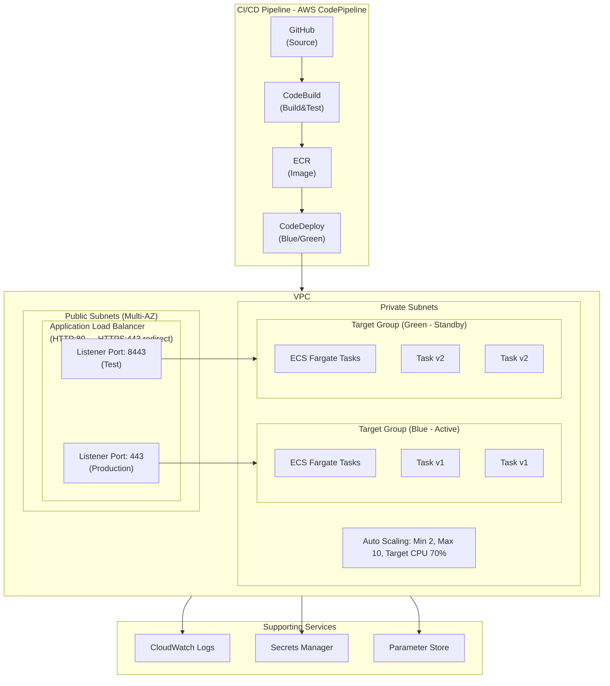
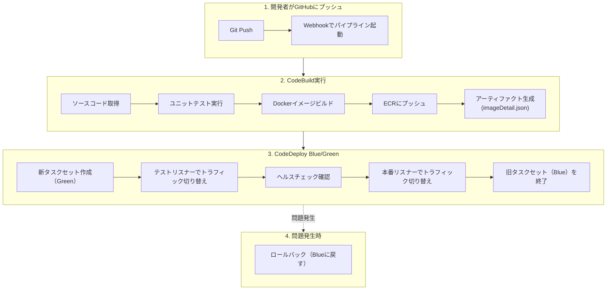

# 課題5: スタートアップのコンテナCI/CD構築

**難易度: 🟢 初級〜中級**

---

## 1. 分類情報

| 項目 | 内容 |
|------|------|
| 難易度 | 初級〜中級 |
| カテゴリ | コンテナ |
| 処理タイプ | 非同期 |
| 使用IaC | CloudFormation |
| 想定所要時間 | 4-5時間 |

---

## 2. シナリオ

### 企業プロファイル

| 項目 | 内容 |
|------|------|
| **企業名** | SmartAssist株式会社 |
| **業種** | AIスタートアップ（チャットボットSaaS） |
| **従業員数** | 25名（エンジニア8名） |
| **サービス** | AIチャットボット「SmartBot」 |
| **顧客数** | 導入企業50社、月間会話100万件 |
| **デプロイ頻度** | 現状週2回 → 目標1日10回 |

### 現状の課題

```
SmartAssist株式会社は急成長するAIチャットボットSaaSを提供しています。
現在のデプロイプロセスには以下の課題があります：

1. 手動デプロイの限界
   - エンジニアがEC2に手動でDocker pullしてデプロイ
   - 1回のデプロイに30分以上かかる
   - 深夜作業でエンジニアが疲弊

2. デプロイの不安定さ
   - 本番環境で問題が発覚することが多い
   - ロールバックに1時間以上かかる
   - 顧客影響が発生するリスク

3. 環境差異の問題
   - 開発環境と本番環境の設定が異なる
   - 「自分のPCでは動いた」問題が頻発
   - テスト環境がない

4. スケーリングの課題
   - ピーク時（平日9-11時）に応答遅延
   - 手動でインスタンスを追加している
   - コスト効率が悪い
```

### ビジネス目標

| KPI | 現状 | 目標 |
|-----|------|------|
| デプロイ所要時間 | 30分 | 5分以下 |
| デプロイ頻度 | 週2回 | 1日10回（オンデマンド） |
| ロールバック時間 | 1時間 | 5分以下 |
| デプロイ成功率 | 80% | 99%以上 |
| ダウンタイム | 5分/回 | ゼロ |

---

## 3. 達成目標（ゴール）

### 主要な学習成果

```
この課題を完了すると、以下ができるようになります：

1. ECRによるコンテナイメージ管理
   - プライベートリポジトリの作成と管理
   - イメージのタグ付けとライフサイクル管理
   - 脆弱性スキャンの活用

2. CodePipelineによるCI/CDパイプライン構築
   - ソースステージ（GitHub/CodeCommit連携）
   - ビルドステージ（CodeBuild）
   - デプロイステージ（ECS）

3. ECS Fargateによるコンテナ運用
   - タスク定義とサービス設定
   - Auto Scalingの構成
   - Blue/Greenデプロイメント

4. 運用監視の基礎
   - CloudWatchによるログ・メトリクス監視
   - アラート設定とSlack通知
```

### 合格基準

| 項目 | 基準 |
|------|------|
| パイプライン | GitプッシュからECSデプロイまで自動化されること |
| デプロイ時間 | 10分以内にデプロイが完了すること |
| ゼロダウンタイム | Blue/Greenデプロイでダウンタイムがないこと |
| ロールバック | 1クリックで前バージョンに戻せること |
| 監視 | コンテナログとメトリクスが収集されていること |

---

## 4. 使用するAWSサービス

### コア技術スタック

```yaml
コンテナ基盤:
  - Amazon ECR: コンテナイメージリポジトリ
  - Amazon ECS: コンテナオーケストレーション
  - AWS Fargate: サーバーレスコンテナ実行環境

CI/CD:
  - AWS CodePipeline: CI/CDオーケストレーション
  - AWS CodeBuild: コンテナビルド
  - AWS CodeDeploy: Blue/Greenデプロイ

ネットワーク:
  - Amazon VPC: ネットワーク分離
  - Application Load Balancer: トラフィック分散
  - AWS Certificate Manager: SSL/TLS証明書

監視・運用:
  - Amazon CloudWatch: ログ・メトリクス・アラーム
  - AWS Systems Manager Parameter Store: 設定管理
  - Amazon SNS: 通知

セキュリティ:
  - AWS IAM: アクセス制御
  - AWS Secrets Manager: シークレット管理
```

### GCPとの比較

| 機能 | AWS | GCP |
|------|-----|-----|
| コンテナレジストリ | ECR | Artifact Registry |
| コンテナ実行 | ECS Fargate | Cloud Run |
| CI/CD | CodePipeline + CodeBuild | Cloud Build |
| デプロイ戦略 | CodeDeploy | Cloud Deploy |
| ロードバランサ | ALB | Cloud Load Balancing |

---

## 5. 前提条件

### 技術要件

```bash
# 必要なCLIツール
aws --version          # 2.x
docker --version       # 20.x+
git --version          # 2.x+

# AWS設定
aws configure
export AWS_REGION=ap-northeast-1
export AWS_ACCOUNT_ID=$(aws sts get-caller-identity --query Account --output text)
```

### 事前準備

```bash
# 1. GitHubリポジトリの準備（またはCodeCommit）
# リポジトリ名: smartassist-chatbot

# 2. サンプルアプリケーションの構造
smartassist-chatbot/
├── src/
│   ├── app.py              # Flaskアプリケーション
│   ├── chatbot/
│   │   ├── __init__.py
│   │   ├── engine.py       # チャットボットエンジン
│   │   └── responses.py    # 応答生成
│   └── tests/
│       └── test_app.py
├── Dockerfile
├── docker-compose.yml
├── requirements.txt
├── buildspec.yml           # CodeBuild設定
├── appspec.yaml            # CodeDeploy設定
└── taskdef.json            # ECSタスク定義
```

---

## 6. アーキテクチャ図

### 全体構成



### デプロイフロー



---

## 8. トラブルシューティングチャレンジ

### Challenge 1: CodeBuildでDockerビルドが失敗する

```
問題:
CodeBuildでDockerビルド時にエラーが発生する。

エラーメッセージ:
Cannot connect to the Docker daemon at unix:///var/run/docker.sock.
Is the docker daemon running?

調査項目:
1. CodeBuildプロジェクトの設定
2. IAMロールの権限
```

<details>
<summary>解決のヒント</summary>

```bash
# 1. CodeBuildプロジェクトでPrivileged modeが有効か確認
aws codebuild batch-get-projects --names smartassist-build \
    --query "projects[0].environment.privilegedMode"

# 2. 無効の場合、有効化
aws codebuild update-project \
    --name smartassist-build \
    --environment '{
        "type": "LINUX_CONTAINER",
        "image": "aws/codebuild/amazonlinux2-x86_64-standard:5.0",
        "computeType": "BUILD_GENERAL1_SMALL",
        "privilegedMode": true
    }'

# 3. または buildspec.yml で docker-in-docker を使用
# install:
#   commands:
#     - nohup /usr/local/bin/dockerd --host=unix:///var/run/docker.sock &
#     - timeout 15 sh -c "until docker info; do echo .; sleep 1; done"
```
</details>

### Challenge 2: Blue/Greenデプロイでヘルスチェックが失敗する

```
問題:
新しいタスクセットがデプロイされたが、ヘルスチェックが失敗して
デプロイがロールバックされる。

エラー:
The deployment timed out while waiting for the replacement task set
to become healthy.

調査項目:
1. ターゲットグループのヘルスチェック設定
2. コンテナの起動ログ
3. セキュリティグループの設定
```

<details>
<summary>解決のヒント</summary>

```bash
# 1. CloudWatchログで起動エラーを確認
aws logs get-log-events \
    --log-group-name /ecs/smartassist \
    --log-stream-name chatbot/chatbot/xxxxx \
    --limit 50

# 2. ターゲットグループのヘルスチェック設定確認
aws elbv2 describe-target-groups \
    --names smartassist-blue-tg smartassist-green-tg \
    --query "TargetGroups[*].{Name:TargetGroupName,Path:HealthCheckPath,Interval:HealthCheckIntervalSeconds,Timeout:HealthCheckTimeoutSeconds}"

# 3. ヘルスチェックパスを修正
aws elbv2 modify-target-group \
    --target-group-arn arn:aws:elasticloadbalancing:...:targetgroup/smartassist-green-tg/... \
    --health-check-path /health \
    --health-check-interval-seconds 30 \
    --healthy-threshold-count 2 \
    --unhealthy-threshold-count 5

# 4. コンテナのヘルスチェックコマンド確認
# タスク定義のhealthCheckが正しく設定されているか
# コンテナ内でcurlがインストールされているか

# 5. セキュリティグループでALBからの通信が許可されているか
aws ec2 describe-security-groups \
    --group-ids sg-xxxxx \
    --query "SecurityGroups[0].IpPermissions"
```
</details>

### Challenge 3: デプロイ後にメモリ不足でタスクが再起動する

```
問題:
デプロイ後しばらくするとタスクがOOMKilledで再起動する。

CloudWatchメトリクス:
- MemoryUtilization: 95%以上
- タスク再起動頻度: 10分に1回

調査項目:
1. タスク定義のメモリ設定
2. アプリケーションのメモリ使用パターン
3. コンテナのリソース制限
```

<details>
<summary>解決のヒント</summary>

```bash
# 1. 現在のメモリ使用状況を確認
aws cloudwatch get-metric-statistics \
    --namespace AWS/ECS \
    --metric-name MemoryUtilization \
    --dimensions Name=ClusterName,Value=smartassist-cluster Name=ServiceName,Value=smartassist-service \
    --start-time $(date -u -d '1 hour ago' +%Y-%m-%dT%H:%M:%SZ) \
    --end-time $(date -u +%Y-%m-%dT%H:%M:%SZ) \
    --period 300 \
    --statistics Average Maximum

# 2. タスク定義のメモリを増やす
# taskdef.jsonで "memory": "1024" に変更

# 3. アプリケーション側の最適化
# gunicorn のワーカー数を調整
# gunicorn --workers 2 --threads 2 ではなく
# gunicorn --workers 1 --threads 4 に変更

# 4. Pythonのメモリ使用を最適化
# requirements.txt に memory-profiler を追加してプロファイリング

# 5. Container Insightsで詳細分析
# CloudWatch Container Insights ダッシュボードで
# コンテナごとのメモリ使用パターンを確認
```
</details>

---

## 9. 設計考慮ポイント

### デプロイ戦略の選択

```yaml
Blue/Green デプロイ（本課題で採用）:
  メリット:
    - ゼロダウンタイム
    - 即時ロールバック可能
    - テスト環境で事前検証可能
  デメリット:
    - 一時的にリソースが2倍必要
    - 設定が複雑

ローリングアップデート:
  メリット:
    - リソース効率が良い
    - シンプルな設定
  デメリット:
    - ロールバックに時間がかかる
    - 新旧バージョンが混在する期間がある

カナリアデプロイ:
  メリット:
    - 段階的なリリースで影響範囲を限定
    - A/Bテストに活用可能
  デメリット:
    - 設定がさらに複雑
    - モニタリングが必須
```

### イメージタグ戦略

```bash
# 推奨: 不変タグ + セマンティックバージョニング

# コミットハッシュ（CI/CDで自動付与）
smartassist/chatbot:abc1234

# 環境タグ
smartassist/chatbot:prod-abc1234
smartassist/chatbot:staging-abc1234

# バージョンタグ（リリース時）
smartassist/chatbot:v1.2.3
smartassist/chatbot:v1.2.3-abc1234

# 避けるべき: mutableタグの使用
# smartassist/chatbot:latest を本番で使わない
```

### セキュリティ考慮事項

```yaml
コンテナセキュリティ:
  - 非rootユーザーで実行
  - イメージの脆弱性スキャン（ECR自動スキャン）
  - 最小権限のIAMロール
  - Secrets Managerで機密情報管理

ネットワークセキュリティ:
  - ECSタスクをプライベートサブネットに配置
  - ALBのみがタスクにアクセス可能
  - VPCエンドポイントでAWSサービスにアクセス

CI/CDセキュリティ:
  - 最小権限のビルドロール
  - Secrets Manager でDockerHub認証情報管理
  - ビルドログの機密情報マスキング
```

---

## 10. 発展課題

### 上級チャレンジ1: マルチステージパイプライン

```yaml
# 開発 → ステージング → 本番 の多段階パイプライン

Stages:
  - Source
  - Build
  - DeployToStaging:
      - ECS Staging環境にデプロイ
      - 自動テスト実行
  - ManualApproval:
      - 手動承認ステージ
  - DeployToProduction:
      - ECS Production環境にBlue/Greenデプロイ

# 環境別設定の分離
environments/
├── staging/
│   ├── taskdef.json
│   └── appspec.yaml
└── production/
    ├── taskdef.json
    └── appspec.yaml
```

### 上級チャレンジ2: カナリアデプロイ実装

```yaml
# appspec.yaml - カナリア設定
version: 0.0
Resources:
  - TargetService:
      Type: AWS::ECS::Service
      Properties:
        TaskDefinition: <TASK_DEFINITION>
        LoadBalancerInfo:
          ContainerName: "chatbot"
          ContainerPort: 8080

Hooks:
  - BeforeAllowTraffic: "arn:aws:lambda:...:function:ValidateCanary"
  - AfterAllowTraffic: "arn:aws:lambda:...:function:MonitorCanary"

# CodeDeploy設定でカナリア比率を指定
# CodeDeployDefault.ECSCanary10Percent5Minutes
# - 10%のトラフィックで5分間テスト
# - 問題なければ残り90%に切り替え
```

### 上級チャレンジ3: GitOps実装

```yaml
# ArgoCD + EKS構成への発展
# GitリポジトリがSingle Source of Truth

argocd/
├── applications/
│   └── smartassist-chatbot.yaml
└── manifests/
    ├── deployment.yaml
    ├── service.yaml
    └── hpa.yaml

# ArgoCD Application
apiVersion: argoproj.io/v1alpha1
kind: Application
metadata:
  name: smartassist-chatbot
  namespace: argocd
spec:
  project: default
  source:
    repoURL: https://github.com/smartassist/chatbot
    targetRevision: HEAD
    path: argocd/manifests
  destination:
    server: https://kubernetes.default.svc
    namespace: production
  syncPolicy:
    automated:
      prune: true
      selfHeal: true
```

---

## 11. コスト見積もり

### 月額コスト概算

| サービス | スペック | 月額コスト |
|----------|----------|------------|
| ECS Fargate | 2タスク × 0.25vCPU × 0.5GB | $15 |
| ALB | 1 ALB + LCU | $25 |
| NAT Gateway | 1 AZ | $45 |
| ECR | 10GB ストレージ | $1 |
| CodePipeline | 1パイプライン | $1 |
| CodeBuild | 100分/月 | $5 |
| CloudWatch | ログ5GB + メトリクス | $10 |
| **合計** | | **約 $102/月** |

### スケール時の見積もり

```
ピーク時（10タスク）:
- ECS Fargate: $75/月
- ALB LCU増加: +$10/月
- その他は同じ

月間合計: 約 $170/月

1日10回のデプロイ:
- CodeBuild: 300分/月 → $15/月
- 合計: 約 $180/月
```

### コスト最適化ポイント

```
1. Fargate Spot活用:
   - 開発・ステージング環境でSpot使用
   - 最大70%削減

2. Auto Scaling最適化:
   - 夜間・週末の最小タスク数を1に
   - CPU/メモリの適切なサイジング

3. NAT Gateway最適化:
   - VPCエンドポイント使用でNAT通信削減
   - 1AZのみNAT Gateway（可用性とのトレードオフ）
```

---

## 12. 学習のポイント

### 今回学んだこと

```
1. ECRによるコンテナ管理
   □ プライベートリポジトリの作成
   □ ライフサイクルポリシーでコスト最適化
   □ 脆弱性スキャンの有効化

2. CodePipelineによるCI/CD
   □ GitHub連携（CodeStar Connections）
   □ CodeBuildでのテスト・ビルド自動化
   □ アーティファクト管理

3. ECS Fargateによるコンテナ運用
   □ タスク定義とサービス設定
   □ Blue/Greenデプロイメント
   □ Auto Scalingの構成

4. 運用のベストプラクティス
   □ ヘルスチェックの重要性
   □ ログ集約とモニタリング
   □ ロールバック手順の確立
```

### GCPとの比較まとめ

| 観点 | AWS (ECS + CodePipeline) | GCP (Cloud Run + Cloud Build) |
|------|--------------------------|-------------------------------|
| サーバーレスコンテナ | ECS Fargate | Cloud Run |
| ビルド | CodeBuild | Cloud Build |
| デプロイ | CodeDeploy | Cloud Deploy |
| 設定の複雑さ | 中〜高 | 低〜中 |
| カスタマイズ性 | 高 | 中 |
| Blue/Green | CodeDeploy統合 | Traffic splitting |

### 次のステップ

```
1. 発展学習:
   - EKS (Kubernetes) への移行
   - Argo CDによるGitOps
   - カナリアデプロイの自動化

2. 運用改善:
   - 本番監視ダッシュボードの構築
   - アラート自動化（PagerDuty/Slack連携）
   - カオスエンジニアリングの導入

3. 認定資格:
   - AWS Certified DevOps Engineer - Professional
   - AWS Certified Solutions Architect - Associate
```
