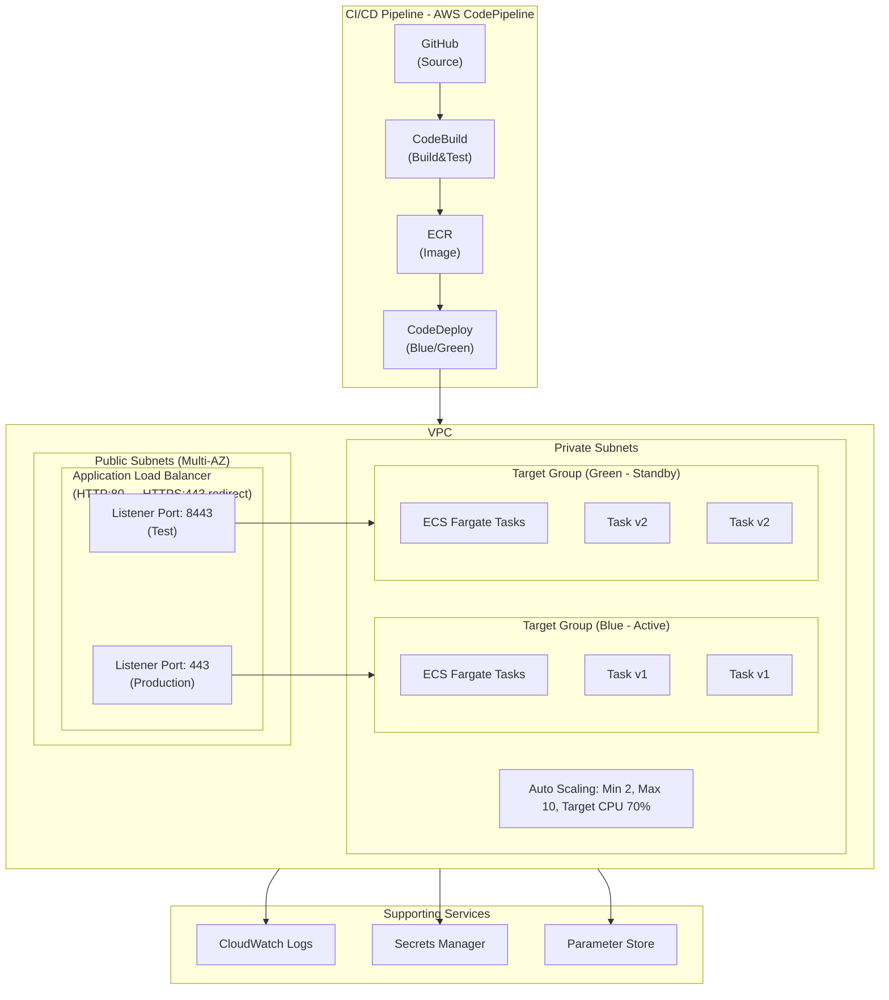
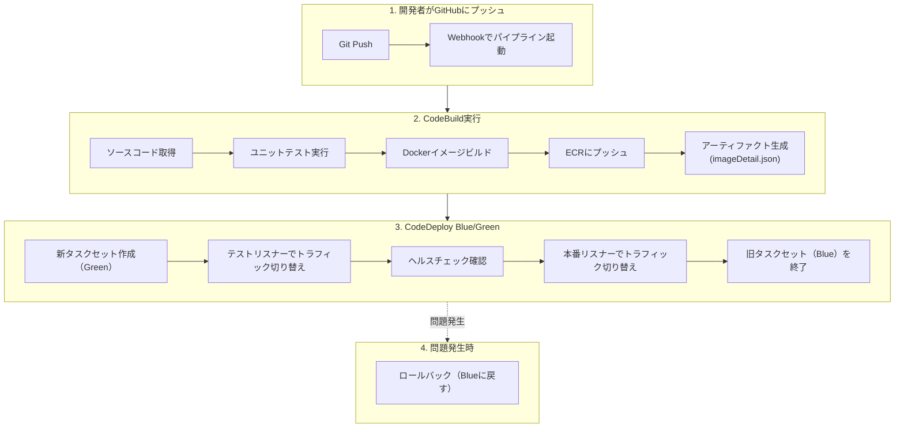

# 課題5: スタートアップのコンテナCI/CD構築

**難易度: 🟢 初級〜中級**

---

## 1. 分類情報

| 項目 | 内容 |
|------|------|
| 難易度 | 初級〜中級 |
| カテゴリ | コンテナ |
| 処理タイプ | 非同期 |
| 使用IaC | CloudFormation |
| 想定所要時間 | 4-5時間 |

---

## 2. シナリオ

### 企業プロファイル

| 項目 | 内容 |
|------|------|
| **企業名** | SmartAssist株式会社 |
| **業種** | AIスタートアップ（チャットボットSaaS） |
| **従業員数** | 25名（エンジニア8名） |
| **サービス** | AIチャットボット「SmartBot」 |
| **顧客数** | 導入企業50社、月間会話100万件 |
| **デプロイ頻度** | 現状週2回 → 目標1日10回 |

### 現状の課題

```
SmartAssist株式会社は急成長するAIチャットボットSaaSを提供しています。
現在のデプロイプロセスには以下の課題があります：

1. 手動デプロイの限界
   - エンジニアがEC2に手動でDocker pullしてデプロイ
   - 1回のデプロイに30分以上かかる
   - 深夜作業でエンジニアが疲弊

2. デプロイの不安定さ
   - 本番環境で問題が発覚することが多い
   - ロールバックに1時間以上かかる
   - 顧客影響が発生するリスク

3. 環境差異の問題
   - 開発環境と本番環境の設定が異なる
   - 「自分のPCでは動いた」問題が頻発
   - テスト環境がない

4. スケーリングの課題
   - ピーク時（平日9-11時）に応答遅延
   - 手動でインスタンスを追加している
   - コスト効率が悪い
```

### ビジネス目標

| KPI | 現状 | 目標 |
|-----|------|------|
| デプロイ所要時間 | 30分 | 5分以下 |
| デプロイ頻度 | 週2回 | 1日10回（オンデマンド） |
| ロールバック時間 | 1時間 | 5分以下 |
| デプロイ成功率 | 80% | 99%以上 |
| ダウンタイム | 5分/回 | ゼロ |

---

## 3. 達成目標（ゴール）

### 主要な学習成果

```
この課題を完了すると、以下ができるようになります：

1. ECRによるコンテナイメージ管理
   - プライベートリポジトリの作成と管理
   - イメージのタグ付けとライフサイクル管理
   - 脆弱性スキャンの活用

2. CodePipelineによるCI/CDパイプライン構築
   - ソースステージ（GitHub/CodeCommit連携）
   - ビルドステージ（CodeBuild）
   - デプロイステージ（ECS）

3. ECS Fargateによるコンテナ運用
   - タスク定義とサービス設定
   - Auto Scalingの構成
   - Blue/Greenデプロイメント

4. 運用監視の基礎
   - CloudWatchによるログ・メトリクス監視
   - アラート設定とSlack通知
```

### 合格基準

| 項目 | 基準 |
|------|------|
| パイプライン | GitプッシュからECSデプロイまで自動化されること |
| デプロイ時間 | 10分以内にデプロイが完了すること |
| ゼロダウンタイム | Blue/Greenデプロイでダウンタイムがないこと |
| ロールバック | 1クリックで前バージョンに戻せること |
| 監視 | コンテナログとメトリクスが収集されていること |

---

## 4. 使用するAWSサービス

### コア技術スタック

```yaml
コンテナ基盤:
  - Amazon ECR: コンテナイメージリポジトリ
  - Amazon ECS: コンテナオーケストレーション
  - AWS Fargate: サーバーレスコンテナ実行環境

CI/CD:
  - AWS CodePipeline: CI/CDオーケストレーション
  - AWS CodeBuild: コンテナビルド
  - AWS CodeDeploy: Blue/Greenデプロイ

ネットワーク:
  - Amazon VPC: ネットワーク分離
  - Application Load Balancer: トラフィック分散
  - AWS Certificate Manager: SSL/TLS証明書

監視・運用:
  - Amazon CloudWatch: ログ・メトリクス・アラーム
  - AWS Systems Manager Parameter Store: 設定管理
  - Amazon SNS: 通知

セキュリティ:
  - AWS IAM: アクセス制御
  - AWS Secrets Manager: シークレット管理
```

### GCPとの比較

| 機能 | AWS | GCP |
|------|-----|-----|
| コンテナレジストリ | ECR | Artifact Registry |
| コンテナ実行 | ECS Fargate | Cloud Run |
| CI/CD | CodePipeline + CodeBuild | Cloud Build |
| デプロイ戦略 | CodeDeploy | Cloud Deploy |
| ロードバランサ | ALB | Cloud Load Balancing |

---

## 5. 前提条件

### 技術要件

```bash
# 必要なCLIツール
aws --version          # 2.x
docker --version       # 20.x+
git --version          # 2.x+

# AWS設定
aws configure
export AWS_REGION=ap-northeast-1
export AWS_ACCOUNT_ID=$(aws sts get-caller-identity --query Account --output text)
```

### 事前準備

```bash
# 1. GitHubリポジトリの準備（またはCodeCommit）
# リポジトリ名: smartassist-chatbot

# 2. サンプルアプリケーションの構造
smartassist-chatbot/
├── src/
│   ├── app.py              # Flaskアプリケーション
│   ├── chatbot/
│   │   ├── __init__.py
│   │   ├── engine.py       # チャットボットエンジン
│   │   └── responses.py    # 応答生成
│   └── tests/
│       └── test_app.py
├── Dockerfile
├── docker-compose.yml
├── requirements.txt
├── buildspec.yml           # CodeBuild設定
├── appspec.yaml            # CodeDeploy設定
└── taskdef.json            # ECSタスク定義
```

---

## 6. アーキテクチャ図

### 全体構成



### デプロイフロー



---

## 7. ハンズオン手順

### Step 1: サンプルアプリケーション準備

```python
# src/app.py
from flask import Flask, request, jsonify
from chatbot.engine import ChatbotEngine
import os
import logging

app = Flask(__name__)
logging.basicConfig(level=logging.INFO)
logger = logging.getLogger(__name__)

# 環境変数から設定を読み込み
APP_VERSION = os.environ.get('APP_VERSION', 'unknown')
ENVIRONMENT = os.environ.get('ENVIRONMENT', 'development')

engine = ChatbotEngine()

@app.route('/health', methods=['GET'])
def health_check():
    """ヘルスチェックエンドポイント"""
    return jsonify({
        'status': 'healthy',
        'version': APP_VERSION,
        'environment': ENVIRONMENT
    })

@app.route('/api/chat', methods=['POST'])
def chat():
    """チャットエンドポイント"""
    try:
        data = request.get_json()
        user_message = data.get('message', '')
        session_id = data.get('session_id', 'default')

        logger.info(f"Received message: {user_message[:50]}...")

        response = engine.generate_response(user_message, session_id)

        return jsonify({
            'response': response,
            'session_id': session_id,
            'version': APP_VERSION
        })
    except Exception as e:
        logger.error(f"Error processing chat: {str(e)}")
        return jsonify({'error': 'Internal server error'}), 500

@app.route('/api/sessions/<session_id>', methods=['DELETE'])
def clear_session(session_id):
    """セッションクリア"""
    engine.clear_session(session_id)
    return jsonify({'message': f'Session {session_id} cleared'})

if __name__ == '__main__':
    port = int(os.environ.get('PORT', 8080))
    app.run(host='0.0.0.0', port=port)
```

```python
# src/chatbot/engine.py
import re
from typing import Dict, List

class ChatbotEngine:
    def __init__(self):
        self.sessions: Dict[str, List[Dict]] = {}
        self.responses = {
            'greeting': 'こんにちは！SmartBotです。何かお手伝いできることはありますか？',
            'help': '以下のコマンドが利用できます：\n- 製品について\n- 料金プラン\n- お問い合わせ',
            'product': 'SmartBotは、AIを活用した次世代チャットボットです。24時間365日、お客様対応を自動化します。',
            'pricing': '料金プランは以下の通りです：\n- Starter: ¥10,000/月\n- Business: ¥50,000/月\n- Enterprise: お問い合わせください',
            'contact': 'お問い合わせは contact@smartassist.example.com までお願いします。',
            'default': 'すみません、よく理解できませんでした。「ヘルプ」と入力すると、利用可能なコマンドを確認できます。'
        }

    def generate_response(self, message: str, session_id: str) -> str:
        """メッセージに対する応答を生成"""
        # セッション履歴を保存
        if session_id not in self.sessions:
            self.sessions[session_id] = []

        self.sessions[session_id].append({
            'role': 'user',
            'content': message
        })

        # 簡易的なルールベース応答
        message_lower = message.lower()

        if any(word in message_lower for word in ['こんにちは', 'hello', 'hi', 'はじめまして']):
            response = self.responses['greeting']
        elif any(word in message_lower for word in ['ヘルプ', 'help', '使い方']):
            response = self.responses['help']
        elif any(word in message_lower for word in ['製品', 'product', 'サービス']):
            response = self.responses['product']
        elif any(word in message_lower for word in ['料金', 'pricing', 'プラン', '価格']):
            response = self.responses['pricing']
        elif any(word in message_lower for word in ['問い合わせ', 'contact', '連絡']):
            response = self.responses['contact']
        else:
            response = self.responses['default']

        self.sessions[session_id].append({
            'role': 'assistant',
            'content': response
        })

        return response

    def clear_session(self, session_id: str):
        """セッションをクリア"""
        if session_id in self.sessions:
            del self.sessions[session_id]
```

```python
# src/tests/test_app.py
import pytest
import sys
import os
sys.path.insert(0, os.path.join(os.path.dirname(__file__), '..'))

from app import app

@pytest.fixture
def client():
    app.config['TESTING'] = True
    with app.test_client() as client:
        yield client

def test_health_check(client):
    """ヘルスチェックのテスト"""
    response = client.get('/health')
    assert response.status_code == 200
    data = response.get_json()
    assert data['status'] == 'healthy'

def test_chat_greeting(client):
    """挨拶への応答テスト"""
    response = client.post('/api/chat', json={
        'message': 'こんにちは',
        'session_id': 'test-session'
    })
    assert response.status_code == 200
    data = response.get_json()
    assert 'SmartBot' in data['response']

def test_chat_help(client):
    """ヘルプ応答テスト"""
    response = client.post('/api/chat', json={
        'message': 'ヘルプ',
        'session_id': 'test-session'
    })
    assert response.status_code == 200
    data = response.get_json()
    assert 'コマンド' in data['response']

def test_chat_pricing(client):
    """料金問い合わせテスト"""
    response = client.post('/api/chat', json={
        'message': '料金プランを教えて',
        'session_id': 'test-session'
    })
    assert response.status_code == 200
    data = response.get_json()
    assert '料金プラン' in data['response']

def test_session_clear(client):
    """セッションクリアテスト"""
    response = client.delete('/api/sessions/test-session')
    assert response.status_code == 200
```

```txt
# requirements.txt
flask==3.0.0
gunicorn==21.2.0
pytest==7.4.3
pytest-cov==4.1.0
```

### Step 2: Dockerfile作成

```dockerfile
# Dockerfile
FROM python:3.11-slim as builder

WORKDIR /app

# 依存関係のインストール
COPY requirements.txt .
RUN pip install --no-cache-dir -r requirements.txt

# アプリケーションコードのコピー
COPY src/ ./src/

# 本番用イメージ
FROM python:3.11-slim

WORKDIR /app

# 非rootユーザーの作成
RUN useradd -m -u 1000 appuser

# 依存関係とアプリケーションのコピー
COPY --from=builder /usr/local/lib/python3.11/site-packages /usr/local/lib/python3.11/site-packages
COPY --from=builder /usr/local/bin/gunicorn /usr/local/bin/gunicorn
COPY --from=builder /app/src ./src

# 環境変数
ENV PORT=8080
ENV PYTHONUNBUFFERED=1
ENV PYTHONDONTWRITEBYTECODE=1

# ポート公開
EXPOSE 8080

# ユーザー切り替え
USER appuser

# ヘルスチェック
HEALTHCHECK --interval=30s --timeout=5s --start-period=5s --retries=3 \
    CMD python -c "import urllib.request; urllib.request.urlopen('http://localhost:8080/health')" || exit 1

# アプリケーション起動
CMD ["gunicorn", "--bind", "0.0.0.0:8080", "--workers", "2", "--threads", "4", "src.app:app"]
```

### Step 3: ECRリポジトリ作成

```bash
# ECRリポジトリ作成
aws ecr create-repository \
    --repository-name smartassist/chatbot \
    --image-scanning-configuration scanOnPush=true \
    --encryption-configuration encryptionType=AES256 \
    --region ap-northeast-1

# ライフサイクルポリシー設定
aws ecr put-lifecycle-policy \
    --repository-name smartassist/chatbot \
    --lifecycle-policy-text '{
        "rules": [
            {
                "rulePriority": 1,
                "description": "Keep last 10 production images",
                "selection": {
                    "tagStatus": "tagged",
                    "tagPrefixList": ["prod-"],
                    "countType": "imageCountMoreThan",
                    "countNumber": 10
                },
                "action": {
                    "type": "expire"
                }
            },
            {
                "rulePriority": 2,
                "description": "Remove untagged images older than 7 days",
                "selection": {
                    "tagStatus": "untagged",
                    "countType": "sinceImagePushed",
                    "countUnit": "days",
                    "countNumber": 7
                },
                "action": {
                    "type": "expire"
                }
            }
        ]
    }'

# ローカルでビルドしてテスト
docker build -t smartassist/chatbot:local .
docker run -p 8080:8080 smartassist/chatbot:local

# 動作確認
curl http://localhost:8080/health
curl -X POST http://localhost:8080/api/chat \
    -H "Content-Type: application/json" \
    -d '{"message": "こんにちは", "session_id": "test"}'
```

### Step 4: ECS基盤構築

```bash
# VPCとサブネットの作成（CloudFormation）
cat > vpc-stack.yaml << 'EOF'
AWSTemplateFormatVersion: '2010-09-09'
Description: VPC for SmartAssist ECS

Parameters:
  EnvironmentName:
    Type: String
    Default: smartassist

Resources:
  VPC:
    Type: AWS::EC2::VPC
    Properties:
      CidrBlock: 10.0.0.0/16
      EnableDnsHostnames: true
      EnableDnsSupport: true
      Tags:
        - Key: Name
          Value: !Sub ${EnvironmentName}-vpc

  InternetGateway:
    Type: AWS::EC2::InternetGateway
    Properties:
      Tags:
        - Key: Name
          Value: !Sub ${EnvironmentName}-igw

  InternetGatewayAttachment:
    Type: AWS::EC2::VPCGatewayAttachment
    Properties:
      InternetGatewayId: !Ref InternetGateway
      VpcId: !Ref VPC

  PublicSubnet1:
    Type: AWS::EC2::Subnet
    Properties:
      VpcId: !Ref VPC
      AvailabilityZone: !Select [0, !GetAZs '']
      CidrBlock: 10.0.1.0/24
      MapPublicIpOnLaunch: true
      Tags:
        - Key: Name
          Value: !Sub ${EnvironmentName}-public-1

  PublicSubnet2:
    Type: AWS::EC2::Subnet
    Properties:
      VpcId: !Ref VPC
      AvailabilityZone: !Select [1, !GetAZs '']
      CidrBlock: 10.0.2.0/24
      MapPublicIpOnLaunch: true
      Tags:
        - Key: Name
          Value: !Sub ${EnvironmentName}-public-2

  PrivateSubnet1:
    Type: AWS::EC2::Subnet
    Properties:
      VpcId: !Ref VPC
      AvailabilityZone: !Select [0, !GetAZs '']
      CidrBlock: 10.0.10.0/24
      Tags:
        - Key: Name
          Value: !Sub ${EnvironmentName}-private-1

  PrivateSubnet2:
    Type: AWS::EC2::Subnet
    Properties:
      VpcId: !Ref VPC
      AvailabilityZone: !Select [1, !GetAZs '']
      CidrBlock: 10.0.11.0/24
      Tags:
        - Key: Name
          Value: !Sub ${EnvironmentName}-private-2

  NatGatewayEIP:
    Type: AWS::EC2::EIP
    DependsOn: InternetGatewayAttachment
    Properties:
      Domain: vpc

  NatGateway:
    Type: AWS::EC2::NatGateway
    Properties:
      AllocationId: !GetAtt NatGatewayEIP.AllocationId
      SubnetId: !Ref PublicSubnet1
      Tags:
        - Key: Name
          Value: !Sub ${EnvironmentName}-nat

  PublicRouteTable:
    Type: AWS::EC2::RouteTable
    Properties:
      VpcId: !Ref VPC
      Tags:
        - Key: Name
          Value: !Sub ${EnvironmentName}-public-rt

  DefaultPublicRoute:
    Type: AWS::EC2::Route
    DependsOn: InternetGatewayAttachment
    Properties:
      RouteTableId: !Ref PublicRouteTable
      DestinationCidrBlock: 0.0.0.0/0
      GatewayId: !Ref InternetGateway

  PublicSubnet1RouteTableAssociation:
    Type: AWS::EC2::SubnetRouteTableAssociation
    Properties:
      RouteTableId: !Ref PublicRouteTable
      SubnetId: !Ref PublicSubnet1

  PublicSubnet2RouteTableAssociation:
    Type: AWS::EC2::SubnetRouteTableAssociation
    Properties:
      RouteTableId: !Ref PublicRouteTable
      SubnetId: !Ref PublicSubnet2

  PrivateRouteTable:
    Type: AWS::EC2::RouteTable
    Properties:
      VpcId: !Ref VPC
      Tags:
        - Key: Name
          Value: !Sub ${EnvironmentName}-private-rt

  DefaultPrivateRoute:
    Type: AWS::EC2::Route
    Properties:
      RouteTableId: !Ref PrivateRouteTable
      DestinationCidrBlock: 0.0.0.0/0
      NatGatewayId: !Ref NatGateway

  PrivateSubnet1RouteTableAssociation:
    Type: AWS::EC2::SubnetRouteTableAssociation
    Properties:
      RouteTableId: !Ref PrivateRouteTable
      SubnetId: !Ref PrivateSubnet1

  PrivateSubnet2RouteTableAssociation:
    Type: AWS::EC2::SubnetRouteTableAssociation
    Properties:
      RouteTableId: !Ref PrivateRouteTable
      SubnetId: !Ref PrivateSubnet2

Outputs:
  VPCId:
    Value: !Ref VPC
    Export:
      Name: !Sub ${EnvironmentName}-VPCId
  PublicSubnet1Id:
    Value: !Ref PublicSubnet1
    Export:
      Name: !Sub ${EnvironmentName}-PublicSubnet1Id
  PublicSubnet2Id:
    Value: !Ref PublicSubnet2
    Export:
      Name: !Sub ${EnvironmentName}-PublicSubnet2Id
  PrivateSubnet1Id:
    Value: !Ref PrivateSubnet1
    Export:
      Name: !Sub ${EnvironmentName}-PrivateSubnet1Id
  PrivateSubnet2Id:
    Value: !Ref PrivateSubnet2
    Export:
      Name: !Sub ${EnvironmentName}-PrivateSubnet2Id
EOF

aws cloudformation create-stack \
    --stack-name smartassist-vpc \
    --template-body file://vpc-stack.yaml \
    --capabilities CAPABILITY_IAM
```

```bash
# ECSクラスターとALB作成
cat > ecs-stack.yaml << 'EOF'
AWSTemplateFormatVersion: '2010-09-09'
Description: ECS Cluster and ALB for SmartAssist

Parameters:
  EnvironmentName:
    Type: String
    Default: smartassist

Resources:
  # Security Groups
  ALBSecurityGroup:
    Type: AWS::EC2::SecurityGroup
    Properties:
      GroupDescription: ALB Security Group
      VpcId: !ImportValue smartassist-VPCId
      SecurityGroupIngress:
        - IpProtocol: tcp
          FromPort: 80
          ToPort: 80
          CidrIp: 0.0.0.0/0
        - IpProtocol: tcp
          FromPort: 443
          ToPort: 443
          CidrIp: 0.0.0.0/0
        - IpProtocol: tcp
          FromPort: 8443
          ToPort: 8443
          CidrIp: 0.0.0.0/0
      Tags:
        - Key: Name
          Value: !Sub ${EnvironmentName}-alb-sg

  ECSSecurityGroup:
    Type: AWS::EC2::SecurityGroup
    Properties:
      GroupDescription: ECS Tasks Security Group
      VpcId: !ImportValue smartassist-VPCId
      SecurityGroupIngress:
        - IpProtocol: tcp
          FromPort: 8080
          ToPort: 8080
          SourceSecurityGroupId: !Ref ALBSecurityGroup
      Tags:
        - Key: Name
          Value: !Sub ${EnvironmentName}-ecs-sg

  # ECS Cluster
  ECSCluster:
    Type: AWS::ECS::Cluster
    Properties:
      ClusterName: !Sub ${EnvironmentName}-cluster
      ClusterSettings:
        - Name: containerInsights
          Value: enabled
      CapacityProviders:
        - FARGATE
        - FARGATE_SPOT
      DefaultCapacityProviderStrategy:
        - CapacityProvider: FARGATE
          Weight: 1
        - CapacityProvider: FARGATE_SPOT
          Weight: 1

  # Application Load Balancer
  ApplicationLoadBalancer:
    Type: AWS::ElasticLoadBalancingV2::LoadBalancer
    Properties:
      Name: !Sub ${EnvironmentName}-alb
      Type: application
      Scheme: internet-facing
      Subnets:
        - !ImportValue smartassist-PublicSubnet1Id
        - !ImportValue smartassist-PublicSubnet2Id
      SecurityGroups:
        - !Ref ALBSecurityGroup

  # Target Groups for Blue/Green
  BlueTargetGroup:
    Type: AWS::ElasticLoadBalancingV2::TargetGroup
    Properties:
      Name: !Sub ${EnvironmentName}-blue-tg
      Port: 8080
      Protocol: HTTP
      VpcId: !ImportValue smartassist-VPCId
      TargetType: ip
      HealthCheckPath: /health
      HealthCheckIntervalSeconds: 30
      HealthyThresholdCount: 2
      UnhealthyThresholdCount: 5

  GreenTargetGroup:
    Type: AWS::ElasticLoadBalancingV2::TargetGroup
    Properties:
      Name: !Sub ${EnvironmentName}-green-tg
      Port: 8080
      Protocol: HTTP
      VpcId: !ImportValue smartassist-VPCId
      TargetType: ip
      HealthCheckPath: /health
      HealthCheckIntervalSeconds: 30
      HealthyThresholdCount: 2
      UnhealthyThresholdCount: 5

  # Listeners
  ProductionListener:
    Type: AWS::ElasticLoadBalancingV2::Listener
    Properties:
      LoadBalancerArn: !Ref ApplicationLoadBalancer
      Port: 80
      Protocol: HTTP
      DefaultActions:
        - Type: forward
          TargetGroupArn: !Ref BlueTargetGroup

  TestListener:
    Type: AWS::ElasticLoadBalancingV2::Listener
    Properties:
      LoadBalancerArn: !Ref ApplicationLoadBalancer
      Port: 8443
      Protocol: HTTP
      DefaultActions:
        - Type: forward
          TargetGroupArn: !Ref GreenTargetGroup

  # CloudWatch Log Group
  LogGroup:
    Type: AWS::Logs::LogGroup
    Properties:
      LogGroupName: !Sub /ecs/${EnvironmentName}
      RetentionInDays: 30

  # ECS Task Execution Role
  ECSTaskExecutionRole:
    Type: AWS::IAM::Role
    Properties:
      RoleName: !Sub ${EnvironmentName}-task-execution-role
      AssumeRolePolicyDocument:
        Version: '2012-10-17'
        Statement:
          - Effect: Allow
            Principal:
              Service: ecs-tasks.amazonaws.com
            Action: sts:AssumeRole
      ManagedPolicyArns:
        - arn:aws:iam::aws:policy/service-role/AmazonECSTaskExecutionRolePolicy
      Policies:
        - PolicyName: SecretsAccess
          PolicyDocument:
            Version: '2012-10-17'
            Statement:
              - Effect: Allow
                Action:
                  - secretsmanager:GetSecretValue
                  - ssm:GetParameters
                Resource: '*'

  # ECS Task Role
  ECSTaskRole:
    Type: AWS::IAM::Role
    Properties:
      RoleName: !Sub ${EnvironmentName}-task-role
      AssumeRolePolicyDocument:
        Version: '2012-10-17'
        Statement:
          - Effect: Allow
            Principal:
              Service: ecs-tasks.amazonaws.com
            Action: sts:AssumeRole
      Policies:
        - PolicyName: TaskPermissions
          PolicyDocument:
            Version: '2012-10-17'
            Statement:
              - Effect: Allow
                Action:
                  - logs:CreateLogStream
                  - logs:PutLogEvents
                Resource: '*'

Outputs:
  ClusterName:
    Value: !Ref ECSCluster
    Export:
      Name: !Sub ${EnvironmentName}-ClusterName
  ALBArn:
    Value: !Ref ApplicationLoadBalancer
    Export:
      Name: !Sub ${EnvironmentName}-ALBArn
  ALBDNSName:
    Value: !GetAtt ApplicationLoadBalancer.DNSName
    Export:
      Name: !Sub ${EnvironmentName}-ALBDNSName
  BlueTargetGroupArn:
    Value: !Ref BlueTargetGroup
    Export:
      Name: !Sub ${EnvironmentName}-BlueTargetGroupArn
  GreenTargetGroupArn:
    Value: !Ref GreenTargetGroup
    Export:
      Name: !Sub ${EnvironmentName}-GreenTargetGroupArn
  ProductionListenerArn:
    Value: !Ref ProductionListener
    Export:
      Name: !Sub ${EnvironmentName}-ProductionListenerArn
  TestListenerArn:
    Value: !Ref TestListener
    Export:
      Name: !Sub ${EnvironmentName}-TestListenerArn
  ECSSecurityGroupId:
    Value: !Ref ECSSecurityGroup
    Export:
      Name: !Sub ${EnvironmentName}-ECSSecurityGroupId
  TaskExecutionRoleArn:
    Value: !GetAtt ECSTaskExecutionRole.Arn
    Export:
      Name: !Sub ${EnvironmentName}-TaskExecutionRoleArn
  TaskRoleArn:
    Value: !GetAtt ECSTaskRole.Arn
    Export:
      Name: !Sub ${EnvironmentName}-TaskRoleArn
  LogGroupName:
    Value: !Ref LogGroup
    Export:
      Name: !Sub ${EnvironmentName}-LogGroupName
EOF

aws cloudformation create-stack \
    --stack-name smartassist-ecs \
    --template-body file://ecs-stack.yaml \
    --capabilities CAPABILITY_NAMED_IAM
```

### Step 5: CodeBuild設定

```yaml
# buildspec.yml
version: 0.2

env:
  variables:
    AWS_DEFAULT_REGION: ap-northeast-1
    IMAGE_REPO_NAME: smartassist/chatbot
  parameter-store:
    DOCKERHUB_USER: /smartassist/dockerhub/username
    DOCKERHUB_TOKEN: /smartassist/dockerhub/token

phases:
  pre_build:
    commands:
      - echo Logging in to Amazon ECR...
      - aws ecr get-login-password --region $AWS_DEFAULT_REGION | docker login --username AWS --password-stdin $AWS_ACCOUNT_ID.dkr.ecr.$AWS_DEFAULT_REGION.amazonaws.com
      - REPOSITORY_URI=$AWS_ACCOUNT_ID.dkr.ecr.$AWS_DEFAULT_REGION.amazonaws.com/$IMAGE_REPO_NAME
      - COMMIT_HASH=$(echo $CODEBUILD_RESOLVED_SOURCE_VERSION | cut -c 1-7)
      - IMAGE_TAG=${COMMIT_HASH:=latest}

  build:
    commands:
      - echo Running tests...
      - pip install -r requirements.txt
      - cd src && python -m pytest tests/ -v --cov=. --cov-report=xml
      - cd ..

      - echo Building the Docker image...
      - docker build -t $REPOSITORY_URI:latest .
      - docker tag $REPOSITORY_URI:latest $REPOSITORY_URI:$IMAGE_TAG
      - docker tag $REPOSITORY_URI:latest $REPOSITORY_URI:prod-$IMAGE_TAG

  post_build:
    commands:
      - echo Pushing the Docker images...
      - docker push $REPOSITORY_URI:latest
      - docker push $REPOSITORY_URI:$IMAGE_TAG
      - docker push $REPOSITORY_URI:prod-$IMAGE_TAG

      - echo Writing image definitions file...
      - printf '{"ImageURI":"%s"}' $REPOSITORY_URI:$IMAGE_TAG > imageDetail.json

      - echo Creating appspec and taskdef for CodeDeploy...
      - |
        cat > appspec.yaml << APPSPEC
        version: 0.0
        Resources:
          - TargetService:
              Type: AWS::ECS::Service
              Properties:
                TaskDefinition: <TASK_DEFINITION>
                LoadBalancerInfo:
                  ContainerName: "chatbot"
                  ContainerPort: 8080
        APPSPEC

      - |
        cat > taskdef.json << TASKDEF
        {
          "family": "smartassist-chatbot",
          "networkMode": "awsvpc",
          "requiresCompatibilities": ["FARGATE"],
          "cpu": "256",
          "memory": "512",
          "executionRoleArn": "arn:aws:iam::${AWS_ACCOUNT_ID}:role/smartassist-task-execution-role",
          "taskRoleArn": "arn:aws:iam::${AWS_ACCOUNT_ID}:role/smartassist-task-role",
          "containerDefinitions": [
            {
              "name": "chatbot",
              "image": "<IMAGE1_NAME>",
              "essential": true,
              "portMappings": [
                {
                  "containerPort": 8080,
                  "protocol": "tcp"
                }
              ],
              "environment": [
                {
                  "name": "ENVIRONMENT",
                  "value": "production"
                },
                {
                  "name": "APP_VERSION",
                  "value": "${IMAGE_TAG}"
                }
              ],
              "logConfiguration": {
                "logDriver": "awslogs",
                "options": {
                  "awslogs-group": "/ecs/smartassist",
                  "awslogs-region": "${AWS_DEFAULT_REGION}",
                  "awslogs-stream-prefix": "chatbot"
                }
              },
              "healthCheck": {
                "command": ["CMD-SHELL", "curl -f http://localhost:8080/health || exit 1"],
                "interval": 30,
                "timeout": 5,
                "retries": 3,
                "startPeriod": 60
              }
            }
          ]
        }
        TASKDEF

artifacts:
  files:
    - imageDetail.json
    - appspec.yaml
    - taskdef.json

reports:
  pytest_reports:
    files:
      - 'src/coverage.xml'
    file-format: COBERTURAXML
```

### Step 6: CodePipeline構築

```bash
# CodePipeline用IAMロール
cat > pipeline-role.yaml << 'EOF'
AWSTemplateFormatVersion: '2010-09-09'
Description: IAM Roles for CodePipeline

Resources:
  CodePipelineRole:
    Type: AWS::IAM::Role
    Properties:
      RoleName: smartassist-codepipeline-role
      AssumeRolePolicyDocument:
        Version: '2012-10-17'
        Statement:
          - Effect: Allow
            Principal:
              Service: codepipeline.amazonaws.com
            Action: sts:AssumeRole
      Policies:
        - PolicyName: CodePipelinePolicy
          PolicyDocument:
            Version: '2012-10-17'
            Statement:
              - Effect: Allow
                Action:
                  - s3:*
                  - codecommit:*
                  - codebuild:*
                  - codedeploy:*
                  - ecs:*
                  - iam:PassRole
                  - elasticloadbalancing:*
                Resource: '*'

  CodeBuildRole:
    Type: AWS::IAM::Role
    Properties:
      RoleName: smartassist-codebuild-role
      AssumeRolePolicyDocument:
        Version: '2012-10-17'
        Statement:
          - Effect: Allow
            Principal:
              Service: codebuild.amazonaws.com
            Action: sts:AssumeRole
      Policies:
        - PolicyName: CodeBuildPolicy
          PolicyDocument:
            Version: '2012-10-17'
            Statement:
              - Effect: Allow
                Action:
                  - logs:*
                  - s3:*
                  - ecr:*
                  - ssm:GetParameters
                  - secretsmanager:GetSecretValue
                Resource: '*'

  CodeDeployRole:
    Type: AWS::IAM::Role
    Properties:
      RoleName: smartassist-codedeploy-role
      AssumeRolePolicyDocument:
        Version: '2012-10-17'
        Statement:
          - Effect: Allow
            Principal:
              Service: codedeploy.amazonaws.com
            Action: sts:AssumeRole
      ManagedPolicyArns:
        - arn:aws:iam::aws:policy/AWSCodeDeployRoleForECS

Outputs:
  CodePipelineRoleArn:
    Value: !GetAtt CodePipelineRole.Arn
    Export:
      Name: smartassist-CodePipelineRoleArn
  CodeBuildRoleArn:
    Value: !GetAtt CodeBuildRole.Arn
    Export:
      Name: smartassist-CodeBuildRoleArn
  CodeDeployRoleArn:
    Value: !GetAtt CodeDeployRole.Arn
    Export:
      Name: smartassist-CodeDeployRoleArn
EOF

aws cloudformation create-stack \
    --stack-name smartassist-pipeline-roles \
    --template-body file://pipeline-role.yaml \
    --capabilities CAPABILITY_NAMED_IAM
```

```bash
# CodePipeline作成
cat > pipeline-stack.yaml << 'EOF'
AWSTemplateFormatVersion: '2010-09-09'
Description: CodePipeline for SmartAssist

Parameters:
  GitHubOwner:
    Type: String
    Description: GitHub repository owner
  GitHubRepo:
    Type: String
    Default: smartassist-chatbot
  GitHubBranch:
    Type: String
    Default: main
  GitHubConnectionArn:
    Type: String
    Description: CodeStar connection ARN for GitHub

Resources:
  ArtifactBucket:
    Type: AWS::S3::Bucket
    Properties:
      BucketName: !Sub smartassist-pipeline-artifacts-${AWS::AccountId}
      VersioningConfiguration:
        Status: Enabled
      BucketEncryption:
        ServerSideEncryptionConfiguration:
          - ServerSideEncryptionByDefault:
              SSEAlgorithm: AES256

  CodeBuildProject:
    Type: AWS::CodeBuild::Project
    Properties:
      Name: smartassist-build
      ServiceRole: !ImportValue smartassist-CodeBuildRoleArn
      Artifacts:
        Type: CODEPIPELINE
      Environment:
        Type: LINUX_CONTAINER
        ComputeType: BUILD_GENERAL1_SMALL
        Image: aws/codebuild/amazonlinux2-x86_64-standard:5.0
        PrivilegedMode: true
        EnvironmentVariables:
          - Name: AWS_ACCOUNT_ID
            Value: !Ref AWS::AccountId
      Source:
        Type: CODEPIPELINE
        BuildSpec: buildspec.yml
      TimeoutInMinutes: 15

  CodeDeployApplication:
    Type: AWS::CodeDeploy::Application
    Properties:
      ApplicationName: smartassist-app
      ComputePlatform: ECS

  CodeDeployDeploymentGroup:
    Type: AWS::CodeDeploy::DeploymentGroup
    Properties:
      ApplicationName: !Ref CodeDeployApplication
      DeploymentGroupName: smartassist-dg
      ServiceRoleArn: !ImportValue smartassist-CodeDeployRoleArn
      DeploymentConfigName: CodeDeployDefault.ECSAllAtOnce
      DeploymentStyle:
        DeploymentType: BLUE_GREEN
        DeploymentOption: WITH_TRAFFIC_CONTROL
      BlueGreenDeploymentConfiguration:
        TerminateBlueInstancesOnDeploymentSuccess:
          Action: TERMINATE
          TerminationWaitTimeInMinutes: 5
        DeploymentReadyOption:
          ActionOnTimeout: CONTINUE_DEPLOYMENT
          WaitTimeInMinutes: 0
      ECSServices:
        - ClusterName: !ImportValue smartassist-ClusterName
          ServiceName: smartassist-service
      LoadBalancerInfo:
        TargetGroupPairInfoList:
          - ProdTrafficRoute:
              ListenerArns:
                - !ImportValue smartassist-ProductionListenerArn
            TestTrafficRoute:
              ListenerArns:
                - !ImportValue smartassist-TestListenerArn
            TargetGroups:
              - Name: smartassist-blue-tg
              - Name: smartassist-green-tg

  Pipeline:
    Type: AWS::CodePipeline::Pipeline
    Properties:
      Name: smartassist-pipeline
      RoleArn: !ImportValue smartassist-CodePipelineRoleArn
      ArtifactStore:
        Type: S3
        Location: !Ref ArtifactBucket
      Stages:
        - Name: Source
          Actions:
            - Name: Source
              ActionTypeId:
                Category: Source
                Owner: AWS
                Provider: CodeStarSourceConnection
                Version: '1'
              Configuration:
                ConnectionArn: !Ref GitHubConnectionArn
                FullRepositoryId: !Sub ${GitHubOwner}/${GitHubRepo}
                BranchName: !Ref GitHubBranch
                OutputArtifactFormat: CODE_ZIP
              OutputArtifacts:
                - Name: SourceOutput
              RunOrder: 1

        - Name: Build
          Actions:
            - Name: Build
              ActionTypeId:
                Category: Build
                Owner: AWS
                Provider: CodeBuild
                Version: '1'
              Configuration:
                ProjectName: !Ref CodeBuildProject
              InputArtifacts:
                - Name: SourceOutput
              OutputArtifacts:
                - Name: BuildOutput
              RunOrder: 1

        - Name: Deploy
          Actions:
            - Name: Deploy
              ActionTypeId:
                Category: Deploy
                Owner: AWS
                Provider: CodeDeployToECS
                Version: '1'
              Configuration:
                ApplicationName: !Ref CodeDeployApplication
                DeploymentGroupName: !Ref CodeDeployDeploymentGroup
                TaskDefinitionTemplateArtifact: BuildOutput
                TaskDefinitionTemplatePath: taskdef.json
                AppSpecTemplateArtifact: BuildOutput
                AppSpecTemplatePath: appspec.yaml
                Image1ArtifactName: BuildOutput
                Image1ContainerName: IMAGE1_NAME
              InputArtifacts:
                - Name: BuildOutput
              RunOrder: 1

Outputs:
  PipelineUrl:
    Value: !Sub https://${AWS::Region}.console.aws.amazon.com/codesuite/codepipeline/pipelines/${Pipeline}/view
EOF
```

### Step 7: ECSサービス初期デプロイ

```bash
# 初期タスク定義登録
cat > initial-taskdef.json << 'EOF'
{
  "family": "smartassist-chatbot",
  "networkMode": "awsvpc",
  "requiresCompatibilities": ["FARGATE"],
  "cpu": "256",
  "memory": "512",
  "executionRoleArn": "arn:aws:iam::ACCOUNT_ID:role/smartassist-task-execution-role",
  "taskRoleArn": "arn:aws:iam::ACCOUNT_ID:role/smartassist-task-role",
  "containerDefinitions": [
    {
      "name": "chatbot",
      "image": "ACCOUNT_ID.dkr.ecr.ap-northeast-1.amazonaws.com/smartassist/chatbot:latest",
      "essential": true,
      "portMappings": [
        {
          "containerPort": 8080,
          "protocol": "tcp"
        }
      ],
      "environment": [
        {
          "name": "ENVIRONMENT",
          "value": "production"
        },
        {
          "name": "APP_VERSION",
          "value": "initial"
        }
      ],
      "logConfiguration": {
        "logDriver": "awslogs",
        "options": {
          "awslogs-group": "/ecs/smartassist",
          "awslogs-region": "ap-northeast-1",
          "awslogs-stream-prefix": "chatbot"
        }
      }
    }
  ]
}
EOF

# ACCOUNT_IDを置換
sed -i "s/ACCOUNT_ID/${AWS_ACCOUNT_ID}/g" initial-taskdef.json

# タスク定義登録
aws ecs register-task-definition --cli-input-json file://initial-taskdef.json

# 初期イメージをプッシュ
aws ecr get-login-password --region ap-northeast-1 | docker login --username AWS --password-stdin ${AWS_ACCOUNT_ID}.dkr.ecr.ap-northeast-1.amazonaws.com
docker build -t smartassist/chatbot:latest .
docker tag smartassist/chatbot:latest ${AWS_ACCOUNT_ID}.dkr.ecr.ap-northeast-1.amazonaws.com/smartassist/chatbot:latest
docker push ${AWS_ACCOUNT_ID}.dkr.ecr.ap-northeast-1.amazonaws.com/smartassist/chatbot:latest

# ECSサービス作成
aws ecs create-service \
    --cluster smartassist-cluster \
    --service-name smartassist-service \
    --task-definition smartassist-chatbot \
    --desired-count 2 \
    --launch-type FARGATE \
    --deployment-controller type=CODE_DEPLOY \
    --network-configuration "awsvpcConfiguration={subnets=[$(aws cloudformation describe-stacks --stack-name smartassist-vpc --query "Stacks[0].Outputs[?OutputKey=='PrivateSubnet1Id'].OutputValue" --output text),$(aws cloudformation describe-stacks --stack-name smartassist-vpc --query "Stacks[0].Outputs[?OutputKey=='PrivateSubnet2Id'].OutputValue" --output text)],securityGroups=[$(aws cloudformation describe-stacks --stack-name smartassist-ecs --query "Stacks[0].Outputs[?OutputKey=='ECSSecurityGroupId'].OutputValue" --output text)],assignPublicIp=DISABLED}" \
    --load-balancers "targetGroupArn=$(aws cloudformation describe-stacks --stack-name smartassist-ecs --query "Stacks[0].Outputs[?OutputKey=='BlueTargetGroupArn'].OutputValue" --output text),containerName=chatbot,containerPort=8080"
```

### Step 8: Auto Scaling設定

```bash
# Auto Scaling設定
aws application-autoscaling register-scalable-target \
    --service-namespace ecs \
    --scalable-dimension ecs:service:DesiredCount \
    --resource-id service/smartassist-cluster/smartassist-service \
    --min-capacity 2 \
    --max-capacity 10

# CPU使用率ベースのスケーリングポリシー
aws application-autoscaling put-scaling-policy \
    --service-namespace ecs \
    --scalable-dimension ecs:service:DesiredCount \
    --resource-id service/smartassist-cluster/smartassist-service \
    --policy-name cpu-scaling-policy \
    --policy-type TargetTrackingScaling \
    --target-tracking-scaling-policy-configuration '{
        "TargetValue": 70.0,
        "PredefinedMetricSpecification": {
            "PredefinedMetricType": "ECSServiceAverageCPUUtilization"
        },
        "ScaleInCooldown": 300,
        "ScaleOutCooldown": 60
    }'

# リクエスト数ベースのスケーリングポリシー
aws application-autoscaling put-scaling-policy \
    --service-namespace ecs \
    --scalable-dimension ecs:service:DesiredCount \
    --resource-id service/smartassist-cluster/smartassist-service \
    --policy-name request-scaling-policy \
    --policy-type TargetTrackingScaling \
    --target-tracking-scaling-policy-configuration '{
        "TargetValue": 1000.0,
        "PredefinedMetricSpecification": {
            "PredefinedMetricType": "ALBRequestCountPerTarget",
            "ResourceLabel": "app/smartassist-alb/xxxxx/targetgroup/smartassist-blue-tg/yyyyy"
        },
        "ScaleInCooldown": 300,
        "ScaleOutCooldown": 60
    }'
```

---

## 8. トラブルシューティングチャレンジ

### Challenge 1: CodeBuildでDockerビルドが失敗する

```
問題:
CodeBuildでDockerビルド時にエラーが発生する。

エラーメッセージ:
Cannot connect to the Docker daemon at unix:///var/run/docker.sock.
Is the docker daemon running?

調査項目:
1. CodeBuildプロジェクトの設定
2. IAMロールの権限
```

<details>
<summary>解決のヒント</summary>

```bash
# 1. CodeBuildプロジェクトでPrivileged modeが有効か確認
aws codebuild batch-get-projects --names smartassist-build \
    --query "projects[0].environment.privilegedMode"

# 2. 無効の場合、有効化
aws codebuild update-project \
    --name smartassist-build \
    --environment '{
        "type": "LINUX_CONTAINER",
        "image": "aws/codebuild/amazonlinux2-x86_64-standard:5.0",
        "computeType": "BUILD_GENERAL1_SMALL",
        "privilegedMode": true
    }'

# 3. または buildspec.yml で docker-in-docker を使用
# install:
#   commands:
#     - nohup /usr/local/bin/dockerd --host=unix:///var/run/docker.sock &
#     - timeout 15 sh -c "until docker info; do echo .; sleep 1; done"
```
</details>

### Challenge 2: Blue/Greenデプロイでヘルスチェックが失敗する

```
問題:
新しいタスクセットがデプロイされたが、ヘルスチェックが失敗して
デプロイがロールバックされる。

エラー:
The deployment timed out while waiting for the replacement task set
to become healthy.

調査項目:
1. ターゲットグループのヘルスチェック設定
2. コンテナの起動ログ
3. セキュリティグループの設定
```

<details>
<summary>解決のヒント</summary>

```bash
# 1. CloudWatchログで起動エラーを確認
aws logs get-log-events \
    --log-group-name /ecs/smartassist \
    --log-stream-name chatbot/chatbot/xxxxx \
    --limit 50

# 2. ターゲットグループのヘルスチェック設定確認
aws elbv2 describe-target-groups \
    --names smartassist-blue-tg smartassist-green-tg \
    --query "TargetGroups[*].{Name:TargetGroupName,Path:HealthCheckPath,Interval:HealthCheckIntervalSeconds,Timeout:HealthCheckTimeoutSeconds}"

# 3. ヘルスチェックパスを修正
aws elbv2 modify-target-group \
    --target-group-arn arn:aws:elasticloadbalancing:...:targetgroup/smartassist-green-tg/... \
    --health-check-path /health \
    --health-check-interval-seconds 30 \
    --healthy-threshold-count 2 \
    --unhealthy-threshold-count 5

# 4. コンテナのヘルスチェックコマンド確認
# タスク定義のhealthCheckが正しく設定されているか
# コンテナ内でcurlがインストールされているか

# 5. セキュリティグループでALBからの通信が許可されているか
aws ec2 describe-security-groups \
    --group-ids sg-xxxxx \
    --query "SecurityGroups[0].IpPermissions"
```
</details>

### Challenge 3: デプロイ後にメモリ不足でタスクが再起動する

```
問題:
デプロイ後しばらくするとタスクがOOMKilledで再起動する。

CloudWatchメトリクス:
- MemoryUtilization: 95%以上
- タスク再起動頻度: 10分に1回

調査項目:
1. タスク定義のメモリ設定
2. アプリケーションのメモリ使用パターン
3. コンテナのリソース制限
```

<details>
<summary>解決のヒント</summary>

```bash
# 1. 現在のメモリ使用状況を確認
aws cloudwatch get-metric-statistics \
    --namespace AWS/ECS \
    --metric-name MemoryUtilization \
    --dimensions Name=ClusterName,Value=smartassist-cluster Name=ServiceName,Value=smartassist-service \
    --start-time $(date -u -d '1 hour ago' +%Y-%m-%dT%H:%M:%SZ) \
    --end-time $(date -u +%Y-%m-%dT%H:%M:%SZ) \
    --period 300 \
    --statistics Average Maximum

# 2. タスク定義のメモリを増やす
# taskdef.jsonで "memory": "1024" に変更

# 3. アプリケーション側の最適化
# gunicorn のワーカー数を調整
# gunicorn --workers 2 --threads 2 ではなく
# gunicorn --workers 1 --threads 4 に変更

# 4. Pythonのメモリ使用を最適化
# requirements.txt に memory-profiler を追加してプロファイリング

# 5. Container Insightsで詳細分析
# CloudWatch Container Insights ダッシュボードで
# コンテナごとのメモリ使用パターンを確認
```
</details>

---

## 9. 設計考慮ポイント

### デプロイ戦略の選択

```yaml
Blue/Green デプロイ（本課題で採用）:
  メリット:
    - ゼロダウンタイム
    - 即時ロールバック可能
    - テスト環境で事前検証可能
  デメリット:
    - 一時的にリソースが2倍必要
    - 設定が複雑

ローリングアップデート:
  メリット:
    - リソース効率が良い
    - シンプルな設定
  デメリット:
    - ロールバックに時間がかかる
    - 新旧バージョンが混在する期間がある

カナリアデプロイ:
  メリット:
    - 段階的なリリースで影響範囲を限定
    - A/Bテストに活用可能
  デメリット:
    - 設定がさらに複雑
    - モニタリングが必須
```

### イメージタグ戦略

```bash
# 推奨: 不変タグ + セマンティックバージョニング

# コミットハッシュ（CI/CDで自動付与）
smartassist/chatbot:abc1234

# 環境タグ
smartassist/chatbot:prod-abc1234
smartassist/chatbot:staging-abc1234

# バージョンタグ（リリース時）
smartassist/chatbot:v1.2.3
smartassist/chatbot:v1.2.3-abc1234

# 避けるべき: mutableタグの使用
# smartassist/chatbot:latest を本番で使わない
```

### セキュリティ考慮事項

```yaml
コンテナセキュリティ:
  - 非rootユーザーで実行
  - イメージの脆弱性スキャン（ECR自動スキャン）
  - 最小権限のIAMロール
  - Secrets Managerで機密情報管理

ネットワークセキュリティ:
  - ECSタスクをプライベートサブネットに配置
  - ALBのみがタスクにアクセス可能
  - VPCエンドポイントでAWSサービスにアクセス

CI/CDセキュリティ:
  - 最小権限のビルドロール
  - Secrets Manager でDockerHub認証情報管理
  - ビルドログの機密情報マスキング
```

---

## 10. 発展課題

### 上級チャレンジ1: マルチステージパイプライン

```yaml
# 開発 → ステージング → 本番 の多段階パイプライン

Stages:
  - Source
  - Build
  - DeployToStaging:
      - ECS Staging環境にデプロイ
      - 自動テスト実行
  - ManualApproval:
      - 手動承認ステージ
  - DeployToProduction:
      - ECS Production環境にBlue/Greenデプロイ

# 環境別設定の分離
environments/
├── staging/
│   ├── taskdef.json
│   └── appspec.yaml
└── production/
    ├── taskdef.json
    └── appspec.yaml
```

### 上級チャレンジ2: カナリアデプロイ実装

```yaml
# appspec.yaml - カナリア設定
version: 0.0
Resources:
  - TargetService:
      Type: AWS::ECS::Service
      Properties:
        TaskDefinition: <TASK_DEFINITION>
        LoadBalancerInfo:
          ContainerName: "chatbot"
          ContainerPort: 8080

Hooks:
  - BeforeAllowTraffic: "arn:aws:lambda:...:function:ValidateCanary"
  - AfterAllowTraffic: "arn:aws:lambda:...:function:MonitorCanary"

# CodeDeploy設定でカナリア比率を指定
# CodeDeployDefault.ECSCanary10Percent5Minutes
# - 10%のトラフィックで5分間テスト
# - 問題なければ残り90%に切り替え
```

### 上級チャレンジ3: GitOps実装

```yaml
# ArgoCD + EKS構成への発展
# GitリポジトリがSingle Source of Truth

argocd/
├── applications/
│   └── smartassist-chatbot.yaml
└── manifests/
    ├── deployment.yaml
    ├── service.yaml
    └── hpa.yaml

# ArgoCD Application
apiVersion: argoproj.io/v1alpha1
kind: Application
metadata:
  name: smartassist-chatbot
  namespace: argocd
spec:
  project: default
  source:
    repoURL: https://github.com/smartassist/chatbot
    targetRevision: HEAD
    path: argocd/manifests
  destination:
    server: https://kubernetes.default.svc
    namespace: production
  syncPolicy:
    automated:
      prune: true
      selfHeal: true
```

---

## 11. コスト見積もり

### 月額コスト概算

| サービス | スペック | 月額コスト |
|----------|----------|------------|
| ECS Fargate | 2タスク × 0.25vCPU × 0.5GB | $15 |
| ALB | 1 ALB + LCU | $25 |
| NAT Gateway | 1 AZ | $45 |
| ECR | 10GB ストレージ | $1 |
| CodePipeline | 1パイプライン | $1 |
| CodeBuild | 100分/月 | $5 |
| CloudWatch | ログ5GB + メトリクス | $10 |
| **合計** | | **約 $102/月** |

### スケール時の見積もり

```
ピーク時（10タスク）:
- ECS Fargate: $75/月
- ALB LCU増加: +$10/月
- その他は同じ

月間合計: 約 $170/月

1日10回のデプロイ:
- CodeBuild: 300分/月 → $15/月
- 合計: 約 $180/月
```

### コスト最適化ポイント

```
1. Fargate Spot活用:
   - 開発・ステージング環境でSpot使用
   - 最大70%削減

2. Auto Scaling最適化:
   - 夜間・週末の最小タスク数を1に
   - CPU/メモリの適切なサイジング

3. NAT Gateway最適化:
   - VPCエンドポイント使用でNAT通信削減
   - 1AZのみNAT Gateway（可用性とのトレードオフ）
```

---

## 12. 学習のポイント

### 今回学んだこと

```
1. ECRによるコンテナ管理
   □ プライベートリポジトリの作成
   □ ライフサイクルポリシーでコスト最適化
   □ 脆弱性スキャンの有効化

2. CodePipelineによるCI/CD
   □ GitHub連携（CodeStar Connections）
   □ CodeBuildでのテスト・ビルド自動化
   □ アーティファクト管理

3. ECS Fargateによるコンテナ運用
   □ タスク定義とサービス設定
   □ Blue/Greenデプロイメント
   □ Auto Scalingの構成

4. 運用のベストプラクティス
   □ ヘルスチェックの重要性
   □ ログ集約とモニタリング
   □ ロールバック手順の確立
```

### GCPとの比較まとめ

| 観点 | AWS (ECS + CodePipeline) | GCP (Cloud Run + Cloud Build) |
|------|--------------------------|-------------------------------|
| サーバーレスコンテナ | ECS Fargate | Cloud Run |
| ビルド | CodeBuild | Cloud Build |
| デプロイ | CodeDeploy | Cloud Deploy |
| 設定の複雑さ | 中〜高 | 低〜中 |
| カスタマイズ性 | 高 | 中 |
| Blue/Green | CodeDeploy統合 | Traffic splitting |

### 次のステップ

```
1. 発展学習:
   - EKS (Kubernetes) への移行
   - Argo CDによるGitOps
   - カナリアデプロイの自動化

2. 運用改善:
   - 本番監視ダッシュボードの構築
   - アラート自動化（PagerDuty/Slack連携）
   - カオスエンジニアリングの導入

3. 認定資格:
   - AWS Certified DevOps Engineer - Professional
   - AWS Certified Solutions Architect - Associate
```
