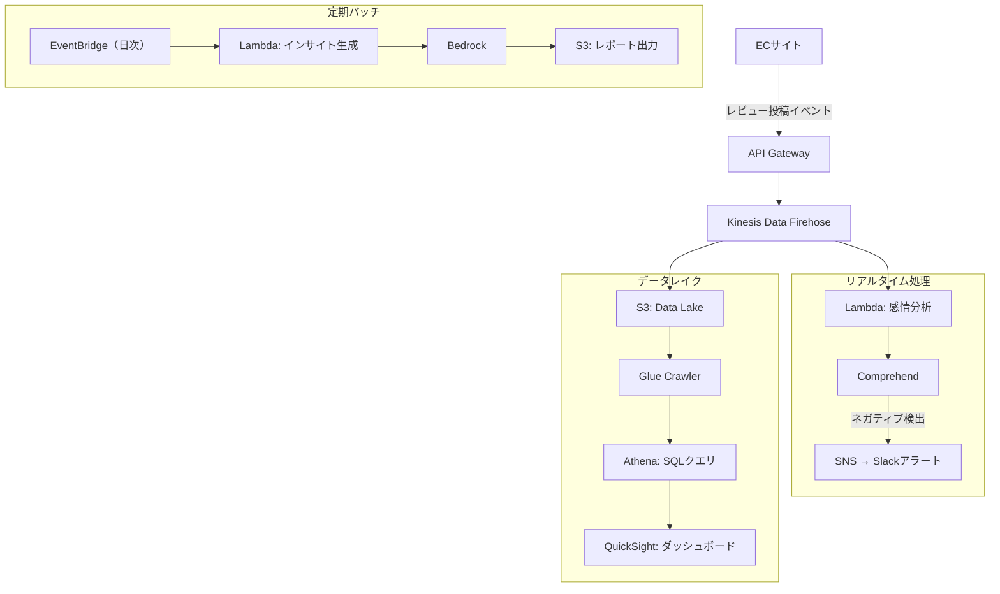

# 課題9: StyleMarket株式会社のECレビュー分析・インサイト抽出システム構築

**難易度: 🟢 初級〜中級**

---

## 1. 分類情報

| 項目 | 内容 |
|------|------|
| 難易度 | 初級〜中級 |
| カテゴリ | AI / データ分析 / EC |
| 処理タイプ | バッチ / ストリーム |
| 使用IaC | CloudFormation |
| 所要時間 | 6〜7時間 |

---

## シナリオ

### 企業プロフィール

**StyleMarket株式会社**は、20〜30代女性をターゲットにしたアパレル・コスメのECプラットフォームを運営しています。

| 項目 | 内容 |
|------|------|
| 業種 | EC（アパレル・コスメ） |
| 設立 | 2018年 |
| 従業員数 | 120名（うちMD15名、CS20名） |
| 月間アクティブユーザー | 80万人 |
| 取扱商品数 | 3万点 |
| 取扱ブランド | 500ブランド |
| 月間レビュー投稿数 | 10万件 |
| 月商 | 15億円 |
| 平均購入単価 | 8,000円 |

### 現状の課題

月間10万件のレビューが投稿されていますが、手動でのレビュー分析に限界があり、商品改善やトレンド把握に活かしきれていません。また、ネガティブレビューへの対応が遅れ、顧客満足度に影響を与えています。

### 数値で示された問題

| 指標 | 現状 | 目標 |
|------|------|------|
| レビュー分析担当 | 3名（MDチーム兼任） | 1名（監視のみ） |
| 分析対象レビュー | 月1,000件（全体の1%） | 全件（10万件） |
| ネガティブレビュー検出 | 翌日以降 | リアルタイム |
| トレンドレポート作成 | 月1回（手作業5日） | 週1回（自動） |
| 商品改善フィードバック | 四半期ごと | 週次 |
| レビュー起因の返品率 | 8% | 5%以下 |

### レビューの内訳分析（過去3ヶ月平均）

| レビュー評価 | 割合 | 月間件数 |
|--------------|------|----------|
| ★5（非常に満足） | 35% | 35,000件 |
| ★4（満足） | 30% | 30,000件 |
| ★3（普通） | 20% | 20,000件 |
| ★2（不満） | 10% | 10,000件 |
| ★1（非常に不満） | 5% | 5,000件 |

**ネガティブレビュー（★1-2）: 月15,000件**
→ これらの早期検出と対応が急務

### 解決したいこと

1. 全レビューの自動感情分析（ポジティブ/ネガティブ/ニュートラル）
2. ネガティブレビューのリアルタイム検出とアラート
3. レビューからの商品改善点・品質課題の自動抽出
4. カテゴリ/ブランド別のトレンド分析ダッシュボード
5. 競合商品との比較インサイト生成

### 成功指標（KPI）

| KPI | 現状 | 目標 | 達成期限 |
|-----|------|------|----------|
| レビュー分析カバー率 | 1% | 100% | 1ヶ月後 |
| ネガティブ検出時間 | 24時間以上 | 5分以内 | 1ヶ月後 |
| 感情分析精度 | - | 90%以上 | 2ヶ月後 |
| レビュー起因返品率 | 8% | 5%以下 | 6ヶ月後 |
| 分析工数 | 3名×20% | 1名×10% | 3ヶ月後 |

---

## 達成目標

この演習で習得できるスキル：

### 技術的な学習ポイント

1. **Amazon Comprehendの実践活用**
   - 感情分析（Sentiment Analysis）
   - エンティティ認識
   - キーフレーズ抽出
   - カスタム分類器

2. **Amazon Bedrockによる高度な分析**
   - レビューからのインサイト抽出
   - 商品改善提案の生成
   - トレンドサマリー作成

3. **データパイプラインの構築**
   - Kinesis Data Firehoseによるストリーム処理
   - Lambda + DynamoDBによるリアルタイム処理
   - S3 + Athenaによるバッチ分析

4. **Amazon QuickSightによる可視化**
   - ダッシュボード構築
   - 自動更新設定
   - 埋め込みダッシュボード

### 実務で活かせる知識

- テキスト分析システムの設計パターン
- ストリーム処理 vs バッチ処理の使い分け
- BIダッシュボードの設計

### GCPとの比較

| 機能 | AWS | GCP |
|------|-----|-----|
| NLP | Amazon Comprehend | Natural Language API |
| 生成AI | Bedrock | Vertex AI |
| ストリーム処理 | Kinesis | Pub/Sub + Dataflow |
| BI | QuickSight | Looker / Data Studio |
| データウェアハウス | Athena / Redshift | BigQuery |

---

## 使用するAWSサービス

### メインサービス

| サービス | 役割 | 選定理由 |
|----------|------|----------|
| Amazon Comprehend | 感情分析・エンティティ抽出 | リアルタイム分析対応 |
| Amazon Bedrock | インサイト生成・サマリー作成 | 高度な日本語理解 |
| Amazon Kinesis Data Firehose | ストリーム取り込み | S3自動配信 |
| AWS Lambda | リアルタイム処理 | イベント駆動 |
| Amazon DynamoDB | リアルタイムデータ保存 | 高速読み書き |
| Amazon S3 | データレイク | 長期保存・分析用 |
| Amazon Athena | SQLクエリ分析 | サーバーレス分析 |
| Amazon QuickSight | ダッシュボード | 可視化・共有 |

### 補助サービス

| サービス | 役割 |
|----------|------|
| Amazon SNS | ネガティブレビューアラート |
| Amazon EventBridge | 定期バッチ実行 |
| AWS Glue | データカタログ |
| Amazon CloudWatch | 監視・ログ |

---

## 前提条件

### 必要な事前知識

- AWSの基本操作（S3, Lambda, DynamoDB）
- SQLの基礎
- JSONの読み書き
- BIダッシュボードの基本概念

### 準備するもの

1. **AWSアカウント**
   - Bedrock有効化（Claude 3 Haiku/Sonnet）
   - QuickSight有効化（Enterprise版推奨）
   - 適切なIAM権限

2. **開発環境**
   - AWS CLI v2
   - Python 3.9以上

3. **テストデータ**
   - サンプルレビューデータ（JSON形式）

---

## アーキテクチャ概要

### システム全体構成



### データフロー

1. **リアルタイム処理**: レビュー投稿 → Firehose → Lambda（Comprehend）→ ネガティブ検出アラート
2. **バッチ処理**: S3 → Athena → QuickSight（日次更新）
3. **インサイト生成**: EventBridge → Lambda（Bedrock）→ 週次レポート

---

## ハンズオン手順

### フェーズ1: データ基盤構築（1.5時間）

#### Step 1-1: S3バケット・DynamoDB作成

```bash
# 環境変数
export AWS_REGION=ap-northeast-1
export ACCOUNT_ID=$(aws sts get-caller-identity --query Account --output text)

# S3バケット（データレイク）
aws s3 mb s3://stylemarket-reviews-${ACCOUNT_ID} --region ${AWS_REGION}

# データレイク用プレフィックス作成
aws s3api put-object --bucket stylemarket-reviews-${ACCOUNT_ID} --key raw/
aws s3api put-object --bucket stylemarket-reviews-${ACCOUNT_ID} --key processed/
aws s3api put-object --bucket stylemarket-reviews-${ACCOUNT_ID} --key insights/

# DynamoDB（リアルタイムデータ）
aws dynamodb create-table \
  --table-name stylemarket-reviews-realtime \
  --attribute-definitions \
    AttributeName=reviewId,AttributeType=S \
    AttributeName=createdAt,AttributeType=S \
  --key-schema \
    AttributeName=reviewId,KeyType=HASH \
    AttributeName=createdAt,KeyType=RANGE \
  --billing-mode PAY_PER_REQUEST \
  --region ${AWS_REGION}

# GSI追加（感情別検索用）
aws dynamodb update-table \
  --table-name stylemarket-reviews-realtime \
  --attribute-definitions AttributeName=sentiment,AttributeType=S \
  --global-secondary-index-updates '[
    {
      "Create": {
        "IndexName": "sentiment-index",
        "KeySchema": [{"AttributeName": "sentiment", "KeyType": "HASH"}, {"AttributeName": "createdAt", "KeyType": "RANGE"}],
        "Projection": {"ProjectionType": "ALL"}
      }
    }
  ]' \
  --region ${AWS_REGION}
```

#### Step 1-2: SNSトピック作成

```bash
# ネガティブレビューアラート用
aws sns create-topic --name stylemarket-negative-review-alert --region ${AWS_REGION}

# メール購読
aws sns subscribe \
  --topic-arn arn:aws:sns:${AWS_REGION}:${ACCOUNT_ID}:stylemarket-negative-review-alert \
  --protocol email \
  --notification-endpoint cs-team@stylemarket.example.com \
  --region ${AWS_REGION}
```

### フェーズ2: リアルタイム処理構築（2時間）

#### Step 2-1: Lambda関数作成（感情分析）

```python
# lambda/review_analyzer.py
import json
import boto3
import os
from datetime import datetime
from decimal import Decimal

comprehend = boto3.client('comprehend', region_name='ap-northeast-1')
dynamodb = boto3.resource('dynamodb', region_name='ap-northeast-1')
sns = boto3.client('sns', region_name='ap-northeast-1')
s3 = boto3.client('s3', region_name='ap-northeast-1')

table = dynamodb.Table(os.environ['DYNAMODB_TABLE'])
ALERT_TOPIC_ARN = os.environ['ALERT_TOPIC_ARN']
OUTPUT_BUCKET = os.environ['OUTPUT_BUCKET']

def analyze_sentiment(text: str) -> dict:
    """Comprehendで感情分析"""
    response = comprehend.detect_sentiment(
        Text=text[:5000],  # 5000文字制限
        LanguageCode='ja'
    )
    return {
        'sentiment': response['Sentiment'],
        'scores': {
            'positive': Decimal(str(round(response['SentimentScore']['Positive'], 4))),
            'negative': Decimal(str(round(response['SentimentScore']['Negative'], 4))),
            'neutral': Decimal(str(round(response['SentimentScore']['Neutral'], 4))),
            'mixed': Decimal(str(round(response['SentimentScore']['Mixed'], 4)))
        }
    }

def extract_key_phrases(text: str) -> list:
    """キーフレーズ抽出"""
    response = comprehend.detect_key_phrases(
        Text=text[:5000],
        LanguageCode='ja'
    )
    return [
        {'text': kp['Text'], 'score': round(kp['Score'], 4)}
        for kp in response['KeyPhrases']
        if kp['Score'] > 0.7
    ][:10]

def extract_entities(text: str) -> list:
    """エンティティ抽出"""
    response = comprehend.detect_entities(
        Text=text[:5000],
        LanguageCode='ja'
    )
    return [
        {'text': e['Text'], 'type': e['Type'], 'score': round(e['Score'], 4)}
        for e in response['Entities']
        if e['Score'] > 0.7
    ][:10]

def send_negative_alert(review: dict, analysis: dict):
    """ネガティブレビューアラート送信"""
    message = f"""
【ネガティブレビュー検出】

商品ID: {review.get('productId', 'N/A')}
商品名: {review.get('productName', 'N/A')}
ブランド: {review.get('brand', 'N/A')}
評価: {'★' * review.get('rating', 0)}
ネガティブスコア: {float(analysis['scores']['negative']):.2%}

レビュー内容:
{review.get('text', '')[:500]}

キーフレーズ:
{', '.join([kp['text'] for kp in analysis.get('keyPhrases', [])])}

---
対応が必要な場合は管理画面から確認してください。
レビューID: {review.get('reviewId', 'N/A')}
"""
    sns.publish(
        TopicArn=ALERT_TOPIC_ARN,
        Subject=f"[要確認] ネガティブレビュー - {review.get('productName', '商品')}",
        Message=message
    )

def lambda_handler(event, context):
    """Firehoseからのレビューデータを処理"""
    output_records = []

    for record in event['records']:
        # Base64デコード
        payload = json.loads(
            boto3.utils.base64.b64decode(record['data']).decode('utf-8')
        )

        review_id = payload.get('reviewId', '')
        review_text = payload.get('text', '')
        rating = payload.get('rating', 0)
        product_id = payload.get('productId', '')
        created_at = payload.get('createdAt', datetime.utcnow().isoformat())

        # 感情分析
        sentiment_result = analyze_sentiment(review_text)

        # キーフレーズ抽出
        key_phrases = extract_key_phrases(review_text)

        # エンティティ抽出
        entities = extract_entities(review_text)

        # 分析結果を統合
        enriched_record = {
            **payload,
            'sentiment': sentiment_result['sentiment'],
            'sentimentScores': sentiment_result['scores'],
            'keyPhrases': key_phrases,
            'entities': entities,
            'analyzedAt': datetime.utcnow().isoformat()
        }

        # DynamoDBに保存
        table.put_item(Item={
            'reviewId': review_id,
            'createdAt': created_at,
            'productId': product_id,
            'rating': rating,
            'sentiment': sentiment_result['sentiment'],
            'negativeScore': sentiment_result['scores']['negative'],
            'keyPhrases': [kp['text'] for kp in key_phrases],
            'text': review_text[:1000],  # 保存用に切り詰め
            'ttl': int(datetime.utcnow().timestamp()) + 86400 * 90  # 90日で削除
        })

        # ネガティブレビュー検出（★2以下 or ネガティブスコア0.7以上）
        is_negative = (
            rating <= 2 or
            float(sentiment_result['scores']['negative']) > 0.7
        )

        if is_negative:
            send_negative_alert(payload, {
                'scores': sentiment_result['scores'],
                'keyPhrases': key_phrases
            })

        # Firehoseに返すデータ（S3保存用）
        output_records.append({
            'recordId': record['recordId'],
            'result': 'Ok',
            'data': boto3.utils.base64.b64encode(
                (json.dumps(enriched_record, ensure_ascii=False, default=str) + '\n').encode('utf-8')
            ).decode('utf-8')
        })

    return {'records': output_records}
```

#### Step 2-2: Kinesis Data Firehose設定

```yaml
# cloudformation/firehose.yaml
AWSTemplateFormatVersion: '2010-09-09'
Description: Kinesis Firehose for StyleMarket Review Analysis

Parameters:
  AccountId:
    Type: String
  Environment:
    Type: String
    Default: dev

Resources:
  # Firehose用IAMロール
  FirehoseRole:
    Type: AWS::IAM::Role
    Properties:
      AssumeRolePolicyDocument:
        Version: '2012-10-17'
        Statement:
          - Effect: Allow
            Principal:
              Service: firehose.amazonaws.com
            Action: sts:AssumeRole
      Policies:
        - PolicyName: FirehosePolicy
          PolicyDocument:
            Version: '2012-10-17'
            Statement:
              - Effect: Allow
                Action:
                  - s3:PutObject
                  - s3:GetObject
                  - s3:ListBucket
                Resource:
                  - !Sub 'arn:aws:s3:::stylemarket-reviews-${AccountId}'
                  - !Sub 'arn:aws:s3:::stylemarket-reviews-${AccountId}/*'
              - Effect: Allow
                Action:
                  - lambda:InvokeFunction
                Resource:
                  - !Sub 'arn:aws:lambda:ap-northeast-1:${AccountId}:function:stylemarket-review-analyzer'
              - Effect: Allow
                Action:
                  - logs:PutLogEvents
                  - logs:CreateLogStream
                Resource: '*'

  # Firehose配信ストリーム
  ReviewFirehose:
    Type: AWS::KinesisFirehose::DeliveryStream
    Properties:
      DeliveryStreamName: !Sub 'stylemarket-reviews-stream-${Environment}'
      DeliveryStreamType: DirectPut
      ExtendedS3DestinationConfiguration:
        BucketARN: !Sub 'arn:aws:s3:::stylemarket-reviews-${AccountId}'
        Prefix: 'processed/year=!{timestamp:yyyy}/month=!{timestamp:MM}/day=!{timestamp:dd}/'
        ErrorOutputPrefix: 'errors/!{firehose:error-output-type}/year=!{timestamp:yyyy}/month=!{timestamp:MM}/day=!{timestamp:dd}/'
        RoleARN: !GetAtt FirehoseRole.Arn
        BufferingHints:
          IntervalInSeconds: 60
          SizeInMBs: 5
        CompressionFormat: GZIP
        ProcessingConfiguration:
          Enabled: true
          Processors:
            - Type: Lambda
              Parameters:
                - ParameterName: LambdaArn
                  ParameterValue: !Sub 'arn:aws:lambda:ap-northeast-1:${AccountId}:function:stylemarket-review-analyzer'
                - ParameterName: BufferSizeInMBs
                  ParameterValue: '1'
                - ParameterName: BufferIntervalInSeconds
                  ParameterValue: '60'
        CloudWatchLoggingOptions:
          Enabled: true
          LogGroupName: !Sub '/aws/kinesisfirehose/stylemarket-reviews-${Environment}'
          LogStreamName: S3Delivery

Outputs:
  FirehoseArn:
    Value: !GetAtt ReviewFirehose.Arn
  FirehoseName:
    Value: !Ref ReviewFirehose
```

### フェーズ3: バッチ分析基盤（1.5時間）

#### Step 3-1: Glue Crawler設定

```bash
# Glueデータベース作成
aws glue create-database \
  --database-input '{"Name": "stylemarket_reviews"}' \
  --region ${AWS_REGION}

# Crawler用IAMロール作成
aws iam create-role \
  --role-name AWSGlueServiceRole-StyleMarket \
  --assume-role-policy-document '{
    "Version": "2012-10-17",
    "Statement": [{
      "Effect": "Allow",
      "Principal": {"Service": "glue.amazonaws.com"},
      "Action": "sts:AssumeRole"
    }]
  }'

aws iam attach-role-policy \
  --role-name AWSGlueServiceRole-StyleMarket \
  --policy-arn arn:aws:iam::aws:policy/service-role/AWSGlueServiceRole

aws iam put-role-policy \
  --role-name AWSGlueServiceRole-StyleMarket \
  --policy-name S3Access \
  --policy-document '{
    "Version": "2012-10-17",
    "Statement": [{
      "Effect": "Allow",
      "Action": ["s3:GetObject", "s3:PutObject", "s3:ListBucket"],
      "Resource": [
        "arn:aws:s3:::stylemarket-reviews-'${ACCOUNT_ID}'",
        "arn:aws:s3:::stylemarket-reviews-'${ACCOUNT_ID}'/*"
      ]
    }]
  }'

# Crawler作成
aws glue create-crawler \
  --name stylemarket-reviews-crawler \
  --role AWSGlueServiceRole-StyleMarket \
  --database-name stylemarket_reviews \
  --targets '{
    "S3Targets": [{
      "Path": "s3://stylemarket-reviews-'${ACCOUNT_ID}'/processed/"
    }]
  }' \
  --schema-change-policy '{"UpdateBehavior": "UPDATE_IN_DATABASE", "DeleteBehavior": "LOG"}' \
  --region ${AWS_REGION}

# Crawler実行
aws glue start-crawler --name stylemarket-reviews-crawler --region ${AWS_REGION}
```

#### Step 3-2: Athenaクエリ準備

```sql
-- Athenaワークグループ作成後に実行

-- カテゴリ別感情分析サマリー
CREATE OR REPLACE VIEW stylemarket_reviews.sentiment_by_category AS
SELECT
    category,
    COUNT(*) as total_reviews,
    SUM(CASE WHEN sentiment = 'POSITIVE' THEN 1 ELSE 0 END) as positive_count,
    SUM(CASE WHEN sentiment = 'NEGATIVE' THEN 1 ELSE 0 END) as negative_count,
    SUM(CASE WHEN sentiment = 'NEUTRAL' THEN 1 ELSE 0 END) as neutral_count,
    AVG(rating) as avg_rating,
    AVG(CAST(sentimentscores.negative AS DOUBLE)) as avg_negative_score
FROM stylemarket_reviews.processed
WHERE year = YEAR(current_date)
  AND month = MONTH(current_date)
GROUP BY category;

-- ブランド別週次トレンド
CREATE OR REPLACE VIEW stylemarket_reviews.brand_weekly_trend AS
SELECT
    brand,
    DATE_TRUNC('week', DATE(createdat)) as week,
    COUNT(*) as review_count,
    AVG(rating) as avg_rating,
    SUM(CASE WHEN sentiment = 'NEGATIVE' THEN 1 ELSE 0 END) as negative_count
FROM stylemarket_reviews.processed
WHERE createdat >= DATE_ADD('day', -30, current_date)
GROUP BY brand, DATE_TRUNC('week', DATE(createdat))
ORDER BY brand, week;

-- ネガティブレビュー詳細（直近7日）
CREATE OR REPLACE VIEW stylemarket_reviews.recent_negative_reviews AS
SELECT
    reviewid,
    productid,
    productname,
    brand,
    category,
    rating,
    text,
    keyphrases,
    sentimentscores.negative as negative_score,
    createdat
FROM stylemarket_reviews.processed
WHERE sentiment = 'NEGATIVE'
  AND createdat >= DATE_ADD('day', -7, current_date)
ORDER BY sentimentscores.negative DESC
LIMIT 100;
```

### フェーズ4: インサイト生成バッチ（1時間）

#### Step 4-1: Bedrockインサイト生成Lambda

```python
# lambda/insight_generator.py
import json
import boto3
import os
from datetime import datetime, timedelta

s3 = boto3.client('s3', region_name='ap-northeast-1')
athena = boto3.client('athena', region_name='ap-northeast-1')
bedrock = boto3.client('bedrock-runtime', region_name='ap-northeast-1')

OUTPUT_BUCKET = os.environ['OUTPUT_BUCKET']
ATHENA_DATABASE = 'stylemarket_reviews'
ATHENA_OUTPUT = f's3://{OUTPUT_BUCKET}/athena-results/'

def run_athena_query(query: str) -> list:
    """Athenaクエリ実行"""
    response = athena.start_query_execution(
        QueryString=query,
        QueryExecutionContext={'Database': ATHENA_DATABASE},
        ResultConfiguration={'OutputLocation': ATHENA_OUTPUT}
    )

    query_id = response['QueryExecutionId']

    # 完了待ち
    while True:
        result = athena.get_query_execution(QueryExecutionId=query_id)
        status = result['QueryExecution']['Status']['State']
        if status in ['SUCCEEDED', 'FAILED', 'CANCELLED']:
            break

    if status != 'SUCCEEDED':
        raise Exception(f"Query failed: {status}")

    # 結果取得
    results = athena.get_query_results(QueryExecutionId=query_id)
    rows = results['ResultSet']['Rows']

    if len(rows) <= 1:
        return []

    headers = [col['VarCharValue'] for col in rows[0]['Data']]
    data = []
    for row in rows[1:]:
        values = [col.get('VarCharValue', '') for col in row['Data']]
        data.append(dict(zip(headers, values)))

    return data

def generate_weekly_insights(data: dict) -> str:
    """Bedrockで週次インサイト生成"""

    prompt = f"""以下のECサイトレビュー分析データを基に、マーチャンダイザー向けの週次インサイトレポートを作成してください。

## データサマリー

### カテゴリ別感情分析
{json.dumps(data.get('category_sentiment', []), ensure_ascii=False, indent=2)}

### ブランド別トレンド
{json.dumps(data.get('brand_trend', []), ensure_ascii=False, indent=2)}

### 最近のネガティブレビュー（主なキーフレーズ）
{json.dumps(data.get('negative_highlights', []), ensure_ascii=False, indent=2)}

## レポート形式

以下のMarkdown形式で作成してください:

1. **エグゼクティブサマリー**（3行程度）
2. **今週の注目ポイント**
   - ポジティブトレンド（伸びているカテゴリ/ブランド）
   - 要注意ポイント（ネガティブ増加傾向）
3. **カテゴリ別分析**
   - 各カテゴリの状況と推奨アクション
4. **ブランド別分析**
   - 特に注目すべきブランド（良い/悪い）
5. **改善提案**
   - 具体的な改善アクション3-5個
6. **来週の注目点**

ビジネス視点で実用的なインサイトを提供してください。"""

    body = json.dumps({
        "anthropic_version": "bedrock-2023-05-31",
        "max_tokens": 4096,
        "messages": [{"role": "user", "content": prompt}]
    })

    response = bedrock.invoke_model(
        modelId='anthropic.claude-3-sonnet-20240229-v1:0',
        body=body
    )

    result = json.loads(response['body'].read())
    return result['content'][0]['text']

def lambda_handler(event, context):
    """週次インサイト生成"""
    print("Starting weekly insight generation...")

    # カテゴリ別感情分析
    category_query = """
    SELECT category, total_reviews, positive_count, negative_count,
           avg_rating, avg_negative_score
    FROM stylemarket_reviews.sentiment_by_category
    ORDER BY total_reviews DESC
    LIMIT 20
    """
    category_data = run_athena_query(category_query)

    # ブランド別トレンド
    brand_query = """
    SELECT brand, week, review_count, avg_rating, negative_count
    FROM stylemarket_reviews.brand_weekly_trend
    ORDER BY review_count DESC
    LIMIT 50
    """
    brand_data = run_athena_query(brand_query)

    # ネガティブレビューハイライト
    negative_query = """
    SELECT productname, brand, category, keyphrases, negative_score
    FROM stylemarket_reviews.recent_negative_reviews
    LIMIT 20
    """
    negative_data = run_athena_query(negative_query)

    # インサイト生成
    insights = generate_weekly_insights({
        'category_sentiment': category_data,
        'brand_trend': brand_data,
        'negative_highlights': negative_data
    })

    # S3に保存
    timestamp = datetime.utcnow().strftime('%Y-%m-%d')
    report_key = f"insights/weekly/{timestamp}/weekly-insight-report.md"

    s3.put_object(
        Bucket=OUTPUT_BUCKET,
        Key=report_key,
        Body=insights.encode('utf-8'),
        ContentType='text/markdown'
    )

    print(f"Report saved: s3://{OUTPUT_BUCKET}/{report_key}")

    return {
        'statusCode': 200,
        'reportKey': report_key
    }
```

#### Step 4-2: EventBridge定期実行設定

```bash
# 週次バッチ用EventBridgeルール
aws events put-rule \
  --name stylemarket-weekly-insight \
  --schedule-expression "cron(0 9 ? * MON *)" \
  --description "Weekly insight generation every Monday 9AM JST" \
  --region ${AWS_REGION}

# Lambdaをターゲットに設定
aws events put-targets \
  --rule stylemarket-weekly-insight \
  --targets "Id"="1","Arn"="arn:aws:lambda:${AWS_REGION}:${ACCOUNT_ID}:function:stylemarket-insight-generator" \
  --region ${AWS_REGION}
```

### フェーズ5: QuickSightダッシュボード（1時間）

#### Step 5-1: QuickSightセットアップ

```bash
# QuickSightアカウント作成（コンソールから実施）
# 1. QuickSight → サインアップ
# 2. Enterprise Edition選択
# 3. S3バケットへのアクセス許可

# Athenaデータソース設定
# QuickSightコンソールから:
# 1. データセット → 新しいデータセット
# 2. Athena選択
# 3. stylemarket_reviewsデータベース選択
# 4. sentiment_by_categoryビュー選択
```

#### Step 5-2: ダッシュボード設計

QuickSightで以下のビジュアルを作成:

1. **サマリーKPI**
   - 総レビュー数（カウンター）
   - 平均評価（ゲージ）
   - ネガティブ率（KPI）

2. **感情分布**
   - 円グラフ（Positive/Negative/Neutral）
   - 時系列トレンド（折れ線グラフ）

3. **カテゴリ別分析**
   - 横棒グラフ（カテゴリ別レビュー数）
   - ヒートマップ（カテゴリ×感情）

4. **ブランド別トレンド**
   - 折れ線グラフ（週次評価推移）
   - テーブル（ブランド別サマリー）

5. **ネガティブレビュー詳細**
   - テーブル（直近ネガティブレビュー一覧）
   - ワードクラウド（キーフレーズ）

---

## トラブルシューティング課題

### 問題1: Comprehendで言語エラー

**症状:**
```
An error occurred (UnsupportedLanguageException):
Comprehend does not support the language of the input text
```

**ヒント:**
1. 入力テキストの言語を確認
2. 空文字やノイズのみのテキストでないか
3. 言語コードが正しいか（ja）

**解決方法:**
```python
def analyze_sentiment_safe(text: str) -> dict:
    # テキストの前処理
    text = text.strip()
    if len(text) < 10:
        return {'sentiment': 'NEUTRAL', 'scores': {...}}

    # 日本語かどうか簡易チェック
    import re
    if not re.search(r'[\u3040-\u309f\u30a0-\u30ff\u4e00-\u9fff]', text):
        # 日本語が含まれない場合は英語として処理
        language_code = 'en'
    else:
        language_code = 'ja'

    response = comprehend.detect_sentiment(
        Text=text[:5000],
        LanguageCode=language_code
    )
    return {...}
```

### 問題2: Firehoseのデータ形式エラー

**症状:**
```
Lambda transformation failed
S3に保存されるデータが空または不正
```

**ヒント:**
1. Lambda戻り値の形式を確認
2. Base64エンコード/デコードを確認
3. recordIdが正しく返されているか

**解決方法:**
```python
# 正しい戻り値形式
output_records.append({
    'recordId': record['recordId'],  # 必須: 元のrecordIdを返す
    'result': 'Ok',  # Ok, Dropped, ProcessingFailed のいずれか
    'data': base64.b64encode(
        (json.dumps(data) + '\n').encode('utf-8')
    ).decode('utf-8')  # 必ず改行を追加
})
```

### 問題3: QuickSightでデータが表示されない

**症状:**
```
データセットの更新が反映されない
SPICEのデータが古い
```

**ヒント:**
1. SPICEの更新スケジュールを確認
2. Athenaテーブルのパーティションを確認
3. データソースの権限を確認

**解決方法:**
```bash
# Glue Crawlerを再実行してパーティション更新
aws glue start-crawler --name stylemarket-reviews-crawler

# QuickSightでSPICE更新
# コンソール → データセット → 今すぐ更新
```

---

## 設計の考察ポイント

### 1. リアルタイム処理とバッチ処理の使い分け

**考察ポイント:**
- ネガティブレビュー検出はなぜリアルタイムが必要か
- インサイト生成はなぜバッチで十分か
- コストとレイテンシーのトレードオフ

### 2. Comprehend vs Bedrock の使い分け

**考察ポイント:**
- Comprehend: 感情分析、エンティティ抽出（高速・低コスト）
- Bedrock: 複雑な解釈、レポート生成（高精度・高コスト）
- 組み合わせることで最適化

### 3. データレイクアーキテクチャ

**考察ポイント:**
- S3 + Athena + Glue の組み合わせ
- パーティショニング戦略（年/月/日）
- 圧縮形式の選択（GZIP vs Parquet）

### 4. アラートの閾値設計

**考察ポイント:**
- 誤検知を防ぐ閾値の設定
- 評価（★）と感情スコアの組み合わせ
- アラート疲れを防ぐ工夫

### 5. ダッシュボードの運用

**考察ポイント:**
- 更新頻度とSPICEコスト
- 直接クエリ vs SPICE
- 権限管理とアクセス制御

---

## 発展課題（オプション）

### 1. カスタム分類器の構築
- レビューの自動カテゴリ分類
- 商品不良/配送問題/価格等の自動タグ付け
- Comprehend Custom Classificationの活用

### 2. 競合分析の追加
- 外部レビューサイトのスクレイピング
- 競合商品との比較分析
- 市場トレンドレポート

### 3. レコメンデーション連携
- レビューに基づく商品レコメンド
- Personalize との統合
- パーソナライズされた商品提案

### 4. リアルタイムダッシュボード
- Kinesis Data Analytics
- リアルタイム集計
- CloudWatch Dashboards連携

### 5. 多言語対応
- 海外ユーザーレビューの分析
- 言語自動検出
- 言語別感情分析

---

## 想定コストと削減方法

### 月額概算コスト（月間10万件レビュー処理想定）

| サービス | 内訳 | 月額コスト |
|----------|------|------------|
| Amazon Comprehend | 10万件 × $0.0001/unit | $100 |
| Amazon Bedrock | 4回/月 × Sonnet | $5 |
| Kinesis Firehose | 10万件 × 5KB | $3 |
| AWS Lambda | 10万回 × 5秒 | $5 |
| Amazon S3 | 50GB + リクエスト | $2 |
| Amazon Athena | 100GB/月スキャン | $5 |
| Amazon DynamoDB | オンデマンド | $10 |
| Amazon QuickSight | 1ユーザー | $24 |
| AWS Glue | Crawler実行 | $1 |
| CloudWatch | ログ・メトリクス | $5 |
| **合計** | | **約$160（約24,000円）** |

### コスト削減のポイント

1. **Comprehendのバッチ処理**
   - リアルタイム不要なレビューはバッチで処理
   - StartSentimentDetectionJobの活用
   - → 最大50%削減

2. **S3のパーティショニング最適化**
   - Athenaのスキャン量削減
   - Parquet形式への変換

3. **QuickSightのライセンス**
   - Reader（閲覧のみ）: $5/月
   - 必要なユーザーのみAuthor

4. **DynamoDB TTLの活用**
   - 古いデータの自動削除
   - S3へのアーカイブ

### リソース削除手順

```bash
# S3バケット
aws s3 rm s3://stylemarket-reviews-${ACCOUNT_ID} --recursive
aws s3 rb s3://stylemarket-reviews-${ACCOUNT_ID}

# DynamoDB
aws dynamodb delete-table --table-name stylemarket-reviews-realtime

# Kinesis Firehose
aws firehose delete-delivery-stream --delivery-stream-name stylemarket-reviews-stream-dev

# SNS
aws sns delete-topic --topic-arn arn:aws:sns:${AWS_REGION}:${ACCOUNT_ID}:stylemarket-negative-review-alert

# Glue
aws glue delete-crawler --name stylemarket-reviews-crawler
aws glue delete-database --name stylemarket_reviews

# EventBridge
aws events remove-targets --rule stylemarket-weekly-insight --ids 1
aws events delete-rule --name stylemarket-weekly-insight

# Lambda
aws lambda delete-function --function-name stylemarket-review-analyzer
aws lambda delete-function --function-name stylemarket-insight-generator

# QuickSight（コンソールから）
# 分析、データセット、データソースを順に削除

# CloudFormation
aws cloudformation delete-stack --stack-name stylemarket-firehose
```

---

## 学習のポイント

### 1. ストリーム処理 vs バッチ処理の設計判断
リアルタイム性が必要な処理（ネガティブ検出アラート）とバッチで十分な処理（週次レポート）を明確に分け、適切なアーキテクチャを選択する。

### 2. Amazon Comprehendの活用パターン
感情分析、エンティティ抽出、キーフレーズ抽出など、NLPタスクに特化したサービスを理解し、適切に組み合わせる。

### 3. データレイクの基本設計
S3 + Glue + Athena の組み合わせは、AWSデータ分析の基本パターン。パーティショニング、圧縮形式、データカタログの概念を習得する。

### 4. BIダッシュボードの設計
QuickSightによる可視化を通じて、ビジネスユーザーにインサイトを届ける方法を学ぶ。SPICE vs 直接クエリのトレードオフを理解する。

### 5. AIとルールベースの組み合わせ
感情分析（AI）と評価スコア（ルール）を組み合わせることで、より正確な判定を実現する。単一の手法に依存しない設計を心がける。
