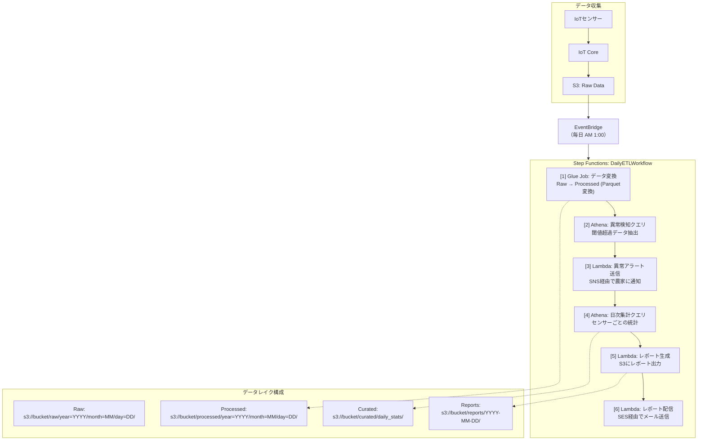

# 課題10: AgriTech株式会社のセンサーデータ集計・異常検知レポート自動生成システム構築

**難易度: 🟡 中級**

---

## 1. 分類情報

| 項目 | 内容 |
|------|------|
| 難易度 | 中級 |
| カテゴリ | バッチ処理 / データ基盤 / IoT / 農業テック |
| 処理タイプ | バッチ / ETL |
| 使用IaC | Terraform |
| 所要時間 | 7〜9時間 |

---

## シナリオ

### 企業プロフィール

**AgriTech株式会社**は、スマート農業ソリューションを提供するアグリテックスタートアップです。

| 項目 | 内容 |
|------|------|
| 業種 | アグリテック（スマート農業） |
| 設立 | 2018年 |
| 従業員数 | 45名 |
| 契約農家数 | 500件 |
| センサー設置箇所 | 全国1,000箇所 |
| 監視対象作物 | 米、野菜、果樹 |
| 日次データ量 | 約10GB |
| 年間売上 | 5億円 |
| サービス内容 | 環境監視、生育予測、収穫時期最適化 |

### 現状の課題

全国1,000箇所に設置したセンサーから毎日大量のデータが送られてきますが、データの集計・分析が追いつかず、異常検知が遅れたり、農家への有益なレポートを提供できていません。

### 数値で示された問題

| 指標 | 現状 | 目標 |
|------|------|------|
| 日次データ量 | 10GB | 変わらず |
| センサーポイント | 1,000箇所 | 拡大予定（2,000箇所） |
| データ収集間隔 | 5分 | 変わらず |
| 日次レコード数 | 約1,000万件 | - |
| データ分析担当 | 3名 | 1名（監視のみ） |
| 異常検知遅延 | 6時間以上 | 1時間以内 |
| 日次レポート配信 | 手動（翌日夕方） | 自動（翌日朝9時） |

### センサーデータの内訳

| センサー種別 | 測定項目 | 収集頻度 | 異常検知対象 |
|--------------|----------|----------|--------------|
| 気象センサー | 気温、湿度、降水量、日照 | 5分 | 霜・高温警報 |
| 土壌センサー | 土壌水分、pH、EC（電気伝導度） | 10分 | 乾燥・過湿 |
| 環境センサー | CO2濃度、風速 | 15分 | 換気異常 |
| 生育モニター | 葉色、茎径 | 1時間 | 生育不良 |

### 解決したいこと

1. 日次10GBのセンサーデータを効率的にETL処理
2. 異常値の自動検知とアラート通知
3. 農家ごとの日次レポート自動生成
4. 過去データとの比較分析（前年同期比等）
5. スケーラブルなデータ基盤の構築

### 成功指標（KPI）

| KPI | 現状 | 目標 | 達成期限 |
|-----|------|------|----------|
| ETL処理時間 | 6時間 | 1時間以内 | 1ヶ月後 |
| 異常検知遅延 | 6時間 | 1時間以内 | 1ヶ月後 |
| レポート配信 | 翌日夕方 | 翌日朝9時 | 1ヶ月後 |
| データ分析工数 | 3名×8時間/日 | 1名×2時間/日 | 2ヶ月後 |
| スケーラビリティ | 1,000箇所 | 5,000箇所対応可 | 3ヶ月後 |

---

## 達成目標

この演習で習得できるスキル：

### 技術的な学習ポイント

1. **AWS Step Functionsによる複雑なワークフロー**
   - 並列処理（Parallel/Map state）
   - 条件分岐（Choice state）
   - エラーハンドリング

2. **AWS Glueによるデータ処理**
   - Glue Jobの作成と実行
   - データカタログの活用
   - パーティショニング戦略

3. **Amazon Athenaによるサーバーレス分析**
   - SQLクエリ最適化
   - パーティション pruning
   - CTAS（Create Table As Select）

4. **データレイクアーキテクチャ**
   - Raw/Processed/Curated 層
   - Parquet形式への変換
   - データライフサイクル管理

### 実務で活かせる知識

- 大規模データのETLパイプライン設計
- 時系列データの分析パターン
- IoTデータ基盤の構築

### GCPとの比較

| 機能 | AWS | GCP |
|------|-----|-----|
| ETL | Glue | Dataflow / Dataproc |
| データウェアハウス | Athena / Redshift | BigQuery |
| データカタログ | Glue Data Catalog | Data Catalog |
| ワークフロー | Step Functions | Cloud Workflows / Composer |
| ストレージ | S3 | Cloud Storage |

---

## 使用するAWSサービス

### メインサービス

| サービス | 役割 | 選定理由 |
|----------|------|----------|
| AWS Step Functions | ワークフローオーケストレーション | 複雑なETL制御 |
| AWS Glue | データ変換・ETL | サーバーレスETL |
| Amazon Athena | SQLクエリ分析 | サーバーレス分析 |
| Amazon S3 | データレイク | 大容量、低コスト |
| AWS Lambda | 軽量処理・通知 | イベント駆動 |

### 補助サービス

| サービス | 役割 |
|----------|------|
| Amazon SNS | 異常アラート通知 |
| Amazon SES | レポートメール配信 |
| Amazon CloudWatch | 監視・ログ |
| Amazon EventBridge | スケジュール実行 |
| AWS Glue Data Catalog | メタデータ管理 |

---

## 前提条件

### 必要な事前知識

- AWSの基本操作（S3, Lambda）
- SQLの基礎〜中級
- Pythonの基礎
- ETLの基本概念

### 準備するもの

1. **AWSアカウント**
   - Glue, Athenaへのアクセス権限
   - 適切なIAM権限

2. **開発環境**
   - Terraform v1.5以上
   - AWS CLI v2
   - Python 3.9以上

3. **テストデータ**
   - サンプルセンサーデータ（CSV/JSON）

---

## アーキテクチャ概要

### システム全体構成



### 処理フロー

1. **データ収集**: IoT Coreからのデータが5分間隔でS3 Rawに蓄積
2. **ETL起動**: EventBridgeが毎日AM1時にStep Functionsを起動
3. **データ変換**: GlueがRaw（JSON）→ Processed（Parquet）に変換
4. **異常検知**: Athenaで閾値超過データを抽出
5. **アラート**: 異常データがあれば農家にSNS通知
6. **集計**: Athenaで日次統計を計算
7. **レポート生成**: Lambdaでレポート作成
8. **配信**: SESで農家にメール送信

---

## ハンズオン手順

### フェーズ1: データ基盤構築（2時間）

#### Step 1-1: Terraformプロジェクト構造

```
agritech-data-platform/
├── main.tf
├── variables.tf
├── outputs.tf
├── modules/
│   ├── s3/
│   ├── glue/
│   ├── athena/
│   └── step-functions/
├── glue_scripts/
│   └── transform_sensor_data.py
└── lambda_code/
    ├── anomaly_alert/
    ├── generate_report/
    └── send_report/
```

#### Step 1-2: S3データレイク構築

```hcl
# modules/s3/main.tf
resource "aws_s3_bucket" "data_lake" {
  bucket = "${var.project_name}-data-lake-${var.environment}-${var.account_id}"
}

resource "aws_s3_bucket_versioning" "data_lake" {
  bucket = aws_s3_bucket.data_lake.id
  versioning_configuration {
    status = "Enabled"
  }
}

resource "aws_s3_bucket_lifecycle_configuration" "data_lake" {
  bucket = aws_s3_bucket.data_lake.id

  # Raw データは30日後にGlacierに移行
  rule {
    id     = "raw-data-lifecycle"
    status = "Enabled"

    filter {
      prefix = "raw/"
    }

    transition {
      days          = 30
      storage_class = "GLACIER"
    }

    expiration {
      days = 365
    }
  }

  # Processed データは90日後にIA移行
  rule {
    id     = "processed-data-lifecycle"
    status = "Enabled"

    filter {
      prefix = "processed/"
    }

    transition {
      days          = 90
      storage_class = "STANDARD_IA"
    }
  }

  # レポートは180日で削除
  rule {
    id     = "reports-lifecycle"
    status = "Enabled"

    filter {
      prefix = "reports/"
    }

    expiration {
      days = 180
    }
  }
}

# プレフィックス作成
resource "aws_s3_object" "prefixes" {
  for_each = toset(["raw/", "processed/", "curated/", "reports/", "athena-results/"])

  bucket  = aws_s3_bucket.data_lake.id
  key     = each.value
  content = ""
}
```

#### Step 1-3: Glue Data Catalog

```hcl
# modules/glue/main.tf
resource "aws_glue_catalog_database" "sensor_db" {
  name        = "${var.project_name}_sensor_data"
  description = "AgriTech sensor data catalog"
}

# Raw テーブル
resource "aws_glue_catalog_table" "raw_sensor_data" {
  name          = "raw_sensor_data"
  database_name = aws_glue_catalog_database.sensor_db.name

  table_type = "EXTERNAL_TABLE"

  parameters = {
    "classification" = "json"
  }

  storage_descriptor {
    location      = "s3://${var.data_lake_bucket}/raw/"
    input_format  = "org.apache.hadoop.mapred.TextInputFormat"
    output_format = "org.apache.hadoop.hive.ql.io.HiveIgnoreKeyTextOutputFormat"

    ser_de_info {
      serialization_library = "org.openx.data.jsonserde.JsonSerDe"
    }

    columns {
      name = "sensor_id"
      type = "string"
    }
    columns {
      name = "farm_id"
      type = "string"
    }
    columns {
      name = "sensor_type"
      type = "string"
    }
    columns {
      name = "timestamp"
      type = "string"
    }
    columns {
      name = "temperature"
      type = "double"
    }
    columns {
      name = "humidity"
      type = "double"
    }
    columns {
      name = "soil_moisture"
      type = "double"
    }
    columns {
      name = "ph"
      type = "double"
    }
    columns {
      name = "ec"
      type = "double"
    }
  }

  partition_keys {
    name = "year"
    type = "string"
  }
  partition_keys {
    name = "month"
    type = "string"
  }
  partition_keys {
    name = "day"
    type = "string"
  }
}

# Processed テーブル（Parquet）
resource "aws_glue_catalog_table" "processed_sensor_data" {
  name          = "processed_sensor_data"
  database_name = aws_glue_catalog_database.sensor_db.name

  table_type = "EXTERNAL_TABLE"

  parameters = {
    "classification"        = "parquet"
    "parquet.compression"   = "SNAPPY"
  }

  storage_descriptor {
    location      = "s3://${var.data_lake_bucket}/processed/"
    input_format  = "org.apache.hadoop.hive.ql.io.parquet.MapredParquetInputFormat"
    output_format = "org.apache.hadoop.hive.ql.io.parquet.MapredParquetOutputFormat"

    ser_de_info {
      serialization_library = "org.apache.hadoop.hive.ql.io.parquet.serde.ParquetHiveSerDe"
    }

    columns {
      name = "sensor_id"
      type = "string"
    }
    columns {
      name = "farm_id"
      type = "string"
    }
    columns {
      name = "sensor_type"
      type = "string"
    }
    columns {
      name = "timestamp"
      type = "timestamp"
    }
    columns {
      name = "temperature"
      type = "double"
    }
    columns {
      name = "humidity"
      type = "double"
    }
    columns {
      name = "soil_moisture"
      type = "double"
    }
    columns {
      name = "ph"
      type = "double"
    }
    columns {
      name = "ec"
      type = "double"
    }
  }

  partition_keys {
    name = "year"
    type = "string"
  }
  partition_keys {
    name = "month"
    type = "string"
  }
  partition_keys {
    name = "day"
    type = "string"
  }
}
```

#### Step 1-4: サンプルデータ生成スクリプト

```python
# scripts/generate_sample_data.py
import json
import random
import boto3
from datetime import datetime, timedelta
import os

s3 = boto3.client('s3', region_name='ap-northeast-1')
BUCKET = os.environ.get('DATA_LAKE_BUCKET', 'agritech-data-lake-dev-xxx')

# 農場とセンサーの定義
FARMS = [f'FARM-{str(i).zfill(3)}' for i in range(1, 11)]  # 10農場
SENSORS_PER_FARM = 5

def generate_sensor_data(farm_id: str, sensor_id: str, timestamp: datetime) -> dict:
    """センサーデータを生成"""
    hour = timestamp.hour

    # 時間帯による気温変動
    base_temp = 20 + 5 * (1 if 10 <= hour <= 16 else -1)

    # 異常データを5%の確率で生成
    is_anomaly = random.random() < 0.05

    if is_anomaly:
        temp = random.choice([base_temp + 15, base_temp - 15])  # 異常値
    else:
        temp = base_temp + random.gauss(0, 2)

    return {
        'sensor_id': sensor_id,
        'farm_id': farm_id,
        'sensor_type': random.choice(['weather', 'soil', 'environment']),
        'timestamp': timestamp.isoformat(),
        'temperature': round(temp, 2),
        'humidity': round(random.uniform(40, 90), 2),
        'soil_moisture': round(random.uniform(20, 80), 2),
        'ph': round(random.uniform(5.5, 7.5), 2),
        'ec': round(random.uniform(0.5, 2.5), 2)
    }

def upload_daily_data(date: datetime):
    """1日分のデータを生成してS3にアップロード"""
    year = date.strftime('%Y')
    month = date.strftime('%m')
    day = date.strftime('%d')

    all_records = []

    # 5分間隔で1日分のデータを生成
    current_time = date.replace(hour=0, minute=0, second=0)
    end_time = date.replace(hour=23, minute=59, second=59)

    while current_time <= end_time:
        for farm_id in FARMS:
            for i in range(SENSORS_PER_FARM):
                sensor_id = f'{farm_id}-SENSOR-{str(i).zfill(2)}'
                record = generate_sensor_data(farm_id, sensor_id, current_time)
                all_records.append(record)

        current_time += timedelta(minutes=5)

    # JSONLinesとしてS3にアップロード
    data = '\n'.join([json.dumps(r) for r in all_records])
    key = f'raw/year={year}/month={month}/day={day}/sensor_data.jsonl'

    s3.put_object(
        Bucket=BUCKET,
        Key=key,
        Body=data.encode('utf-8'),
        ContentType='application/json'
    )

    print(f"Uploaded {len(all_records)} records to s3://{BUCKET}/{key}")
    return len(all_records)

if __name__ == '__main__':
    # 過去7日分のデータを生成
    for i in range(7):
        date = datetime.utcnow() - timedelta(days=i+1)
        upload_daily_data(date)
```

### フェーズ2: Glue ETLジョブ実装（1.5時間）

#### Step 2-1: Glue Jobスクリプト

```python
# glue_scripts/transform_sensor_data.py
import sys
from awsglue.transforms import *
from awsglue.utils import getResolvedOptions
from pyspark.context import SparkContext
from awsglue.context import GlueContext
from awsglue.job import Job
from awsglue.dynamicframe import DynamicFrame
from pyspark.sql.functions import col, to_timestamp, year, month, dayofmonth

args = getResolvedOptions(sys.argv, [
    'JOB_NAME',
    'source_database',
    'source_table',
    'target_path',
    'process_date'
])

sc = SparkContext()
glueContext = GlueContext(sc)
spark = glueContext.spark_session
job = Job(glueContext)
job.init(args['JOB_NAME'], args)

# パラメータ
source_database = args['source_database']
source_table = args['source_table']
target_path = args['target_path']
process_date = args['process_date']  # YYYY-MM-DD形式

year_val, month_val, day_val = process_date.split('-')

# データ読み込み（特定日のパーティションのみ）
datasource = glueContext.create_dynamic_frame.from_catalog(
    database=source_database,
    table_name=source_table,
    push_down_predicate=f"(year == '{year_val}' and month == '{month_val}' and day == '{day_val}')"
)

print(f"Read {datasource.count()} records")

if datasource.count() == 0:
    print("No data to process")
    job.commit()
    sys.exit(0)

# DataFrameに変換して処理
df = datasource.toDF()

# データ型変換・クレンジング
df_transformed = df \
    .withColumn("timestamp", to_timestamp(col("timestamp"))) \
    .withColumn("temperature", col("temperature").cast("double")) \
    .withColumn("humidity", col("humidity").cast("double")) \
    .withColumn("soil_moisture", col("soil_moisture").cast("double")) \
    .withColumn("ph", col("ph").cast("double")) \
    .withColumn("ec", col("ec").cast("double")) \
    .filter(col("sensor_id").isNotNull()) \
    .filter(col("timestamp").isNotNull())

# 異常値除去（物理的にありえない値）
df_cleaned = df_transformed \
    .filter((col("temperature") >= -50) & (col("temperature") <= 60)) \
    .filter((col("humidity") >= 0) & (col("humidity") <= 100)) \
    .filter((col("soil_moisture") >= 0) & (col("soil_moisture") <= 100)) \
    .filter((col("ph") >= 0) & (col("ph") <= 14))

print(f"After cleaning: {df_cleaned.count()} records")

# パーティション列を維持
df_final = df_cleaned \
    .withColumn("year", year(col("timestamp")).cast("string")) \
    .withColumn("month", month(col("timestamp")).cast("string").lpad(2, '0')) \
    .withColumn("day", dayofmonth(col("timestamp")).cast("string").lpad(2, '0'))

# DynamicFrameに戻してParquet出力
output_frame = DynamicFrame.fromDF(df_final, glueContext, "output")

# Parquet形式で書き込み（パーティション分割）
glueContext.write_dynamic_frame.from_options(
    frame=output_frame,
    connection_type="s3",
    connection_options={
        "path": target_path,
        "partitionKeys": ["year", "month", "day"]
    },
    format="parquet",
    format_options={
        "compression": "snappy"
    }
)

print(f"Written to {target_path}")

job.commit()
```

#### Step 2-2: Glue Job Terraform定義

```hcl
# modules/glue/job.tf
resource "aws_glue_job" "transform_sensor_data" {
  name     = "${var.project_name}-transform-sensor-data"
  role_arn = aws_iam_role.glue_role.arn

  command {
    name            = "glueetl"
    script_location = "s3://${var.scripts_bucket}/glue_scripts/transform_sensor_data.py"
    python_version  = "3"
  }

  default_arguments = {
    "--job-language"                     = "python"
    "--job-bookmark-option"              = "job-bookmark-enable"
    "--enable-metrics"                   = "true"
    "--enable-continuous-cloudwatch-log" = "true"
    "--source_database"                  = aws_glue_catalog_database.sensor_db.name
    "--source_table"                     = "raw_sensor_data"
    "--target_path"                      = "s3://${var.data_lake_bucket}/processed/"
  }

  execution_property {
    max_concurrent_runs = 1
  }

  glue_version      = "4.0"
  number_of_workers = 2
  worker_type       = "G.1X"
  timeout           = 60

  tags = {
    Project = var.project_name
  }
}

resource "aws_iam_role" "glue_role" {
  name = "${var.project_name}-glue-role"

  assume_role_policy = jsonencode({
    Version = "2012-10-17"
    Statement = [{
      Effect = "Allow"
      Principal = {
        Service = "glue.amazonaws.com"
      }
      Action = "sts:AssumeRole"
    }]
  })
}

resource "aws_iam_role_policy_attachment" "glue_service" {
  role       = aws_iam_role.glue_role.name
  policy_arn = "arn:aws:iam::aws:policy/service-role/AWSGlueServiceRole"
}

resource "aws_iam_role_policy" "glue_s3_access" {
  name = "s3-access"
  role = aws_iam_role.glue_role.id

  policy = jsonencode({
    Version = "2012-10-17"
    Statement = [{
      Effect = "Allow"
      Action = [
        "s3:GetObject",
        "s3:PutObject",
        "s3:DeleteObject",
        "s3:ListBucket"
      ]
      Resource = [
        "arn:aws:s3:::${var.data_lake_bucket}",
        "arn:aws:s3:::${var.data_lake_bucket}/*",
        "arn:aws:s3:::${var.scripts_bucket}",
        "arn:aws:s3:::${var.scripts_bucket}/*"
      ]
    }]
  })
}
```

### フェーズ3: Lambda関数実装（1.5時間）

#### Step 3-1: 異常検知アラートLambda

```python
# lambda_code/anomaly_alert/handler.py
import boto3
import json
import os
from datetime import datetime

athena = boto3.client('athena')
sns = boto3.client('sns')

DATABASE = os.environ['ATHENA_DATABASE']
OUTPUT_LOCATION = os.environ['ATHENA_OUTPUT_LOCATION']
ALERT_TOPIC = os.environ['ALERT_TOPIC']

# 異常閾値定義
THRESHOLDS = {
    'temperature': {'min': -10, 'max': 45, 'name': '気温'},
    'humidity': {'min': 20, 'max': 95, 'name': '湿度'},
    'soil_moisture': {'min': 10, 'max': 90, 'name': '土壌水分'},
}

def run_athena_query(query: str) -> list:
    """Athenaクエリを実行して結果を取得"""
    response = athena.start_query_execution(
        QueryString=query,
        QueryExecutionContext={'Database': DATABASE},
        ResultConfiguration={'OutputLocation': OUTPUT_LOCATION}
    )

    query_id = response['QueryExecutionId']

    # 完了待ち
    while True:
        result = athena.get_query_execution(QueryExecutionId=query_id)
        status = result['QueryExecution']['Status']['State']

        if status in ['SUCCEEDED', 'FAILED', 'CANCELLED']:
            break

    if status != 'SUCCEEDED':
        raise Exception(f"Query failed: {status}")

    # 結果取得
    results = athena.get_query_results(QueryExecutionId=query_id)
    rows = results['ResultSet']['Rows']

    if len(rows) <= 1:
        return []

    headers = [col['VarCharValue'] for col in rows[0]['Data']]
    data = []
    for row in rows[1:]:
        values = [col.get('VarCharValue', '') for col in row['Data']]
        data.append(dict(zip(headers, values)))

    return data

def handler(event, context):
    """異常データを検出してアラート送信"""
    process_date = event['processDate']  # YYYY-MM-DD

    year, month, day = process_date.split('-')

    # 異常検知クエリ
    anomaly_query = f"""
    SELECT
        sensor_id,
        farm_id,
        sensor_type,
        timestamp,
        temperature,
        humidity,
        soil_moisture,
        CASE
            WHEN temperature < {THRESHOLDS['temperature']['min']} THEN '低温警報'
            WHEN temperature > {THRESHOLDS['temperature']['max']} THEN '高温警報'
            WHEN humidity < {THRESHOLDS['humidity']['min']} THEN '低湿度警報'
            WHEN humidity > {THRESHOLDS['humidity']['max']} THEN '高湿度警報'
            WHEN soil_moisture < {THRESHOLDS['soil_moisture']['min']} THEN '乾燥警報'
            WHEN soil_moisture > {THRESHOLDS['soil_moisture']['max']} THEN '過湿警報'
            ELSE 'その他'
        END as anomaly_type
    FROM processed_sensor_data
    WHERE year = '{year}' AND month = '{month}' AND day = '{day}'
      AND (
        temperature < {THRESHOLDS['temperature']['min']}
        OR temperature > {THRESHOLDS['temperature']['max']}
        OR humidity < {THRESHOLDS['humidity']['min']}
        OR humidity > {THRESHOLDS['humidity']['max']}
        OR soil_moisture < {THRESHOLDS['soil_moisture']['min']}
        OR soil_moisture > {THRESHOLDS['soil_moisture']['max']}
      )
    ORDER BY farm_id, timestamp
    """

    anomalies = run_athena_query(anomaly_query)

    print(f"Found {len(anomalies)} anomalies")

    if not anomalies:
        return {
            'processDate': process_date,
            'anomalyCount': 0,
            'alertsSent': 0
        }

    # 農場ごとにグループ化
    farm_anomalies = {}
    for a in anomalies:
        farm_id = a['farm_id']
        if farm_id not in farm_anomalies:
            farm_anomalies[farm_id] = []
        farm_anomalies[farm_id].append(a)

    # 農場ごとにアラート送信
    alerts_sent = 0
    for farm_id, farm_data in farm_anomalies.items():
        anomaly_summary = {}
        for a in farm_data:
            anomaly_type = a['anomaly_type']
            if anomaly_type not in anomaly_summary:
                anomaly_summary[anomaly_type] = 0
            anomaly_summary[anomaly_type] += 1

        message = f"""
【センサー異常検知アラート】

農場ID: {farm_id}
検知日: {process_date}
異常検知件数: {len(farm_data)}件

■ 異常内訳
"""
        for anomaly_type, count in anomaly_summary.items():
            message += f"  - {anomaly_type}: {count}件\n"

        message += f"""
■ 直近の異常データ（最大5件）
"""
        for a in farm_data[:5]:
            message += f"  - {a['timestamp']}: {a['sensor_type']} - 気温{a['temperature']}℃, 湿度{a['humidity']}%, 土壌水分{a['soil_moisture']}%\n"

        message += """
詳細はダッシュボードでご確認ください。
"""

        sns.publish(
            TopicArn=ALERT_TOPIC,
            Subject=f'[要確認] センサー異常検知 - {farm_id}',
            Message=message
        )
        alerts_sent += 1

    return {
        'processDate': process_date,
        'anomalyCount': len(anomalies),
        'alertsSent': alerts_sent,
        'farmAnomalies': {k: len(v) for k, v in farm_anomalies.items()}
    }
```

#### Step 3-2: レポート生成Lambda

```python
# lambda_code/generate_report/handler.py
import boto3
import json
import os
from datetime import datetime

athena = boto3.client('athena')
s3 = boto3.client('s3')

DATABASE = os.environ['ATHENA_DATABASE']
OUTPUT_LOCATION = os.environ['ATHENA_OUTPUT_LOCATION']
REPORT_BUCKET = os.environ['REPORT_BUCKET']

def run_athena_query(query: str) -> list:
    """Athenaクエリ実行"""
    response = athena.start_query_execution(
        QueryString=query,
        QueryExecutionContext={'Database': DATABASE},
        ResultConfiguration={'OutputLocation': OUTPUT_LOCATION}
    )

    query_id = response['QueryExecutionId']

    while True:
        result = athena.get_query_execution(QueryExecutionId=query_id)
        status = result['QueryExecution']['Status']['State']
        if status in ['SUCCEEDED', 'FAILED', 'CANCELLED']:
            break

    if status != 'SUCCEEDED':
        raise Exception(f"Query failed: {status}")

    results = athena.get_query_results(QueryExecutionId=query_id)
    rows = results['ResultSet']['Rows']

    if len(rows) <= 1:
        return []

    headers = [col['VarCharValue'] for col in rows[0]['Data']]
    data = []
    for row in rows[1:]:
        values = [col.get('VarCharValue', '') for col in row['Data']]
        data.append(dict(zip(headers, values)))

    return data

def handler(event, context):
    """日次レポートを生成"""
    process_date = event['processDate']
    year, month, day = process_date.split('-')

    # 日次統計クエリ
    stats_query = f"""
    SELECT
        farm_id,
        sensor_type,
        COUNT(*) as record_count,
        AVG(temperature) as avg_temp,
        MIN(temperature) as min_temp,
        MAX(temperature) as max_temp,
        AVG(humidity) as avg_humidity,
        AVG(soil_moisture) as avg_soil_moisture,
        AVG(ph) as avg_ph
    FROM processed_sensor_data
    WHERE year = '{year}' AND month = '{month}' AND day = '{day}'
    GROUP BY farm_id, sensor_type
    ORDER BY farm_id, sensor_type
    """

    stats = run_athena_query(stats_query)

    if not stats:
        return {
            'processDate': process_date,
            'reportGenerated': False,
            'reason': 'No data'
        }

    # 農場ごとにレポート生成
    farm_stats = {}
    for s in stats:
        farm_id = s['farm_id']
        if farm_id not in farm_stats:
            farm_stats[farm_id] = []
        farm_stats[farm_id].append(s)

    reports_generated = []

    for farm_id, data in farm_stats.items():
        report = f"""
====================================
日次センサーデータレポート
====================================

農場ID: {farm_id}
対象日: {process_date}
生成日時: {datetime.utcnow().strftime('%Y-%m-%d %H:%M:%S')} UTC

■ センサータイプ別統計
-----------------------------------
"""
        for d in data:
            report += f"""
【{d['sensor_type']}】
  レコード数: {d['record_count']}件
  気温: 平均{float(d['avg_temp']):.1f}℃ (最低{float(d['min_temp']):.1f}℃ / 最高{float(d['max_temp']):.1f}℃)
  湿度: 平均{float(d['avg_humidity']):.1f}%
  土壌水分: 平均{float(d['avg_soil_moisture']):.1f}%
  pH: 平均{float(d['avg_ph']):.2f}
"""

        report += """
-----------------------------------
※ 異常値は除外して集計しています。
※ 詳細データはダッシュボードでご確認ください。
====================================
"""

        # S3に保存
        report_key = f"reports/{process_date}/{farm_id}/daily_report.txt"
        s3.put_object(
            Bucket=REPORT_BUCKET,
            Key=report_key,
            Body=report.encode('utf-8'),
            ContentType='text/plain'
        )

        reports_generated.append({
            'farm_id': farm_id,
            'report_key': report_key
        })

    return {
        'processDate': process_date,
        'reportGenerated': True,
        'reportsCount': len(reports_generated),
        'reports': reports_generated
    }
```

### フェーズ4: Step Functions ワークフロー（1.5時間）

#### Step 4-1: ワークフロー定義

```json
{
  "Comment": "AgriTech Daily ETL and Reporting Workflow",
  "StartAt": "RunGlueETL",
  "States": {
    "RunGlueETL": {
      "Type": "Task",
      "Resource": "arn:aws:states:::glue:startJobRun.sync",
      "Parameters": {
        "JobName": "${GlueJobName}",
        "Arguments": {
          "--process_date.$": "$.processDate"
        }
      },
      "ResultPath": "$.glueResult",
      "Retry": [
        {
          "ErrorEquals": ["States.TaskFailed"],
          "IntervalSeconds": 60,
          "MaxAttempts": 2,
          "BackoffRate": 2
        }
      ],
      "Catch": [
        {
          "ErrorEquals": ["States.ALL"],
          "Next": "NotifyFailure",
          "ResultPath": "$.error"
        }
      ],
      "Next": "UpdateGluePartitions"
    },
    "UpdateGluePartitions": {
      "Type": "Task",
      "Resource": "arn:aws:lambda:${Region}:${AccountId}:function:${UpdatePartitionsFunction}",
      "Parameters": {
        "processDate.$": "$.processDate"
      },
      "ResultPath": "$.partitionResult",
      "Next": "ParallelAnalysis"
    },
    "ParallelAnalysis": {
      "Type": "Parallel",
      "Branches": [
        {
          "StartAt": "DetectAnomalies",
          "States": {
            "DetectAnomalies": {
              "Type": "Task",
              "Resource": "arn:aws:lambda:${Region}:${AccountId}:function:${AnomalyAlertFunction}",
              "Parameters": {
                "processDate.$": "$.processDate"
              },
              "End": true
            }
          }
        },
        {
          "StartAt": "GenerateReports",
          "States": {
            "GenerateReports": {
              "Type": "Task",
              "Resource": "arn:aws:lambda:${Region}:${AccountId}:function:${GenerateReportFunction}",
              "Parameters": {
                "processDate.$": "$.processDate"
              },
              "End": true
            }
          }
        }
      ],
      "ResultPath": "$.analysisResults",
      "Next": "SendReports"
    },
    "SendReports": {
      "Type": "Task",
      "Resource": "arn:aws:lambda:${Region}:${AccountId}:function:${SendReportFunction}",
      "Parameters": {
        "processDate.$": "$.processDate",
        "reports.$": "$.analysisResults[1].reports"
      },
      "ResultPath": "$.sendResult",
      "Next": "NotifySuccess"
    },
    "NotifySuccess": {
      "Type": "Task",
      "Resource": "arn:aws:states:::sns:publish",
      "Parameters": {
        "TopicArn": "${NotificationTopic}",
        "Subject": "日次ETL処理完了",
        "Message.$": "States.Format('日次ETL処理が正常に完了しました。\\n処理日: {}\\n異常検知件数: {}\\nレポート生成数: {}', $.processDate, $.analysisResults[0].anomalyCount, $.analysisResults[1].reportsCount)"
      },
      "End": true
    },
    "NotifyFailure": {
      "Type": "Task",
      "Resource": "arn:aws:states:::sns:publish",
      "Parameters": {
        "TopicArn": "${NotificationTopic}",
        "Subject": "日次ETL処理失敗",
        "Message.$": "States.Format('日次ETL処理が失敗しました。\\n処理日: {}\\nエラー: {}', $.processDate, $.error)"
      },
      "End": true
    }
  }
}
```

### フェーズ5: テストと監視（1時間）

#### Step 5-1: テスト実行

```bash
# サンプルデータ生成
export DATA_LAKE_BUCKET=agritech-data-lake-dev-${ACCOUNT_ID}
python scripts/generate_sample_data.py

# Glueパーティション追加
aws glue batch-create-partition \
  --database-name agritech_sensor_data \
  --table-name raw_sensor_data \
  --partition-input-list '[...]'

# Step Functions実行
aws stepfunctions start-execution \
  --state-machine-arn arn:aws:states:${AWS_REGION}:${ACCOUNT_ID}:stateMachine:agritech-daily-etl \
  --input '{"processDate": "2024-01-15"}'

# 実行状態確認
aws stepfunctions describe-execution \
  --execution-arn <EXECUTION_ARN>

# Athenaで結果確認
aws athena start-query-execution \
  --query-string "SELECT COUNT(*) FROM agritech_sensor_data.processed_sensor_data WHERE year='2024' AND month='01' AND day='15'" \
  --query-execution-context Database=agritech_sensor_data \
  --result-configuration OutputLocation=s3://${DATA_LAKE_BUCKET}/athena-results/
```

---

## トラブルシューティング課題

### 問題1: Glue Jobが失敗

**症状:**
```
An error occurred while calling o87.pyWriteDynamicFrame
OutOfMemoryError: Java heap space
```

**ヒント:**
1. ワーカー数・タイプを確認
2. データ量に対して適切か
3. パーティションの絞り込みができているか

**解決方法:**
```hcl
# ワーカー増強
resource "aws_glue_job" "transform_sensor_data" {
  # ...
  number_of_workers = 5   # 2から5に
  worker_type       = "G.2X"  # G.1XからG.2Xに
}
```

### 問題2: Athenaクエリが遅い

**症状:**
```
クエリに5分以上かかる
スキャンデータ量が大きい
```

**ヒント:**
1. パーティション指定ができているか確認
2. Parquet形式になっているか確認
3. 必要なカラムのみSELECTしているか

**解決方法:**
```sql
-- パーティションを明示的に指定
WHERE year = '2024' AND month = '01' AND day = '15'

-- 必要なカラムのみ選択
SELECT sensor_id, temperature, humidity
FROM processed_sensor_data
-- SELECT * は避ける
```

### 問題3: Step Functionsがタイムアウト

**症状:**
```
States.Timeout エラー
Glue Jobの完了を待てない
```

**ヒント:**
1. Glue Job実行時間を確認
2. Step Functions Standardのタイムアウト設定
3. 同期呼び出し（.sync）を確認

**解決方法:**
```json
// タイムアウト延長
{
  "Type": "Task",
  "Resource": "arn:aws:states:::glue:startJobRun.sync",
  "TimeoutSeconds": 3600,  // 1時間に設定
  // ...
}
```

---

## 設計の考察ポイント

### 1. データレイクのレイヤー設計

**考察ポイント:**
- Raw → Processed → Curated の3層構造
- 各層の目的と保持期間
- 形式の選択（JSON → Parquet）

### 2. パーティショニング戦略

**考察ポイント:**
- 年/月/日 でのパーティショニング
- クエリパターンとの整合性
- パーティション数の管理

### 3. ETLツールの選択

**考察ポイント:**
- Glue vs Lambda vs EMR
- データ量とコストのバランス
- 開発生産性

### 4. リアルタイム vs バッチ

**考察ポイント:**
- 異常検知をリアルタイムにする必要性
- Kinesis + Lambda の検討
- コストと緊急性のトレードオフ

### 5. コスト最適化

**考察ポイント:**
- S3ライフサイクルポリシー
- Glue DPU の最適化
- Athena のスキャン量削減

---

## 発展課題（オプション）

### 1. リアルタイム異常検知
- Kinesis Data Streams + Lambda
- 5分以内の検知
- 即時アラート

### 2. 機械学習による予測
- SageMaker連携
- 収穫時期予測
- 病害予測

### 3. ダッシュボード構築
- QuickSight連携
- リアルタイムモニタリング
- 農家向けポータル

### 4. データ品質管理
- Glue Data Quality
- 自動データ検証
- 品質スコアリング

### 5. マルチリージョン対応
- 災害対策
- S3レプリケーション
- グローバル展開

---

## 想定コストと削減方法

### 月額概算コスト（日次10GB処理想定）

| サービス | 内訳 | 月額コスト |
|----------|------|------------|
| AWS Glue | 2 DPU × 30分 × 30日 | $13 |
| Amazon Athena | 300GB/月スキャン | $15 |
| Amazon S3 | 300GB（Raw+Processed）| $7 |
| AWS Lambda | 処理関数実行 | $5 |
| Step Functions | 30ワークフロー | $0.75 |
| Amazon SNS | 通知 | $1 |
| Amazon SES | メール配信 | $1 |
| CloudWatch | ログ | $5 |
| **合計** | | **約$48（約7,200円）** |

### コスト削減のポイント

1. **Athena最適化**
   - Parquet + Snappy圧縮
   - パーティション pruning
   - → スキャン量70%削減

2. **S3ライフサイクル**
   - Raw: 30日後Glacier
   - Processed: 90日後IA
   - → ストレージコスト50%削減

3. **Glue Job最適化**
   - Auto Scaling
   - ジョブブックマーク（増分処理）
   - → 処理時間50%削減

4. **スポットインスタンス**
   - Glue Flex実行
   - → Glueコスト30%削減

### リソース削除手順

```bash
# Step Functions
aws stepfunctions delete-state-machine --state-machine-arn arn:aws:states:...

# Glue
aws glue delete-job --job-name agritech-transform-sensor-data
aws glue delete-table --database-name agritech_sensor_data --name raw_sensor_data
aws glue delete-table --database-name agritech_sensor_data --name processed_sensor_data
aws glue delete-database --name agritech_sensor_data

# Lambda
aws lambda delete-function --function-name agritech-anomaly-alert
aws lambda delete-function --function-name agritech-generate-report
aws lambda delete-function --function-name agritech-send-report

# S3（データ削除後）
aws s3 rm s3://agritech-data-lake-dev-${ACCOUNT_ID} --recursive
aws s3 rb s3://agritech-data-lake-dev-${ACCOUNT_ID}

# SNS/SES
aws sns delete-topic --topic-arn arn:aws:sns:...

# Terraform
terraform destroy -auto-approve
```

---

## 学習のポイント

### 1. データレイクアーキテクチャの基本
Raw → Processed → Curated の3層構造で、データの鮮度・品質・用途に応じた管理を行う。各層で適切な形式（JSON, Parquet）を選択。

### 2. Glueによるサーバーレス ETL
Apache Spark ベースの ETL をサーバーレスで実行。データカタログによるメタデータ管理、ジョブブックマークによる増分処理が特徴。

### 3. Athenaによるサーバーレス分析
S3上のデータに直接SQLを実行。Parquet形式とパーティショニングによりスキャン量を削減し、コストと性能を最適化。

### 4. Step Functionsによる複雑なワークフロー
Parallel state で並列処理、Choice state で条件分岐を実装。Glueの同期呼び出し（.sync）でジョブ完了を待機。

### 5. IoT/農業データの特性理解
時系列データの特性、異常値の定義、季節変動を考慮した分析が重要。ドメイン知識とデータエンジニアリングの両方が必要。
