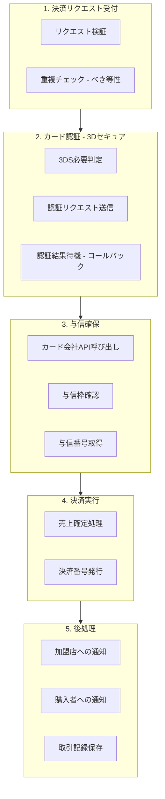
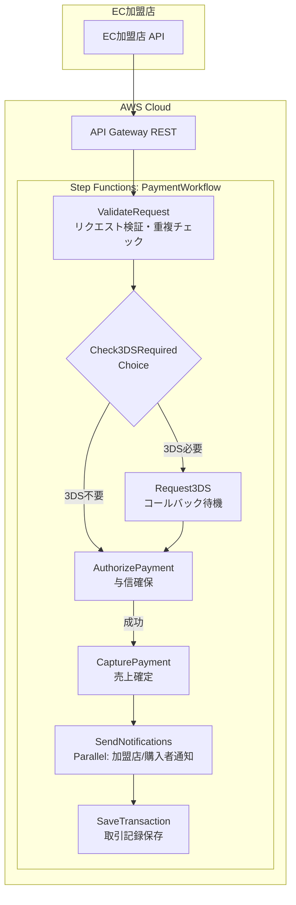

# 課題13: PayEasy Step Functionsワークフロー - 決済処理オーケストレーション

**難易度: 🟡 中級**

---

## 1. 分類情報

| 項目 | 内容 |
|------|------|
| 難易度 | 中級 |
| カテゴリ | サーバーレス / ワークフロー |
| 処理タイプ | 非同期 |
| 使用IaC | CDK |
| 想定所要時間 | 5-6時間 |

---

## 2. ビジネスシナリオ

### 企業プロファイル: PayEasy株式会社

```
┌─────────────────────────────────────────────────────────────────┐
│                     PayEasy株式会社                              │
│                    決済代行サービス                              │
├─────────────────────────────────────────────────────────────────┤
│  設立: 2019年    従業員: 80名    本社: 東京                      │
│  事業: EC事業者向け決済代行、サブスクリプション決済             │
│  取引額: 月間50億円    加盟店: 2000社    API: 1日500万リクエスト │
├─────────────────────────────────────────────────────────────────┤
│                                                                  │
│  【決済処理の現状】                                              │
│  ┌────────────────────────────────────────────────────────────┐│
│  │                                                              ││
│  │    ┌─────┐    ┌─────┐    ┌─────┐    ┌─────┐    ┌─────┐    ││
│  │    │認証 │───►│与信 │───►│決済 │───►│通知 │───►│記録 │    ││
│  │    └─────┘    └─────┘    └─────┘    └─────┘    └─────┘    ││
│  │       │          │          │          │          │        ││
│  │       ▼          ▼          ▼          ▼          ▼        ││
│  │    [複雑な条件分岐とリトライ処理がコード内に散在]            ││
│  │                                                              ││
│  └────────────────────────────────────────────────────────────┘│
│                                                                  │
│  【現在の課題】                                                  │
│  ┌────────────────────────────────────────────────────────────┐│
│  │  ・決済フローが複雑化し、コードの可読性が低下               ││
│  │  ・エラー発生時の状態把握が困難                             ││
│  │  ・リトライ・補償処理のロジックが複雑                       ││
│  │  ・処理時間の長い決済でLambdaタイムアウト発生               ││
│  │  ・監査対応のための処理追跡が困難                           ││
│  └────────────────────────────────────────────────────────────┘│
│                                                                  │
│  【目指す姿】                                                    │
│  ┌────────────────────────────────────────────────────────────┐│
│  │                   Step Functions                             ││
│  │  ┌─────────────────────────────────────────────────────┐    ││
│  │  │  ┌────┐   ┌────┐   ┌────┐   ┌────┐   ┌────┐       │    ││
│  │  │  │認証│──►│与信│──►│決済│──►│通知│──►│完了│       │    ││
│  │  │  └────┘   └──┬─┘   └──┬─┘   └────┘   └────┘       │    ││
│  │  │              │        │                            │    ││
│  │  │         ┌────▼────┐  ┌▼───────────┐               │    ││
│  │  │         │与信失敗 │  │決済失敗    │               │    ││
│  │  │         │→拒否通知│  │→ロールバック│               │    ││
│  │  │         └─────────┘  └────────────┘               │    ││
│  │  └─────────────────────────────────────────────────────┘    ││
│  │                                                              ││
│  │  ・視覚的なワークフロー管理                                 ││
│  │  ・組み込みのエラーハンドリング                             ││
│  │  ・実行履歴の自動記録                                       ││
│  │  ・長時間処理のサポート（最大1年）                          ││
│  └────────────────────────────────────────────────────────────┘│
│                                                                  │
└─────────────────────────────────────────────────────────────────┘
```

### 決済フロー要件

#### クレジットカード決済フロー



#### エラーパターンと処理

| エラー種別 | 処理方針 | リトライ |
|-----------|---------|---------|
| カード認証失敗 | 拒否通知→終了 | なし |
| 与信失敗 | 拒否通知→終了 | なし |
| 与信タイムアウト | 再試行 | 3回まで |
| 決済失敗 | 与信取消→拒否通知 | なし |
| 決済タイムアウト | 状態確認→判断 | 確認3回 |
| 通知失敗 | キュー→再送 | 5回まで |
| システムエラー | アラート→手動対応 | 要確認 |

### ビジネス要件と KPI

#### パフォーマンス目標

| 指標 | 現状 | 目標 | 改善 |
|-----|------|------|------|
| 決済完了時間 | 8秒 | 3秒 | 62%↓ |
| 決済成功率 | 97% | 99% | 2%↑ |
| エラー検知時間 | 30分 | 1分 | 96%↓ |
| 障害復旧時間 | 2時間 | 15分 | 87%↓ |

#### 運用目標

| 指標 | 現状 | 目標 | 改善 |
|-----|------|------|------|
| コード行数 | 5000行 | 2000行 | 60%↓ |
| デプロイ時間 | 30分 | 5分 | 83%↓ |
| 監査対応工数 | 20時間/月 | 2時間/月 | 90%↓ |
| 新機能追加工数 | 2週間 | 3日 | 78%↓ |

#### 処理量

- 1日あたり決済件数: 50万件
- ピーク時: 1000件/秒
- 平均決済金額: 5,000円
- 3Dセキュア対象: 30%

---

## 3. 学習目標

### 習得スキル

```
┌─────────────────────────────────────────────────────────────────┐
│                       学習目標マップ                             │
├─────────────────────────────────────────────────────────────────┤
│                                                                  │
│  【主要スキル】                                                  │
│                                                                  │
│  ┌─────────────────────────────────────────────────────────────┐│
│  │  1. Step Functions 基礎                                      ││
│  │     ├── Amazon States Language (ASL) 構文                    ││
│  │     ├── Standard vs Express ワークフロー                     ││
│  │     ├── 各種ステート（Task, Choice, Parallel, Map等）        ││
│  │     └── 入出力処理（InputPath, OutputPath, ResultPath）      ││
│  └─────────────────────────────────────────────────────────────┘│
│                                                                  │
│  ┌─────────────────────────────────────────────────────────────┐│
│  │  2. エラーハンドリング                                       ││
│  │     ├── Retry設定（指数バックオフ）                          ││
│  │     ├── Catch設定（エラー分岐）                              ││
│  │     ├── 補償トランザクション（Saga パターン）                ││
│  │     └── タイムアウト設定                                     ││
│  └─────────────────────────────────────────────────────────────┘│
│                                                                  │
│  ┌─────────────────────────────────────────────────────────────┐│
│  │  3. 高度なパターン                                           ││
│  │     ├── コールバックパターン（waitForTaskToken）             ││
│  │     ├── 並列処理（Parallel, Map）                            ││
│  │     ├── 動的並列処理（Distributed Map）                      ││
│  │     └── ネストされたワークフロー                             ││
│  └─────────────────────────────────────────────────────────────┘│
│                                                                  │
│  ┌─────────────────────────────────────────────────────────────┐│
│  │  4. CDKによるStep Functions構築                              ││
│  │     ├── StepFunctions Constructs                             ││
│  │     ├── Lambda統合                                           ││
│  │     ├── 他AWSサービス統合                                    ││
│  │     └── テスト戦略                                           ││
│  └─────────────────────────────────────────────────────────────┘│
│                                                                  │
│  【副次スキル】                                                  │
│  ・イベント駆動アーキテクチャ                                    │
│  ・CloudWatch Logs Insights でのデバッグ                        │
│  ・X-Ray による分散トレーシング                                 │
│  ・コスト最適化                                                  │
│                                                                  │
└─────────────────────────────────────────────────────────────────┘
```

### GCPとの対応関係

| AWS サービス | GCP 対応サービス | 主な違い |
|-------------|-----------------|---------|
| Step Functions | Cloud Workflows | Step FunctionsはASL、WorkflowsはYAML |
| Step Functions Express | Cloud Run Jobs | 短時間実行の高スループット |
| EventBridge | Eventarc | イベントルーティング |
| X-Ray | Cloud Trace | 分散トレーシング |

---

## 4. 使用するAWSサービス

```
┌─────────────────────────────────────────────────────────────────┐
│                    使用AWSサービス一覧                           │
├─────────────────────────────────────────────────────────────────┤
│                                                                  │
│  【コアサービス】                                                │
│  ┌─────────────────────────────────────────────────────────────┐│
│  │  サービス          │ 用途                    │ 重要度      ││
│  ├────────────────────┼─────────────────────────┼─────────────┤│
│  │  Step Functions    │ ワークフロー管理        │ ★★★★★      ││
│  │  Lambda            │ 各処理ステップ実行      │ ★★★★★      ││
│  │  API Gateway       │ 決済API受付             │ ★★★★☆      ││
│  │  DynamoDB          │ 取引データ保存          │ ★★★★☆      ││
│  │  CDK               │ インフラ定義            │ ★★★★★      ││
│  └─────────────────────────────────────────────────────────────┘│
│                                                                  │
│  【支援サービス】                                                │
│  ┌─────────────────────────────────────────────────────────────┐│
│  │  サービス          │ 用途                    │ 重要度      ││
│  ├────────────────────┼─────────────────────────┼─────────────┤│
│  │  SQS               │ 非同期通知キュー        │ ★★★☆☆      ││
│  │  SNS               │ 通知配信                │ ★★★☆☆      ││
│  │  Secrets Manager   │ 認証情報管理            │ ★★★★☆      ││
│  │  CloudWatch        │ 監視・アラート          │ ★★★★☆      ││
│  │  X-Ray             │ 分散トレーシング        │ ★★★☆☆      ││
│  └─────────────────────────────────────────────────────────────┘│
│                                                                  │
└─────────────────────────────────────────────────────────────────┘
```

---

## 5. 前提条件と事前準備

### 必要な環境

```bash
# Node.js バージョン確認
node --version
# v18.x 以上

# AWS CDK バージョン確認
cdk --version
# 2.x 以上

# AWS CLI バージョン確認
aws --version
# aws-cli/2.x.x 以上

# TypeScript
npm list typescript
```

### AWS環境の準備

```bash
# 環境変数設定
export AWS_REGION=ap-northeast-1
export PROJECT_NAME=payeasy
export ENVIRONMENT=dev

# プロジェクトディレクトリ作成
mkdir -p ~/payeasy-stepfunctions
cd ~/payeasy-stepfunctions

# CDKプロジェクト初期化
cdk init app --language typescript

# 必要なパッケージインストール
npm install @aws-cdk/aws-stepfunctions @aws-cdk/aws-stepfunctions-tasks \
            @aws-cdk/aws-lambda @aws-cdk/aws-lambda-nodejs \
            @aws-cdk/aws-dynamodb @aws-cdk/aws-apigateway \
            @aws-cdk/aws-sqs @aws-cdk/aws-sns @aws-cdk/aws-sns-subscriptions \
            @aws-cdk/aws-secretsmanager @aws-cdk/aws-logs \
            esbuild
```

### IAMポリシー（必要な権限）

```json
{
  "Version": "2012-10-17",
  "Statement": [
    {
      "Effect": "Allow",
      "Action": [
        "states:*",
        "lambda:*",
        "dynamodb:*",
        "apigateway:*",
        "sqs:*",
        "sns:*",
        "secretsmanager:*",
        "logs:*",
        "xray:*",
        "cloudformation:*",
        "iam:*",
        "s3:*"
      ],
      "Resource": "*"
    }
  ]
}
```

---

## 6. アーキテクチャ設計

### 決済ワークフロー全体像



**エラー処理フロー:**
- 各ステップで Catch → ErrorHandler → 補償処理/通知
- 与信失敗 → 拒否通知
- 決済失敗 → 与信取消 → 拒否通知
- 通知失敗 → SQS → リトライ

### ステートマシン詳細設計

#### ステート一覧

| ステート名 | タイプ | 説明 |
|-----------|--------|------|
| ValidateRequest | Task | 入力検証・重複チェック |
| Check3DSRequired | Choice | 3DS認証要否判定 |
| Request3DS | Task | 3DS認証リクエスト |
| Wait3DSCallback | Task | コールバック待機 |
| Validate3DSResult | Choice | 3DS結果判定 |
| AuthorizePayment | Task | 与信確保 |
| CheckAuthResult | Choice | 与信結果判定 |
| CapturePayment | Task | 売上確定 |
| SendNotifications | Parallel | 通知送信（並列） |
| SaveTransaction | Task | 取引記録保存 |
| PaymentSuccess | Succeed | 正常終了 |
| HandleAuthFailure | Task | 与信失敗処理 |
| HandleCaptureFailure | Task | 決済失敗→与信取消 |
| HandleError | Task | 汎用エラー処理 |
| PaymentFailed | Fail | 異常終了 |

#### エラーハンドリング戦略

**リトライ対象:**
- States.TaskFailed (一時的な失敗)
- States.Timeout (タイムアウト)
- Lambda.ServiceException (サービスエラー)

**リトライ設定:**
- MaxAttempts: 3
- IntervalSeconds: 1
- BackoffRate: 2.0
- MaxDelaySeconds: 10

**Catch対象:**
- AuthorizationError → HandleAuthFailure
- CaptureError → HandleCaptureFailure
- States.ALL → HandleError

---

## 8. トラブルシューティング演習

### 演習8-1: タイムアウト問題

```
┌─────────────────────────────────────────────────────────────────┐
│              トラブルシューティング演習 8-1                      │
│                  タイムアウト問題                                │
├─────────────────────────────────────────────────────────────────┤
│                                                                  │
│  【状況】                                                        │
│  3DS認証で外部サービスからのコールバックが                       │
│  タイムアウトになり、決済が失敗するケースが増加している。        │
│                                                                  │
│  【エラー】                                                      │
│  ┌─────────────────────────────────────────────────────────────┐│
│  │  States.Timeout: Task timed out after 600 seconds           ││
│  │  State: Request3DS                                          ││
│  │  ExecutionArn: arn:aws:states:...:execution:xxx             ││
│  └─────────────────────────────────────────────────────────────┘│
│                                                                  │
│  【課題】                                                        │
│  1. タイムアウトの原因を調査してください                         │
│  2. 適切なタイムアウト設定を検討してください                     │
│  3. タイムアウト時のユーザー体験を改善してください               │
│                                                                  │
│  【ヒント】                                                      │
│  - CloudWatch Logs Insights                                     │
│  - Step Functions 実行履歴                                      │
│  - Heartbeat機能                                                │
│                                                                  │
└─────────────────────────────────────────────────────────────────┘
```

**解決策例**

```typescript
// ハートビートを使用した改善版
const request3DSWithHeartbeat = new tasks.LambdaInvoke(this, 'Request3DS', {
  lambdaFunction: lambdas.request3DS,
  integrationPattern: sfn.IntegrationPattern.WAIT_FOR_TASK_TOKEN,
  payload: sfn.TaskInput.fromObject({
    'paymentId.$': '$.paymentId',
    'taskToken.$': '$$.Task.Token',
  }),
  // タイムアウト設定
  taskTimeout: sfn.Timeout.duration(cdk.Duration.minutes(10)),
  // ハートビート：30秒ごとに生存確認
  heartbeat: cdk.Duration.seconds(30),
  resultPath: '$.threeDSResult',
});

// Lambda側でハートビートを送信
// lambda/request-3ds/index.ts
import { SFNClient, SendTaskHeartbeatCommand } from '@aws-sdk/client-sfn';

const sfnClient = new SFNClient({});

async function sendHeartbeat(taskToken: string): Promise<void> {
  await sfnClient.send(new SendTaskHeartbeatCommand({ taskToken }));
}

// 外部サービス待機中に定期的にハートビートを送信
const heartbeatInterval = setInterval(async () => {
  try {
    await sendHeartbeat(taskToken);
    console.log('Heartbeat sent successfully');
  } catch (error) {
    console.error('Failed to send heartbeat:', error);
    clearInterval(heartbeatInterval);
  }
}, 25000); // 30秒のハートビートタイムアウトより短く
```

### 演習8-2: 補償トランザクション失敗

```
┌─────────────────────────────────────────────────────────────────┐
│              トラブルシューティング演習 8-2                      │
│               補償トランザクション失敗                           │
├─────────────────────────────────────────────────────────────────┤
│                                                                  │
│  【状況】                                                        │
│  決済（売上確定）が失敗し、与信取消（補償）も失敗した。          │
│  結果として与信枠が確保されたままの状態になっている。            │
│                                                                  │
│  【エラーログ】                                                  │
│  ┌─────────────────────────────────────────────────────────────┐│
│  │  CapturePayment: Failed - Network timeout                   ││
│  │  RollbackAuthorization: Failed - Service unavailable        ││
│  │                                                              ││
│  │  Payment Status: UNKNOWN                                     ││
│  │  Authorization Status: ACTIVE (should be VOIDED)            ││
│  └─────────────────────────────────────────────────────────────┘│
│                                                                  │
│  【課題】                                                        │
│  1. 二重障害パターンへの対策を設計してください                   │
│  2. 未解決トランザクションの検出・解決方法を実装してください     │
│  3. 運用対応フローを策定してください                             │
│                                                                  │
└─────────────────────────────────────────────────────────────────┘
```

**解決策例**

```typescript
// 補償トランザクションの堅牢化
const rollbackWithRetry = new sfn.Parallel(this, 'RobustRollback', {
  resultPath: '$.rollbackResult',
})
.branch(
  // メイン：即座にロールバック試行
  new tasks.LambdaInvoke(this, 'ImmediateRollback', {
    lambdaFunction: lambdas.rollbackAuthorization,
  })
  .addRetry({
    errors: ['States.ALL'],
    interval: cdk.Duration.seconds(5),
    maxAttempts: 5,
    backoffRate: 2,
  })
)
.addCatch(
  // フォールバック：SQSに保存して後で処理
  new sfn.Chain(this, 'RollbackFallback')
    .next(new tasks.SqsSendMessage(this, 'QueueFailedRollback', {
      queue: rollbackDLQ,
      messageBody: sfn.TaskInput.fromObject({
        'paymentId.$': '$.paymentId',
        'authorizationCode.$': '$.authorizationCode',
        'error.$': '$.error',
        'timestamp.$': '$$.State.EnteredTime',
      }),
    }))
    .next(new tasks.SnsPublish(this, 'AlertRollbackFailure', {
      topic: alertTopic,
      message: sfn.TaskInput.fromObject({
        'alert': 'CRITICAL: Rollback failed',
        'paymentId.$': '$.paymentId',
        'requiresManualIntervention': true,
      }),
    })),
  { errors: ['States.ALL'] }
);

// 未解決トランザクション検出用のスケジュール実行
// EventBridge -> Step Functions
const reconciliationWorkflow = new sfn.StateMachine(this, 'ReconciliationWorkflow', {
  definitionBody: sfn.DefinitionBody.fromChainable(
    new tasks.LambdaInvoke(this, 'FindStaleAuthorizations', {
      lambdaFunction: findStaleAuthLambda,
    })
    .next(new sfn.Map(this, 'ProcessEachStale', {
      itemsPath: '$.staleAuthorizations',
      maxConcurrency: 5,
    })
    .itemProcessor(
      new tasks.LambdaInvoke(this, 'ResolveStaleAuth', {
        lambdaFunction: resolveStaleAuthLambda,
      })
    ))
  ),
});
```

### 演習8-3: 高負荷時のスロットリング

```
┌─────────────────────────────────────────────────────────────────┐
│              トラブルシューティング演習 8-3                      │
│                 高負荷時スロットリング                           │
├─────────────────────────────────────────────────────────────────┤
│                                                                  │
│  【状況】                                                        │
│  セール期間中にAPI呼び出しが急増し、                             │
│  Step Functionsのスロットリングが発生している。                  │
│                                                                  │
│  【メトリクス】                                                  │
│  ┌─────────────────────────────────────────────────────────────┐│
│  │  ExecutionsStarted: 10,000/sec (limit: 2,000)               ││
│  │  ThrottledEvents: 8,000                                     ││
│  │  API Gateway 429 errors: 急増                               ││
│  └─────────────────────────────────────────────────────────────┘│
│                                                                  │
│  【課題】                                                        │
│  1. スロットリングの原因を特定してください                       │
│  2. Standard vs Express ワークフローの使い分けを検討             │
│  3. バッファリング戦略を実装してください                         │
│                                                                  │
└─────────────────────────────────────────────────────────────────┘
```

---

## 9. 設計課題

### 設計課題9-1: サブスクリプション決済ワークフロー

```
┌─────────────────────────────────────────────────────────────────┐
│                      設計課題 9-1                                │
│              サブスクリプション決済ワークフロー                  │
├─────────────────────────────────────────────────────────────────┤
│                                                                  │
│  【課題】                                                        │
│  月額課金のサブスクリプション決済を自動化するワークフローを      │
│  設計してください。                                              │
│                                                                  │
│  【要件】                                                        │
│  ・毎月指定日に自動課金                                          │
│  ・決済失敗時は3回までリトライ（1日、3日、7日後）                │
│  ・3回失敗でサブスクリプション一時停止                           │
│  ・顧客への事前通知・失敗通知                                    │
│  ・管理者への日次レポート                                        │
│                                                                  │
│  【成果物】                                                      │
│  1. ワークフロー設計図（ASL形式）                                │
│  2. リトライ戦略の詳細設計                                       │
│  3. 通知テンプレート                                             │
│                                                                  │
└─────────────────────────────────────────────────────────────────┘
```

### 設計課題9-2: マルチテナント決済基盤

```
┌─────────────────────────────────────────────────────────────────┐
│                      設計課題 9-2                                │
│                マルチテナント決済基盤                            │
├─────────────────────────────────────────────────────────────────┤
│                                                                  │
│  【課題】                                                        │
│  複数の加盟店（テナント）がそれぞれ独自のワークフローを          │
│  設定できる決済基盤を設計してください。                          │
│                                                                  │
│  【要件】                                                        │
│  ・テナントごとに異なる決済フロー（3DS有無、審査有無等）         │
│  ・テナントごとのAPI制限（レートリミット）                       │
│  ・テナント間のデータ分離                                        │
│  ・共通コンポーネントの再利用                                    │
│                                                                  │
│  【成果物】                                                      │
│  1. マルチテナントアーキテクチャ図                               │
│  2. テナント設定管理の設計                                       │
│  3. 動的ワークフロー生成の仕組み                                 │
│                                                                  │
└─────────────────────────────────────────────────────────────────┘
```

---

## 10. 発展課題

### 発展課題10-1: Express Workflowへの移行

```
┌─────────────────────────────────────────────────────────────────┐
│                      発展課題 10-1                               │
│               Express Workflowへの移行                           │
├─────────────────────────────────────────────────────────────────┤
│                                                                  │
│  【シナリオ】                                                    │
│  決済処理の大部分（3DS不要の小額決済）を                         │
│  Express Workflowに移行してコスト削減したい。                    │
│                                                                  │
│  【技術要件】                                                    │
│  ・Standard/Expressの使い分け判断                                │
│  ・Express Workflow用の設計変更                                  │
│  ・同期実行APIの設計                                             │
│  ・ログ・監視の設計                                              │
│                                                                  │
│  【成果物】                                                      │
│  1. Standard/Express振り分けロジック                             │
│  2. Express Workflow用CDKコード                                  │
│  3. コスト比較分析                                               │
│                                                                  │
└─────────────────────────────────────────────────────────────────┘
```

### 発展課題10-2: 分散トレーシングの実装

```
┌─────────────────────────────────────────────────────────────────┐
│                      発展課題 10-2                               │
│                分散トレーシングの実装                            │
├─────────────────────────────────────────────────────────────────┤
│                                                                  │
│  【シナリオ】                                                    │
│  決済処理全体のレイテンシボトルネックを特定し、                  │
│  パフォーマンスを改善したい。                                    │
│                                                                  │
│  【技術要件】                                                    │
│  ・X-Rayによるエンドツーエンドトレーシング                       │
│  ・カスタムサブセグメントの追加                                  │
│  ・サービスマップの構築                                          │
│  ・パフォーマンス分析ダッシュボード                              │
│                                                                  │
│  【成果物】                                                      │
│  1. X-Ray設定のCDKコード                                         │
│  2. カスタムアノテーション設計                                   │
│  3. パフォーマンス分析レポート                                   │
│                                                                  │
└─────────────────────────────────────────────────────────────────┘
```

---

## 11. 学習のまとめ

### 学習チェックリスト

```
┌─────────────────────────────────────────────────────────────────┐
│                     学習チェックリスト                           │
├─────────────────────────────────────────────────────────────────┤
│                                                                  │
│  【Step Functions基礎】                                          │
│  □ Standard/Expressワークフローの違いを説明できる               │
│  □ ASL（Amazon States Language）を読み書きできる                │
│  □ 各種ステートタイプの使い分けができる                         │
│  □ 入出力処理（Path系）を理解した                               │
│                                                                  │
│  【エラーハンドリング】                                          │
│  □ Retry設定を適切に設計できる                                  │
│  □ Catch設定でエラー分岐を実装できる                            │
│  □ 補償トランザクション（Saga）を設計できる                     │
│  □ タイムアウト戦略を説明できる                                 │
│                                                                  │
│  【高度なパターン】                                              │
│  □ コールバックパターン（waitForTaskToken）を実装できる         │
│  □ Parallel/Mapステートを使い分けられる                         │
│  □ ネストされたワークフローを設計できる                         │
│  □ 動的並列処理を実装できる                                     │
│                                                                  │
│  【CDK実装】                                                     │
│  □ CDKでStep Functionsを構築できる                              │
│  □ Lambda統合を実装できる                                       │
│  □ API Gateway統合を実装できる                                  │
│  □ テスト戦略を確立した                                         │
│                                                                  │
│  【運用】                                                        │
│  □ CloudWatch Logsでデバッグできる                              │
│  □ 実行履歴を分析できる                                         │
│  □ アラートを設定できる                                         │
│  □ コスト最適化の観点で設計できる                               │
│                                                                  │
└─────────────────────────────────────────────────────────────────┘
```

### Step Functions ベストプラクティス

```
┌─────────────────────────────────────────────────────────────────┐
│              Step Functions ベストプラクティス                   │
├─────────────────────────────────────────────────────────────────┤
│                                                                  │
│  【設計原則】                                                    │
│  ┌─────────────────────────────────────────────────────────────┐│
│  │  1. 単一責任の原則                                          ││
│  │     - 各ステートは1つの責務のみ                             ││
│  │     - Lambdaは小さく保つ                                    ││
│  │                                                              ││
│  │  2. 冪等性の確保                                            ││
│  │     - 同じ入力で同じ結果                                    ││
│  │     - リトライ安全な設計                                    ││
│  │                                                              ││
│  │  3. 失敗を前提とした設計                                    ││
│  │     - すべてのタスクにCatch設定                             ││
│  │     - 適切なリトライ戦略                                    ││
│  │     - 補償トランザクションの準備                            ││
│  └─────────────────────────────────────────────────────────────┘│
│                                                                  │
│  【アンチパターン】                                              │
│  ┌─────────────────────────────────────────────────────────────┐│
│  │  ✗ 長時間実行のLambda（15分以上の処理）                     ││
│  │  ✗ 大きなペイロード（256KB超）                              ││
│  │  ✗ リトライなしのタスク                                     ││
│  │  ✗ 無限ループの可能性があるChoice                           ││
│  │  ✗ Catch なしのワークフロー                                 ││
│  └─────────────────────────────────────────────────────────────┘│
│                                                                  │
└─────────────────────────────────────────────────────────────────┘
```

---

## 12. コスト見積もり

### 想定コスト（月額）

```
┌─────────────────────────────────────────────────────────────────┐
│                      コスト見積もり                              │
├─────────────────────────────────────────────────────────────────┤
│                                                                  │
│  【開発環境】                                                    │
│  ┌─────────────────────────────────────────────────────────────┐│
│  │  項目                    │ 数量            │ 月額（USD）    ││
│  ├──────────────────────────┼─────────────────┼────────────────┤│
│  │  Step Functions Standard │ 1,000実行       │ $0.025         ││
│  │  Lambda                  │ 10,000呼出      │ $0.002         ││
│  │  API Gateway             │ 1,000リクエスト │ $0.004         ││
│  │  DynamoDB                │ On-Demand       │ $1.00          ││
│  │  CloudWatch Logs         │ 1GB             │ $0.50          ││
│  ├──────────────────────────┼─────────────────┼────────────────┤│
│  │  小計                    │                 │ 約 $2          ││
│  └─────────────────────────────────────────────────────────────┘│
│                                                                  │
│  【本番環境想定（50万決済/日）】                                 │
│  ┌─────────────────────────────────────────────────────────────┐│
│  │  項目                    │ 数量            │ 月額（USD）    ││
│  ├──────────────────────────┼─────────────────┼────────────────┤│
│  │  Step Functions Standard │ 15M状態遷移     │ $375           ││
│  │  Lambda                  │ 100M呼出        │ $200           ││
│  │  API Gateway             │ 15Mリクエスト   │ $53            ││
│  │  DynamoDB                │ On-Demand       │ $150           ││
│  │  SQS                     │ 10M メッセージ  │ $4             ││
│  │  CloudWatch Logs         │ 100GB           │ $50            ││
│  │  X-Ray                   │ トレース        │ $25            ││
│  ├──────────────────────────┼─────────────────┼────────────────┤│
│  │  小計                    │                 │ 約 $857        ││
│  │                          │                 │ (約 ¥128,000)  ││
│  └─────────────────────────────────────────────────────────────┘│
│                                                                  │
│  【コスト最適化のポイント】                                      │
│  ・小額決済はExpress Workflow（1/10のコスト）                    │
│  ・Lambda ARM64アーキテクチャ（20%削減）                         │
│  ・CloudWatch Logs保持期間の最適化                               │
│  ・不要なトレースの削減                                          │
│                                                                  │
└─────────────────────────────────────────────────────────────────┘
```

---

## リソースのクリーンアップ

```bash
# CDKスタック削除
cdk destroy PayEasyStack-dev

# 確認
aws cloudformation list-stacks \
  --query "StackSummaries[?StackName=='PayEasyStack-dev'].StackStatus"

# 手動で残ったリソースがないか確認
aws stepfunctions list-state-machines \
  --query "stateMachines[?contains(name, 'payeasy')]"

aws lambda list-functions \
  --query "Functions[?contains(FunctionName, 'payeasy')]"

echo "Cleanup completed!"
```

---

**次の課題**: [課題35: ShopNow Chaos Engineering](exercise-35.md)

**前の課題**: [課題33: MegaMart DynamoDB実践設計](exercise-33.md)
