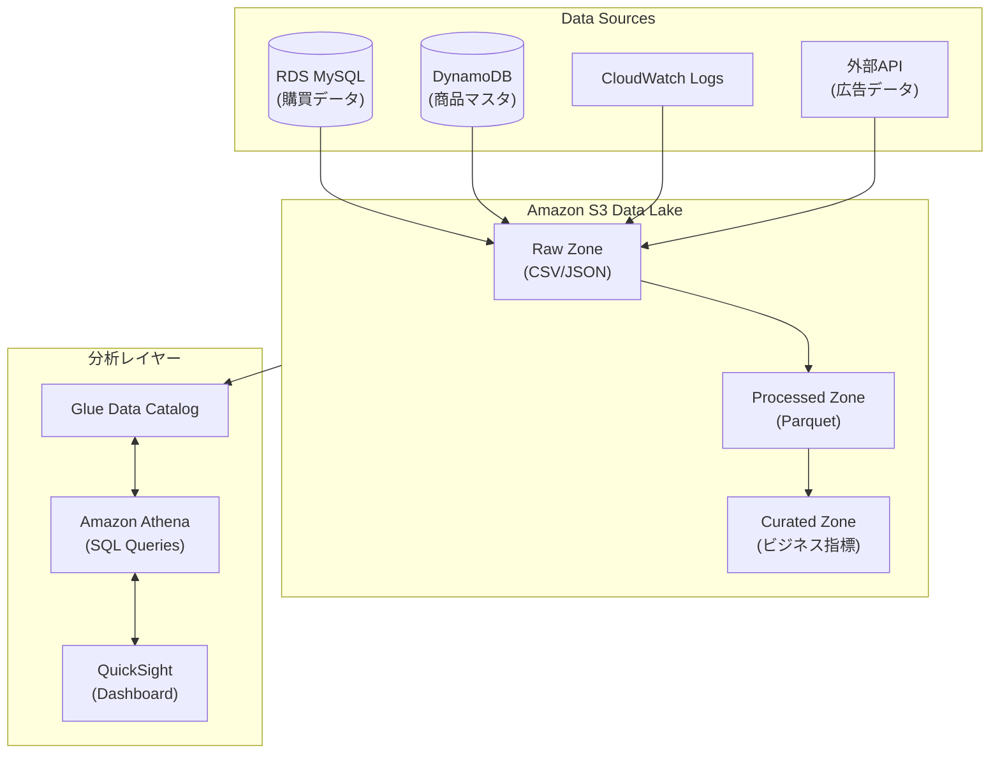

# 課題13: EC企業のデータレイク構築

**難易度: 🟡 初級〜中級**

---

## 1. 分類情報

| 項目 | 内容 |
|------|------|
| 難易度 | 初級〜中級 |
| カテゴリ | データ基盤 |
| 処理タイプ | バッチ |
| 使用IaC | CloudFormation |
| 想定所要時間 | 5-6時間 |

---

## 2. 学習するAWSサービス

この演習では以下のAWSサービスを実践的に学習します。

### コア技術スタック

| サービス | 役割 | 学習ポイント |
|----------|------|-------------|
| **Amazon S3** | データレイクストレージ | 3層アーキテクチャ、ライフサイクル管理 |
| **AWS Glue** | ETL、データカタログ | クローラー、ETLジョブ、スキーマ管理 |
| **Amazon Athena** | サーバーレスSQL | パーティションプルーニング、コスト最適化 |
| **Amazon QuickSight** | BIダッシュボード | SPICE、可視化 |

---

## 3. 最終構成図



---

## 4. シナリオ

### 企業プロファイル

| 項目 | 内容 |
|------|------|
| **企業名** | 〇〇株式会社 |
| **業種** | 総合EC（家電・日用品・ファッション） |
| **従業員数** | 500名（データチーム10名） |
| **月間購買件数** | 100万件 |
| **SKU数** | 10万点 |
| **月間PV** | 5000万PV |

### 現状の課題

```
〇〇株式会社は急成長する総合ECサイトを運営しています。
データ活用において以下の課題を抱えています：

1. データサイロ化
   - 購買データはRDS (MySQL)
   - アクセスログはElasticsearch
   - 商品データはDynamoDB
   - それぞれ別々に分析、統合できない

2. 分析の遅延
   - 月次レポート作成に3日かかる
   - アドホック分析の依頼対応に1週間
   - リアルタイムな意思決定ができない

3. コスト非効率
   - 分析用に本番DBのレプリカを使用
   - 高額なBIツールのライセンス費用
   - データエンジニアの工数が分析に消費

4. スケーラビリティの限界
   - データ量増加でクエリが遅くなっている
   - 過去データの保持コストが増大
   - 新しい分析要件への対応が困難
```

### ビジネス目標

| KPI | 現状 | 目標 |
|-----|------|------|
| 月次レポート作成時間 | 3日 | 自動化（0日） |
| アドホック分析対応 | 1週間 | 1時間以内（セルフサービス） |
| データ統合率 | 0%（サイロ化） | 100% |
| 過去データ保持期間 | 1年 | 5年以上 |
| 分析コスト | 月100万円 | 月30万円 |

---

## 5. 達成目標

### 主要な学習成果

```
この課題を完了すると、以下ができるようになります：

1. S3ベースのデータレイク構築
   - Raw/Processed/Curatedの3層アーキテクチャ
   - パーティショニングによる効率化
   - ライフサイクル管理でコスト最適化

2. AWS Glueによるデータ統合
   - クローラーによるスキーマ自動検出
   - ETLジョブでのデータ変換
   - Data Catalogによるメタデータ管理

3. Amazon Athenaによるクエリ分析
   - サーバーレスでのSQLクエリ
   - パーティションプルーニング
   - クエリ結果のキャッシング

4. Amazon QuickSightによるBI
   - ダッシュボード作成
   - SPICE によるパフォーマンス最適化
   - セルフサービス分析の実現
```

### 合格基準

| 項目 | 基準 |
|------|------|
| データレイク | S3に3層構造でデータが格納されていること |
| ETL | Glueジョブで日次データ処理が自動化されていること |
| クエリ | Athenaで主要な分析クエリが実行できること |
| ダッシュボード | QuickSightで売上ダッシュボードが作成されていること |
| コスト | スキャン量の最適化が実装されていること |

---

## 6. 使用するAWSサービス

### コア技術スタック

```yaml
ストレージ:
  - Amazon S3: データレイクストレージ
  - S3 Glacier: 長期アーカイブ

データ処理:
  - AWS Glue: ETL、データカタログ
  - AWS Glue DataBrew: データ準備（ノーコード）
  - Amazon EMR: 大規模データ処理（オプション）

クエリエンジン:
  - Amazon Athena: サーバーレスSQL
  - Amazon Redshift Spectrum: DWH連携（オプション）

可視化:
  - Amazon QuickSight: BIダッシュボード

オーケストレーション:
  - AWS Step Functions: ワークフロー管理
  - Amazon EventBridge: スケジュール実行

セキュリティ:
  - AWS Lake Formation: データレイクガバナンス
  - AWS IAM: アクセス制御
  - AWS KMS: 暗号化
```

### GCPとの比較

| 機能 | AWS | GCP |
|------|-----|-----|
| オブジェクトストレージ | S3 | Cloud Storage |
| データカタログ | Glue Data Catalog | Data Catalog |
| ETL | Glue | Dataflow / Dataproc |
| サーバーレスクエリ | Athena | BigQuery |
| BI | QuickSight | Looker |

---

## 7. 前提条件

### 技術要件

```bash
# 必要なCLIツール
aws --version          # 2.x
python --version       # 3.9+

# AWS設定
aws configure
export AWS_REGION=ap-northeast-1
export AWS_ACCOUNT_ID=$(aws sts get-caller-identity --query Account --output text)
export DATALAKE_BUCKET=company-datalake-${AWS_ACCOUNT_ID}
```

### 事前準備

```bash
# サンプルデータの概要
# 以下のデータソースを想定:

1. 購買データ (orders.csv)
   - order_id, customer_id, order_date, total_amount, status

2. 注文明細 (order_items.csv)
   - order_item_id, order_id, product_id, quantity, unit_price

3. 商品マスタ (products.csv)
   - product_id, product_name, category, subcategory, brand, price

4. 顧客データ (customers.csv)
   - customer_id, name, email, prefecture, city, registration_date

5. アクセスログ (access_logs.json)
   - timestamp, user_id, page_url, action, device, session_id
```

---

## 8. トラブルシューティングチャレンジ

### Challenge 1: Athenaクエリが遅い

```
問題:
カテゴリ別売上クエリの実行に5分以上かかる。
データスキャン量も10GB以上になっている。

クエリ:
SELECT category, SUM(total_amount)
FROM company_processed.orders o
JOIN company_processed.order_items oi ON o.order_id = oi.order_id
JOIN company_processed.products p ON oi.product_id = p.product_id
WHERE order_date BETWEEN '2024-01-01' AND '2024-01-31'
GROUP BY category

調査項目:
1. パーティションの活用状況
2. ファイルフォーマットとサイズ
3. JOIN最適化
```

<details>
<summary>解決のヒント</summary>

```sql
-- 1. パーティションフィルタを使用
SELECT category, SUM(total_amount)
FROM company_processed.orders o
JOIN company_processed.order_items oi ON o.order_id = oi.order_id
JOIN company_processed.products p ON oi.product_id = p.product_id
WHERE o.year = 2024 AND o.month = 1  -- パーティションキーを使用
GROUP BY category;

-- 2. EXPLAIN で実行計画確認
EXPLAIN
SELECT category, SUM(total_amount)
FROM company_processed.orders ...;

-- 3. パーティション状態確認
SHOW PARTITIONS company_processed.orders;

-- 4. テーブル統計情報更新
ANALYZE TABLE company_processed.orders COMPUTE STATISTICS;

-- 5. Curatedゾーンの事前集計テーブルを使用
-- 日次バッチで集計済みデータを参照
SELECT category, SUM(total_sales)
FROM company_curated.daily_sales
WHERE order_date BETWEEN '2024-01-01' AND '2024-01-31'
GROUP BY category;

-- パフォーマンス比較:
-- Before: スキャン10GB、5分
-- After: スキャン100MB、5秒
```
</details>

### Challenge 2: Glue ETLジョブがOOM（メモリ不足）で失敗

```
問題:
日次ETLジョブが大量データ処理時にメモリ不足で失敗する。

エラーログ:
Container killed by YARN for exceeding memory limits.
10.0 GB of 10 GB physical memory used.

データ量:
- 入力: 500万レコード
- 処理後: 1億レコード（JOIN後）

調査項目:
1. Spark設定
2. データ処理パターン
3. ワーカー設定
```

<details>
<summary>解決のヒント</summary>

```python
# 1. ブロードキャスト結合の活用（小さいテーブル）
from pyspark.sql.functions import broadcast

# 商品マスタは小さいのでブロードキャスト
orders_with_products = orders_df.join(
    broadcast(products_df),  # 小さいテーブルをブロードキャスト
    'product_id'
)

# 2. データのパーティショニング
orders_df = orders_df.repartition(100, 'order_date')

# 3. キャッシュの適切な使用
products_df.cache()  # 複数回使うテーブルのみキャッシュ

# 4. 不要なカラムを早期に除外
orders_df = orders_df.select('order_id', 'customer_id', 'order_date', 'total_amount')

# 5. Glueジョブ設定の調整
# --conf spark.sql.shuffle.partitions=200
# --conf spark.sql.autoBroadcastJoinThreshold=52428800

# 6. ワーカー数とタイプの変更
aws glue update-job \
    --job-name company-orders-etl \
    --job-update '{
        "NumberOfWorkers": 10,
        "WorkerType": "G.2X"
    }'
```
</details>

### Challenge 3: QuickSight SPICEデータセットの更新エラー

```
問題:
SPICEへのデータインポートが失敗する。
QuickSightダッシュボードが古いデータのまま。

エラー:
SPICE ingestion failed: Source data exceeds SPICE limits

状況:
- データセットサイズ: 50GB
- SPICE容量: 10GB
- 更新頻度: 日次

調査項目:
1. SPICEの制限
2. データ量の最適化
3. 代替アプローチ
```

<details>
<summary>解決のヒント</summary>

```sql
-- 1. データ量を削減（直近データのみ）
-- データセットのクエリを修正
SELECT ...
FROM company_curated.daily_sales
WHERE order_date >= date_add('day', -90, current_date)  -- 直近90日のみ

-- 2. 集計レベルを上げる
-- 詳細データではなく日次/週次集計を使用
SELECT
    date_trunc('week', order_date) as week,
    category,
    SUM(total_sales) as weekly_sales
FROM company_curated.daily_sales
GROUP BY date_trunc('week', order_date), category

-- 3. Direct Queryモードに切り替え（SPICEを使わない）
aws quicksight update-data-set \
    --aws-account-id ${AWS_ACCOUNT_ID} \
    --data-set-id company-daily-sales \
    --import-mode DIRECT_QUERY

-- 4. SPICE容量の追加購入
-- QuickSightコンソールから追加購入（$0.25/GB/月）

-- 5. データセットの分割
-- カテゴリ別に複数のデータセットを作成
-- ダッシュボードでパラメータによる切り替え
```
</details>

---

## 9. 設計の考察ポイント

### データレイクアーキテクチャ

```yaml
3層アーキテクチャの設計原則:

Raw Zone:
  目的: ソースデータの忠実な保存
  形式: CSV, JSON, Avro（ソース形式そのまま）
  保持期間: 長期（Glacierへアーカイブ）
  アクセス: ETLジョブのみ
  注意点:
    - スキーマ変更に対応できるよう柔軟に
    - データリネージのためにメタデータ保持

Processed Zone:
  目的: 分析用に最適化されたデータ
  形式: Parquet（カラムナー形式）
  保持期間: 中期（1-2年）
  アクセス: データエンジニア、アナリスト
  最適化:
    - パーティショニング（日付、カテゴリ等）
    - 適切なファイルサイズ（128MB-1GB）
    - Snappy圧縮

Curated Zone:
  目的: ビジネス指標、集計データ
  形式: Parquet
  保持期間: 長期
  アクセス: 全ユーザー（セルフサービス）
  特徴:
    - ビジネス用語でのカラム名
    - 事前計算されたKPI
    - ドキュメント化されたスキーマ
```

### コスト最適化戦略

```
1. ストレージ階層化:
   - 頻繁アクセス: S3 Standard
   - 低頻度アクセス: S3 Standard-IA
   - アーカイブ: S3 Glacier

2. Athenaクエリ最適化:
   - パーティショニング: 最大90%のコスト削減
   - Parquet形式: 最大80%のコスト削減
   - 結果キャッシュ: 同一クエリの再実行を防止

3. Glueジョブ最適化:
   - Spot Instances: 最大70%のコスト削減
   - 適切なワーカー数: 過剰プロビジョニング防止
   - ジョブブックマーク: 増分処理

4. QuickSight最適化:
   - SPICEの適切なサイジング
   - ユーザーライセンスの管理
   - セッション容量の活用
```

---

## 10. 発展課題

### 上級チャレンジ1: リアルタイムデータ取り込み

```yaml
# Kinesis Firehoseでリアルタイムログ取り込み

KinesisFirehose:
  DeliveryStreamName: company-access-logs
  S3DestinationConfiguration:
    BucketARN: arn:aws:s3:::company-datalake-xxx
    Prefix: raw/access_logs/year=!{timestamp:yyyy}/month=!{timestamp:MM}/day=!{timestamp:dd}/
    ErrorOutputPrefix: errors/
    BufferingHints:
      SizeInMBs: 128
      IntervalInSeconds: 300
    CompressionFormat: GZIP
    DataFormatConversionConfiguration:
      Enabled: true
      InputFormatConfiguration:
        Deserializer:
          JsonSerDe: {}
      OutputFormatConfiguration:
        Serializer:
          ParquetSerDe:
            Compression: SNAPPY
      SchemaConfiguration:
        DatabaseName: company_raw
        TableName: access_logs
        RoleARN: arn:aws:iam::xxx:role/FirehoseRole
```

### 上級チャレンジ2: Lake Formation によるガバナンス

```bash
# Lake Formationでデータアクセス制御

# データレイク管理者の設定
aws lakeformation put-data-lake-settings \
    --data-lake-settings '{
        "DataLakeAdmins": [
            {"DataLakePrincipalIdentifier": "arn:aws:iam::xxx:user/datalake-admin"}
        ]
    }'

# テーブルレベルの権限付与
aws lakeformation grant-permissions \
    --principal '{"DataLakePrincipalIdentifier": "arn:aws:iam::xxx:role/AnalystRole"}' \
    --resource '{
        "Table": {
            "DatabaseName": "company_curated",
            "Name": "daily_sales"
        }
    }' \
    --permissions SELECT

# カラムレベルの権限付与（PII保護）
aws lakeformation grant-permissions \
    --principal '{"DataLakePrincipalIdentifier": "arn:aws:iam::xxx:role/MarketingRole"}' \
    --resource '{
        "TableWithColumns": {
            "DatabaseName": "company_processed",
            "Name": "customers",
            "ColumnNames": ["customer_id", "segment", "prefecture"]
        }
    }' \
    --permissions SELECT
# email, name などのPIIカラムは除外
```

### 上級チャレンジ3: データ品質チェックの自動化

```python
# Glue Data Quality ルール定義

from awsgluedq.transforms import EvaluateDataQuality

# 品質ルールセット
rules = """
Rules = [
    ColumnValues "order_id" Uniqueness > 0.99,
    ColumnValues "customer_id" IsComplete,
    ColumnValues "total_amount" > 0,
    ColumnValues "order_date" matches "\\d{4}-\\d{2}-\\d{2}",
    RowCount > 1000,
    ColumnValues "status" in ["completed", "shipped", "pending", "cancelled"]
]
"""

# 品質チェック実行
quality_result = EvaluateDataQuality.apply(
    frame=orders_dyf,
    ruleset=rules,
    publishing_options={
        "dataQualityEvaluationContext": "orders_quality_check",
        "enableDataQualityCloudWatchMetrics": True,
        "enableDataQualityResultsPublishing": True
    }
)

# 結果に基づいてアクション
if quality_result['Outcome'] == 'Failed':
    # アラート送信、処理停止など
    raise Exception(f"Data quality check failed: {quality_result['FailedRules']}")
```

---

## 11. コスト見積もり

### 月額コスト概算

| サービス | 使用量 | 月額コスト |
|----------|--------|------------|
| S3 Standard | 500GB | $12 |
| S3 Standard-IA | 1TB | $12 |
| S3 Glacier | 2TB | $8 |
| Glue Crawler | 10時間/月 | $4 |
| Glue ETL | 100 DPU時間/月 | $44 |
| Athena | 1TB スキャン/月 | $5 |
| QuickSight | 5 Author + 20 Reader | $165 |
| Data Transfer | 100GB | $9 |
| **合計** | | **約 $259/月** |

### 従来構成との比較

```
従来構成（RDSレプリカ + 商用BI）:
- RDS レプリカ: $200/月
- BIツールライセンス: $500/月
- データエンジニア工数: $800/月相当
- 合計: 約 $1,500/月

データレイク構成:
- 合計: 約 $259/月

コスト削減: 83% (月額 $1,241 削減)
```

---

## 12. 学習のポイント

### 今回学んだこと

```
1. S3データレイク設計
   □ 3層アーキテクチャ（Raw/Processed/Curated）
   □ パーティショニング戦略
   □ ライフサイクル管理

2. AWS Glue活用
   □ クローラーによるスキーマ検出
   □ ETLジョブでのデータ変換
   □ Data Catalogによるメタデータ管理

3. Amazon Athena
   □ サーバーレスSQLクエリ
   □ パーティションプルーニング
   □ コスト最適化（スキャン量削減）

4. Amazon QuickSight
   □ SPICE によるパフォーマンス向上
   □ ダッシュボード作成
   □ セルフサービスBI
```

### GCPとの比較まとめ

| 観点 | AWS | GCP |
|------|-----|-----|
| サーバーレスクエリ | Athena（S3直接） | BigQuery（ストレージ統合） |
| ETL | Glue（Spark） | Dataflow（Apache Beam） |
| 価格モデル | スキャン量課金 | スキャン量 or 定額 |
| 使いやすさ | 複数サービス組合せ | BigQuery一体型 |

### 次のステップ

```
1. 発展学習:
   - Amazon Redshift でのDWH構築
   - Amazon EMR での大規模処理
   - AWS Lake Formation でのガバナンス

2. 実務応用:
   - リアルタイムダッシュボード構築
   - 機械学習パイプライン連携
   - データメッシュアーキテクチャ

3. 認定資格:
   - AWS Certified Data Analytics - Specialty
   - AWS Certified Solutions Architect - Professional
```
