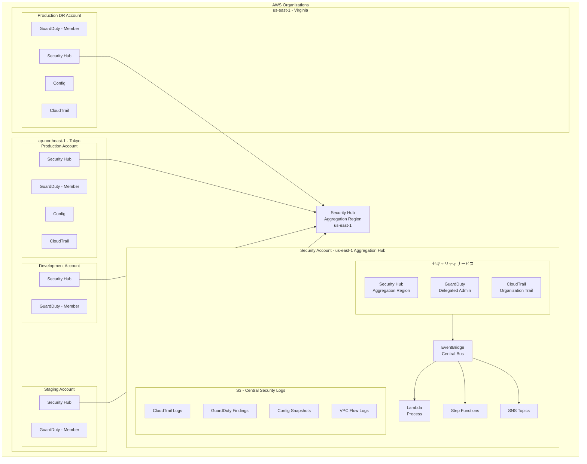

# 課題19: ヘルスケア企業のセキュリティ監視基盤構築

**難易度: 🟡 中級**

---

## 1. 分類情報

| 項目 | 内容 |
|------|------|
| 難易度 | 中級 |
| カテゴリ | セキュリティ・コンプライアンス |
| 処理タイプ | リアルタイム |
| 使用IaC | CloudFormation |
| 想定所要時間 | 5-6時間 |

---

## 2. ビジネスシナリオ

### 企業プロファイル
- **企業名**: MedSecure株式会社
- **業種**: 医療データ管理・分析プラットフォーム
- **規模**: 従業員150名、エンジニア25名
- **データ規模**: 患者データ100万件、月間API呼び出し5000万回
- **現状インフラ**: AWS上でマルチアカウント環境を運用

### 現状の課題
MedSecure株式会社は、複数の医療機関から患者データを預かり、AIによる診断支援サービスを提供しています。しかし、以下の問題を抱えています：

1. **セキュリティ可視性の欠如**
   - 複数AWSアカウントのセキュリティ状態が一元管理されていない
   - 脅威検知が手動で、発見が遅れがち
   - セキュリティイベントの対応が属人化

2. **コンプライアンス対応の負荷**
   - HIPAA準拠の証跡管理が煩雑
   - 監査対応に毎回1ヶ月以上かかる
   - セキュリティベースラインの維持が困難

3. **インシデント対応の遅延**
   - 異常検知から対応まで平均4時間
   - 夜間・休日の対応体制が不十分
   - 対応手順が標準化されていない

### ビジネス要件
```
機能要件:
- マルチアカウントのセキュリティ統合監視
- 脅威の自動検知と重要度分類
- セキュリティイベントの自動対応
- コンプライアンスダッシュボードの構築

非機能要件:
- 脅威検知から通知まで5分以内
- 重大インシデントの自動隔離（15分以内）
- 99.9%の監視システム稼働率
- 監査証跡の13ヶ月保持
```

### 成功指標（KPI）
| 指標 | 現状 | 目標 |
|------|------|------|
| 平均検知時間（MTTD） | 4時間 | 5分 |
| 平均対応時間（MTTR） | 8時間 | 30分 |
| セキュリティ検出カバー率 | 40% | 95% |
| コンプライアンススコア | 65% | 95% |
| 自動対応率 | 0% | 80% |

---

## 3. 学習目標

### 本課題で習得するスキル

```
1. セキュリティ監視（理解度：詳細）
   - GuardDutyによる脅威検知の設定
   - Security Hubによるセキュリティ統合管理
   - マルチアカウントセキュリティ集約

2. 自動対応システム（理解度：実装）
   - EventBridgeによるイベントルーティング
   - Lambdaによる自動修復アクション
   - Step Functionsによるワークフロー自動化

3. コンプライアンス管理（理解度：基礎）
   - AWS Configによる構成評価
   - カスタムセキュリティ基準の実装
   - 監査レポートの自動生成
```

### GCPエンジニア向け補足
```
GCP → AWS マッピング:
- Security Command Center → Security Hub
- Event Threat Detection → GuardDuty
- Cloud Functions → Lambda
- Eventarc → EventBridge
- Organization Policy → AWS Config Rules

主な違い:
1. Security Hub: 複数のセキュリティサービスを統合し、
   統一されたセキュリティビューを提供（SCCに近いが、
   より多くのサードパーティ統合が可能）

2. GuardDuty: ML ベースの脅威検知に特化
   （GCPのEvent Threat Detectionより広範な検知パターン）

3. EventBridge: イベント駆動アーキテクチャの中核
   （Eventarcより柔軟なルーティングとフィルタリング）
```

---

## 4. 使用するAWSサービス

### メインサービス
| サービス | 役割 | 使用機能 |
|----------|------|----------|
| **Amazon GuardDuty** | 脅威検知 | ML検知、マルウェア保護、Kubernetes監査 |
| **AWS Security Hub** | 統合管理 | セキュリティ基準、検出結果集約 |
| **Amazon EventBridge** | イベント処理 | ルール、パターンマッチング |
| **AWS Lambda** | 自動対応 | 修復アクション、通知 |

### サポートサービス
| サービス | 用途 |
|----------|------|
| **AWS Config** | 構成評価、コンプライアンスチェック |
| **AWS Organizations** | マルチアカウント管理 |
| **Amazon SNS** | 通知配信 |
| **AWS Step Functions** | ワークフロー自動化 |
| **Amazon S3** | 証跡・レポート保存 |
| **AWS CloudTrail** | API監査ログ |
| **Amazon CloudWatch** | メトリクス・ログ監視 |

### アーキテクチャ図


---

## 5. 前提条件と事前準備

### 必要な環境
```bash
# AWS CLI v2
aws --version  # 2.x以上

# Python 3.9以上
python3 --version

# Terraform（オプション）
terraform --version  # 1.5以上

# jq（JSON処理）
jq --version
```

### AWSアカウント要件
```
- AWS Organizations が有効化されていること
- Security Account（セキュリティ集約用）が作成済み
- 複数のメンバーアカウント（本演習では最低2つ）
- IAM権限：OrganizationsFullAccess, SecurityHubFullAccess,
  GuardDutyFullAccess, ConfigFullAccess, Lambda管理者
```

### 事前準備スクリプト
```bash
#!/bin/bash
# setup-security-baseline.sh

# 変数設定
SECURITY_ACCOUNT_ID="111111111111"  # セキュリティアカウントID
PRODUCTION_ACCOUNT_ID="222222222222"  # 本番アカウントID
REGION="ap-northeast-1"

# ディレクトリ構造の作成
mkdir -p medsecure-security/{terraform,lambda,config-rules,dashboards}
cd medsecure-security

# 必要なIAMロールの確認
echo "Checking IAM permissions..."
aws sts get-caller-identity

# Organizations の確認
echo "Checking Organizations..."
aws organizations describe-organization

# 既存のSecurity Hub状態確認
echo "Checking Security Hub status..."
aws securityhub describe-hub --region $REGION 2>/dev/null || echo "Security Hub not enabled"

# 既存のGuardDuty状態確認
echo "Checking GuardDuty status..."
aws guardduty list-detectors --region $REGION
```

---

## 6. アーキテクチャ設計

### セキュリティ検知フロー設計
```yaml
# security-detection-flow.yaml
detection_sources:
  guardduty:
    enabled_features:
      - EC2_MALWARE_PROTECTION
      - S3_DATA_EVENTS
      - EKS_AUDIT_LOGS
      - RDS_LOGIN_EVENTS
      - LAMBDA_NETWORK_LOGS
    finding_types:
      critical:
        - "Trojan:*"
        - "CryptoCurrency:*"
        - "UnauthorizedAccess:IAMUser/InstanceCredentialExfiltration*"
      high:
        - "Recon:*"
        - "Persistence:*"
        - "PrivilegeEscalation:*"
      medium:
        - "Policy:*"
        - "Stealth:*"

  security_hub:
    standards:
      - AWS-Foundational-Security-Best-Practices
      - CIS-AWS-Foundations-Benchmark
      - HIPAA  # カスタム基準
    aggregation:
      - CRITICAL findings → Immediate response
      - HIGH findings → 1-hour response
      - MEDIUM findings → 24-hour review

  config:
    managed_rules:
      - s3-bucket-public-read-prohibited
      - ec2-instance-no-public-ip
      - encrypted-volumes
      - rds-storage-encrypted
    custom_rules:
      - hipaa-phi-encryption-check
      - patient-data-access-logging
```

### 自動対応マトリックス
```yaml
# auto-remediation-matrix.yaml
remediation_actions:
  # GuardDuty findings
  "UnauthorizedAccess:IAMUser/InstanceCredentialExfiltration":
    severity: CRITICAL
    auto_response: true
    actions:
      - isolate_instance
      - revoke_credentials
      - create_forensic_snapshot
      - notify_security_team
    escalation: immediate

  "Policy:S3/BucketPublicAccessGranted":
    severity: HIGH
    auto_response: true
    actions:
      - block_public_access
      - notify_data_owner
    escalation: 1_hour

  "Recon:EC2/PortProbeUnprotectedPort":
    severity: MEDIUM
    auto_response: false
    actions:
      - log_event
      - notify_security_team
    escalation: 24_hours

  # Config compliance
  "s3-bucket-server-side-encryption-enabled":
    auto_response: true
    actions:
      - enable_default_encryption
      - notify_bucket_owner

  "ec2-instance-no-public-ip":
    auto_response: false  # 要確認
    actions:
      - create_ticket
      - notify_account_owner
```

---

## 7. ハンズオン手順

### Step 1: GuardDuty の有効化とマルチアカウント設定

```bash
#!/bin/bash
# step1-enable-guardduty.sh

REGION="ap-northeast-1"
SECURITY_ACCOUNT_ID="111111111111"

# Security Account で GuardDuty を有効化（Delegated Admin として）
echo "=== Enabling GuardDuty in Security Account ==="

# Detector の作成
DETECTOR_ID=$(aws guardduty create-detector \
    --enable \
    --finding-publishing-frequency FIFTEEN_MINUTES \
    --data-sources '{
        "S3Logs": {"Enable": true},
        "Kubernetes": {"AuditLogs": {"Enable": true}},
        "MalwareProtection": {"ScanEc2InstanceWithFindings": {"EbsVolumes": true}}
    }' \
    --features '[
        {"Name": "S3_DATA_EVENTS", "Status": "ENABLED"},
        {"Name": "EKS_AUDIT_LOGS", "Status": "ENABLED"},
        {"Name": "EBS_MALWARE_PROTECTION", "Status": "ENABLED"},
        {"Name": "RDS_LOGIN_EVENTS", "Status": "ENABLED"},
        {"Name": "LAMBDA_NETWORK_LOGS", "Status": "ENABLED"}
    ]' \
    --query 'DetectorId' \
    --output text \
    --region $REGION)

echo "Detector ID: $DETECTOR_ID"

# Organizations から Delegated Admin を設定（Management Account で実行）
# aws guardduty enable-organization-admin-account \
#     --admin-account-id $SECURITY_ACCOUNT_ID \
#     --region $REGION

# メンバーアカウントの自動登録設定
aws guardduty update-organization-configuration \
    --detector-id $DETECTOR_ID \
    --auto-enable \
    --auto-enable-organization-members ALL \
    --region $REGION

echo "GuardDuty organization configuration updated"
```

### Step 2: Security Hub の有効化と統合

```bash
#!/bin/bash
# step2-enable-security-hub.sh

REGION="ap-northeast-1"

# Security Hub を有効化
echo "=== Enabling Security Hub ==="
aws securityhub enable-security-hub \
    --enable-default-standards \
    --control-finding-generator SECURITY_CONTROL \
    --region $REGION

# セキュリティ基準の有効化
echo "=== Enabling Security Standards ==="

# AWS Foundational Security Best Practices
aws securityhub batch-enable-standards \
    --standards-subscription-requests '[
        {
            "StandardsArn": "arn:aws:securityhub:ap-northeast-1::standards/aws-foundational-security-best-practices/v/1.0.0"
        },
        {
            "StandardsArn": "arn:aws:securityhub:ap-northeast-1::standards/cis-aws-foundations-benchmark/v/1.4.0"
        }
    ]' \
    --region $REGION

# GuardDuty との統合を有効化
aws securityhub enable-import-findings-for-product \
    --product-arn "arn:aws:securityhub:${REGION}::product/aws/guardduty" \
    --region $REGION

# AWS Config との統合
aws securityhub enable-import-findings-for-product \
    --product-arn "arn:aws:securityhub:${REGION}::product/aws/config" \
    --region $REGION

echo "Security Hub enabled with integrations"
```

### Step 3: EventBridge ルールの作成

```python
# lambda/event_router.py
"""
セキュリティイベントを重要度に応じてルーティングするLambda関数
"""
import json
import boto3
import os
from datetime import datetime

sns_client = boto3.client('sns')
sfn_client = boto3.client('stepfunctions')
dynamodb = boto3.resource('dynamodb')

# 環境変数
CRITICAL_SNS_TOPIC = os.environ['CRITICAL_SNS_TOPIC']
HIGH_SNS_TOPIC = os.environ['HIGH_SNS_TOPIC']
REMEDIATION_STATE_MACHINE = os.environ['REMEDIATION_STATE_MACHINE']
EVENTS_TABLE = os.environ['EVENTS_TABLE']

def lambda_handler(event, context):
    """
    GuardDuty/Security Hub からのイベントを処理
    """
    print(f"Received event: {json.dumps(event)}")

    # イベントソースの判定
    source = event.get('source', '')
    detail_type = event.get('detail-type', '')
    detail = event.get('detail', {})

    # イベント情報の抽出
    event_info = extract_event_info(source, detail_type, detail)

    # DynamoDB にイベントを記録
    store_event(event_info)

    # 重要度に応じたルーティング
    severity = event_info.get('severity', 'MEDIUM')

    if severity == 'CRITICAL':
        handle_critical_event(event_info)
    elif severity == 'HIGH':
        handle_high_event(event_info)
    else:
        handle_medium_event(event_info)

    return {
        'statusCode': 200,
        'body': json.dumps({
            'message': 'Event processed',
            'event_id': event_info.get('event_id'),
            'severity': severity
        })
    }

def extract_event_info(source, detail_type, detail):
    """
    イベントソースに応じて情報を抽出
    """
    event_info = {
        'event_id': detail.get('id', detail.get('Id', 'unknown')),
        'timestamp': datetime.utcnow().isoformat(),
        'source': source,
        'detail_type': detail_type
    }

    if source == 'aws.guardduty':
        # GuardDuty Finding
        event_info.update({
            'severity': map_guardduty_severity(detail.get('severity', 0)),
            'finding_type': detail.get('type', ''),
            'title': detail.get('title', ''),
            'description': detail.get('description', ''),
            'account_id': detail.get('accountId', ''),
            'region': detail.get('region', ''),
            'resource': detail.get('resource', {}),
            'raw_severity': detail.get('severity', 0)
        })
    elif source == 'aws.securityhub':
        # Security Hub Finding
        findings = detail.get('findings', [{}])
        if findings:
            finding = findings[0]
            event_info.update({
                'severity': finding.get('Severity', {}).get('Label', 'MEDIUM'),
                'finding_type': finding.get('Types', ['Unknown'])[0],
                'title': finding.get('Title', ''),
                'description': finding.get('Description', ''),
                'account_id': finding.get('AwsAccountId', ''),
                'region': finding.get('Region', ''),
                'resource': finding.get('Resources', []),
                'compliance_status': finding.get('Compliance', {}).get('Status', '')
            })

    return event_info

def map_guardduty_severity(severity_value):
    """
    GuardDuty の数値重要度をラベルにマッピング
    """
    if severity_value >= 7.0:
        return 'CRITICAL'
    elif severity_value >= 4.0:
        return 'HIGH'
    elif severity_value >= 1.0:
        return 'MEDIUM'
    else:
        return 'LOW'

def store_event(event_info):
    """
    イベントを DynamoDB に保存
    """
    table = dynamodb.Table(EVENTS_TABLE)
    table.put_item(Item={
        'event_id': event_info['event_id'],
        'timestamp': event_info['timestamp'],
        'severity': event_info['severity'],
        'source': event_info['source'],
        'finding_type': event_info.get('finding_type', ''),
        'title': event_info.get('title', ''),
        'account_id': event_info.get('account_id', ''),
        'status': 'NEW',
        'ttl': int(datetime.utcnow().timestamp()) + (90 * 24 * 60 * 60)  # 90日保持
    })

def handle_critical_event(event_info):
    """
    CRITICAL イベントの処理: 即座に自動対応 + 通知
    """
    # Step Functions で自動修復ワークフローを開始
    sfn_client.start_execution(
        stateMachineArn=REMEDIATION_STATE_MACHINE,
        input=json.dumps({
            'event_info': event_info,
            'auto_remediate': True
        })
    )

    # 即時通知（Slack, PagerDuty）
    message = format_critical_alert(event_info)
    sns_client.publish(
        TopicArn=CRITICAL_SNS_TOPIC,
        Subject=f"[CRITICAL] Security Alert - {event_info.get('title', 'Unknown')}",
        Message=message,
        MessageAttributes={
            'severity': {'DataType': 'String', 'StringValue': 'CRITICAL'}
        }
    )

def handle_high_event(event_info):
    """
    HIGH イベントの処理: 通知 + レビュー待ち
    """
    message = format_high_alert(event_info)
    sns_client.publish(
        TopicArn=HIGH_SNS_TOPIC,
        Subject=f"[HIGH] Security Alert - {event_info.get('title', 'Unknown')}",
        Message=message
    )

def handle_medium_event(event_info):
    """
    MEDIUM イベントの処理: ログ記録のみ
    """
    print(f"Medium severity event logged: {event_info.get('event_id')}")

def format_critical_alert(event_info):
    """
    CRITICAL アラートのフォーマット
    """
    return f"""
=== CRITICAL SECURITY ALERT ===

Event ID: {event_info.get('event_id')}
Time: {event_info.get('timestamp')}
Account: {event_info.get('account_id')}
Region: {event_info.get('region', 'N/A')}

Finding Type: {event_info.get('finding_type')}
Title: {event_info.get('title')}

Description:
{event_info.get('description', 'No description available')}

Auto-remediation has been initiated.
Please review the incident in Security Hub.

Console: https://console.aws.amazon.com/securityhub/home
"""

def format_high_alert(event_info):
    """
    HIGH アラートのフォーマット
    """
    return f"""
=== HIGH SECURITY ALERT ===

Event ID: {event_info.get('event_id')}
Time: {event_info.get('timestamp')}
Account: {event_info.get('account_id')}

Finding Type: {event_info.get('finding_type')}
Title: {event_info.get('title')}

Description:
{event_info.get('description', 'No description available')}

Action Required: Please review within 1 hour.
"""
```

### Step 4: 自動修復 Lambda の実装

```python
# lambda/auto_remediation.py
"""
セキュリティインシデントの自動修復を行うLambda関数
"""
import json
import boto3
from datetime import datetime

ec2_client = boto3.client('ec2')
iam_client = boto3.client('iam')
s3_client = boto3.client('s3')
sts_client = boto3.client('sts')

def lambda_handler(event, context):
    """
    Step Functions から呼び出される自動修復関数
    """
    print(f"Remediation event: {json.dumps(event)}")

    event_info = event.get('event_info', {})
    finding_type = event_info.get('finding_type', '')

    remediation_result = {
        'event_id': event_info.get('event_id'),
        'timestamp': datetime.utcnow().isoformat(),
        'finding_type': finding_type,
        'actions_taken': []
    }

    try:
        # Finding Type に応じた修復アクション
        if 'InstanceCredentialExfiltration' in finding_type:
            result = remediate_credential_exfiltration(event_info)
            remediation_result['actions_taken'].extend(result)

        elif 'BucketPublicAccessGranted' in finding_type:
            result = remediate_s3_public_access(event_info)
            remediation_result['actions_taken'].extend(result)

        elif 'EC2/Malware' in finding_type:
            result = remediate_malware_instance(event_info)
            remediation_result['actions_taken'].extend(result)

        elif 'UnauthorizedAccess:IAMUser' in finding_type:
            result = remediate_iam_unauthorized_access(event_info)
            remediation_result['actions_taken'].extend(result)

        else:
            remediation_result['actions_taken'].append({
                'action': 'LOG_ONLY',
                'reason': f'No auto-remediation defined for: {finding_type}'
            })

        remediation_result['status'] = 'SUCCESS'

    except Exception as e:
        remediation_result['status'] = 'FAILED'
        remediation_result['error'] = str(e)
        print(f"Remediation failed: {e}")

    return remediation_result

def remediate_credential_exfiltration(event_info):
    """
    インスタンス認証情報の外部流出を修復
    """
    actions = []
    resource = event_info.get('resource', {})
    instance_details = resource.get('instanceDetails', {})
    instance_id = instance_details.get('instanceId')

    if not instance_id:
        return [{'action': 'SKIP', 'reason': 'No instance ID found'}]

    # 対象アカウントで実行するためのロール引き受け
    target_account = event_info.get('account_id')
    credentials = assume_role_in_account(target_account)

    if credentials:
        ec2_target = boto3.client(
            'ec2',
            aws_access_key_id=credentials['AccessKeyId'],
            aws_secret_access_key=credentials['SecretAccessKey'],
            aws_session_token=credentials['SessionToken'],
            region_name=event_info.get('region', 'ap-northeast-1')
        )
    else:
        ec2_target = ec2_client

    # 1. インスタンスをネットワークから隔離
    try:
        # 専用の隔離用セキュリティグループに変更
        isolation_sg = get_or_create_isolation_sg(ec2_target)

        ec2_target.modify_instance_attribute(
            InstanceId=instance_id,
            Groups=[isolation_sg]
        )
        actions.append({
            'action': 'ISOLATE_INSTANCE',
            'instance_id': instance_id,
            'status': 'SUCCESS'
        })
    except Exception as e:
        actions.append({
            'action': 'ISOLATE_INSTANCE',
            'instance_id': instance_id,
            'status': 'FAILED',
            'error': str(e)
        })

    # 2. インスタンスプロファイルの認証情報を無効化
    try:
        instance_info = ec2_target.describe_instances(InstanceIds=[instance_id])
        iam_profile = instance_info['Reservations'][0]['Instances'][0].get('IamInstanceProfile', {})

        if iam_profile:
            # メタデータサービスをIMDSv2必須に変更（認証情報アクセスを制限）
            ec2_target.modify_instance_metadata_options(
                InstanceId=instance_id,
                HttpTokens='required',
                HttpPutResponseHopLimit=1
            )
            actions.append({
                'action': 'RESTRICT_METADATA',
                'instance_id': instance_id,
                'status': 'SUCCESS'
            })
    except Exception as e:
        actions.append({
            'action': 'RESTRICT_METADATA',
            'status': 'FAILED',
            'error': str(e)
        })

    # 3. フォレンジック用スナップショットを作成
    try:
        volumes = ec2_target.describe_volumes(
            Filters=[{'Name': 'attachment.instance-id', 'Values': [instance_id]}]
        )['Volumes']

        for volume in volumes:
            snapshot = ec2_target.create_snapshot(
                VolumeId=volume['VolumeId'],
                Description=f"Forensic snapshot - {event_info.get('event_id')}",
                TagSpecifications=[{
                    'ResourceType': 'snapshot',
                    'Tags': [
                        {'Key': 'Purpose', 'Value': 'Forensic'},
                        {'Key': 'IncidentId', 'Value': event_info.get('event_id')},
                        {'Key': 'SourceInstance', 'Value': instance_id}
                    ]
                }]
            )
            actions.append({
                'action': 'CREATE_FORENSIC_SNAPSHOT',
                'snapshot_id': snapshot['SnapshotId'],
                'volume_id': volume['VolumeId'],
                'status': 'SUCCESS'
            })
    except Exception as e:
        actions.append({
            'action': 'CREATE_FORENSIC_SNAPSHOT',
            'status': 'FAILED',
            'error': str(e)
        })

    return actions

def remediate_s3_public_access(event_info):
    """
    S3 バケットのパブリックアクセスを修復
    """
    actions = []
    resource = event_info.get('resource', [])

    bucket_name = None
    for r in resource if isinstance(resource, list) else [resource]:
        if 'S3Bucket' in str(r.get('Type', '')):
            bucket_name = r.get('Id', '').split(':')[-1]
            break

    if not bucket_name:
        return [{'action': 'SKIP', 'reason': 'No bucket name found'}]

    # 対象アカウントで実行
    target_account = event_info.get('account_id')
    credentials = assume_role_in_account(target_account)

    if credentials:
        s3_target = boto3.client(
            's3',
            aws_access_key_id=credentials['AccessKeyId'],
            aws_secret_access_key=credentials['SecretAccessKey'],
            aws_session_token=credentials['SessionToken']
        )
    else:
        s3_target = s3_client

    # パブリックアクセスをブロック
    try:
        s3_target.put_public_access_block(
            Bucket=bucket_name,
            PublicAccessBlockConfiguration={
                'BlockPublicAcls': True,
                'IgnorePublicAcls': True,
                'BlockPublicPolicy': True,
                'RestrictPublicBuckets': True
            }
        )
        actions.append({
            'action': 'BLOCK_PUBLIC_ACCESS',
            'bucket': bucket_name,
            'status': 'SUCCESS'
        })
    except Exception as e:
        actions.append({
            'action': 'BLOCK_PUBLIC_ACCESS',
            'bucket': bucket_name,
            'status': 'FAILED',
            'error': str(e)
        })

    return actions

def remediate_malware_instance(event_info):
    """
    マルウェア感染インスタンスの修復
    """
    actions = []
    resource = event_info.get('resource', {})
    instance_details = resource.get('instanceDetails', {})
    instance_id = instance_details.get('instanceId')

    if not instance_id:
        return [{'action': 'SKIP', 'reason': 'No instance ID found'}]

    target_account = event_info.get('account_id')
    credentials = assume_role_in_account(target_account)

    if credentials:
        ec2_target = boto3.client(
            'ec2',
            aws_access_key_id=credentials['AccessKeyId'],
            aws_secret_access_key=credentials['SecretAccessKey'],
            aws_session_token=credentials['SessionToken'],
            region_name=event_info.get('region', 'ap-northeast-1')
        )
    else:
        ec2_target = ec2_client

    # 1. インスタンスを隔離
    isolation_sg = get_or_create_isolation_sg(ec2_target)
    ec2_target.modify_instance_attribute(
        InstanceId=instance_id,
        Groups=[isolation_sg]
    )
    actions.append({
        'action': 'ISOLATE_INSTANCE',
        'instance_id': instance_id,
        'status': 'SUCCESS'
    })

    # 2. インスタンスを停止（破壊的だが、マルウェアの拡散防止）
    ec2_target.stop_instances(InstanceIds=[instance_id])
    actions.append({
        'action': 'STOP_INSTANCE',
        'instance_id': instance_id,
        'status': 'SUCCESS',
        'note': 'Instance stopped to prevent malware spread'
    })

    return actions

def remediate_iam_unauthorized_access(event_info):
    """
    IAM 不正アクセスの修復
    """
    actions = []
    resource = event_info.get('resource', {})

    # アクセスキーの無効化
    access_key_details = resource.get('accessKeyDetails', {})
    user_name = access_key_details.get('userName')
    access_key_id = access_key_details.get('accessKeyId')

    if access_key_id:
        try:
            iam_client.update_access_key(
                UserName=user_name,
                AccessKeyId=access_key_id,
                Status='Inactive'
            )
            actions.append({
                'action': 'DEACTIVATE_ACCESS_KEY',
                'user': user_name,
                'key_id': access_key_id,
                'status': 'SUCCESS'
            })
        except Exception as e:
            actions.append({
                'action': 'DEACTIVATE_ACCESS_KEY',
                'status': 'FAILED',
                'error': str(e)
            })

    return actions

def assume_role_in_account(account_id):
    """
    対象アカウントのロールを引き受け
    """
    if not account_id:
        return None

    try:
        response = sts_client.assume_role(
            RoleArn=f'arn:aws:iam::{account_id}:role/SecurityRemediationRole',
            RoleSessionName='SecurityAutoRemediation'
        )
        return response['Credentials']
    except Exception as e:
        print(f"Failed to assume role in account {account_id}: {e}")
        return None

def get_or_create_isolation_sg(ec2_client):
    """
    隔離用セキュリティグループを取得または作成
    """
    sg_name = 'security-isolation-sg'

    try:
        response = ec2_client.describe_security_groups(
            Filters=[{'Name': 'group-name', 'Values': [sg_name]}]
        )
        if response['SecurityGroups']:
            return response['SecurityGroups'][0]['GroupId']
    except:
        pass

    # VPC ID を取得（デフォルト VPC）
    vpcs = ec2_client.describe_vpcs(Filters=[{'Name': 'isDefault', 'Values': ['true']}])
    vpc_id = vpcs['Vpcs'][0]['VpcId'] if vpcs['Vpcs'] else None

    if not vpc_id:
        vpcs = ec2_client.describe_vpcs()
        vpc_id = vpcs['Vpcs'][0]['VpcId']

    # 隔離用 SG を作成（インバウンド/アウトバウンドルールなし）
    response = ec2_client.create_security_group(
        GroupName=sg_name,
        Description='Security isolation - no traffic allowed',
        VpcId=vpc_id,
        TagSpecifications=[{
            'ResourceType': 'security-group',
            'Tags': [{'Key': 'Purpose', 'Value': 'SecurityIsolation'}]
        }]
    )

    sg_id = response['GroupId']

    # デフォルトのアウトバウンドルールを削除
    ec2_client.revoke_security_group_egress(
        GroupId=sg_id,
        IpPermissions=[{
            'IpProtocol': '-1',
            'IpRanges': [{'CidrIp': '0.0.0.0/0'}]
        }]
    )

    return sg_id
```

### Step 5: Step Functions ワークフロー定義

```json
{
  "Comment": "Security Incident Remediation Workflow",
  "StartAt": "EvaluateSeverity",
  "States": {
    "EvaluateSeverity": {
      "Type": "Choice",
      "Choices": [
        {
          "Variable": "$.event_info.severity",
          "StringEquals": "CRITICAL",
          "Next": "ParallelCriticalResponse"
        },
        {
          "Variable": "$.event_info.severity",
          "StringEquals": "HIGH",
          "Next": "HighSeverityResponse"
        }
      ],
      "Default": "LogAndMonitor"
    },

    "ParallelCriticalResponse": {
      "Type": "Parallel",
      "Branches": [
        {
          "StartAt": "AutoRemediate",
          "States": {
            "AutoRemediate": {
              "Type": "Task",
              "Resource": "arn:aws:lambda:ap-northeast-1:${AWS::AccountId}:function:security-auto-remediation",
              "Retry": [
                {
                  "ErrorEquals": ["Lambda.ServiceException", "Lambda.TooManyRequestsException"],
                  "IntervalSeconds": 2,
                  "MaxAttempts": 3,
                  "BackoffRate": 2
                }
              ],
              "Catch": [
                {
                  "ErrorEquals": ["States.ALL"],
                  "Next": "RemediationFailed"
                }
              ],
              "End": true
            },
            "RemediationFailed": {
              "Type": "Pass",
              "Result": {
                "status": "REMEDIATION_FAILED",
                "requires_manual_intervention": true
              },
              "End": true
            }
          }
        },
        {
          "StartAt": "NotifySecurityTeam",
          "States": {
            "NotifySecurityTeam": {
              "Type": "Task",
              "Resource": "arn:aws:states:::sns:publish",
              "Parameters": {
                "TopicArn": "arn:aws:sns:ap-northeast-1:${AWS::AccountId}:critical-security-alerts",
                "Subject.$": "States.Format('[CRITICAL] Security Incident - {}', $.event_info.title)",
                "Message.$": "States.JsonToString($.event_info)"
              },
              "End": true
            }
          }
        },
        {
          "StartAt": "CreateIncidentTicket",
          "States": {
            "CreateIncidentTicket": {
              "Type": "Task",
              "Resource": "arn:aws:lambda:ap-northeast-1:${AWS::AccountId}:function:create-incident-ticket",
              "Parameters": {
                "severity": "CRITICAL",
                "event_info.$": "$.event_info"
              },
              "End": true
            }
          }
        }
      ],
      "Next": "RecordIncident"
    },

    "HighSeverityResponse": {
      "Type": "Parallel",
      "Branches": [
        {
          "StartAt": "NotifyHighSeverity",
          "States": {
            "NotifyHighSeverity": {
              "Type": "Task",
              "Resource": "arn:aws:states:::sns:publish",
              "Parameters": {
                "TopicArn": "arn:aws:sns:ap-northeast-1:${AWS::AccountId}:high-security-alerts",
                "Subject.$": "States.Format('[HIGH] Security Alert - {}', $.event_info.title)",
                "Message.$": "States.JsonToString($.event_info)"
              },
              "End": true
            }
          }
        },
        {
          "StartAt": "WaitForReview",
          "States": {
            "WaitForReview": {
              "Type": "Wait",
              "Seconds": 3600,
              "Next": "CheckReviewStatus"
            },
            "CheckReviewStatus": {
              "Type": "Task",
              "Resource": "arn:aws:lambda:ap-northeast-1:${AWS::AccountId}:function:check-incident-status",
              "Next": "EscalateIfUnreviewed"
            },
            "EscalateIfUnreviewed": {
              "Type": "Choice",
              "Choices": [
                {
                  "Variable": "$.reviewed",
                  "BooleanEquals": false,
                  "Next": "EscalateToManager"
                }
              ],
              "Default": "EndHighSeverityBranch"
            },
            "EscalateToManager": {
              "Type": "Task",
              "Resource": "arn:aws:states:::sns:publish",
              "Parameters": {
                "TopicArn": "arn:aws:sns:ap-northeast-1:${AWS::AccountId}:manager-escalation",
                "Subject": "Escalation: Unreviewed Security Alert",
                "Message.$": "States.JsonToString($)"
              },
              "Next": "EndHighSeverityBranch"
            },
            "EndHighSeverityBranch": {
              "Type": "Pass",
              "End": true
            }
          }
        }
      ],
      "Next": "RecordIncident"
    },

    "LogAndMonitor": {
      "Type": "Task",
      "Resource": "arn:aws:lambda:ap-northeast-1:${AWS::AccountId}:function:log-security-event",
      "Next": "RecordIncident"
    },

    "RecordIncident": {
      "Type": "Task",
      "Resource": "arn:aws:states:::dynamodb:putItem",
      "Parameters": {
        "TableName": "security-incidents",
        "Item": {
          "incident_id": {"S.$": "$.event_info.event_id"},
          "timestamp": {"S.$": "$$.State.EnteredTime"},
          "severity": {"S.$": "$.event_info.severity"},
          "status": {"S": "PROCESSED"},
          "finding_type": {"S.$": "$.event_info.finding_type"},
          "account_id": {"S.$": "$.event_info.account_id"}
        }
      },
      "Next": "GenerateReport"
    },

    "GenerateReport": {
      "Type": "Task",
      "Resource": "arn:aws:lambda:ap-northeast-1:${AWS::AccountId}:function:generate-incident-report",
      "Parameters": {
        "event_info.$": "$.event_info",
        "remediation_result.$": "$"
      },
      "End": true
    }
  }
}
```

### Step 6: CloudFormation テンプレート

```yaml
# cloudformation/security-monitoring.yaml
AWSTemplateFormatVersion: '2010-09-09'
Description: 'MedSecure Security Monitoring Infrastructure'

Parameters:
  Environment:
    Type: String
    Default: production
    AllowedValues: [production, staging, development]

  SlackWebhookUrl:
    Type: String
    NoEcho: true
    Description: Slack webhook URL for notifications

  PagerDutyIntegrationKey:
    Type: String
    NoEcho: true
    Description: PagerDuty integration key for critical alerts

Resources:
  #=====================================
  # SNS Topics for Notifications
  #=====================================
  CriticalAlertsTopic:
    Type: AWS::SNS::Topic
    Properties:
      TopicName: !Sub 'critical-security-alerts-${Environment}'
      KmsMasterKeyId: alias/aws/sns
      Tags:
        - Key: Environment
          Value: !Ref Environment

  HighAlertsTopic:
    Type: AWS::SNS::Topic
    Properties:
      TopicName: !Sub 'high-security-alerts-${Environment}'
      KmsMasterKeyId: alias/aws/sns

  #=====================================
  # DynamoDB Tables
  #=====================================
  SecurityEventsTable:
    Type: AWS::DynamoDB::Table
    Properties:
      TableName: !Sub 'security-events-${Environment}'
      BillingMode: PAY_PER_REQUEST
      AttributeDefinitions:
        - AttributeName: event_id
          AttributeType: S
        - AttributeName: timestamp
          AttributeType: S
        - AttributeName: severity
          AttributeType: S
      KeySchema:
        - AttributeName: event_id
          KeyType: HASH
        - AttributeName: timestamp
          KeyType: RANGE
      GlobalSecondaryIndexes:
        - IndexName: severity-index
          KeySchema:
            - AttributeName: severity
              KeyType: HASH
            - AttributeName: timestamp
              KeyType: RANGE
          Projection:
            ProjectionType: ALL
      TimeToLiveSpecification:
        AttributeName: ttl
        Enabled: true
      PointInTimeRecoverySpecification:
        PointInTimeRecoveryEnabled: true
      SSESpecification:
        SSEEnabled: true

  SecurityIncidentsTable:
    Type: AWS::DynamoDB::Table
    Properties:
      TableName: !Sub 'security-incidents-${Environment}'
      BillingMode: PAY_PER_REQUEST
      AttributeDefinitions:
        - AttributeName: incident_id
          AttributeType: S
        - AttributeName: timestamp
          AttributeType: S
      KeySchema:
        - AttributeName: incident_id
          KeyType: HASH
        - AttributeName: timestamp
          KeyType: RANGE
      StreamSpecification:
        StreamViewType: NEW_AND_OLD_IMAGES
      PointInTimeRecoverySpecification:
        PointInTimeRecoveryEnabled: true

  #=====================================
  # Lambda Functions
  #=====================================
  EventRouterFunction:
    Type: AWS::Lambda::Function
    Properties:
      FunctionName: !Sub 'security-event-router-${Environment}'
      Runtime: python3.11
      Handler: event_router.lambda_handler
      Timeout: 60
      MemorySize: 256
      Role: !GetAtt EventRouterRole.Arn
      Environment:
        Variables:
          CRITICAL_SNS_TOPIC: !Ref CriticalAlertsTopic
          HIGH_SNS_TOPIC: !Ref HighAlertsTopic
          REMEDIATION_STATE_MACHINE: !Ref RemediationStateMachine
          EVENTS_TABLE: !Ref SecurityEventsTable
      Code:
        ZipFile: |
          # Placeholder - deploy actual code via CI/CD
          def lambda_handler(event, context):
              return {'statusCode': 200}
      TracingConfig:
        Mode: Active

  AutoRemediationFunction:
    Type: AWS::Lambda::Function
    Properties:
      FunctionName: !Sub 'security-auto-remediation-${Environment}'
      Runtime: python3.11
      Handler: auto_remediation.lambda_handler
      Timeout: 300
      MemorySize: 512
      Role: !GetAtt AutoRemediationRole.Arn
      Code:
        ZipFile: |
          def lambda_handler(event, context):
              return {'statusCode': 200}
      TracingConfig:
        Mode: Active

  #=====================================
  # IAM Roles
  #=====================================
  EventRouterRole:
    Type: AWS::IAM::Role
    Properties:
      RoleName: !Sub 'security-event-router-role-${Environment}'
      AssumeRolePolicyDocument:
        Version: '2012-10-17'
        Statement:
          - Effect: Allow
            Principal:
              Service: lambda.amazonaws.com
            Action: sts:AssumeRole
      ManagedPolicyArns:
        - arn:aws:iam::aws:policy/service-role/AWSLambdaBasicExecutionRole
        - arn:aws:iam::aws:policy/AWSXRayDaemonWriteAccess
      Policies:
        - PolicyName: EventRouterPolicy
          PolicyDocument:
            Version: '2012-10-17'
            Statement:
              - Effect: Allow
                Action:
                  - sns:Publish
                Resource:
                  - !Ref CriticalAlertsTopic
                  - !Ref HighAlertsTopic
              - Effect: Allow
                Action:
                  - dynamodb:PutItem
                  - dynamodb:GetItem
                  - dynamodb:UpdateItem
                Resource:
                  - !GetAtt SecurityEventsTable.Arn
              - Effect: Allow
                Action:
                  - states:StartExecution
                Resource:
                  - !Ref RemediationStateMachine

  AutoRemediationRole:
    Type: AWS::IAM::Role
    Properties:
      RoleName: !Sub 'security-auto-remediation-role-${Environment}'
      AssumeRolePolicyDocument:
        Version: '2012-10-17'
        Statement:
          - Effect: Allow
            Principal:
              Service: lambda.amazonaws.com
            Action: sts:AssumeRole
      ManagedPolicyArns:
        - arn:aws:iam::aws:policy/service-role/AWSLambdaBasicExecutionRole
      Policies:
        - PolicyName: AutoRemediationPolicy
          PolicyDocument:
            Version: '2012-10-17'
            Statement:
              - Effect: Allow
                Action:
                  - sts:AssumeRole
                Resource: 'arn:aws:iam::*:role/SecurityRemediationRole'
              - Effect: Allow
                Action:
                  - ec2:DescribeInstances
                  - ec2:DescribeSecurityGroups
                  - ec2:DescribeVolumes
                  - ec2:DescribeVpcs
                  - ec2:ModifyInstanceAttribute
                  - ec2:CreateSecurityGroup
                  - ec2:RevokeSecurityGroupEgress
                  - ec2:CreateSnapshot
                  - ec2:CreateTags
                  - ec2:StopInstances
                  - ec2:ModifyInstanceMetadataOptions
                Resource: '*'
              - Effect: Allow
                Action:
                  - s3:PutBucketPublicAccessBlock
                  - s3:GetBucketPublicAccessBlock
                Resource: '*'
              - Effect: Allow
                Action:
                  - iam:UpdateAccessKey
                  - iam:ListAccessKeys
                Resource: '*'

  #=====================================
  # Step Functions State Machine
  #=====================================
  RemediationStateMachine:
    Type: AWS::StepFunctions::StateMachine
    Properties:
      StateMachineName: !Sub 'security-remediation-${Environment}'
      RoleArn: !GetAtt StepFunctionsRole.Arn
      TracingConfiguration:
        Enabled: true
      DefinitionString: !Sub |
        {
          "Comment": "Security Incident Remediation Workflow",
          "StartAt": "EvaluateSeverity",
          "States": {
            "EvaluateSeverity": {
              "Type": "Choice",
              "Choices": [
                {
                  "Variable": "$.event_info.severity",
                  "StringEquals": "CRITICAL",
                  "Next": "AutoRemediate"
                }
              ],
              "Default": "LogEvent"
            },
            "AutoRemediate": {
              "Type": "Task",
              "Resource": "${AutoRemediationFunction.Arn}",
              "Next": "RecordIncident"
            },
            "LogEvent": {
              "Type": "Pass",
              "Next": "RecordIncident"
            },
            "RecordIncident": {
              "Type": "Task",
              "Resource": "arn:aws:states:::dynamodb:putItem",
              "Parameters": {
                "TableName": "${SecurityIncidentsTable}",
                "Item": {
                  "incident_id": {"S.$": "$.event_info.event_id"},
                  "timestamp": {"S.$": "$$.State.EnteredTime"},
                  "severity": {"S.$": "$.event_info.severity"},
                  "status": {"S": "PROCESSED"}
                }
              },
              "End": true
            }
          }
        }

  StepFunctionsRole:
    Type: AWS::IAM::Role
    Properties:
      AssumeRolePolicyDocument:
        Version: '2012-10-17'
        Statement:
          - Effect: Allow
            Principal:
              Service: states.amazonaws.com
            Action: sts:AssumeRole
      Policies:
        - PolicyName: StepFunctionsPolicy
          PolicyDocument:
            Version: '2012-10-17'
            Statement:
              - Effect: Allow
                Action:
                  - lambda:InvokeFunction
                Resource:
                  - !GetAtt AutoRemediationFunction.Arn
                  - !GetAtt EventRouterFunction.Arn
              - Effect: Allow
                Action:
                  - dynamodb:PutItem
                Resource:
                  - !GetAtt SecurityIncidentsTable.Arn
              - Effect: Allow
                Action:
                  - sns:Publish
                Resource:
                  - !Ref CriticalAlertsTopic
                  - !Ref HighAlertsTopic

  #=====================================
  # EventBridge Rules
  #=====================================
  GuardDutyFindingsRule:
    Type: AWS::Events::Rule
    Properties:
      Name: !Sub 'guardduty-findings-${Environment}'
      Description: Route GuardDuty findings to security event router
      EventPattern:
        source:
          - aws.guardduty
        detail-type:
          - GuardDuty Finding
      State: ENABLED
      Targets:
        - Id: EventRouterLambda
          Arn: !GetAtt EventRouterFunction.Arn

  SecurityHubFindingsRule:
    Type: AWS::Events::Rule
    Properties:
      Name: !Sub 'securityhub-findings-${Environment}'
      Description: Route Security Hub findings to security event router
      EventPattern:
        source:
          - aws.securityhub
        detail-type:
          - Security Hub Findings - Imported
        detail:
          findings:
            Severity:
              Label:
                - CRITICAL
                - HIGH
      State: ENABLED
      Targets:
        - Id: EventRouterLambda
          Arn: !GetAtt EventRouterFunction.Arn

  ConfigComplianceRule:
    Type: AWS::Events::Rule
    Properties:
      Name: !Sub 'config-compliance-${Environment}'
      Description: Route Config compliance changes
      EventPattern:
        source:
          - aws.config
        detail-type:
          - Config Rules Compliance Change
        detail:
          newEvaluationResult:
            complianceType:
              - NON_COMPLIANT
      State: ENABLED
      Targets:
        - Id: EventRouterLambda
          Arn: !GetAtt EventRouterFunction.Arn

  # Lambda permission for EventBridge
  EventRouterGuardDutyPermission:
    Type: AWS::Lambda::Permission
    Properties:
      FunctionName: !Ref EventRouterFunction
      Action: lambda:InvokeFunction
      Principal: events.amazonaws.com
      SourceArn: !GetAtt GuardDutyFindingsRule.Arn

  EventRouterSecurityHubPermission:
    Type: AWS::Lambda::Permission
    Properties:
      FunctionName: !Ref EventRouterFunction
      Action: lambda:InvokeFunction
      Principal: events.amazonaws.com
      SourceArn: !GetAtt SecurityHubFindingsRule.Arn

  EventRouterConfigPermission:
    Type: AWS::Lambda::Permission
    Properties:
      FunctionName: !Ref EventRouterFunction
      Action: lambda:InvokeFunction
      Principal: events.amazonaws.com
      SourceArn: !GetAtt ConfigComplianceRule.Arn

  #=====================================
  # S3 Bucket for Security Logs
  #=====================================
  SecurityLogsBucket:
    Type: AWS::S3::Bucket
    Properties:
      BucketName: !Sub 'medsecure-security-logs-${AWS::AccountId}-${Environment}'
      BucketEncryption:
        ServerSideEncryptionConfiguration:
          - ServerSideEncryptionByDefault:
              SSEAlgorithm: aws:kms
              KMSMasterKeyID: alias/aws/s3
      PublicAccessBlockConfiguration:
        BlockPublicAcls: true
        BlockPublicPolicy: true
        IgnorePublicAcls: true
        RestrictPublicBuckets: true
      VersioningConfiguration:
        Status: Enabled
      LifecycleConfiguration:
        Rules:
          - Id: TransitionToGlacier
            Status: Enabled
            Transitions:
              - StorageClass: GLACIER
                TransitionInDays: 90
            ExpirationInDays: 2555  # 7年保持（HIPAA要件）
      LoggingConfiguration:
        DestinationBucketName: !Ref SecurityLogsBucket
        LogFilePrefix: access-logs/

Outputs:
  SecurityEventsTableArn:
    Value: !GetAtt SecurityEventsTable.Arn
    Export:
      Name: !Sub '${AWS::StackName}-EventsTableArn'

  CriticalAlertsTopicArn:
    Value: !Ref CriticalAlertsTopic
    Export:
      Name: !Sub '${AWS::StackName}-CriticalTopicArn'

  EventRouterFunctionArn:
    Value: !GetAtt EventRouterFunction.Arn
    Export:
      Name: !Sub '${AWS::StackName}-EventRouterArn'

  RemediationStateMachineArn:
    Value: !Ref RemediationStateMachine
    Export:
      Name: !Sub '${AWS::StackName}-RemediationStateMachineArn'
```

### Step 7: カスタム Config ルール（HIPAA準拠）

```python
# config-rules/hipaa_phi_encryption_check.py
"""
HIPAA準拠: PHI（Protected Health Information）を含む可能性のある
リソースの暗号化状態をチェックするカスタム Config ルール
"""
import json
import boto3

config_client = boto3.client('config')
s3_client = boto3.client('s3')
rds_client = boto3.client('rds')
dynamodb_client = boto3.client('dynamodb')

# PHIを含む可能性のあるリソースを識別するタグ
PHI_TAGS = ['PHI', 'ePHI', 'patient-data', 'medical-records', 'hipaa']

def lambda_handler(event, context):
    """
    AWS Config カスタムルールのメインハンドラー
    """
    invoking_event = json.loads(event['invokingEvent'])
    configuration_item = invoking_event.get('configurationItem', {})

    if not configuration_item:
        return {'compliance_type': 'NOT_APPLICABLE'}

    resource_type = configuration_item.get('resourceType', '')
    resource_id = configuration_item.get('resourceId', '')
    tags = configuration_item.get('tags', {})

    # PHI タグがない場合は対象外
    if not has_phi_tag(tags):
        return put_evaluation(
            event, resource_id, resource_type, 'NOT_APPLICABLE',
            'Resource does not have PHI tags'
        )

    # リソースタイプ別の暗号化チェック
    if resource_type == 'AWS::S3::Bucket':
        compliance = check_s3_encryption(resource_id)
    elif resource_type == 'AWS::RDS::DBInstance':
        compliance = check_rds_encryption(resource_id)
    elif resource_type == 'AWS::DynamoDB::Table':
        compliance = check_dynamodb_encryption(resource_id)
    elif resource_type == 'AWS::EBS::Volume':
        compliance = check_ebs_encryption(configuration_item)
    else:
        compliance = {'status': 'NOT_APPLICABLE', 'message': 'Resource type not covered'}

    return put_evaluation(
        event, resource_id, resource_type,
        compliance['status'], compliance['message']
    )

def has_phi_tag(tags):
    """
    PHI関連のタグが存在するかチェック
    """
    if not tags:
        return False

    for key, value in tags.items():
        key_lower = key.lower()
        value_lower = str(value).lower() if value else ''

        for phi_tag in PHI_TAGS:
            if phi_tag.lower() in key_lower or phi_tag.lower() in value_lower:
                return True

    return False

def check_s3_encryption(bucket_name):
    """
    S3 バケットの暗号化設定をチェック
    """
    try:
        # サーバーサイド暗号化の確認
        encryption = s3_client.get_bucket_encryption(Bucket=bucket_name)
        rules = encryption.get('ServerSideEncryptionConfiguration', {}).get('Rules', [])

        for rule in rules:
            sse = rule.get('ApplyServerSideEncryptionByDefault', {})
            algorithm = sse.get('SSEAlgorithm', '')

            # KMS 暗号化が必須
            if algorithm == 'aws:kms':
                return {
                    'status': 'COMPLIANT',
                    'message': 'S3 bucket has KMS encryption enabled'
                }
            elif algorithm == 'AES256':
                return {
                    'status': 'NON_COMPLIANT',
                    'message': 'PHI data requires KMS encryption, not AES256'
                }

        return {
            'status': 'NON_COMPLIANT',
            'message': 'No encryption configuration found'
        }

    except s3_client.exceptions.ClientError as e:
        if 'ServerSideEncryptionConfigurationNotFoundError' in str(e):
            return {
                'status': 'NON_COMPLIANT',
                'message': 'No encryption enabled on PHI bucket'
            }
        raise

def check_rds_encryption(db_instance_id):
    """
    RDS インスタンスの暗号化設定をチェック
    """
    try:
        response = rds_client.describe_db_instances(
            DBInstanceIdentifier=db_instance_id
        )

        if not response['DBInstances']:
            return {'status': 'NOT_APPLICABLE', 'message': 'Instance not found'}

        instance = response['DBInstances'][0]

        # ストレージ暗号化
        if not instance.get('StorageEncrypted', False):
            return {
                'status': 'NON_COMPLIANT',
                'message': 'RDS storage encryption is not enabled'
            }

        # KMS キーの確認
        kms_key = instance.get('KmsKeyId', '')
        if not kms_key:
            return {
                'status': 'NON_COMPLIANT',
                'message': 'RDS is not using KMS encryption'
            }

        return {
            'status': 'COMPLIANT',
            'message': 'RDS has KMS encryption enabled'
        }

    except Exception as e:
        return {
            'status': 'NON_COMPLIANT',
            'message': f'Error checking RDS: {str(e)}'
        }

def check_dynamodb_encryption(table_name):
    """
    DynamoDB テーブルの暗号化設定をチェック
    """
    try:
        response = dynamodb_client.describe_table(TableName=table_name)
        table = response['Table']

        sse = table.get('SSEDescription', {})
        sse_type = sse.get('SSEType', '')
        status = sse.get('Status', '')

        if status != 'ENABLED':
            return {
                'status': 'NON_COMPLIANT',
                'message': 'DynamoDB encryption is not enabled'
            }

        # CMK 使用を確認
        if sse_type != 'KMS':
            return {
                'status': 'NON_COMPLIANT',
                'message': 'PHI data requires customer-managed KMS key'
            }

        return {
            'status': 'COMPLIANT',
            'message': 'DynamoDB has KMS encryption enabled'
        }

    except Exception as e:
        return {
            'status': 'NON_COMPLIANT',
            'message': f'Error checking DynamoDB: {str(e)}'
        }

def check_ebs_encryption(configuration_item):
    """
    EBS ボリュームの暗号化設定をチェック
    """
    config = configuration_item.get('configuration', {})

    if not config.get('encrypted', False):
        return {
            'status': 'NON_COMPLIANT',
            'message': 'EBS volume is not encrypted'
        }

    kms_key = config.get('kmsKeyId', '')
    if not kms_key:
        return {
            'status': 'NON_COMPLIANT',
            'message': 'EBS volume is not using KMS encryption'
        }

    return {
        'status': 'COMPLIANT',
        'message': 'EBS volume has KMS encryption enabled'
    }

def put_evaluation(event, resource_id, resource_type, compliance_type, annotation):
    """
    Config に評価結果を送信
    """
    config_client.put_evaluations(
        Evaluations=[{
            'ComplianceResourceType': resource_type,
            'ComplianceResourceId': resource_id,
            'ComplianceType': compliance_type,
            'Annotation': annotation[:256],  # 最大256文字
            'OrderingTimestamp': json.loads(event['invokingEvent'])
                .get('notificationCreationTime', '')
        }],
        ResultToken=event['resultToken']
    )

    return {
        'compliance_type': compliance_type,
        'annotation': annotation
    }
```

---

## 8. トラブルシューティング課題

### 課題1: GuardDuty の検出結果が Security Hub に表示されない

**症状**:
```
GuardDuty で脅威が検出されているが、Security Hub のダッシュボードに
表示されない。EventBridge ルールもトリガーされていない。
```

**調査コマンド**:
```bash
# GuardDuty の検出結果確認
aws guardduty list-findings --detector-id YOUR_DETECTOR_ID

# Security Hub の製品統合状態確認
aws securityhub list-enabled-products-for-import

# EventBridge ルールの状態確認
aws events describe-rule --name guardduty-findings-production
```

**原因と解決**:
<details>
<summary>解答を見る</summary>

**原因**: Security Hub と GuardDuty の製品統合が有効化されていない

**解決手順**:
```bash
# 1. Security Hub で GuardDuty 統合を有効化
aws securityhub enable-import-findings-for-product \
    --product-arn "arn:aws:securityhub:ap-northeast-1::product/aws/guardduty"

# 2. 統合が有効になったことを確認
aws securityhub list-enabled-products-for-import

# 3. GuardDuty の Finding を手動で Security Hub にプッシュ（テスト）
aws securityhub batch-import-findings --findings '[{
    "SchemaVersion": "2018-10-08",
    "Id": "test-finding-001",
    "ProductArn": "arn:aws:securityhub:ap-northeast-1::product/aws/guardduty",
    "GeneratorId": "test-generator",
    "AwsAccountId": "123456789012",
    "Types": ["Software and Configuration Checks/Vulnerabilities"],
    "CreatedAt": "2024-01-15T00:00:00.000Z",
    "UpdatedAt": "2024-01-15T00:00:00.000Z",
    "Severity": {"Label": "HIGH"},
    "Title": "Test Finding",
    "Description": "Test finding for integration verification",
    "Resources": [{"Type": "AwsAccount", "Id": "AWS::::Account:123456789012"}]
}]'
```

**追加確認事項**:
- 両サービスが同じリージョンで有効化されているか
- IAM 権限が適切に設定されているか
- Organizations を使用している場合、Delegated Admin が正しく設定されているか
</details>

### 課題2: Lambda 自動修復が実行されない

**症状**:
```
CRITICAL な GuardDuty finding が検出されたが、
Step Functions ワークフローが開始されず、自動修復が実行されない。
Lambda 関数の CloudWatch Logs にもエントリがない。
```

**調査コマンド**:
```bash
# EventBridge ルールの確認
aws events list-rules --name-prefix "guardduty"

# Lambda の呼び出し状況確認
aws lambda get-function --function-name security-event-router-production

# EventBridge のイベント履歴確認（CloudTrail）
aws cloudtrail lookup-events \
    --lookup-attributes AttributeKey=EventName,AttributeValue=PutEvents
```

**原因と解決**:
<details>
<summary>解答を見る</summary>

**原因**: EventBridge ルールの Lambda 呼び出し権限が不足している

**解決手順**:
```bash
# 1. EventBridge ルールのターゲット確認
aws events list-targets-by-rule --rule guardduty-findings-production

# 2. Lambda のリソースベースポリシー確認
aws lambda get-policy --function-name security-event-router-production

# 3. Lambda 呼び出し権限を追加
aws lambda add-permission \
    --function-name security-event-router-production \
    --statement-id EventBridgeInvoke \
    --action lambda:InvokeFunction \
    --principal events.amazonaws.com \
    --source-arn arn:aws:events:ap-northeast-1:123456789012:rule/guardduty-findings-production

# 4. テストイベントを送信して確認
aws events put-events --entries '[{
    "Source": "aws.guardduty",
    "DetailType": "GuardDuty Finding",
    "Detail": "{\"severity\": 8.0, \"type\": \"UnauthorizedAccess:IAMUser/InstanceCredentialExfiltration\", \"title\": \"Test Critical Finding\", \"accountId\": \"123456789012\"}"
}]'

# 5. Lambda ログを確認
aws logs tail /aws/lambda/security-event-router-production --follow
```

**追加確認事項**:
- EventBridge ルールの State が ENABLED になっているか
- イベントパターンが正しくマッチしているか
- Lambda 関数のタイムアウト設定は十分か
</details>

### 課題3: クロスアカウント修復が失敗する

**症状**:
```
メンバーアカウントで検出されたセキュリティイベントに対して、
セキュリティアカウントからの自動修復が "AccessDenied" で失敗する。
```

**エラーログ**:
```json
{
    "errorType": "ClientError",
    "errorMessage": "An error occurred (AccessDenied) when calling the AssumeRole operation: User: arn:aws:sts::111111111111:assumed-role/security-auto-remediation-role-production/security-auto-remediation-production is not authorized to perform: sts:AssumeRole on resource: arn:aws:iam::222222222222:role/SecurityRemediationRole"
}
```

**原因と解決**:
<details>
<summary>解答を見る</summary>

**原因**: メンバーアカウントの SecurityRemediationRole の信頼ポリシーが
セキュリティアカウントからのロール引き受けを許可していない

**解決手順**:
```bash
# メンバーアカウントで実行

# 1. 信頼ポリシーを確認
aws iam get-role --role-name SecurityRemediationRole

# 2. 正しい信頼ポリシーを設定
cat > trust-policy.json << 'EOF'
{
    "Version": "2012-10-17",
    "Statement": [
        {
            "Effect": "Allow",
            "Principal": {
                "AWS": "arn:aws:iam::111111111111:role/security-auto-remediation-role-production"
            },
            "Action": "sts:AssumeRole",
            "Condition": {
                "StringEquals": {
                    "sts:ExternalId": "MedSecureSecurityRemediation"
                }
            }
        }
    ]
}
EOF

aws iam update-assume-role-policy \
    --role-name SecurityRemediationRole \
    --policy-document file://trust-policy.json

# 3. ロールに必要な権限を付与
cat > remediation-policy.json << 'EOF'
{
    "Version": "2012-10-17",
    "Statement": [
        {
            "Effect": "Allow",
            "Action": [
                "ec2:DescribeInstances",
                "ec2:ModifyInstanceAttribute",
                "ec2:StopInstances",
                "ec2:CreateSnapshot",
                "ec2:CreateTags",
                "s3:PutBucketPublicAccessBlock"
            ],
            "Resource": "*"
        }
    ]
}
EOF

aws iam put-role-policy \
    --role-name SecurityRemediationRole \
    --policy-name RemediationActions \
    --policy-document file://remediation-policy.json

# 4. Lambda コードを更新して ExternalId を使用
# assume_role 呼び出しに ExternalId を追加
```

**Lambda コード修正**:
```python
def assume_role_in_account(account_id):
    response = sts_client.assume_role(
        RoleArn=f'arn:aws:iam::{account_id}:role/SecurityRemediationRole',
        RoleSessionName='SecurityAutoRemediation',
        ExternalId='MedSecureSecurityRemediation'  # 追加
    )
    return response['Credentials']
```
</details>

---

## 9. 設計課題

### 設計課題: マルチリージョン・マルチアカウントのセキュリティ集約アーキテクチャ

**シナリオ**:
MedSecure社は事業拡大に伴い、以下の構成でAWSを運用することになりました：

- **アカウント構成**:
  - Production Account（東京）
  - Production Account（バージニア北部）※ DR用
  - Development Account（東京）
  - Staging Account（東京）
  - Security Account（中央管理）

- **要件**:
  1. 全アカウント・全リージョンのセキュリティイベントを一元管理
  2. 検出から通知まで5分以内
  3. HIPAA、SOC2 準拠の監査証跡
  4. コスト効率の良い設計

**設計すべき項目**:
```
1. セキュリティサービスの集約構成
   - GuardDuty のマルチアカウント・マルチリージョン集約方法
   - Security Hub のリージョン間アグリゲーション設計
   - CloudTrail のマルチアカウントログ集約

2. イベント処理アーキテクチャ
   - EventBridge によるクロスアカウント・クロスリージョンイベント転送
   - 中央での処理と分散処理のバランス
   - 障害時のフェイルオーバー設計

3. コンプライアンス対応
   - 監査ログの保持と暗号化
   - アクセス制御と証跡
   - レポート自動生成

4. コスト最適化
   - ログ保持期間の階層化
   - リージョン間データ転送の最小化
```

**期待する成果物**:
- アーキテクチャ図（マルチアカウント・マルチリージョン）
- サービス設定のベストプラクティス
- 推定月額コスト
- 実装の優先順位

<details>
<summary>設計例を見る</summary>

### マルチリージョン・マルチアカウント セキュリティアーキテクチャ



### サービス設定のベストプラクティス

```yaml
# 1. Security Hub 設定
security_hub:
  aggregation_region: us-east-1
  linked_regions:
    - ap-northeast-1
  auto_enable_controls: true
  standards:
    - AWS-Foundational-Security-Best-Practices
    - CIS-AWS-Foundations-Benchmark
  finding_aggregator:
    region_linking_mode: ALL_REGIONS

# 2. GuardDuty 設定
guardduty:
  delegated_admin: security-account-id
  auto_enable_members: true
  auto_enable_organization_members: ALL
  publishing_frequency: FIFTEEN_MINUTES
  features:
    - S3_DATA_EVENTS
    - EKS_AUDIT_LOGS
    - EBS_MALWARE_PROTECTION
    - RDS_LOGIN_EVENTS
    - LAMBDA_NETWORK_LOGS

# 3. CloudTrail 設定
cloudtrail:
  organization_trail: true
  multi_region: true
  log_file_validation: true
  kms_encryption: true
  s3_bucket: central-security-logs
  cloudwatch_logs: true
  data_events:
    - S3
    - Lambda

# 4. EventBridge 設定
eventbridge:
  cross_account_policy: allow-from-org
  archive:
    enabled: true
    retention_days: 90
  rules:
    - pattern: guardduty-findings
      targets: [lambda, sns]
    - pattern: securityhub-findings
      targets: [lambda, step-functions]
```

### 推定月額コスト

| サービス | 構成 | 月額コスト |
|----------|------|-----------|
| GuardDuty | 4アカウント × 2リージョン | $150-300 |
| Security Hub | 4アカウント × 2リージョン | $50-100 |
| CloudTrail | Organization Trail | $50-100 |
| EventBridge | イベント処理 | $20-50 |
| Lambda | 修復・通知 | $10-30 |
| S3 | ログ保存（1TB/月） | $30-50 |
| Step Functions | ワークフロー | $10-20 |
| **合計** | | **$320-650** |

### 実装の優先順位

```
Phase 1（Week 1-2）: 基盤構築
├── Organizations 設定確認
├── Security Hub Aggregation Region 設定
├── GuardDuty Delegated Admin 設定
└── CloudTrail Organization Trail 設定

Phase 2（Week 3-4）: 検知・通知
├── EventBridge ルール設定
├── SNS トピック・サブスクリプション設定
├── Lambda 通知関数デプロイ
└── 基本的なアラート動作確認

Phase 3（Week 5-6）: 自動修復
├── Step Functions ワークフロー構築
├── 自動修復 Lambda 関数デプロイ
├── クロスアカウント IAM ロール設定
└── 修復シナリオテスト

Phase 4（Week 7-8）: コンプライアンス・最適化
├── Config ルール（カスタム含む）設定
├── 監査レポート自動生成
├── ダッシュボード構築
└── コスト最適化レビュー
```

</details>

---

## 10. 発展課題

### 発展課題1: SIEM 統合（難易度：上級）

**課題内容**:
セキュリティイベントを外部 SIEM（Splunk または Elastic SIEM）に連携し、
より高度な相関分析を実現してください。

**要件**:
- リアルタイムでのイベント転送
- カスタムフィールドマッピング
- 双方向の連携（SIEM からの修復トリガー）

```python
# ヒント: Kinesis Data Firehose を使用した SIEM 連携
def create_firehose_to_splunk():
    """
    Security Hub findings を Splunk HEC に送信する
    Kinesis Data Firehose の設定
    """
    firehose_config = {
        'DeliveryStreamName': 'security-findings-to-splunk',
        'DeliveryStreamType': 'DirectPut',
        'SplunkDestinationConfiguration': {
            'HECEndpoint': 'https://splunk-hec.medsecure.com:8088',
            'HECEndpointType': 'Raw',
            'HECToken': '{{resolve:secretsmanager:splunk-hec-token}}',
            'HECAcknowledgmentTimeoutInSeconds': 180,
            'RetryOptions': {
                'DurationInSeconds': 60
            },
            'S3BackupMode': 'FailedEventsOnly',
            'ProcessingConfiguration': {
                'Enabled': True,
                'Processors': [{
                    'Type': 'Lambda',
                    'Parameters': [{
                        'ParameterName': 'LambdaArn',
                        'ParameterValue': 'arn:aws:lambda:...:transform-for-splunk'
                    }]
                }]
            }
        }
    }
    return firehose_config
```

### 発展課題2: 脅威インテリジェンス統合（難易度：上級）

**課題内容**:
サードパーティの脅威インテリジェンスフィード（例：AlienVault OTX）を
GuardDuty のカスタム脅威リストとして統合し、業界特有の脅威を検出してください。

**要件**:
- 脅威インテリジェンスフィードの自動取得
- GuardDuty 脅威リストの自動更新
- ヘルスケア業界特有の IoC（Indicators of Compromise）の監視

### 発展課題3: セキュリティダッシュボード構築（難易度：中級）

**課題内容**:
Amazon Managed Grafana を使用して、経営層向けのセキュリティダッシュボードを
構築してください。

**要件**:
- リアルタイムの脅威可視化
- トレンド分析（過去30日間）
- コンプライアンススコアの表示
- 自動 PDF レポート生成

---

## 11. 振り返りと次のステップ

### 学習のまとめ

```
本課題で学んだこと:
□ GuardDuty による ML ベースの脅威検知
□ Security Hub によるセキュリティ統合管理
□ EventBridge を使ったイベント駆動セキュリティ
□ Lambda/Step Functions による自動修復
□ HIPAA 準拠のセキュリティ要件
□ マルチアカウント・マルチリージョンセキュリティ

GCP との主な違い:
- Security Hub は SCC よりサードパーティ統合が豊富
- GuardDuty は専用の ML モデルで検知精度が高い
- EventBridge はより柔軟なイベントルーティングが可能
- Organizations との統合が深い
```

### GCP経験者向けポイント

| 観点 | GCP | AWS | 移行時の注意 |
|------|-----|-----|-------------|
| 統合セキュリティ | Security Command Center | Security Hub | 検出結果のスキーマが異なる |
| 脅威検知 | Event Threat Detection | GuardDuty | ML モデルの検知パターンが異なる |
| イベント処理 | Eventarc | EventBridge | イベントパターンの記法が異なる |
| ポリシー管理 | Organization Policy | AWS Config | ルール定義方法が異なる |
| ログ集約 | Cloud Logging | CloudWatch + CloudTrail | ログの構造と検索方法が異なる |

### 推奨される次のステップ

```
1. AWS Certified Security - Specialty の学習
   - より深いセキュリティサービスの理解
   - ベストプラクティスの習得

2. Incident Response Playbook の作成
   - 組織固有のシナリオ対応手順
   - 自動化可能な範囲の拡大

3. Chaos Engineering for Security
   - GameDay の実施
   - セキュリティ対応訓練

4. 関連課題への挑戦
   - 課題25: セキュアネットワーク基盤
   - 課題26: DDoS対策とエッジセキュリティ
```

---

## 12. 推定コストと注意事項

### 本課題の推定コスト

| サービス | 使用量 | 推定コスト（演習時） |
|----------|--------|---------------------|
| GuardDuty | 1アカウント、基本検出 | $5-10 |
| Security Hub | 基本機能 | $3-5 |
| Lambda | 100回実行 | < $1 |
| Step Functions | 50回実行 | < $1 |
| EventBridge | 1000イベント | < $1 |
| DynamoDB | オンデマンド | $1-2 |
| S3 | 1GB | < $1 |
| **合計** | | **$10-20** |

### コスト最適化のヒント

```
1. GuardDuty の最適化
   - S3 保護は必要なバケットのみ有効化
   - 検出結果のエクスポート頻度を調整

2. Security Hub の最適化
   - 不要なセキュリティ基準を無効化
   - 自動修復で解決済みの検出結果をアーカイブ

3. ログ保存の最適化
   - S3 ライフサイクルポリシーで Glacier に移行
   - CloudWatch Logs の保持期間を適切に設定
```

### 注意事項

```
⚠️ セキュリティサービスの有効化
- GuardDuty、Security Hub は有効化すると即座に課金開始
- テスト後は必ず無効化するか、コストを監視

⚠️ 自動修復のテスト
- 本番環境では十分なテスト後に有効化
- 誤検知による影響を最小化する設計を

⚠️ IAM 権限
- 自動修復用のロールには最小権限を付与
- クロスアカウントアクセスには ExternalId を使用
```

---

**課題作成日**: 2024年1月
**最終更新日**: 2024年1月
**作成者**: AWS学習プログラム
