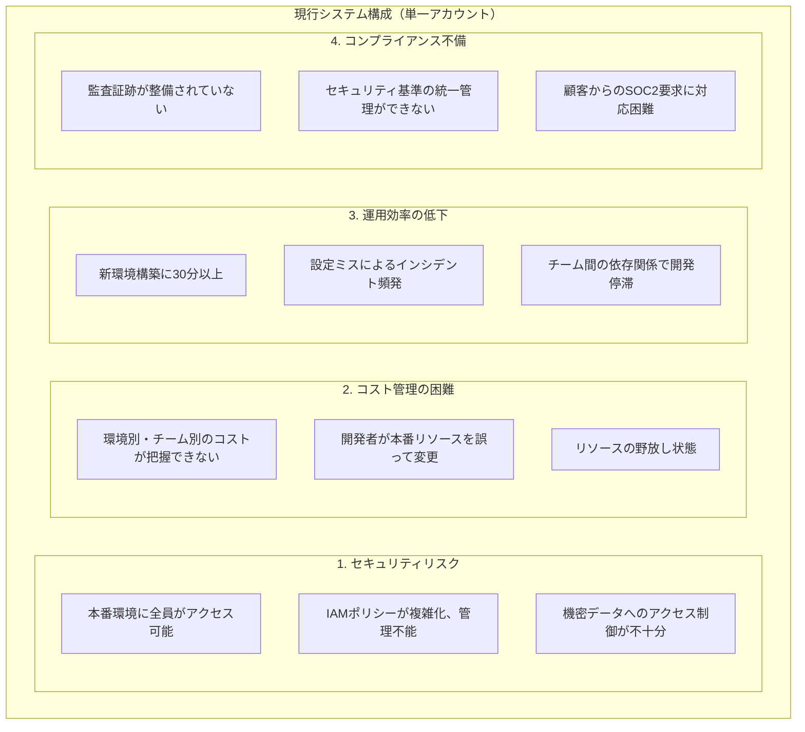
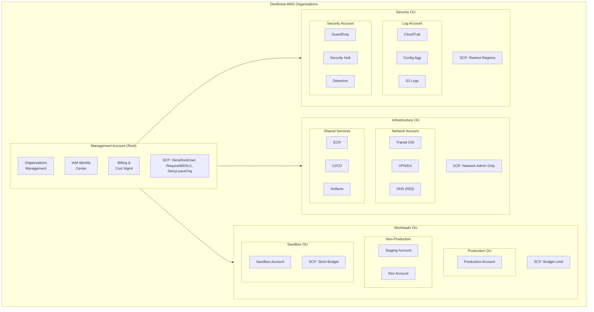
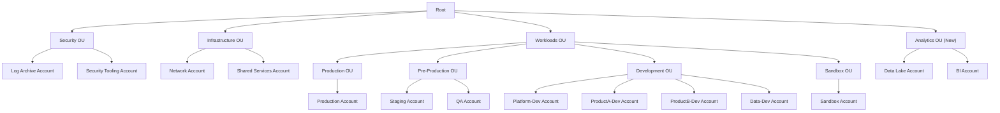

# 課題20: スタートアップのAWS基盤設計（Organizations + Landing Zone）

**難易度: 🟢 初級〜中級**

---

## 1. 分類情報

| 項目 | 内容 |
|------|------|
| 難易度 | 初級〜中級 |
| カテゴリ | マルチアカウント戦略・ガバナンス |
| 処理タイプ | バッチ |
| 使用IaC | Terraform |
| 想定所要時間 | 5-6時間 |

---

## 2. ビジネスシナリオ

### 企業プロファイル
- **企業名**: DevBoost株式会社
- **業種**: SaaSスタートアップ（開発者向け生産性ツール）
- **規模**: 従業員15名（今後1年で50名予定）、エンジニア8名
- **フェーズ**: シリーズA調達完了、急成長期
- **現状インフラ**: 単一AWSアカウントで全環境を運用

### 現状の課題
DevBoost株式会社は、単一のAWSアカウントで本番・開発・検証環境を運用しています。
急成長に伴い、以下の問題が深刻化しています：



### ビジネス要件
```
機能要件:
- マルチアカウント環境の構築（本番/ステージング/開発/共有）
- セキュリティベースラインの自動適用
- 新アカウント作成の自動化（5分以内）
- 統合ログ・監査基盤

非機能要件:
- 環境構築時間：30分 → 5分
- セキュリティインシデント：0件/月
- コンプライアンススコア：95%以上
- 運用工数：週10時間 → 週2時間
```

### 成功指標（KPI）
| 指標 | 現状 | 目標 |
|------|------|------|
| 新環境構築時間 | 30分 | 5分 |
| セキュリティインシデント | 月2-3件 | 0件 |
| コスト可視性 | 0%（不明） | 100% |
| IAMポリシー数 | 150+ | 20以下 |
| コンプライアンススコア | 40% | 95% |

---

## 3. 学習目標

### 本課題で習得するスキル

```
1. AWS Organizations（理解度：詳細）
   - OU（組織単位）設計
   - SCP（サービスコントロールポリシー）
   - 一括請求とコスト配分

2. Landing Zone設計（理解度：実装）
   - Control Tower の概念理解
   - Account Factory パターン
   - ベースラインセキュリティ

3. Terraform によるIaC（理解度：実装）
   - マルチアカウントプロビジョニング
   - モジュール設計
   - State管理（S3 + DynamoDB）

4. セキュリティガバナンス（理解度：基礎）
   - GuardDuty / Security Hub 統合
   - CloudTrail 組織トレイル
   - Config 集約
```

### GCPエンジニア向け補足
```
GCP → AWS マッピング:
- Resource Manager → AWS Organizations
- Folders → Organizational Units (OU)
- Organization Policies → Service Control Policies (SCP)
- Cloud Identity → IAM Identity Center
- Security Command Center → Security Hub

主な違い:
1. AWS Organizations: アカウント単位での分離が基本
   （GCPはプロジェクト単位）

2. SCP: 明示的な許可ではなく、最大権限の境界を設定
   （Organization Policies に近いが、IAMとの組み合わせが必要）

3. Landing Zone: AWS独自の概念
   （GCPではCloud Foundation Toolkitが近い）
```

---

## 4. 使用するAWSサービス

### メインサービス
| サービス | 役割 | 使用機能 |
|----------|------|----------|
| **AWS Organizations** | アカウント管理 | OU、SCP、一括請求 |
| **AWS IAM Identity Center** | ID管理 | SSO、権限セット |
| **AWS CloudTrail** | 監査ログ | 組織トレイル |
| **AWS Config** | 構成管理 | アグリゲーター |

### サポートサービス
| サービス | 用途 |
|----------|------|
| **Amazon S3** | Terraform State、ログ保存 |
| **Amazon DynamoDB** | Terraform State Lock |
| **AWS Security Hub** | セキュリティ統合 |
| **Amazon GuardDuty** | 脅威検知 |
| **AWS Budgets** | コスト管理 |
| **Amazon SNS** | 通知 |

### アーキテクチャ図


---

## 5. 前提条件と事前準備

### 必要な環境
```bash
# Terraform
terraform --version  # 1.5以上

# AWS CLI v2
aws --version  # 2.x以上

# Git
git --version

# jq（JSON処理）
jq --version
```

### AWSアカウント要件
```
- AWS Organizations が有効化可能なアカウント
- 管理者権限を持つIAMユーザーまたはロール
- 請求情報へのアクセス権限
- 新規アカウント作成権限
```

### 事前準備スクリプト
```bash
#!/bin/bash
# setup-landing-zone.sh

# 変数設定
PROJECT_NAME="devboost"
REGION="ap-northeast-1"

# ディレクトリ構造の作成
mkdir -p ${PROJECT_NAME}-landing-zone/{modules,environments,policies}
cd ${PROJECT_NAME}-landing-zone

# ディレクトリ構造
cat << 'EOF'
devboost-landing-zone/
├── main.tf
├── variables.tf
├── outputs.tf
├── providers.tf
├── backend.tf
├── modules/
│   ├── organization/
│   │   ├── main.tf
│   │   ├── variables.tf
│   │   └── outputs.tf
│   ├── account/
│   │   ├── main.tf
│   │   ├── variables.tf
│   │   └── outputs.tf
│   ├── scp/
│   │   ├── main.tf
│   │   └── policies/
│   │       ├── deny-root.json
│   │       ├── require-imdsv2.json
│   │       └── region-restriction.json
│   ├── security-baseline/
│   │   ├── main.tf
│   │   ├── guardduty.tf
│   │   ├── securityhub.tf
│   │   └── config.tf
│   └── logging/
│       ├── main.tf
│       ├── cloudtrail.tf
│       └── s3.tf
├── environments/
│   ├── production/
│   ├── staging/
│   └── development/
└── policies/
    └── scp/
EOF

# AWS Organizations の状態確認
echo "=== Checking AWS Organizations Status ==="
aws organizations describe-organization 2>/dev/null || echo "Organizations not enabled yet"

# 現在の認証情報確認
echo "=== Current AWS Identity ==="
aws sts get-caller-identity
```

---

## 6. アーキテクチャ設計

### OU（組織単位）設計
```yaml
# ou-design.yaml
organizational_units:
  root:
    name: "Root"
    scps:
      - DenyLeaveOrganization
      - RequireIMDSv2

  security:
    name: "Security"
    purpose: "セキュリティ・監査機能の集約"
    scps:
      - DenyAllExceptSecurityServices
    accounts:
      - name: "log-archive"
        email: "aws-log@devboost.example.com"
        purpose: "CloudTrail, Config, VPCフローログの集約"
      - name: "security-tooling"
        email: "aws-security@devboost.example.com"
        purpose: "GuardDuty, Security Hub, Detective"

  infrastructure:
    name: "Infrastructure"
    purpose: "共有インフラストラクチャ"
    scps:
      - NetworkAdminOnly
    accounts:
      - name: "network"
        email: "aws-network@devboost.example.com"
        purpose: "Transit Gateway, VPN, Direct Connect"
      - name: "shared-services"
        email: "aws-shared@devboost.example.com"
        purpose: "ECR, CI/CD, 共有ツール"

  workloads:
    name: "Workloads"
    children:
      production:
        name: "Production"
        scps:
          - DenyDestructiveActions
          - RequireTagging
        accounts:
          - name: "production"
            email: "aws-prod@devboost.example.com"

      non_production:
        name: "Non-Production"
        scps:
          - BudgetLimit
        accounts:
          - name: "staging"
            email: "aws-staging@devboost.example.com"
          - name: "development"
            email: "aws-dev@devboost.example.com"

      sandbox:
        name: "Sandbox"
        scps:
          - StrictBudgetLimit
          - LimitedServices
        accounts:
          - name: "sandbox"
            email: "aws-sandbox@devboost.example.com"
```

### SCP設計
```yaml
# scp-design.yaml
service_control_policies:
  # 全組織に適用
  DenyLeaveOrganization:
    description: "組織からの離脱を禁止"
    effect: "DENY"
    actions:
      - "organizations:LeaveOrganization"

  RequireIMDSv2:
    description: "EC2でIMDSv2を必須化"
    effect: "DENY"
    actions:
      - "ec2:RunInstances"
    conditions:
      StringNotEquals:
        "ec2:MetadataHttpTokens": "required"

  # 本番環境用
  DenyDestructiveActions:
    description: "破壊的操作の禁止"
    effect: "DENY"
    actions:
      - "ec2:TerminateInstances"
      - "rds:DeleteDBInstance"
      - "s3:DeleteBucket"
    conditions:
      StringNotLike:
        "aws:PrincipalArn": "arn:aws:iam::*:role/Admin*"

  # 開発環境用
  BudgetLimit:
    description: "高額サービスの制限"
    effect: "DENY"
    actions:
      - "ec2:RunInstances"
    conditions:
      ForAnyValue:StringLike:
        "ec2:InstanceType":
          - "*.metal"
          - "*.24xlarge"
          - "*.16xlarge"
          - "p*.*"
          - "g*.*"

  # リージョン制限
  RegionRestriction:
    description: "許可リージョンの制限"
    effect: "DENY"
    not_actions:
      - "iam:*"
      - "organizations:*"
      - "support:*"
      - "budgets:*"
    conditions:
      StringNotEquals:
        "aws:RequestedRegion":
          - "ap-northeast-1"
          - "us-east-1"  # グローバルサービス用
```

---

## 8. トラブルシューティング課題

### 課題1: アカウント作成が失敗する

**症状**:
```
Error: error creating Organizations Account: ConstraintViolationException:
You have exceeded the allowed number of AWS accounts.
```

**調査コマンド**:
```bash
# アカウント制限の確認
aws organizations describe-organization

# 既存アカウント数の確認
aws organizations list-accounts --query 'Accounts[*].[Id,Name,Status]' --output table

# Service Quotas の確認
aws service-quotas get-service-quota \
    --service-code organizations \
    --quota-code L-29A0C5DF
```

**原因と解決**:
<details>
<summary>解答を見る</summary>

**原因**: Organizations のデフォルトアカウント制限（10）に達している

**解決手順**:
```bash
# 1. Service Quotas でクォータ引き上げリクエスト
aws service-quotas request-service-quota-increase \
    --service-code organizations \
    --quota-code L-29A0C5DF \
    --desired-value 50

# 2. または、AWS サポートケースを作成
# - カテゴリ: Service Limit Increase
# - サービス: AWS Organizations
# - 理由: ビジネス要件を記載

# 3. 待機中の対応策
# - 不要なアカウントのクローズ検討
# - アカウント統合の検討
```

**追加確認事項**:
- 閉鎖中のアカウントも制限にカウントされる（90日間）
- アカウントメールの重複確認
</details>

### 課題2: SCP が意図通りに機能しない

**症状**:
```
SCP でリージョン制限を設定したが、制限されているはずのリージョンで
リソースが作成できてしまう。
```

**調査手順**:
```bash
# SCP のアタッチ状態確認
aws organizations list-policies-for-target \
    --target-id ou-xxxx-xxxxxxxx \
    --filter SERVICE_CONTROL_POLICY

# SCP の内容確認
aws organizations describe-policy --policy-id p-xxxxxxxx

# 対象アカウントの有効なポリシー確認
aws organizations describe-effective-policy \
    --target-id 123456789012 \
    --policy-type SERVICE_CONTROL_POLICY
```

**原因と解決**:
<details>
<summary>解答を見る</summary>

**原因**: SCP の条件や NotAction の設定が不適切

**解決手順**:
```hcl
# 1. NotAction の使用に注意
# NotAction で指定したサービスは SCP の制限を受けない
# グローバルサービスを適切に除外する

resource "aws_organizations_policy" "region_restriction_fixed" {
  name = "RegionRestrictionFixed"
  type = "SERVICE_CONTROL_POLICY"

  content = jsonencode({
    Version = "2012-10-17"
    Statement = [
      {
        Sid       = "DenyOtherRegions"
        Effect    = "Deny"
        NotAction = [
          # グローバルサービスのみを除外
          "iam:*",
          "organizations:*",
          "route53:*",
          "cloudfront:*",
          "waf:*",
          "wafv2:*",
          "globalaccelerator:*",
          "support:*",
          "budgets:*",
          "ce:*",
          "s3:GetBucketLocation",  # S3 は特定のアクションのみ除外
          "s3:ListAllMyBuckets"
        ]
        Resource = "*"
        Condition = {
          StringNotEquals = {
            "aws:RequestedRegion" = ["ap-northeast-1", "us-east-1"]
          }
        }
      }
    ]
  })
}

# 2. SCP が OU に正しくアタッチされているか確認
# 3. OU の階層構造を確認（親 OU の SCP も影響）
# 4. マネジメントアカウントは SCP の対象外であることに注意
```

**テスト方法**:
```bash
# 制限されるべきリージョンでテスト
aws ec2 describe-vpcs --region eu-west-1
# Access Denied が返ることを確認
```
</details>

### 課題3: クロスアカウントアクセスが機能しない

**症状**:
```
Terraform で別アカウントにリソースを作成しようとすると
Access Denied エラーが発生する。
```

**原因と解決**:
<details>
<summary>解答を見る</summary>

**原因**: AssumeRole の設定が不完全

**解決手順**:
```hcl
# 1. Terraform provider でロールを指定
provider "aws" {
  alias  = "production"
  region = "ap-northeast-1"

  assume_role {
    role_arn     = "arn:aws:iam::PRODUCTION_ACCOUNT_ID:role/OrganizationAccountAccessRole"
    session_name = "TerraformSession"
  }
}

# 2. Organizations 作成時のデフォルトロールを確認
# アカウント作成時に OrganizationAccountAccessRole が自動作成される

# 3. 信頼ポリシーの確認（対象アカウントで）
aws iam get-role --role-name OrganizationAccountAccessRole

# 4. 必要に応じて信頼ポリシーを更新
{
  "Version": "2012-10-17",
  "Statement": [
    {
      "Effect": "Allow",
      "Principal": {
        "AWS": "arn:aws:iam::MANAGEMENT_ACCOUNT_ID:root"
      },
      "Action": "sts:AssumeRole"
    }
  ]
}
```
</details>

---

## 9. 設計課題

### 設計課題: 50名規模への成長対応

**シナリオ**:
DevBoost社は1年後に従業員50名（エンジニア20名）への成長を計画しています。
現在の Landing Zone 設計を拡張し、以下の要件に対応してください。

**要件**:
```
1. チーム構成（想定）
   - プラットフォームチーム: 5名
   - プロダクトチームA: 5名
   - プロダクトチームB: 5名
   - データチーム: 3名
   - SRE: 2名

2. アクセス要件
   - チームごとに専用の開発アカウント
   - 本番環境は SRE + プラットフォームのみ
   - データチームは分析環境のみ

3. セキュリティ要件
   - SOC2 Type II 準拠準備
   - 監査ログの13ヶ月保持
   - PII データの暗号化必須

4. コスト要件
   - チーム別コスト可視化
   - 開発環境の予算制限（チームあたり月10万円）
```

**設計すべき項目**:
- 拡張OU構造
- IAM Identity Center の権限セット設計
- 追加SCP
- コスト配分戦略

<details>
<summary>設計例を見る</summary>

### 拡張 OU 構造



### IAM Identity Center 権限セット設計

```yaml
permission_sets:
  # 管理者用
  AdministratorAccess:
    managed_policies:
      - arn:aws:iam::aws:policy/AdministratorAccess
    session_duration: 4h
    assignment:
      - group: SRE
        accounts: [All]
      - group: PlatformTeam
        accounts: [Infrastructure, Development OUs]

  # 開発者用
  DeveloperAccess:
    managed_policies:
      - arn:aws:iam::aws:policy/PowerUserAccess
    inline_policy: |
      {
        "Version": "2012-10-17",
        "Statement": [
          {
            "Effect": "Deny",
            "Action": [
              "iam:CreateUser",
              "iam:CreateAccessKey",
              "organizations:*"
            ],
            "Resource": "*"
          }
        ]
      }
    session_duration: 8h
    assignment:
      - group: ProductTeamA
        accounts: [ProductA-Dev]
      - group: ProductTeamB
        accounts: [ProductB-Dev]

  # 読み取り専用
  ViewOnlyAccess:
    managed_policies:
      - arn:aws:iam::aws:policy/ViewOnlyAccess
    session_duration: 8h
    assignment:
      - group: AllDevelopers
        accounts: [Production]

  # データ分析用
  DataAnalystAccess:
    managed_policies:
      - arn:aws:iam::aws:policy/AmazonAthenaFullAccess
      - arn:aws:iam::aws:policy/AmazonRedshiftReadOnlyAccess
    inline_policy: |
      {
        "Version": "2012-10-17",
        "Statement": [
          {
            "Effect": "Allow",
            "Action": [
              "s3:GetObject",
              "s3:ListBucket"
            ],
            "Resource": [
              "arn:aws:s3:::*-data-lake-*",
              "arn:aws:s3:::*-data-lake-*/*"
            ]
          }
        ]
      }
    assignment:
      - group: DataTeam
        accounts: [Data Lake, BI]
```

### コスト配分戦略

```yaml
cost_allocation:
  # 必須タグ
  mandatory_tags:
    - Team
    - Environment
    - CostCenter
    - Project

  # Budget 設定
  budgets:
    - name: ProductA-Dev-Monthly
      amount: 100000  # 10万円
      filter:
        account: ProductA-Dev
      alerts:
        - threshold: 80
          action: notify
        - threshold: 100
          action: [notify, restrict_expensive_services]

    - name: ProductB-Dev-Monthly
      amount: 100000
      filter:
        account: ProductB-Dev
      alerts:
        - threshold: 80
          action: notify
        - threshold: 100
          action: [notify, restrict_expensive_services]

  # Cost Categories
  cost_categories:
    - name: Team
      rules:
        - value: Platform
          match: Account IN [Platform-Dev, Shared-Services, Network]
        - value: ProductA
          match: Account IN [ProductA-Dev] OR Tag:Team = ProductA
        - value: ProductB
          match: Account IN [ProductB-Dev] OR Tag:Team = ProductB
        - value: Data
          match: Account IN [Data-Dev, Data-Lake, BI]
```

</details>

---

## 10. 発展課題

### 発展課題1: Control Tower の導入（難易度：中級）

**課題内容**:
現在の Terraform ベースの Landing Zone を AWS Control Tower に移行し、
ガードレールと Account Factory を活用してください。

**要件**:
- 既存アカウントの Control Tower への登録
- カスタムガードレールの作成
- Account Factory Customization (AFC) の設定

### 発展課題2: GitOps によるアカウント管理（難易度：上級）

**課題内容**:
新規アカウント作成をGitOps で管理し、PR ベースの承認フローを実装してください。

**要件**:
- GitHub/GitLab リポジトリでアカウント定義を管理
- PR 作成 → レビュー → マージで自動プロビジョニング
- Terraform Cloud / Atlantis の活用

### 発展課題3: FinOps 基盤の構築（難易度：中級）

**課題内容**:
組織全体のコスト可視化と最適化を自動化する FinOps 基盤を構築してください。

**要件**:
- Cost and Usage Report の設定と分析
- 異常コスト検知の自動化
- 月次コストレポートの自動配信

---

## 11. 振り返りと次のステップ

### 学習のまとめ

```
本課題で学んだこと:
□ AWS Organizations によるマルチアカウント管理
□ OU 設計とベストプラクティス
□ SCP による権限境界の設定
□ IAM Identity Center による統合 ID 管理
□ Terraform でのマルチアカウントプロビジョニング
□ 組織レベルのセキュリティ・監査基盤

GCP との主な違い:
- アカウント vs プロジェクトの粒度の違い
- SCP は Organization Policy より IAM 統合が深い
- Control Tower という Landing Zone ソリューション
```

### GCP経験者向けポイント

| 観点 | GCP | AWS | 移行時の注意 |
|------|-----|-----|-------------|
| 階層構造 | Folders | Organizational Units | OU は移動可能だが制限あり |
| ポリシー | Organization Policies | SCP | SCP は許可ではなく境界を設定 |
| ID 管理 | Cloud Identity | IAM Identity Center | SCIM 連携の設定が異なる |
| 請求 | Billing Account | 一括請求 | 支払いアカウントは1つ |
| ログ集約 | Log Router | CloudTrail 組織トレイル | 設定方法が異なる |

### 推奨される次のステップ

```
1. AWS Certified Solutions Architect Associate
   - Organizations の詳細理解

2. Control Tower の学習
   - マネージドな Landing Zone

3. 実環境での適用
   - 段階的な移行計画の策定
   - チームへの教育

4. 関連課題への挑戦
   - 課題32: マルチリージョン構成
   - 課題40: IAM Identity Center 統合
```

---

## 12. 推定コストと注意事項

### 本課題の推定コスト

| サービス | 使用量 | 推定コスト（演習時） |
|----------|--------|---------------------|
| Organizations | 管理機能 | 無料 |
| CloudTrail | 組織トレイル | $2-5/月 |
| Config | ルール評価 | $2-5/月 |
| S3 | ログ保存 | $1-2/月 |
| IAM Identity Center | ユーザー管理 | 無料 |
| **合計** | | **$5-15/月** |

### 注意事項

```
⚠️ Organizations の有効化
- 一度有効化すると、完全な無効化は困難
- 既存のアカウント構造に影響

⚠️ アカウント作成
- アカウント作成には一意のメールアドレスが必要
- 作成後のメールアドレス変更は不可
- アカウントのクローズには90日の待機期間

⚠️ SCP の適用
- マネジメントアカウントには SCP が適用されない
- SCP は許可を与えない（IAM との AND 条件）
- テスト環境で十分な検証後に適用

⚠️ 本番環境への適用
- 段階的に適用（Sandbox → Dev → Staging → Prod）
- ロールバック計画を準備
- チームへの事前周知
```

---

**課題作成日**: 2024年1月
**最終更新日**: 2024年1月
**作成者**: AWS学習プログラム
