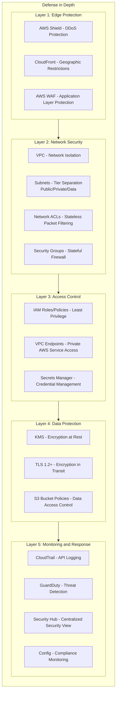

# 課題21: 金融系SaaSのセキュア基盤構築

**難易度: 🟢 初級〜中級**

---

## 1. 分類情報

| 項目 | 内容 |
|------|------|
| 難易度 | 初級〜中級 |
| カテゴリ | セキュリティ |
| 処理タイプ | リアルタイム |
| 使用IaC | CloudFormation |
| 想定所要時間 | 5-6時間 |

---

## 2. シナリオ

### 企業プロファイル

| 項目 | 内容 |
|------|------|
| **企業名** | InvestPro株式会社 |
| **業種** | 投資管理SaaS |
| **従業員数** | 60名（エンジニア20名） |
| **顧客数** | 機関投資家・資産運用会社100社 |
| **管理資産額** | 10兆円相当のデータ管理 |
| **規制要件** | 金融庁ガイドライン、FISC安全対策基準 |

### 現状の課題

```
InvestPro株式会社は機関投資家向けの投資管理SaaSを提供しています。
金融庁の監督指針対応において以下の課題を抱えています：

1. ネットワークセキュリティの不備
   - パブリックサブネットにアプリケーションが配置
   - インターネット経由でのAWSサービスアクセス
   - セグメンテーションが不十分

2. 認証情報管理の問題
   - データベースパスワードが環境変数にハードコード
   - APIキーがソースコードに含まれている
   - シークレットのローテーションが手動

3. アクセス制御の課題
   - IPアドレス制限が不完全
   - WAFが未導入
   - 監査ログが不十分

4. コンプライアンス対応
   - 金融庁ガイドラインへの対応が不完全
   - セキュリティ監査で指摘事項あり
   - 顧客からのセキュリティ質問への回答に時間がかかる
```

### ビジネス目標

| KPI | 現状 | 目標 |
|-----|------|------|
| セキュリティ監査スコア | 60点 | 90点以上 |
| 金融庁ガイドライン準拠率 | 70% | 100% |
| シークレットローテーション | 手動（年1回） | 自動（90日ごと） |
| インシデント検知時間 | 数時間 | 5分以内 |
| セキュリティ質問対応 | 3日 | 即日 |

---

## 3. 達成目標（ゴール）

### 主要な学習成果

```
この課題を完了すると、以下ができるようになります：

1. セキュアなVPC設計
   - マルチAZ構成とサブネット分離
   - VPCエンドポイントによるプライベートアクセス
   - ネットワークACLとセキュリティグループの多層防御

2. AWS PrivateLinkの活用
   - VPCエンドポイントサービスの構築
   - Interface/Gateway Endpoint の使い分け
   - プライベートなサービス連携

3. AWS WAFによるWebアプリケーション保護
   - マネージドルールの適用
   - カスタムルールの作成
   - レート制限とIP制限

4. AWS Secrets Managerによる認証情報管理
   - シークレットの安全な保存
   - 自動ローテーションの設定
   - アプリケーション統合
```

### 合格基準

| 項目 | 基準 |
|------|------|
| VPC設計 | プライベートサブネットにアプリが配置されていること |
| PrivateLink | AWSサービスへのアクセスがVPCエンドポイント経由であること |
| WAF | 主要な攻撃パターンがブロックされること |
| Secrets | DBパスワードがSecrets Managerで管理されていること |
| 監査 | CloudTrailで全アクションが記録されていること |

---

## 4. 使用するAWSサービス

### コア技術スタック

```yaml
ネットワーク:
  - Amazon VPC: 仮想ネットワーク
  - VPC Endpoints: プライベートサービスアクセス
  - AWS PrivateLink: サービス間プライベート接続
  - AWS Transit Gateway: VPC間接続（オプション）
  - Network Firewall: 高度なトラフィック制御（オプション）

Webアプリケーション保護:
  - AWS WAF: Webアプリケーションファイアウォール
  - AWS Shield: DDoS保護
  - Amazon CloudFront: CDN + WAF統合

認証情報管理:
  - AWS Secrets Manager: シークレット管理・ローテーション
  - AWS Systems Manager Parameter Store: 設定パラメータ
  - AWS KMS: 暗号化キー管理

アクセス制御:
  - AWS IAM: 認証・認可
  - IAM Identity Center: SSO
  - AWS Organizations: マルチアカウント管理

監視・監査:
  - AWS CloudTrail: API監査ログ
  - Amazon GuardDuty: 脅威検知
  - AWS Config: 構成管理
  - AWS Security Hub: セキュリティ統合ダッシュボード
```

### GCPとの比較

| 機能 | AWS | GCP |
|------|-----|-----|
| プライベート接続 | PrivateLink | Private Service Connect |
| WAF | AWS WAF | Cloud Armor |
| シークレット管理 | Secrets Manager | Secret Manager |
| 脅威検知 | GuardDuty | Security Command Center |
| 構成監査 | Config | Security Health Analytics |

---

## 5. 前提条件

### 技術要件

```bash
# 必要なCLIツール
aws --version          # 2.x
terraform --version    # 1.5+

# AWS設定
aws configure
export AWS_REGION=ap-northeast-1
export AWS_ACCOUNT_ID=$(aws sts get-caller-identity --query Account --output text)
```

### 事前準備

```bash
# プロジェクト構造
investpro-secure-infra/
├── terraform/
│   ├── main.tf
│   ├── vpc.tf
│   ├── endpoints.tf
│   ├── waf.tf
│   ├── secrets.tf
│   ├── security_groups.tf
│   ├── iam.tf
│   └── variables.tf
├── policies/
│   ├── waf-rules.json
│   └── iam-policies/
└── docs/
    └── security-architecture.md
```

---

## 6. アーキテクチャ図

### 全体構成


**WAF Rules:** SQL Injection, XSS, Rate Limit, IP Block, Geo Block

**Security Groups:**
- alb-sg: Inbound 443 from CloudFront IPs only
- app-sg: Inbound 8080 from alb-sg only, Outbound 443 to VPC Endpoints only
- db-sg: Inbound 5432 from app-sg only, Encrypted with KMS CMK

**Secrets Manager:** investpro/db/credentials, investpro/api/keys, investpro/external/tokens (Rotation: 90 days)

### セキュリティレイヤー



---

## 8. トラブルシューティングチャレンジ

### Challenge 1: VPCエンドポイント経由でSecrets Managerにアクセスできない

```
問題:
ECSタスクからSecrets Managerへのアクセスがタイムアウトする。
VPCエンドポイントを設定したはずだが機能しない。

エラーログ:
botocore.exceptions.ConnectTimeoutError:
Connect timeout on endpoint URL: "https://secretsmanager.ap-northeast-1.amazonaws.com"

調査項目:
1. VPCエンドポイントの設定
2. セキュリティグループ
3. DNS設定
```

<details>
<summary>解決のヒント</summary>

```bash
# 1. VPCエンドポイントの状態確認
aws ec2 describe-vpc-endpoints \
    --filters "Name=service-name,Values=com.amazonaws.ap-northeast-1.secretsmanager" \
    --query "VpcEndpoints[*].{ID:VpcEndpointId,State:State,DNS:DnsEntries}"

# 2. Private DNSが有効か確認
# private_dns_enabled = true である必要がある

# 3. セキュリティグループ確認
aws ec2 describe-security-groups \
    --group-ids sg-vpce-xxx \
    --query "SecurityGroups[0].IpPermissions"

# Inbound: 443 from VPC CIDR が必要

# 4. ECSタスクのセキュリティグループ確認
# Outbound: 443 to VPCE Security Group が必要

# 5. ルートテーブル確認（S3エンドポイントがGateway型の場合）
aws ec2 describe-route-tables \
    --route-table-ids rtb-xxx

# 6. DNS解決テスト（ECSタスク内から）
nslookup secretsmanager.ap-northeast-1.amazonaws.com
# VPCエンドポイントのプライベートIPが返されるべき

# 解決策:
# - private_dns_enabled = true を設定
# - セキュリティグループでHTTPS許可
# - サブネットにVPCエンドポイントを配置
```
</details>

### Challenge 2: WAFでブロックされるべきリクエストが通過する

```
問題:
SQLインジェクション攻撃がWAFをバイパスしてアプリケーションに到達している。

ログ:
WAF: ALLOW
Application: SQL Injection detected in parameter 'search'

攻撃例:
/api/search?q=1%27%20OR%20%271%27%3D%271

調査項目:
1. WAFルールの設定
2. ルールの優先順位
3. エンコーディング
```

<details>
<summary>解決のヒント</summary>

```bash
# 1. WAFルールのテスト
aws wafv2 get-sampled-requests \
    --web-acl-arn arn:aws:wafv2:...:webacl/investpro-web-acl \
    --rule-metric-name AWSManagedRulesSQLiRuleSetMetric \
    --scope CLOUDFRONT \
    --time-window StartTime=...,EndTime=... \
    --max-items 100

# 2. SQLiルールがCOUNTモードになっていないか確認
# override_action { count {} } ではなく none {} である必要

# 3. Text Transformationの追加
# URL_DECODEを追加してエンコードされた攻撃を検知

# terraform/waf.tf に追加
rule {
  name     = "CustomSQLiRule"
  priority = 2

  action {
    block {}
  }

  statement {
    sqli_match_statement {
      field_to_match {
        query_string {}
      }
      text_transformation {
        priority = 0
        type     = "URL_DECODE"
      }
      text_transformation {
        priority = 1
        type     = "HTML_ENTITY_DECODE"
      }
      text_transformation {
        priority = 2
        type     = "LOWERCASE"
      }
    }
  }

  visibility_config {
    cloudwatch_metrics_enabled = true
    metric_name                = "CustomSQLiRuleMetric"
    sampled_requests_enabled   = true
  }
}

# 4. CloudFront経由でのみアクセス可能にする
# ALBのセキュリティグループでCloudFront IPsのみ許可
```
</details>

### Challenge 3: シークレットローテーション後にアプリケーションが接続エラー

```
問題:
Secrets Managerの自動ローテーション実行後、
アプリケーションがデータベースに接続できなくなった。

エラー:
psycopg2.OperationalError: FATAL: password authentication failed for user "app_user"

調査項目:
1. ローテーションLambdaの実行ログ
2. シークレットのバージョン
3. アプリケーションのキャッシュ
```

<details>
<summary>解決のヒント</summary>

```bash
# 1. シークレットのバージョン確認
aws secretsmanager list-secret-version-ids \
    --secret-id investpro/db/credentials

# AWSCURRENT と AWSPREVIOUS を確認

# 2. ローテーションLambdaのログ確認
aws logs get-log-events \
    --log-group-name /aws/lambda/investpro-secret-rotation \
    --log-stream-name $(aws logs describe-log-streams \
        --log-group-name /aws/lambda/investpro-secret-rotation \
        --order-by LastEventTime --descending \
        --query "logStreams[0].logStreamName" --output text)

# 3. 実際のシークレット値確認
aws secretsmanager get-secret-value \
    --secret-id investpro/db/credentials \
    --query SecretString --output text | jq .

# 4. データベースでパスワード確認（手動テスト）
psql -h xxx.rds.amazonaws.com -U app_user -d investpro

# 5. アプリケーションのキャッシュクリア
# @lru_cache を使用している場合、キャッシュをクリア

# 解決策:
# a) アプリケーションでシークレットのキャッシュTTLを設定
# b) ローテーション時のエラーハンドリング改善
# c) データベース接続のリトライロジック追加

# キャッシュTTL付きの実装例
from cachetools import TTLCache

class SecretsManager:
    def __init__(self):
        self.cache = TTLCache(maxsize=10, ttl=300)  # 5分キャッシュ

    def get_secret(self, secret_name):
        if secret_name in self.cache:
            return self.cache[secret_name]

        secret = self._fetch_secret(secret_name)
        self.cache[secret_name] = secret
        return secret
```
</details>

---

## 9. 設計考慮ポイント

### 金融庁ガイドライン対応マッピング

```yaml
金融機関のシステムリスク管理基準:

1. アクセス管理:
   対応: IAM, VPC Security Groups, WAF IP制限
   証跡: CloudTrail, VPC Flow Logs

2. ネットワーク管理:
   対応: VPC分離, PrivateLink, Network ACL
   証跡: VPC Flow Logs, Config

3. 暗号化:
   対応: KMS (AES-256), TLS 1.2+, RDS暗号化
   証跡: KMS監査ログ, Config Rules

4. 監査ログ:
   対応: CloudTrail, CloudWatch Logs
   保持: 7年以上

5. 脆弱性管理:
   対応: WAF, GuardDuty, Security Hub
   対応: ECRスキャン, Inspector

6. インシデント対応:
   対応: GuardDuty, Security Hub, SNS通知
   手順: ランブック自動化
```

### コスト vs セキュリティのトレードオフ

```
High Security (本課題構成):
┌─────────────────────────────────────────┐
│ • Multi-AZ NAT Gateway: $90/月         │
│ • VPC Endpoints (8個): $80/月          │
│ • WAF: $10/月 + $0.60/100万リクエスト  │
│ • GuardDuty: $4/月〜                   │
│ • CloudTrail: $2/月〜                  │
│                                         │
│ セキュリティレベル: ★★★★★            │
│ 月額追加コスト: 約$190                  │
└─────────────────────────────────────────┘

Medium Security (代替構成):
┌─────────────────────────────────────────┐
│ • Single NAT Gateway: $45/月           │
│ • 主要VPC Endpoints (3個): $30/月      │
│ • WAF: $10/月                          │
│                                         │
│ セキュリティレベル: ★★★☆☆            │
│ 月額追加コスト: 約$85                   │
└─────────────────────────────────────────┘

金融系では High Security が必須
```

---

## 10. 発展課題

### 上級チャレンジ1: ゼロトラストアーキテクチャ

```yaml
# AWS Verified Access による実装

ゼロトラスト原則:
  - Never trust, always verify
  - Assume breach
  - Verify explicitly

実装コンポーネント:
  - AWS Verified Access: アプリケーションアクセス制御
  - IAM Identity Center: 統合認証
  - Device Trust: デバイス検証
  - Continuous Verification: 継続的な認証

# Verified Access Trust Provider
resource "aws_verifiedaccess_trust_provider" "oidc" {
  policy_reference_name = "investpro-idp"
  trust_provider_type   = "user"

  oidc_options {
    authorization_endpoint = "https://idp.investpro.example/authorize"
    client_id              = var.oidc_client_id
    client_secret          = var.oidc_client_secret
    issuer                 = "https://idp.investpro.example"
    token_endpoint         = "https://idp.investpro.example/token"
    user_info_endpoint     = "https://idp.investpro.example/userinfo"
    scope                  = "openid profile email"
  }
}
```

### 上級チャレンジ2: SOC2/SOC3レポート対応

```yaml
# AWS Artifact + 自社監査証跡

SOC2 Type II 対応項目:

Security:
  - 実装: WAF, Security Groups, KMS
  - 証跡: CloudTrail, Config

Availability:
  - 実装: Multi-AZ, Auto Scaling
  - 証跡: CloudWatch, Health Dashboard

Processing Integrity:
  - 実装: Lambda検証, データ整合性チェック
  - 証跡: アプリケーションログ

Confidentiality:
  - 実装: 暗号化, VPC分離, IAM
  - 証跡: KMS監査ログ, Access Analyzer

Privacy:
  - 実装: データ分類, アクセス制御
  - 証跡: Macie, IAM Access Analyzer
```

### 上級チャレンジ3: セキュリティ自動修復

```python
# Lambda: GuardDuty検知時の自動対応

import boto3
import json

def lambda_handler(event, context):
    """
    GuardDuty検知イベントに対する自動対応
    """
    finding = event['detail']
    finding_type = finding['type']
    severity = finding['severity']

    # 重大度に応じた対応
    if severity >= 7:
        # 高重大度: 即座にブロック
        handle_high_severity(finding)
    elif severity >= 4:
        # 中重大度: アラート + 調査開始
        handle_medium_severity(finding)
    else:
        # 低重大度: ログ記録のみ
        log_finding(finding)


def handle_high_severity(finding):
    """高重大度の検知への対応"""
    ec2 = boto3.client('ec2')
    wafv2 = boto3.client('wafv2')

    finding_type = finding['type']

    if 'UnauthorizedAccess' in finding_type:
        # 不正アクセス: IPをWAFでブロック
        source_ip = finding['service']['action']['networkConnectionAction']['remoteIpDetails']['ipAddressV4']
        block_ip_in_waf(wafv2, source_ip)

    elif 'CryptoCurrency' in finding_type:
        # マイニング検知: インスタンス隔離
        instance_id = finding['resource']['instanceDetails']['instanceId']
        isolate_instance(ec2, instance_id)

    # SNS通知
    notify_security_team(finding)


def block_ip_in_waf(client, ip_address):
    """WAFのIPブロックリストにIPを追加"""
    client.update_ip_set(
        Name='investpro-ip-block-list',
        Scope='CLOUDFRONT',
        Id='xxx',
        Addresses=[f"{ip_address}/32"],
        LockToken='xxx'
    )


def isolate_instance(client, instance_id):
    """インスタンスを隔離用セキュリティグループに変更"""
    # 全トラフィックを拒否するSGに変更
    client.modify_instance_attribute(
        InstanceId=instance_id,
        Groups=['sg-isolation']
    )
```

---

## 11. コスト見積もり

### 月額コスト概算

| サービス | スペック | 月額コスト |
|----------|----------|------------|
| NAT Gateway | 2 × Multi-AZ | $90 |
| VPC Endpoints | 8 Interface Endpoints | $80 |
| WAF | Web ACL + ルール | $15 |
| Secrets Manager | 5 シークレット | $2 |
| KMS | 3 CMK | $3 |
| CloudTrail | Multi-region | $2 |
| GuardDuty | 基本 | $5 |
| Config | 基本 | $3 |
| CloudWatch Logs | 10GB | $5 |
| **合計** | | **約 $205/月** |

### ROI分析

```
セキュリティ投資対効果:

コスト:
- 月額インフラ追加費用: $205
- 年間: $2,460

リスク軽減効果:
- データ漏洩時の想定被害: 1億円〜
- セキュリティインシデントによる信用失墜: 計り知れない
- 金融庁による行政処分リスク: 事業継続に影響

ROI:
- セキュリティ投資は保険として考える
- 金融業界では必須投資
- 顧客獲得時のセキュリティ質問対応が容易に
```

---

## 12. 学習のポイント

### 今回学んだこと

```
1. セキュアなVPC設計
   □ サブネット分離（Public/Private/Data）
   □ セキュリティグループの多層防御
   □ Network ACLによる追加防御

2. VPCエンドポイント
   □ Interface vs Gateway Endpoint
   □ PrivateLink によるプライベート接続
   □ エンドポイントポリシー

3. AWS WAF
   □ マネージドルールの活用
   □ カスタムルールの作成
   □ レート制限とIP制限

4. Secrets Manager
   □ シークレットの安全な保存
   □ 自動ローテーション
   □ アプリケーション統合

5. 監査とコンプライアンス
   □ CloudTrail
   □ AWS Config
   □ Security Hub
```

### GCPとの比較まとめ

| 観点 | AWS | GCP |
|------|-----|-----|
| プライベート接続 | PrivateLink | Private Service Connect |
| WAF | AWS WAF (マネージドルール豊富) | Cloud Armor |
| シークレット管理 | Secrets Manager | Secret Manager |
| 監査 | CloudTrail + Config | Cloud Audit Logs |
| 統合ダッシュボード | Security Hub | Security Command Center |

### 次のステップ

```
1. 発展学習:
   - AWS Network Firewall
   - AWS Verified Access
   - AWS Macie (データ分類)

2. 認定対応:
   - FISC安全対策基準
   - PCI DSS
   - ISO 27001

3. 認定資格:
   - AWS Certified Security - Specialty
   - AWS Certified Solutions Architect - Professional
```
