# 課題24: 動画エンコーディングパイプライン構築

**難易度: 🟡 中級**

---

## 1. 分類情報

| 項目 | 内容 |
|------|------|
| 難易度 | 中級 |
| カテゴリ | バッチ処理 / メディア / コンテンツ配信 |
| 処理タイプ | バッチ / イベント駆動 |
| 使用IaC | CloudFormation |
| 所要時間 | 5〜6時間 |

---

## シナリオ

### 企業プロフィール

**〇〇株式会社**は、オリジナルドラマ・映画を配信するサブスクリプション型動画配信サービスを運営しています。

| 項目 | 内容 |
|------|------|
| 業種 | 動画配信（OTT） |
| 設立 | 2019年 |
| 従業員数 | 80名 |
| 月間アクティブユーザー | 50万人 |
| 有料会員数 | 30万人 |
| 月商 | 3億円 |
| コンテンツ数 | 2,000本 |
| 月間新規コンテンツ | 500本 |
| 対応デバイス | Web、iOS、Android、Smart TV、Fire TV |

### 現状の課題

コンテンツ制作会社から納品されるマスター動画（4K ProRes形式）を、各デバイス向けに手動でエンコードしています。エンコード作業がボトルネックとなり、コンテンツの配信開始が遅延しています。

### 数値で示された問題

| 指標 | 現状 | 目標 |
|------|------|------|
| 月間エンコード動画数 | 500本 | 変わらず |
| 1本あたりエンコード時間 | 4時間 | 30分以内 |
| エンコード担当者 | 2名専任 | 0名（自動化） |
| 配信開始リードタイム | 48時間 | 4時間以内 |
| エンコードエラー率 | 5% | 1%以下 |
| 出力フォーマット数 | 8種類 | 12種類以上 |

### 現状のエンコードワークフロー

```
1. 制作会社からマスター動画をHDD/クラウドで受領
2. 担当者がローカルPCにダウンロード（30分〜1時間）
3. Adobe Media Encoderで各フォーマットにエンコード（2〜3時間）
4. 目視で品質チェック（30分）
5. CDNにアップロード（30分）
6. メタデータ登録
→ 合計: 4〜5時間/本
```

### 必要な出力フォーマット

| プロファイル | 解像度 | ビットレート | 対象デバイス |
|--------------|--------|--------------|--------------|
| 4K UHD | 3840×2160 | 15Mbps | 4K TV |
| 1080p High | 1920×1080 | 8Mbps | Smart TV, PC |
| 1080p | 1920×1080 | 5Mbps | PC, Tablet |
| 720p | 1280×720 | 3Mbps | Mobile WiFi |
| 480p | 854×480 | 1.5Mbps | Mobile 4G |
| 360p | 640×360 | 0.8Mbps | Mobile 3G |
| Audio Only | - | 128kbps | バックグラウンド再生 |

+ HLS/DASH 両対応

### 解決したいこと

1. マスター動画アップロード後の自動エンコード
2. 複数フォーマットへの並列エンコード
3. 配信開始リードタイムの大幅短縮
4. エンコード品質の一貫性確保
5. 自動品質チェック・エラー通知

### 成功指標（KPI）

| KPI | 現状 | 目標 | 達成期限 |
|-----|------|------|----------|
| エンコード時間/本 | 4時間 | 30分以内 | 1ヶ月後 |
| 配信リードタイム | 48時間 | 4時間以内 | 1ヶ月後 |
| 自動化率 | 0% | 95%以上 | 2ヶ月後 |
| エンコードエラー率 | 5% | 1%以下 | 1ヶ月後 |
| 人的工数 | 160時間/月 | 10時間/月 | 2ヶ月後 |

---

## 達成目標

この演習で習得できるスキル：

### 技術的な学習ポイント

1. **AWS Elemental MediaConvertの実践活用**
   - ジョブテンプレートの設計
   - 出力グループ（HLS, DASH）の設定
   - カスタムプリセット作成

2. **AWS Batchによる大規模バッチ処理**
   - コンピューティング環境の設計
   - ジョブ定義とジョブキュー
   - スポットインスタンス活用

3. **S3イベント駆動アーキテクチャ**
   - S3 → Lambda → MediaConvert
   - Step Functionsによるワークフロー

4. **CloudFrontによるコンテンツ配信**
   - HLS/DASH配信設定
   - キャッシュ戦略

### 実務で活かせる知識

- 動画配信プラットフォームの構築
- メディア処理パイプラインの設計
- コスト最適化（スポットインスタンス）

---

## 使用するAWSサービス

### メインサービス

| サービス | 役割 | 選定理由 |
|----------|------|----------|
| AWS Elemental MediaConvert | 動画エンコード | 高品質、多フォーマット対応 |
| AWS Batch | 大規模並列処理（前処理用） | スポット対応、コスト効率 |
| Amazon S3 | 入力/出力ストレージ | 大容量、イベント通知 |
| AWS Lambda | オーケストレーション | イベント駆動 |
| AWS Step Functions | ワークフロー管理 | 可視化、エラー処理 |
| Amazon CloudFront | コンテンツ配信 | グローバル配信 |

### 補助サービス

| サービス | 役割 |
|----------|------|
| Amazon DynamoDB | ジョブ状態管理 |
| Amazon SNS | 完了/エラー通知 |
| Amazon CloudWatch | 監視・ログ |
| AWS Secrets Manager | APIキー管理 |

---

## 前提条件

### 必要な事前知識

- AWSの基本操作（S3, Lambda）
- 動画フォーマットの基本（コーデック、コンテナ）
- HLS/DASHの基本概念

### 準備するもの

1. **AWSアカウント**
   - MediaConvertへのアクセス権限
   - 適切なIAM権限

2. **開発環境**
   - AWS CLI v2
   - Python 3.9以上

3. **テストデータ**
   - サンプル動画ファイル（MP4, 1分程度）

---

## アーキテクチャ概要

### システム全体構成

```mermaid
architecture-beta
    group aws(cloud)[AWS Cloud]

    group input_layer(server)[Input Layer] in aws
    group workflow_layer(logos:aws-step-functions)[Workflow Layer] in aws
    group output_layer(server)[Output Layer] in aws
    group support_layer(server)[Support Services] in aws

    service producer(internet)[Producer]
    service s3_input(logos:aws-s3)[S3 Input] in input_layer
    service lambda_trigger(logos:aws-lambda)[Lambda Trigger] in input_layer

    service stepfn(logos:aws-step-functions)[Step Functions] in workflow_layer
    service mediaconvert(server)[MediaConvert] in workflow_layer
    service lambda_thumb(logos:aws-lambda)[Lambda Thumbnail] in workflow_layer
    service lambda_meta(logos:aws-lambda)[Lambda Metadata] in workflow_layer

    service s3_output(logos:aws-s3)[S3 Output] in output_layer
    service cloudfront(logos:aws-cloudfront)[CloudFront] in output_layer
    service viewer(internet)[Viewer]

    service dynamodb(logos:aws-dynamodb)[DynamoDB] in support_layer
    service sns(logos:aws-sns)[SNS] in support_layer

    producer:R --> L:s3_input
    s3_input:B --> T:lambda_trigger
    lambda_trigger:R --> L:stepfn
    stepfn:B --> T:mediaconvert
    stepfn:B --> T:lambda_thumb
    stepfn:B --> T:lambda_meta
    mediaconvert:R --> L:s3_output
    s3_output:B --> T:cloudfront
    cloudfront:R --> L:viewer
    stepfn:R --> L:dynamodb
    stepfn:R --> L:sns
```



| コンポーネント | 役割 |
|----------------|------|
| **Producer** | 制作会社（マスター動画をアップロード） |
| **S3 Input** | 入力バケット（マスター動画保存） |
| **Lambda Trigger** | S3イベントでワークフロー起動 |
| **Step Functions** | エンコードワークフロー管理 |
| **MediaConvert** | 動画エンコード（HLS・DASH形式） |
| **Lambda Thumbnail** | サムネイル画像生成 |
| **Lambda Metadata** | メタデータ更新処理 |
| **S3 Output** | 出力バケット（エンコード済み動画） |
| **CloudFront** | CDNによるグローバル配信 |
| **Viewer** | 動画視聴者 |
| **DynamoDB** | ジョブ状態管理 |
| **SNS** | 完了・エラー通知 |

### エンコードフロー

1. **アップロード**: 制作会社がS3にマスター動画をアップロード
2. **トリガー**: S3イベントでLambdaが起動
3. **ワークフロー**: Step Functionsで処理開始
4. **エンコード**: MediaConvertで複数フォーマットに変換
5. **後処理**: サムネイル生成、メタデータ登録
6. **通知**: 完了通知を送信
7. **配信**: CloudFront経由で配信開始

---

## トラブルシューティング課題

### 問題1: MediaConvertジョブがエラー終了

**症状:**
```
MediaConvert job status: ERROR
"Unable to open input file"
```

**ヒント:**
1. 入力ファイルのS3パスが正しいか確認
2. MediaConvertロールのS3権限を確認
3. 入力ファイルが破損していないか確認

**解決方法:**
```bash
# IAMロールのポリシー確認
aws iam list-attached-role-policies --role-name video-appMediaConvertRole

# S3アクセステスト
aws s3 ls s3://video-app-master-${ACCOUNT_ID}/uploads/

# MediaConvert用の追加ポリシー
aws iam attach-role-policy \
  --role-name video-appMediaConvertRole \
  --policy-arn arn:aws:iam::aws:policy/AmazonS3ReadOnlyAccess
```

### 問題2: HLSマニフェストが正しく生成されない

**症状:**
```
index.m3u8が存在しない
プレイヤーで再生できない
```

**ヒント:**
1. OutputGroupSettingsのDestinationを確認
2. HlsGroupSettingsの設定を確認
3. 出力ファイル一覧を確認

**解決方法:**
```python
# 正しいHLS設定
"HlsGroupSettings": {
    "SegmentLength": 6,
    "MinSegmentLength": 0,
    "Destination": f"s3://{OUTPUT_BUCKET}/hls/{content_id}/",
    "ManifestCompression": "NONE",
    "DirectoryStructure": "SINGLE_DIRECTORY",
    "OutputSelection": "MANIFESTS_AND_SEGMENTS"  # これを追加
}
```

### 問題3: CloudFrontでCORSエラー

**症状:**
```
Access-Control-Allow-Origin エラー
動画プレイヤーで再生できない
```

**ヒント:**
1. S3のCORS設定を確認
2. CloudFrontのResponse Headers Policyを確認
3. ブラウザのキャッシュをクリア

**解決方法:**
```bash
# CloudFront Response Headers Policy設定
# コンソールから:
# 1. CloudFront → ディストリビューション → Behaviors
# 2. Response headers policy: SimpleCORS または カスタムポリシー
# 3. Access-Control-Allow-Origin: *
# 4. Access-Control-Allow-Methods: GET, HEAD, OPTIONS
```

---

## 設計の考察ポイント

### 1. MediaConvert vs 自前エンコード（FFmpeg）

**考察ポイント:**
- MediaConvert: マネージド、スケーラブル、品質保証
- FFmpeg on EC2/ECS: 柔軟性、カスタマイズ性
- コスト比較（長時間動画の場合）

### 2. 出力フォーマットの選定

**考察ポイント:**
- HLS vs DASH（デバイスカバレッジ）
- ビットレートラダーの設計
- ABR（Adaptive Bitrate）の最適化

### 3. 並列処理のアプローチ

**考察ポイント:**
- MediaConvert単独 vs AWS Batch併用
- チャンク分割エンコード
- コスト効率とスループットのバランス

### 4. CDN配信の最適化

**考察ポイント:**
- CloudFrontのキャッシュ戦略
- セグメントサイズと初回再生時間
- リージョン配置（エッジロケーション）

### 5. DRMとセキュリティ

**考察ポイント:**
- 有料コンテンツの保護
- Widevine / FairPlay対応
- 署名付きURL / Cookie

---

## 発展課題（オプション）

### 1. DRM対応（SPEKE）
- AWS Elemental MediaPackage連携
- Widevine / FairPlay / PlayReady
- ライセンスサーバー統合

### 2. ライブ配信対応
- MediaLive + MediaPackage
- ライブ to VODワークフロー
- 低遅延配信（LL-HLS）

### 3. コンテンツモデレーション
- Rekognition Video連携
- 不適切コンテンツの自動検出
- 年齢制限の自動判定

### 4. 字幕・多言語対応
- Transcribe連携（自動字幕）
- Translate連携（翻訳）
- WebVTT埋め込み

### 5. 視聴分析
- CloudFrontログ分析
- Athena + QuickSight
- コンテンツ人気度ダッシュボード

---

## 想定コストと削減方法

### 月額概算コスト（月間500本 × 平均30分処理想定）

| サービス | 内訳 | 月額コスト |
|----------|------|------------|
| MediaConvert | 500本 × 30分 × 5出力 = 1,250時間 | $625 |
| Amazon S3 | 入力500GB + 出力2TB | $55 |
| AWS Lambda | 処理関数実行 | $5 |
| Step Functions | 500ワークフロー | $0.15 |
| CloudFront | 5TB転送 | $425 |
| DynamoDB | オンデマンド | $2 |
| SNS | 通知 | $0.50 |
| CloudWatch | ログ | $10 |
| **合計** | | **約$1,123（約168,000円）** |

### コスト削減のポイント

1. **MediaConvertの最適化**
   - On-Demand vs Reserved Capacity
   - 品質レベルの調整（SINGLE_PASS vs MULTI_PASS）
   - → 最大30%削減

2. **S3ストレージクラス**
   - 入力: Standard（一時）→ 処理後削除
   - 出力: Intelligent-Tiering
   - → ストレージコスト40%削減

3. **CloudFront Reserved Capacity**
   - 年間契約で割引
   - → 配信コスト最大30%削減

4. **不要解像度の削除**
   - 4K対応が不要なら4K出力を削除
   - → MediaConvertコスト削減

### リソース削除手順

```bash
# CloudFront（コンソールから無効化→削除）

# S3
aws s3 rm s3://video-app-master-${ACCOUNT_ID} --recursive
aws s3 rm s3://video-app-output-${ACCOUNT_ID} --recursive
aws s3 rb s3://video-app-master-${ACCOUNT_ID}
aws s3 rb s3://video-app-output-${ACCOUNT_ID}

# DynamoDB
aws dynamodb delete-table --table-name video-app-encoding-jobs

# Step Functions
aws stepfunctions delete-state-machine --state-machine-arn arn:aws:states:...

# Lambda
aws lambda delete-function --function-name video-app-trigger
aws lambda delete-function --function-name video-app-start-encoding
aws lambda delete-function --function-name video-app-check-encoding
aws lambda delete-function --function-name video-app-finalize

# SNS
aws sns delete-topic --topic-arn arn:aws:sns:...

# IAM
aws iam detach-role-policy --role-name video-appMediaConvertRole --policy-arn arn:aws:iam::aws:policy/AmazonS3FullAccess
aws iam delete-role --role-name video-appMediaConvertRole
```

---

## 学習のポイント

### 1. MediaConvertの基本
AWS の動画変換サービスとして、入力 → 出力グループ → 出力の構造を理解する。HLS/DASH などのストリーミングフォーマットの基本も押さえる。

### 2. イベント駆動アーキテクチャ
S3イベント → Lambda → Step Functions の流れは、バッチ処理の典型パターン。非同期処理の状態管理方法を学ぶ。

### 3. ABR（Adaptive Bitrate）の概念
ネットワーク状況に応じて品質を切り替えるストリーミング技術。ビットレートラダーの設計がユーザー体験に直結する。

### 4. CDN配信の基礎
CloudFront によるグローバル配信、キャッシュ戦略、CORSの設定など、コンテンツ配信の基本を習得する。

### 5. ワークフローの可視化
Step Functions でエンコード処理を可視化することで、進捗確認やエラー対応が容易になる。長時間バッチ処理では特に重要。
