# 課題25: テックマニュファクチャリング株式会社の設備異常検知AIモデル運用基盤構築

**難易度: 🟡 中級**

---

## 1. 分類情報

| 項目 | 内容 |
|------|------|
| 難易度 | 中級 |
| カテゴリ | AI / IoT / 製造業 / MLOps |
| 処理タイプ | リアルタイム / バッチ |
| 使用IaC | Terraform |
| 所要時間 | 8〜10時間 |

---

## 2. シナリオ

### 企業プロフィール

**テックマニュファクチャリング株式会社**は、精密機器部品を製造する中堅製造業企業です。

| 項目 | 内容 |
|------|------|
| 業種 | 精密機器製造 |
| 設立 | 1985年 |
| 従業員数 | 450名 |
| 工場数 | 3拠点（埼玉、名古屋、福岡） |
| 生産設備数 | 50台（CNC旋盤、プレス機、射出成形機等） |
| 年間売上 | 120億円 |
| 主要顧客 | 自動車部品メーカー、家電メーカー |
| 稼働率目標 | 95%以上 |

### 現状の課題

設備の突発故障により生産ラインが停止し、納期遅延やコスト増加が発生しています。現在は定期保全（TBM: Time Based Maintenance）を実施していますが、過剰保全によるコスト増や、定期保全の間に発生する故障を防げていません。

### 数値で示された問題

| 指標 | 現状 | 業界平均 |
|------|------|----------|
| 年間計画外停止回数 | 180回（3.6回/台） | 50回以下 |
| 平均ダウンタイム | 4時間/回 | 1時間/回 |
| 年間停止時間 | 720時間 | 50時間以下 |
| 停止による損失 | 年3.6億円 | - |
| 保全コスト | 年2億円 | - |
| 設備稼働率 | 88% | 95% |

### 故障の内訳分析（過去1年）

| 故障種別 | 発生回数 | 平均復旧時間 | 予兆検知可能性 |
|----------|----------|--------------|----------------|
| モーター異常 | 45回 | 6時間 | 高（振動・電流） |
| 軸受け摩耗 | 35回 | 3時間 | 高（振動・温度） |
| 油圧系統異常 | 30回 | 4時間 | 中（圧力・温度） |
| 電気系統故障 | 25回 | 5時間 | 中（電流・電圧） |
| センサー故障 | 20回 | 2時間 | 高（値異常） |
| その他 | 25回 | 3時間 | 低 |

**予兆検知可能な故障: 約80%（144回/年）**

### 解決したいこと

1. 設備センサーデータのリアルタイム収集・分析
2. 異常検知AIモデルによる故障予兆の検出
3. 予知保全（PdM: Predictive Maintenance）への移行
4. 計画外停止の80%削減
5. MLモデルの継続的な改善サイクル確立

### 成功指標（KPI）

| KPI | 現状 | 目標 | 達成期限 |
|-----|------|------|----------|
| 計画外停止回数 | 180回/年 | 36回/年（80%削減） | 12ヶ月後 |
| 異常検知精度（Recall） | - | 90%以上 | 6ヶ月後 |
| 誤検知率（False Positive） | - | 10%以下 | 6ヶ月後 |
| 設備稼働率 | 88% | 95%以上 | 12ヶ月後 |
| ダウンタイム損失 | 3.6億円/年 | 0.7億円/年以下 | 12ヶ月後 |

---

## 3. 達成目標

この演習で習得できるスキル：

### 技術的な学習ポイント

1. **Amazon SageMakerの実践活用**
   - 組み込みアルゴリズム（Random Cut Forest）
   - モデルのトレーニング・デプロイ
   - エンドポイント管理

2. **MLOpsパイプラインの構築**
   - SageMaker Pipelines
   - モデルレジストリ
   - A/Bテストデプロイ

3. **IoTデータパイプライン**
   - IoT Core / Kinesis Data Streams
   - リアルタイム推論
   - Lambda + Step Functions

4. **時系列異常検知の基礎**
   - Random Cut Forest（RCF）アルゴリズム
   - 異常スコアの閾値設計
   - 特徴量エンジニアリング

### 実務で活かせる知識

- 製造業におけるAI活用パターン
- 予知保全システムの設計
- MLOpsの実践的なワークフロー

### GCPとの比較

| 機能 | AWS | GCP |
|------|-----|-----|
| ML プラットフォーム | SageMaker | Vertex AI |
| IoT | IoT Core | Cloud IoT Core |
| ストリーム処理 | Kinesis | Pub/Sub + Dataflow |
| 時系列DB | Timestream | BigQuery + Cloud Monitoring |
| MLパイプライン | SageMaker Pipelines | Vertex AI Pipelines |

---

## 4. 学習するAWSサービス

### メインサービス

| サービス | 役割 | 選定理由 |
|----------|------|----------|
| Amazon SageMaker | 異常検知モデルの構築・デプロイ | エンドツーエンドMLプラットフォーム |
| Amazon Kinesis Data Streams | センサーデータのストリーム処理 | リアルタイム取り込み |
| AWS Lambda | リアルタイム推論・アラート | イベント駆動処理 |
| AWS Step Functions | MLパイプラインオーケストレーション | ワークフロー管理 |
| Amazon S3 | 学習データ・モデル保存 | データレイク |
| Amazon DynamoDB | リアルタイムデータ・アラート履歴 | 高速アクセス |
| Amazon Timestream | 時系列データ保存・分析 | 時系列特化DB |

### 補助サービス

| サービス | 役割 |
|----------|------|
| Amazon SNS | アラート通知 |
| Amazon CloudWatch | 監視・ダッシュボード |
| AWS IoT Core | デバイス接続（実環境用） |
| Amazon EventBridge | スケジュール実行 |

---

## 5. 前提条件

### 必要な事前知識

- AWSの基本操作（S3, Lambda）
- Python基礎
- 機械学習の基本概念（訓練/検証/テスト）
- 時系列データの基本理解

### 準備するもの

1. **AWSアカウント**
   - SageMaker実行権限
   - 適切なIAM権限

2. **開発環境**
   - Terraform v1.5以上
   - AWS CLI v2
   - Python 3.9以上
   - Jupyter Notebook（またはSageMaker Studio）

3. **テストデータ**
   - センサーデータ（CSVまたはJSON）
   - 正常/異常ラベル付きデータ（学習用）

---

## 6. 最終構成図

### システム全体構成

```mermaid
flowchart TB
    subgraph Realtime["リアルタイム処理"]
        Sensor["設備センサー"]
        IoT["IoT Core / API Gateway"]
        Kinesis["Kinesis Data Streams"]

        subgraph Processing["データ処理"]
            LambdaPrep["Lambda: データ前処理"]
            Timestream[("Timestream: 時系列保存")]
        end

        subgraph Inference["推論処理"]
            LambdaInf["Lambda: リアルタイム推論"]
            SageMaker["SageMaker Endpoint: 異常検知"]
            DynamoDB[("DynamoDB: 結果保存")]
            SNS["SNS: アラート通知"]
        end

        Staff["保全担当者/管理画面"]
    end

    subgraph Batch["定期バッチ"]
        EventBridge["EventBridge（週次）"]
        subgraph StepFunctions["Step Functions: モデル再学習パイプライン"]
            SMProcessing["SageMaker Processing: データ準備"]
            SMTraining["SageMaker Training: モデル学習"]
            SMRegistry["SageMaker Model Registry: 登録"]
            SMDeploy["SageMaker Endpoint: デプロイ"]
        end
    end

    Sensor -->|MQTT/HTTP| IoT
    IoT --> Kinesis
    Kinesis --> LambdaPrep
    LambdaPrep --> Timestream
    Kinesis --> LambdaInf
    LambdaInf --> SageMaker
    SageMaker -->|異常スコア| DynamoDB
    DynamoDB -->|閾値超過| SNS
    SNS --> Staff

    EventBridge --> SMProcessing
    SMProcessing --> SMTraining
    SMTraining --> SMRegistry
    SMRegistry --> SMDeploy
```



### データフロー

1. **データ収集**: センサーデータをKinesis Data Streamsに送信
2. **リアルタイム処理**: Lambdaで前処理し、SageMakerエンドポイントで推論
3. **異常検知**: 異常スコアが閾値を超えたらアラート
4. **モデル改善**: 週次でデータを蓄積し、モデルを再学習

---

## 8. トラブルシューティング課題

### 問題1: SageMakerエンドポイントのレイテンシーが高い

**症状:**
```
推論に500ms以上かかる
リアルタイム性が損なわれている
```

**ヒント:**
1. インスタンスタイプが適切か確認
2. コールドスタートの影響を確認
3. バッチ推論の活用を検討

**解決方法:**
```python
# バッチ推論の実装
def batch_invoke(features_list: list) -> list:
    """複数サンプルを1回のリクエストで推論"""
    payload = '\n'.join([','.join(map(str, f)) for f in features_list])

    response = sagemaker_runtime.invoke_endpoint(
        EndpointName=ENDPOINT_NAME,
        ContentType='text/csv',
        Body=payload
    )

    result = json.loads(response['Body'].read())
    return [s['score'] for s in result['scores']]
```

### 問題2: 誤検知（False Positive）が多い

**症状:**
```
正常な状態でもアラートが頻発
現場から「オオカミ少年」状態の苦情
```

**ヒント:**
1. 閾値の調整
2. 特徴量エンジニアリングの見直し
3. 時系列の考慮（急変 vs 緩やかな変化）

**解決方法:**
```python
# 連続異常検出による誤検知抑制
def check_consecutive_anomalies(equipment_id: str, current_score: float, window_size: int = 3) -> bool:
    """連続して閾値を超えた場合のみアラート"""
    # DynamoDBから直近のスコアを取得
    recent_scores = get_recent_scores(equipment_id, window_size)
    recent_scores.append(current_score)

    # 全て閾値を超えている場合のみTrue
    return all(s > ANOMALY_THRESHOLD for s in recent_scores[-window_size:])
```

### 問題3: モデル再学習後に性能が低下

**症状:**
```
再学習後のモデルでRecallが低下
既知の異常パターンを検出できなくなった
```

**ヒント:**
1. 学習データの分布を確認
2. 異常データの比率が適切か
3. ハイパーパラメータの調整

**解決方法:**
```python
# データバランシング
def balance_training_data(df: pd.DataFrame, anomaly_ratio: float = 0.1) -> pd.DataFrame:
    """異常データの比率を調整"""
    normal = df[df['is_anomaly'] == 0]
    anomaly = df[df['is_anomaly'] == 1]

    target_anomaly_count = int(len(normal) * anomaly_ratio / (1 - anomaly_ratio))

    if len(anomaly) < target_anomaly_count:
        # アンダーサンプリングされた異常をオーバーサンプリング
        anomaly = anomaly.sample(target_anomaly_count, replace=True)
    else:
        anomaly = anomaly.sample(target_anomaly_count)

    return pd.concat([normal, anomaly]).sample(frac=1).reset_index(drop=True)
```

---

## 9. 設計の考察ポイント

### 1. Random Cut Forest を選択した理由は？

**考察ポイント:**
- 教師なし学習 vs 教師あり学習
- ストリーミングデータへの適応性
- 解釈可能性（なぜ異常か説明できるか）
- 代替: Isolation Forest, AutoEncoder, LSTM

### 2. リアルタイム推論の必要性は？

**考察ポイント:**
- 秒単位の検知 vs 分単位のバッチ
- コスト（エンドポイント常時起動）vs 価値
- エッジでの推論（IoT Greengrass）の検討

### 3. 閾値設計のアプローチは？

**考察ポイント:**
- 固定閾値 vs 動的閾値
- 設備ごとの閾値カスタマイズ
- ビジネスインパクト（見逃し vs 誤検知）

### 4. MLOpsの成熟度は適切か？

**考察ポイント:**
- 手動 → 自動化 → 継続的学習
- モデル監視（ドリフト検知）
- A/Bテストによる段階的デプロイ

### 5. エッジコンピューティングの検討

**考察ポイント:**
- レイテンシー要件が厳しい場合
- ネットワーク障害時の可用性
- IoT Greengrass + SageMaker Edge

---

## 10. 発展課題（オプション）

### 1. マルチモデル構成
- 設備タイプ別のモデル
- SageMaker Multi-Model Endpoint
- モデルルーティング

### 2. 特徴量ストアの導入
- SageMaker Feature Store
- リアルタイム/バッチ両対応
- 特徴量の再利用

### 3. 説明可能AI（XAI）
- SHAP値の計算
- 異常の原因説明
- 保全担当者への情報提供

### 4. エッジ推論
- IoT Greengrass + SageMaker Edge
- オフライン対応
- 帯域幅削減

### 5. 予測メンテナンススケジューリング
- 残存寿命（RUL）予測
- 保全計画の最適化
- 部品在庫との連携

---

## 11. 想定コストと削減方法

### 月額概算コスト

| サービス | 内訳 | 月額コスト |
|----------|------|------------|
| SageMaker Endpoint | ml.t2.medium × 24h × 30日 | $50 |
| SageMaker Training | ml.m5.large × 4回/月 × 1時間 | $4 |
| Kinesis Data Streams | 2 シャード × 24h × 30日 | $22 |
| Kinesis Firehose | 100GB/月 | $3 |
| AWS Lambda | 200万回 × 500ms | $5 |
| Amazon Timestream | 10GB 書き込み + 100GBストレージ | $30 |
| Amazon DynamoDB | オンデマンド | $10 |
| Amazon S3 | 50GB | $1 |
| CloudWatch | ログ・メトリクス | $10 |
| Step Functions | 4回/月 | $0.10 |
| **合計** | | **約$135（約20,000円）** |

### コスト削減のポイント

1. **SageMaker Serverless Inference**
   - トラフィックが少ない時間帯の自動スケールダウン
   - → 最大50%削減

2. **Kinesis On-Demand**
   - トラフィックパターンが予測困難な場合
   - シャード管理の自動化

3. **Timestreamの階層化**
   - メモリストア: 直近24時間
   - マグネティックストア: 長期保存

4. **スポットインスタンス（学習時）**
   - SageMaker Training でスポット使用
   - → 学習コスト70%削減

### リソース削除手順

```bash
# SageMaker
aws sagemaker delete-endpoint --endpoint-name techmfg-endpoint-dev
aws sagemaker delete-endpoint-config --endpoint-config-name techmfg-endpoint-config-dev
aws sagemaker delete-model --model-name techmfg-anomaly-model-dev

# Kinesis
aws kinesis delete-stream --stream-name techmfg-sensor-data-dev
aws firehose delete-delivery-stream --delivery-stream-name techmfg-sensor-backup-dev

# Timestream
aws timestream-write delete-table --database-name techmfg-sensor-db --table-name sensor_readings
aws timestream-write delete-table --database-name techmfg-sensor-db --table-name anomaly_scores
aws timestream-write delete-database --database-name techmfg-sensor-db

# DynamoDB
aws dynamodb delete-table --table-name techmfg-alerts

# Step Functions
aws stepfunctions delete-state-machine --state-machine-arn arn:aws:states:...

# Lambda
aws lambda delete-function --function-name techmfg-inference
aws lambda delete-function --function-name techmfg-export-training-data
aws lambda delete-function --function-name techmfg-evaluate-model

# S3
aws s3 rm s3://techmfg-data-bucket --recursive
aws s3 rb s3://techmfg-data-bucket

# SNS
aws sns delete-topic --topic-arn arn:aws:sns:...

# Terraform
terraform destroy -auto-approve
```

---

## 12. 学習のポイント

### 1. 時系列異常検知の基礎
Random Cut Forest は教師なし学習で異常検知を行うアルゴリズム。ストリーミングデータに適しており、SageMaker の組み込みアルゴリズムとして利用可能。

### 2. MLOpsパイプラインの設計
モデルの学習 → 評価 → デプロイの自動化サイクルを Step Functions で構築。性能基準を満たさないモデルはデプロイしない「品質ゲート」を設ける。

### 3. リアルタイム推論アーキテクチャ
Kinesis → Lambda → SageMaker Endpoint の構成は、IoT/ストリーミングデータのリアルタイム推論の典型パターン。

### 4. 閾値設計の重要性
異常検知では、誤検知（False Positive）と見逃し（False Negative）のトレードオフを理解し、ビジネス要件に合った閾値を設計する。

### 5. 予知保全（PdM）の価値
故障を予測して事前に保全することで、計画外停止を減らし、保全コストを最適化できる。製造業DXの重要なユースケース。
