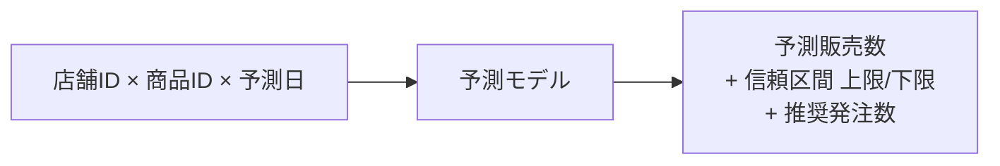

# 課題27: 〇〇株式会社 SageMaker モデル基盤 - 需要予測モデルの構築とデプロイ

**難易度: 🟡 中級**

---

## 1. 分類情報

| 項目 | 内容 |
|------|------|
| 難易度 | 中級 |
| カテゴリ | 機械学習 / SageMaker |
| 処理タイプ | バッチ |
| 使用IaC | CloudFormation |
| 想定所要時間 | 6-8時間 |

---

## 2. ビジネスシナリオ

### 企業プロファイル: 〇〇株式会社

```
┌─────────────────────────────────────────────────────────────────┐
│                   〇〇株式会社                                   │
│                  小売チェーン運営企業                            │
├─────────────────────────────────────────────────────────────────┤
│  設立: 2010年    従業員: 3000名    本社: 大阪                    │
│  事業: コンビニエンスストアチェーン（全国500店舗）              │
│  年商: 800億円    SKU数: 3000品目    1日販売数: 200万個         │
├─────────────────────────────────────────────────────────────────┤
│                                                                  │
│  【現在の課題】                                                  │
│  ┌────────────────────────────────────────────────────────────┐│
│  │                                                              ││
│  │  ┌─────────────────────────────────────────────────────┐    ││
│  │  │  発注業務の問題                                      │    ││
│  │  │  ・各店舗の店長が経験と勘で発注量を決定             │    ││
│  │  │  ・欠品率: 8%（機会損失 月間2億円）                 │    ││
│  │  │  ・廃棄ロス率: 5%（月間4000万円）                   │    ││
│  │  │  ・発注作業時間: 1店舗あたり2時間/日                │    ││
│  │  └─────────────────────────────────────────────────────┘    ││
│  │                                                              ││
│  │  ┌─────────────────────────────────────────────────────┐    ││
│  │  │  データはあるが活用できていない                      │    ││
│  │  │  ・POSデータ: 3年分（10億レコード）                 │    ││
│  │  │  ・気象データ: 連携済み                              │    ││
│  │  │  ・イベント情報: 手動管理                            │    ││
│  │  └─────────────────────────────────────────────────────┘    ││
│  │                                                              ││
│  └────────────────────────────────────────────────────────────┘│
│                                                                  │
│  【目指す姿】                                                    │
│  ┌────────────────────────────────────────────────────────────┐│
│  │                                                              ││
│  │         ┌─────────────────────────────────────┐             ││
│  │         │    AI需要予測システム               │             ││
│  │         │                                     │             ││
│  │         │  ┌───────┐  ┌───────┐  ┌───────┐  │             ││
│  │         │  │  POS  │  │ 気象  │  │ Event │  │             ││
│  │         │  │ Data  │  │ Data  │  │ Data  │  │             ││
│  │         │  └───┬───┘  └───┬───┘  └───┬───┘  │             ││
│  │         │      └──────────┼──────────┘      │             ││
│  │         │                 ▼                  │             ││
│  │         │         ┌─────────────┐           │             ││
│  │         │         │  SageMaker  │           │             ││
│  │         │         │   Model     │           │             ││
│  │         │         └──────┬──────┘           │             ││
│  │         │                ▼                  │             ││
│  │         │    商品×店舗×日 の需要予測        │             ││
│  │         │    → 自動発注推奨                 │             ││
│  │         │                                     │             ││
│  │         └─────────────────────────────────────┘             ││
│  │                                                              ││
│  └────────────────────────────────────────────────────────────┘│
│                                                                  │
└─────────────────────────────────────────────────────────────────┘
```

### ビジネス要件と KPI

```
┌─────────────────────────────────────────────────────────────────┐
│                    プロジェクト KPI                              │
├─────────────────────────────────────────────────────────────────┤
│                                                                  │
│  【予測精度目標】                                                │
│  ┌─────────────────────────────────────────────────────────────┐│
│  │  指標              │ 現状        │ 目標        │ 改善      ││
│  ├────────────────────┼─────────────┼─────────────┼───────────┤│
│  │  MAPE（平均絶対    │ 手動: 25%   │ < 15%       │ 40%↓     ││
│  │  パーセント誤差）  │             │             │           ││
│  │  欠品率            │ 8%          │ < 3%        │ 62%↓     ││
│  │  廃棄ロス率        │ 5%          │ < 2%        │ 60%↓     ││
│  └─────────────────────────────────────────────────────────────┘│
│                                                                  │
│  【ビジネス効果目標】                                            │
│  ┌─────────────────────────────────────────────────────────────┐│
│  │  項目              │ 現状        │ 目標        │ 効果      ││
│  ├────────────────────┼─────────────┼─────────────┼───────────┤│
│  │  機会損失削減      │ 2億円/月    │ 0.8億円/月  │ 1.2億円↓ ││
│  │  廃棄ロス削減      │ 4000万/月   │ 1600万/月   │ 2400万↓  ││
│  │  発注作業時間      │ 2時間/日/店 │ 30分/日/店  │ 75%↓     ││
│  │  年間コスト削減    │ -           │ 約15億円    │ -         ││
│  └─────────────────────────────────────────────────────────────┘│
│                                                                  │
│  【システム要件】                                                │
│  ┌─────────────────────────────────────────────────────────────┐│
│  │  ・推論レイテンシ: < 500ms（バッチ推論は許容）               ││
│  │  ・モデル更新頻度: 週次再学習                                ││
│  │  ・予測対象: 500店舗 × 3000SKU × 7日先                       ││
│  │  ・1日あたり推論回数: 約1050万回（バッチ）                   ││
│  └─────────────────────────────────────────────────────────────┘│
│                                                                  │
└─────────────────────────────────────────────────────────────────┘
```

---

## 3. 学習目標

### 習得スキル

```
┌─────────────────────────────────────────────────────────────────┐
│                       学習目標マップ                             │
├─────────────────────────────────────────────────────────────────┤
│                                                                  │
│  【主要スキル】                                                  │
│                                                                  │
│  ┌─────────────────────────────────────────────────────────────┐│
│  │  1. SageMaker基礎                                           ││
│  │     ├── SageMaker Studio / Notebooks                        ││
│  │     ├── 組み込みアルゴリズム（XGBoost, DeepAR等）           ││
│  │     ├── Training Job / Processing Job                       ││
│  │     └── Model / Endpoint / Batch Transform                  ││
│  └─────────────────────────────────────────────────────────────┘│
│                                                                  │
│  ┌─────────────────────────────────────────────────────────────┐│
│  │  2. モデル開発ライフサイクル                                ││
│  │     ├── データ前処理（SageMaker Processing）                ││
│  │     ├── 特徴量エンジニアリング                              ││
│  │     ├── ハイパーパラメータチューニング                      ││
│  │     └── モデル評価・検証                                    ││
│  └─────────────────────────────────────────────────────────────┘│
│                                                                  │
│  ┌─────────────────────────────────────────────────────────────┐│
│  │  3. モデルデプロイ                                          ││
│  │     ├── リアルタイム推論エンドポイント                      ││
│  │     ├── バッチ変換（Batch Transform）                       ││
│  │     ├── サーバーレス推論                                    ││
│  │     └── マルチモデルエンドポイント                          ││
│  └─────────────────────────────────────────────────────────────┘│
│                                                                  │
│  ┌─────────────────────────────────────────────────────────────┐│
│  │  4. CloudFormationによるML基盤構築                          ││
│  │     ├── SageMaker Domain / Studio                           ││
│  │     ├── S3バケット設計                                      ││
│  │     ├── IAMロール設計                                       ││
│  │     └── VPCネットワーク設計                                 ││
│  └─────────────────────────────────────────────────────────────┘│
│                                                                  │
│  【副次スキル】                                                  │
│  ・時系列予測の基礎知識                                          │
│  ・Feature Storeの活用                                           │
│  ・Model Registry                                                │
│  ・コスト最適化                                                  │
│                                                                  │
└─────────────────────────────────────────────────────────────────┘
```

### GCPとの対応関係

| AWS サービス | GCP 対応サービス | 主な違い |
|-------------|-----------------|---------|
| SageMaker | Vertex AI | 統合ML プラットフォーム |
| SageMaker Studio | Vertex AI Workbench | ノートブック環境 |
| SageMaker Endpoints | Vertex AI Predictions | モデルサービング |
| SageMaker Processing | Dataflow / Dataproc | データ処理 |

---

## 4. 使用するAWSサービス

```
┌─────────────────────────────────────────────────────────────────┐
│                    使用AWSサービス一覧                           │
├─────────────────────────────────────────────────────────────────┤
│                                                                  │
│  【コアサービス】                                                │
│  ┌─────────────────────────────────────────────────────────────┐│
│  │  サービス          │ 用途                    │ 重要度      ││
│  ├────────────────────┼─────────────────────────┼─────────────┤│
│  │  SageMaker         │ ML開発・デプロイ        │ ★★★★★      ││
│  │  S3                │ データ・モデル保存      │ ★★★★★      ││
│  │  CloudFormation    │ インフラ定義            │ ★★★★★      ││
│  │  IAM               │ アクセス制御            │ ★★★★☆      ││
│  └─────────────────────────────────────────────────────────────┘│
│                                                                  │
│  【支援サービス】                                                │
│  ┌─────────────────────────────────────────────────────────────┐│
│  │  サービス          │ 用途                    │ 重要度      ││
│  ├────────────────────┼─────────────────────────┼─────────────┤│
│  │  CloudWatch        │ 監視・ログ              │ ★★★★☆      ││
│  │  EventBridge       │ スケジュール実行        │ ★★★☆☆      ││
│  │  Lambda            │ 推論トリガー            │ ★★★☆☆      ││
│  │  Step Functions    │ ML パイプライン         │ ★★★☆☆      ││
│  │  ECR               │ カスタムコンテナ        │ ★★☆☆☆      ││
│  └─────────────────────────────────────────────────────────────┘│
│                                                                  │
└─────────────────────────────────────────────────────────────────┘
```

---

## 5. 前提条件と事前準備

### 必要な環境

```bash
# AWS CLI バージョン確認
aws --version
# aws-cli/2.x.x 以上

# Python環境
python3 --version
# Python 3.9以上

# 必要なPythonパッケージ
pip install boto3 sagemaker pandas numpy scikit-learn
```

### AWS環境の準備

```bash
# 環境変数設定
export AWS_REGION=ap-northeast-1
export PROJECT_NAME=smartretail
export ENVIRONMENT=dev

# 作業ディレクトリ作成
mkdir -p ~/smartretail-sagemaker/{cfn,notebooks,scripts,data}
cd ~/smartretail-sagemaker
```

### IAMポリシー（必要な権限）

```json
{
  "Version": "2012-10-17",
  "Statement": [
    {
      "Effect": "Allow",
      "Action": [
        "sagemaker:*",
        "s3:*",
        "ecr:*",
        "cloudwatch:*",
        "logs:*",
        "iam:PassRole",
        "iam:CreateServiceLinkedRole",
        "cloudformation:*",
        "ec2:*",
        "kms:*"
      ],
      "Resource": "*"
    }
  ]
}
```

---

## 6. アーキテクチャ設計

### ML基盤全体像


### データフロー設計

#### 入力データ

| データソース | 形式 | 更新頻度 | サイズ |
|-------------|------|---------|--------|
| POSトランザクション | CSV/Parquet | 日次 | 10GB/日 |
| 商品マスタ | CSV | 週次 | 10MB |
| 店舗マスタ | CSV | 月次 | 1MB |
| 気象データ | JSON→CSV | 日次 | 100MB |
| イベントカレンダー | CSV | 週次 | 1MB |

#### 特徴量設計

| カテゴリ | 特徴量例 |
|---------|---------|
| 時間特徴 | 曜日, 月, 祝日フラグ, 給料日フラグ |
| ラグ特徴 | 過去7日/14日/28日の販売数 |
| ローリング統計 | 7日/14日移動平均, 標準偏差 |
| 商品特徴 | カテゴリ, 価格帯, 新商品フラグ |
| 店舗特徴 | 立地タイプ, 面積, 客層 |
| 気象特徴 | 気温, 降水確率, 天気カテゴリ |
| イベント特徴 | 近隣イベント, 店舗イベント |

#### 出力データ



---

## 7. トラブルシューティング演習

### 演習7-1: モデル精度の劣化

```
┌─────────────────────────────────────────────────────────────────┐
│              トラブルシューティング演習 7-1                      │
│                  モデル精度の劣化                                │
├─────────────────────────────────────────────────────────────────┤
│                                                                  │
│  【状況】                                                        │
│  本番稼働後3ヶ月で、予測精度が徐々に低下している。              │
│  MAPEが当初15%だったが、現在は25%まで悪化。                     │
│                                                                  │
│  【観測データ】                                                  │
│  ┌─────────────────────────────────────────────────────────────┐│
│  │  時期        │ MAPE  │ 特記事項                            ││
│  ├─────────────┼───────┼─────────────────────────────────────┤│
│  │  1ヶ月目    │ 15%   │ 正常                                ││
│  │  2ヶ月目    │ 18%   │ 新商品50品追加                      ││
│  │  3ヶ月目    │ 25%   │ 夏季セール開始                      ││
│  └─────────────────────────────────────────────────────────────┘│
│                                                                  │
│  【課題】                                                        │
│  1. 精度劣化の原因を分析してください                             │
│  2. データドリフト検出の仕組みを設計してください                 │
│  3. モデル再学習の自動化を提案してください                       │
│                                                                  │
└─────────────────────────────────────────────────────────────────┘
```

### 演習7-2: 推論エンドポイントのレイテンシ問題

```
┌─────────────────────────────────────────────────────────────────┐
│              トラブルシューティング演習 7-2                      │
│              推論レイテンシの問題                                │
├─────────────────────────────────────────────────────────────────┤
│                                                                  │
│  【状況】                                                        │
│  リアルタイム推論エンドポイントのレイテンシが                    │
│  SLO（500ms）を超えるケースが増加している。                     │
│                                                                  │
│  【メトリクス】                                                  │
│  ┌─────────────────────────────────────────────────────────────┐│
│  │  ・平均レイテンシ: 300ms                                    ││
│  │  ・P99レイテンシ: 1200ms                                    ││
│  │  ・モデル読み込み時間: 800ms                                ││
│  │  ・コールドスタート発生率: 15%                              ││
│  └─────────────────────────────────────────────────────────────┘│
│                                                                  │
│  【課題】                                                        │
│  1. レイテンシ問題の根本原因を特定してください                   │
│  2. コールドスタート対策を提案してください                       │
│  3. Serverless Inferenceの適用を検討してください                 │
│                                                                  │
└─────────────────────────────────────────────────────────────────┘
```

---

## 8. 設計課題

### 設計課題8-1: マルチモデル戦略

```
┌─────────────────────────────────────────────────────────────────┐
│                      設計課題 8-1                                │
│                 マルチモデル戦略                                 │
├─────────────────────────────────────────────────────────────────┤
│                                                                  │
│  【課題】                                                        │
│  商品カテゴリごとに異なるモデルを使い分ける                      │
│  マルチモデル戦略を設計してください。                            │
│                                                                  │
│  【要件】                                                        │
│  ・飲料/食品/日用品/菓子で異なるモデル                          │
│  ・各モデルは独立して更新可能                                    │
│  ・推論時にカテゴリに応じて適切なモデルを選択                    │
│  ・コスト効率の良いエンドポイント設計                            │
│                                                                  │
│  【成果物】                                                      │
│  1. マルチモデルエンドポイントの設計                             │
│  2. モデルルーティングロジック                                   │
│  3. CloudFormationテンプレート                                   │
│                                                                  │
└─────────────────────────────────────────────────────────────────┘
```

### 設計課題8-2: A/Bテスト基盤

```
┌─────────────────────────────────────────────────────────────────┐
│                      設計課題 8-2                                │
│                   A/Bテスト基盤                                  │
├─────────────────────────────────────────────────────────────────┤
│                                                                  │
│  【課題】                                                        │
│  新しいモデルバージョンを安全にデプロイするための                │
│  A/Bテスト基盤を設計してください。                               │
│                                                                  │
│  【要件】                                                        │
│  ・トラフィックの10%を新モデルに振り分け                        │
│  ・モデル間の精度比較を自動化                                    │
│  ・問題発生時の自動ロールバック                                  │
│  ・統計的有意性の判定                                            │
│                                                                  │
│  【成果物】                                                      │
│  1. A/Bテストアーキテクチャ図                                    │
│  2. トラフィック分割設定                                         │
│  3. 評価ダッシュボード設計                                       │
│                                                                  │
└─────────────────────────────────────────────────────────────────┘
```

---

## 9. 発展課題

### 発展課題9-1: Feature Store の活用

```
┌─────────────────────────────────────────────────────────────────┐
│                      発展課題 9-1                               │
│                 Feature Store の活用                             │
├─────────────────────────────────────────────────────────────────┤
│                                                                  │
│  【シナリオ】                                                    │
│  特徴量の管理と再利用を効率化するため、                          │
│  SageMaker Feature Storeを導入したい。                           │
│                                                                  │
│  【技術要件】                                                    │
│  ・オフラインストア（学習用）とオンラインストア（推論用）       │
│  ・特徴量のバージョン管理                                        │
│  ・リアルタイム特徴量取得（<10ms）                              │
│  ・特徴量の共有と再利用                                          │
│                                                                  │
│  【成果物】                                                      │
│  1. Feature Group設計                                            │
│  2. 特徴量パイプライン                                           │
│  3. CloudFormationテンプレート                                   │
│                                                                  │
└─────────────────────────────────────────────────────────────────┘
```

---

## 10. 学習のまとめ

### 学習チェックリスト

```
┌─────────────────────────────────────────────────────────────────┐
│                     学習チェックリスト                           │
├─────────────────────────────────────────────────────────────────┤
│                                                                  │
│  【SageMaker基礎】                                               │
│  □ SageMaker Studioの環境構築ができる                           │
│  □ Processing Jobでデータ前処理ができる                         │
│  □ Training Jobでモデル訓練ができる                             │
│  □ Batch Transformでバッチ推論ができる                          │
│                                                                  │
│  【モデル開発】                                                  │
│  □ 組み込みアルゴリズム（XGBoost等）を使用できる                │
│  □ ハイパーパラメータチューニングができる                       │
│  □ モデル評価指標を適切に選択できる                             │
│  □ Model Registryを活用できる                                   │
│                                                                  │
│  【デプロイ】                                                    │
│  □ リアルタイムエンドポイントを構築できる                       │
│  □ Auto Scalingを設定できる                                     │
│  □ Data Captureを設定できる                                     │
│  □ A/Bテスト環境を構築できる                                    │
│                                                                  │
│  【CloudFormation】                                              │
│  □ SageMaker Domainを構築できる                                 │
│  □ IAMロールを適切に設計できる                                  │
│  □ VPCエンドポイントを設定できる                                │
│  □ エンドポイントをIaCで管理できる                              │
│                                                                  │
└─────────────────────────────────────────────────────────────────┘
```

---

## 11. コスト見積もり

### 想定コスト（月額）

```
┌─────────────────────────────────────────────────────────────────┐
│                      コスト見積もり                              │
├─────────────────────────────────────────────────────────────────┤
│                                                                  │
│  【開発環境】                                                    │
│  ┌─────────────────────────────────────────────────────────────┐│
│  │  項目                    │ 数量            │ 月額（USD）    ││
│  ├──────────────────────────┼─────────────────┼────────────────┤│
│  │  SageMaker Studio        │ 40時間/月       │ $12            ││
│  │  Training Job (m5.xl)    │ 10時間/月       │ $2.30          ││
│  │  Processing Job          │ 5時間/月        │ $1.15          ││
│  │  S3 Storage              │ 50GB            │ $1.15          ││
│  ├──────────────────────────┼─────────────────┼────────────────┤│
│  │  小計                    │                 │ 約 $17         ││
│  └─────────────────────────────────────────────────────────────┘│
│                                                                  │
│  【本番環境想定】                                                │
│  ┌─────────────────────────────────────────────────────────────┐│
│  │  項目                    │ 数量            │ 月額（USD）    ││
│  ├──────────────────────────┼─────────────────┼────────────────┤│
│  │  Endpoint (ml.m5.large)  │ 2台 × 24h       │ $210           ││
│  │  Batch Transform (週次)  │ 4回 × 2時間     │ $18            ││
│  │  Training Job (週次)     │ 4回 × 3時間     │ $28            ││
│  │  S3 Storage              │ 500GB           │ $11.50         ││
│  │  CloudWatch              │ ログ・メトリクス│ $15            ││
│  ├──────────────────────────┼─────────────────┼────────────────┤│
│  │  小計                    │                 │ 約 $283        ││
│  │                          │                 │ (約 ¥42,000)   ││
│  └─────────────────────────────────────────────────────────────┘│
│                                                                  │
│  【コスト最適化のポイント】                                      │
│  ・Spot Instancesの活用（Training: 最大90%削減）                │
│  ・Serverless Inferenceの検討（低トラフィック時）                │
│  ・適切なインスタンスサイズ選定                                  │
│  ・不要なリソースの自動停止                                      │
│                                                                  │
└─────────────────────────────────────────────────────────────────┘
```

---

## リソースのクリーンアップ

```bash
# エンドポイント削除
aws sagemaker delete-endpoint \
  --endpoint-name smartretail-demand-forecast-dev

aws sagemaker delete-endpoint-config \
  --endpoint-config-name smartretail-demand-forecast-config-dev

aws sagemaker delete-model \
  --model-name smartretail-demand-forecast-dev

# CloudFormationスタック削除
aws cloudformation delete-stack --stack-name smartretail-sagemaker-domain-dev
aws cloudformation delete-stack --stack-name smartretail-storage-iam-dev
aws cloudformation delete-stack --stack-name smartretail-network-dev

# S3バケット削除（中身がある場合は先に空にする）
aws s3 rb s3://smartretail-ml-data-dev-${ACCOUNT_ID} --force
aws s3 rb s3://smartretail-ml-models-dev-${ACCOUNT_ID} --force

echo "Cleanup completed!"
```

---

**次の課題**: [課題37: 〇〇株式会社 MLOpsパイプライン](exercise-37.md)

**前の課題**: [課題35: ShopNow Chaos Engineering](exercise-35.md)
