# 課題29: センサーデータ集計・異常検知レポート自動生成システム構築

**難易度: 🟡 中級**

---

## 1. 分類情報

| 項目 | 内容 |
|------|------|
| 難易度 | 中級 |
| カテゴリ | バッチ処理 / データ基盤 / IoT / 農業テック |
| 処理タイプ | バッチ / ETL |
| 使用IaC | Terraform |
| 所要時間 | 7〜9時間 |

---

## 2. ビジネスシナリオ

### 企業プロファイル: 〇〇株式会社

| 項目 | 内容 |
|------|------|
| **企業名** | 〇〇株式会社 |
| **業種** | アグリテック（スマート農業） |

〇〇株式会社は、スマート農業ソリューションを提供するアグリテックスタートアップです。

| 項目 | 内容 |
|------|------|
| 設立 | 2018年 |
| 従業員数 | 45名 |
| 契約農家数 | 500件 |
| センサー設置箇所 | 全国1,000箇所 |
| 監視対象作物 | 米、野菜、果樹 |
| 日次データ量 | 約10GB |
| 年間売上 | 5億円 |
| サービス内容 | 環境監視、生育予測、収穫時期最適化 |

### 現状の課題

全国1,000箇所に設置したセンサーから毎日大量のデータが送られてきますが、データの集計・分析が追いつかず、異常検知が遅れたり、農家への有益なレポートを提供できていません。

### 数値で示された問題

| 指標 | 現状 | 目標 |
|------|------|------|
| 日次データ量 | 10GB | 変わらず |
| センサーポイント | 1,000箇所 | 拡大予定（2,000箇所） |
| データ収集間隔 | 5分 | 変わらず |
| 日次レコード数 | 約1,000万件 | - |
| データ分析担当 | 3名 | 1名（監視のみ） |
| 異常検知遅延 | 6時間以上 | 1時間以内 |
| 日次レポート配信 | 手動（翌日夕方） | 自動（翌日朝9時） |

### センサーデータの内訳

| センサー種別 | 測定項目 | 収集頻度 | 異常検知対象 |
|--------------|----------|----------|--------------|
| 気象センサー | 気温、湿度、降水量、日照 | 5分 | 霜・高温警報 |
| 土壌センサー | 土壌水分、pH、EC（電気伝導度） | 10分 | 乾燥・過湿 |
| 環境センサー | CO2濃度、風速 | 15分 | 換気異常 |
| 生育モニター | 葉色、茎径 | 1時間 | 生育不良 |

### 解決したいこと

1. 日次10GBのセンサーデータを効率的にETL処理
2. 異常値の自動検知とアラート通知
3. 農家ごとの日次レポート自動生成
4. 過去データとの比較分析（前年同期比等）
5. スケーラブルなデータ基盤の構築

### 成功指標（KPI）

| KPI | 現状 | 目標 | 達成期限 |
|-----|------|------|----------|
| ETL処理時間 | 6時間 | 1時間以内 | 1ヶ月後 |
| 異常検知遅延 | 6時間 | 1時間以内 | 1ヶ月後 |
| レポート配信 | 翌日夕方 | 翌日朝9時 | 1ヶ月後 |
| データ分析工数 | 3名×8時間/日 | 1名×2時間/日 | 2ヶ月後 |
| スケーラビリティ | 1,000箇所 | 5,000箇所対応可 | 3ヶ月後 |

---

## 学習目標

この演習で習得できるスキル：

### 技術的な学習ポイント

1. **AWS Step Functionsによる複雑なワークフロー**
   - 並列処理（Parallel/Map state）
   - 条件分岐（Choice state）
   - エラーハンドリング

2. **AWS Glueによるデータ処理**
   - Glue Jobの作成と実行
   - データカタログの活用
   - パーティショニング戦略

3. **Amazon Athenaによるサーバーレス分析**
   - SQLクエリ最適化
   - パーティション pruning
   - CTAS（Create Table As Select）

4. **データレイクアーキテクチャ**
   - Raw/Processed/Curated 層
   - Parquet形式への変換
   - データライフサイクル管理

### 実務で活かせる知識

- 大規模データのETLパイプライン設計
- 時系列データの分析パターン
- IoTデータ基盤の構築

---

## 3. 使用するAWSサービス

### メインサービス

| サービス | 役割 | 選定理由 |
|----------|------|----------|
| AWS Step Functions | ワークフローオーケストレーション | 複雑なETL制御 |
| AWS Glue | データ変換・ETL | サーバーレスETL |
| Amazon Athena | SQLクエリ分析 | サーバーレス分析 |
| Amazon S3 | データレイク | 大容量、低コスト |
| AWS Lambda | 軽量処理・通知 | イベント駆動 |

### 補助サービス

| サービス | 役割 |
|----------|------|
| Amazon SNS | 異常アラート通知 |
| Amazon SES | レポートメール配信 |
| Amazon CloudWatch | 監視・ログ |
| Amazon EventBridge | スケジュール実行 |
| AWS Glue Data Catalog | メタデータ管理 |

---

## 4. 前提条件

### 必要な事前知識

- AWSの基本操作（S3, Lambda）
- SQLの基礎〜中級
- Pythonの基礎
- ETLの基本概念

### 準備するもの

1. **AWSアカウント**
   - Glue, Athenaへのアクセス権限
   - 適切なIAM権限

2. **開発環境**
   - Terraform v1.5以上
   - AWS CLI v2
   - Python 3.9以上

3. **テストデータ**
   - サンプルセンサーデータ（CSV/JSON）

---

## 5. アーキテクチャ設計

### システム全体構成

```mermaid
architecture-beta
    group aws(cloud)[AWS Cloud]

    group ingestion(server)[Data Ingestion] in aws
    service iot_sensor(internet)[IoT Sensors] in ingestion
    service iot_core(server)[IoT Core] in ingestion
    service s3_raw(logos:aws-s3)[S3 Raw Data] in ingestion

    group orchestration(server)[Orchestration] in aws
    service eventbridge(server)[EventBridge] in orchestration
    service sfn(logos:aws-step-functions)[Step Functions] in orchestration

    group processing(server)[Processing Pipeline] in aws
    service glue(server)[Glue ETL] in processing
    service athena_anomaly(server)[Athena Anomaly] in processing
    service lambda_alert(logos:aws-lambda)[Lambda Alert] in processing
    service athena_stats(server)[Athena Stats] in processing
    service lambda_report(logos:aws-lambda)[Lambda Report] in processing
    service lambda_send(logos:aws-lambda)[Lambda Send] in processing

    group datalake(server)[Data Lake] in aws
    service s3_processed(logos:aws-s3)[S3 Processed] in datalake
    service s3_curated(logos:aws-s3)[S3 Curated] in datalake
    service s3_reports(logos:aws-s3)[S3 Reports] in datalake

    group notification(server)[Notification] in aws
    service sns(logos:aws-sns)[SNS Alert] in notification
    service ses(server)[SES Email] in notification

    iot_sensor:R --> L:iot_core
    iot_core:R --> L:s3_raw
    s3_raw:B --> T:eventbridge
    eventbridge:R --> L:sfn
    sfn:B --> T:glue
    glue:R --> L:athena_anomaly
    athena_anomaly:R --> L:lambda_alert
    lambda_alert:B --> T:athena_stats
    athena_stats:R --> L:lambda_report
    lambda_report:R --> L:lambda_send
    glue:B --> T:s3_processed
    athena_stats:B --> T:s3_curated
    lambda_report:B --> T:s3_reports
    lambda_alert:B --> T:sns
    lambda_send:B --> T:ses
```



| コンポーネント | 役割 |
|----------------|------|
| **IoT Sensors** | IoTセンサー（データ収集元） |
| **IoT Core** | IoTデータの受信 |
| **S3 Raw Data** | 生データの保存 |
| **EventBridge** | 日次スケジュール（AM 1:00） |
| **Step Functions** | ETLワークフロー管理 |
| **Glue ETL** | データ変換処理 |
| **Athena Anomaly** | 異常検知クエリ |
| **Lambda Alert** | アラート送信処理 |
| **Athena Stats** | 日次集計クエリ |
| **Lambda Report** | レポート生成 |
| **Lambda Send** | レポート配信 |
| **S3 Processed/Curated/Reports** | 各段階のデータ保存 |
| **SNS Alert / SES Email** | 通知配信 |

### 処理フロー

1. **データ収集**: IoT Coreからのデータが5分間隔でS3 Rawに蓄積
2. **ETL起動**: EventBridgeが毎日AM1時にStep Functionsを起動
3. **データ変換**: GlueがRaw（JSON）→ Processed（Parquet）に変換
4. **異常検知**: Athenaで閾値超過データを抽出
5. **アラート**: 異常データがあれば農家にSNS通知
6. **集計**: Athenaで日次統計を計算
7. **レポート生成**: Lambdaでレポート作成
8. **配信**: SESで農家にメール送信

---

## 6. トラブルシューティング演習

### 問題1: Glue Jobが失敗

**症状:**
```
An error occurred while calling o87.pyWriteDynamicFrame
OutOfMemoryError: Java heap space
```

**ヒント:**
1. ワーカー数・タイプを確認
2. データ量に対して適切か
3. パーティションの絞り込みができているか

**解決方法:**
```hcl
# ワーカー増強
resource "aws_glue_job" "transform_sensor_data" {
  # ...
  number_of_workers = 5   # 2から5に
  worker_type       = "G.2X"  # G.1XからG.2Xに
}
```

### 問題2: Athenaクエリが遅い

**症状:**
```
クエリに5分以上かかる
スキャンデータ量が大きい
```

**ヒント:**
1. パーティション指定ができているか確認
2. Parquet形式になっているか確認
3. 必要なカラムのみSELECTしているか

**解決方法:**
```sql
-- パーティションを明示的に指定
WHERE year = '2024' AND month = '01' AND day = '15'

-- 必要なカラムのみ選択
SELECT sensor_id, temperature, humidity
FROM processed_sensor_data
-- SELECT * は避ける
```

### 問題3: Step Functionsがタイムアウト

**症状:**
```
States.Timeout エラー
Glue Jobの完了を待てない
```

**ヒント:**
1. Glue Job実行時間を確認
2. Step Functions Standardのタイムアウト設定
3. 同期呼び出し（.sync）を確認

**解決方法:**
```json
// タイムアウト延長
{
  "Type": "Task",
  "Resource": "arn:aws:states:::glue:startJobRun.sync",
  "TimeoutSeconds": 3600,  // 1時間に設定
  // ...
}
```

---

## 7. 設計課題

### 1. データレイクのレイヤー設計

**考察ポイント:**
- Raw → Processed → Curated の3層構造
- 各層の目的と保持期間
- 形式の選択（JSON → Parquet）

### 2. パーティショニング戦略

**考察ポイント:**
- 年/月/日 でのパーティショニング
- クエリパターンとの整合性
- パーティション数の管理

### 3. ETLツールの選択

**考察ポイント:**
- Glue vs Lambda vs EMR
- データ量とコストのバランス
- 開発生産性

### 4. リアルタイム vs バッチ

**考察ポイント:**
- 異常検知をリアルタイムにする必要性
- Kinesis + Lambda の検討
- コストと緊急性のトレードオフ

### 5. コスト最適化

**考察ポイント:**
- S3ライフサイクルポリシー
- Glue DPU の最適化
- Athena のスキャン量削減

---

## 8. 発展課題

### 1. リアルタイム異常検知
- Kinesis Data Streams + Lambda
- 5分以内の検知
- 即時アラート

### 2. 機械学習による予測
- SageMaker連携
- 収穫時期予測
- 病害予測

### 3. ダッシュボード構築
- QuickSight連携
- リアルタイムモニタリング
- 農家向けポータル

### 4. データ品質管理
- Glue Data Quality
- 自動データ検証
- 品質スコアリング

### 5. マルチリージョン対応
- 災害対策
- S3レプリケーション
- グローバル展開

---

## 9. コスト見積もり

### 月額概算コスト（日次10GB処理想定）

| サービス | 内訳 | 月額コスト |
|----------|------|------------|
| AWS Glue | 2 DPU × 30分 × 30日 | $13 |
| Amazon Athena | 300GB/月スキャン | $15 |
| Amazon S3 | 300GB（Raw+Processed）| $7 |
| AWS Lambda | 処理関数実行 | $5 |
| Step Functions | 30ワークフロー | $0.75 |
| Amazon SNS | 通知 | $1 |
| Amazon SES | メール配信 | $1 |
| CloudWatch | ログ | $5 |
| **合計** | | **約$48（約7,200円）** |

### コスト削減のポイント

1. **Athena最適化**
   - Parquet + Snappy圧縮
   - パーティション pruning
   - → スキャン量70%削減

2. **S3ライフサイクル**
   - Raw: 30日後Glacier
   - Processed: 90日後IA
   - → ストレージコスト50%削減

3. **Glue Job最適化**
   - Auto Scaling
   - ジョブブックマーク（増分処理）
   - → 処理時間50%削減

4. **スポットインスタンス**
   - Glue Flex実行
   - → Glueコスト30%削減

### リソース削除手順

```bash
# Step Functions
aws stepfunctions delete-state-machine --state-machine-arn arn:aws:states:...

# Glue
aws glue delete-job --job-name sensor-app-transform-sensor-data
aws glue delete-table --database-name sensor-app_sensor_data --name raw_sensor_data
aws glue delete-table --database-name sensor-app_sensor_data --name processed_sensor_data
aws glue delete-database --name sensor-app_sensor_data

# Lambda
aws lambda delete-function --function-name sensor-app-anomaly-alert
aws lambda delete-function --function-name sensor-app-generate-report
aws lambda delete-function --function-name sensor-app-send-report

# S3（データ削除後）
aws s3 rm s3://sensor-app-data-lake-dev-${ACCOUNT_ID} --recursive
aws s3 rb s3://sensor-app-data-lake-dev-${ACCOUNT_ID}

# SNS/SES
aws sns delete-topic --topic-arn arn:aws:sns:...

# Terraform
terraform destroy -auto-approve
```

---

## 10. 学習のまとめ

### 1. データレイクアーキテクチャの基本
Raw → Processed → Curated の3層構造で、データの鮮度・品質・用途に応じた管理を行う。各層で適切な形式（JSON, Parquet）を選択。

### 2. Glueによるサーバーレス ETL
Apache Spark ベースの ETL をサーバーレスで実行。データカタログによるメタデータ管理、ジョブブックマークによる増分処理が特徴。

### 3. Athenaによるサーバーレス分析
S3上のデータに直接SQLを実行。Parquet形式とパーティショニングによりスキャン量を削減し、コストと性能を最適化。

### 4. Step Functionsによる複雑なワークフロー
Parallel state で並列処理、Choice state で条件分岐を実装。Glueの同期呼び出し（.sync）でジョブ完了を待機。

### 5. IoT/農業データの特性理解
時系列データの特性、異常値の定義、季節変動を考慮した分析が重要。ドメイン知識とデータエンジニアリングの両方が必要。
