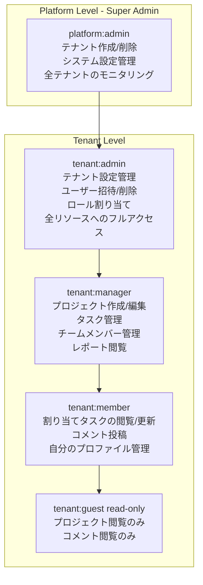
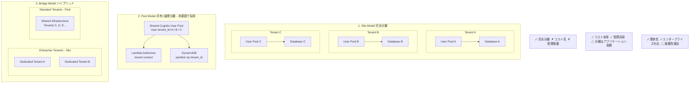

# 課題32: TeamHub - マルチテナントSaaS認証基盤

**難易度: 🟡 中級**

---

## 1. 分類情報

| 項目 | 内容 |
|------|------|
| 難易度 | 中級 |
| カテゴリ | 認証・認可 / セキュリティ |
| 処理タイプ | リアルタイム |
| 使用IaC | CDK |
| 想定所要時間 | 5-6時間 |

---

## 2. シナリオ

BtoB SaaS「〇〇株式会社」のマルチテナント認証・認可システムを AWS CDK で構築します。テナント分離、ロールベースアクセス制御（RBAC）、テナント管理機能を実装し、セキュアなマルチテナントSaaSアーキテクチャを学びます。

### 企業プロファイル

| 項目 | 内容 |
|------|------|
| 企業名 | 〇〇株式会社 |
| 業種 | BtoB SaaS（プロジェクト管理ツール） |
| テナント数 | 100社 |
| 総ユーザー数 | 5,000名 |
| テナント規模 | 小規模（10名以下）〜大規模（500名） |
| 課題 | テナント間のデータ分離とセキュリティ確保 |

### 達成目標（white hat KPI）

| KPI | 目標値 | 測定方法 |
|-----|--------|----------|
| テナント分離 | 100% | クロステナントアクセス試行のブロック率 |
| 認証成功率 | 99.9% | 正当なリクエストの認証成功率 |
| 認可レイテンシ | < 50ms | カスタム認可処理の平均応答時間 |
| テナントオンボーディング | < 5分 | 新規テナント作成の所要時間 |

---

## 2. アーキテクチャ図


**Custom Attributes:** tenant_id (必須), tenant_role (admin/manager/member), tenant_tier (free/standard/enterprise)

**Lambda Authorizer:** JWT検証、テナントコンテキスト抽出、RBAC権限チェック、リソースレベル認可

**DynamoDB Single Table Design:** PK: TENANT#X, SK: PROJECT#/TASK# (Tenant Partition)

### RBACモデル



---

## 3. 前提知識

### 3.1 マルチテナントアーキテクチャ

GCPでのマルチテナント経験がある方向けの比較：

| 観点 | GCP | AWS |
|------|-----|-----|
| 認証基盤 | Firebase Authentication | Cognito User Pool |
| カスタムクレーム | Custom Claims | Custom Attributes + Pre Token Generation |
| テナント分離 | Identity Platform Multi-tenancy | Cognito + Custom Lambda |
| RBAC | Custom Claims based | Groups + Custom Attributes |

### 3.2 テナント分離パターン



---

## 4. 構築手順

### 4.1 CDKプロジェクトの初期化

```bash
# プロジェクト作成
mkdir teamhub-multitenant-auth && cd teamhub-multitenant-auth
npx cdk init app --language typescript

# 依存パッケージのインストール
npm install @aws-cdk/aws-cognito-identitypool-alpha
```

### 4.2 テナントメタデータテーブル定義

```typescript
// lib/constructs/tenant-table.ts
import * as cdk from 'aws-cdk-lib';
import * as dynamodb from 'aws-cdk-lib/aws-dynamodb';
import { Construct } from 'constructs';

export interface TenantTableProps {
  tableName?: string;
}

export class TenantTable extends Construct {
  public readonly table: dynamodb.Table;

  constructor(scope: Construct, id: string, props: TenantTableProps = {}) {
    super(scope, id);

    this.table = new dynamodb.Table(this, 'TenantMetadataTable', {
      tableName: props.tableName || 'teamhub-tenants',
      partitionKey: {
        name: 'PK',
        type: dynamodb.AttributeType.STRING,
      },
      sortKey: {
        name: 'SK',
        type: dynamodb.AttributeType.STRING,
      },
      billingMode: dynamodb.BillingMode.PAY_PER_REQUEST,
      pointInTimeRecovery: true,
      removalPolicy: cdk.RemovalPolicy.RETAIN,
    });

    // テナントIDでの検索用GSI
    this.table.addGlobalSecondaryIndex({
      indexName: 'GSI1',
      partitionKey: {
        name: 'GSI1PK',
        type: dynamodb.AttributeType.STRING,
      },
      sortKey: {
        name: 'GSI1SK',
        type: dynamodb.AttributeType.STRING,
      },
    });

    // ユーザーメールでの検索用GSI
    this.table.addGlobalSecondaryIndex({
      indexName: 'EmailIndex',
      partitionKey: {
        name: 'email',
        type: dynamodb.AttributeType.STRING,
      },
    });
  }
}
```

### 4.3 Cognito User Pool構築

```typescript
// lib/constructs/auth-stack.ts
import * as cdk from 'aws-cdk-lib';
import * as cognito from 'aws-cdk-lib/aws-cognito';
import * as lambda from 'aws-cdk-lib/aws-lambda';
import * as nodejs from 'aws-cdk-lib/aws-lambda-nodejs';
import * as dynamodb from 'aws-cdk-lib/aws-dynamodb';
import { Construct } from 'constructs';
import * as path from 'path';

export interface MultiTenantAuthProps {
  tenantTable: dynamodb.Table;
}

export class MultiTenantAuth extends Construct {
  public readonly userPool: cognito.UserPool;
  public readonly userPoolClient: cognito.UserPoolClient;
  public readonly userPoolDomain: cognito.UserPoolDomain;

  constructor(scope: Construct, id: string, props: MultiTenantAuthProps) {
    super(scope, id);

    // Pre-SignUp Lambda Trigger
    const preSignUpTrigger = new nodejs.NodejsFunction(this, 'PreSignUpTrigger', {
      entry: path.join(__dirname, '../lambda/triggers/pre-signup.ts'),
      handler: 'handler',
      runtime: lambda.Runtime.NODEJS_20_X,
      environment: {
        TENANT_TABLE_NAME: props.tenantTable.tableName,
      },
      timeout: cdk.Duration.seconds(10),
    });
    props.tenantTable.grantReadData(preSignUpTrigger);

    // Post-Authentication Lambda Trigger
    const postAuthTrigger = new nodejs.NodejsFunction(this, 'PostAuthTrigger', {
      entry: path.join(__dirname, '../lambda/triggers/post-authentication.ts'),
      handler: 'handler',
      runtime: lambda.Runtime.NODEJS_20_X,
      environment: {
        TENANT_TABLE_NAME: props.tenantTable.tableName,
      },
      timeout: cdk.Duration.seconds(10),
    });
    props.tenantTable.grantReadWriteData(postAuthTrigger);

    // Pre-Token Generation Lambda Trigger
    const preTokenGenTrigger = new nodejs.NodejsFunction(this, 'PreTokenGenTrigger', {
      entry: path.join(__dirname, '../lambda/triggers/pre-token-generation.ts'),
      handler: 'handler',
      runtime: lambda.Runtime.NODEJS_20_X,
      environment: {
        TENANT_TABLE_NAME: props.tenantTable.tableName,
      },
      timeout: cdk.Duration.seconds(10),
    });
    props.tenantTable.grantReadData(preTokenGenTrigger);

    // Cognito User Pool
    this.userPool = new cognito.UserPool(this, 'TeamHubUserPool', {
      userPoolName: 'teamhub-users',
      selfSignUpEnabled: false, // 管理者のみがユーザー作成可能
      signInAliases: {
        email: true,
      },
      standardAttributes: {
        email: {
          required: true,
          mutable: false,
        },
        fullname: {
          required: true,
          mutable: true,
        },
      },
      customAttributes: {
        tenant_id: new cognito.StringAttribute({
          mutable: false,
          minLen: 1,
          maxLen: 50,
        }),
        tenant_role: new cognito.StringAttribute({
          mutable: true,
          minLen: 1,
          maxLen: 20,
        }),
        tenant_tier: new cognito.StringAttribute({
          mutable: true,
          minLen: 1,
          maxLen: 20,
        }),
      },
      passwordPolicy: {
        minLength: 12,
        requireLowercase: true,
        requireUppercase: true,
        requireDigits: true,
        requireSymbols: true,
        tempPasswordValidity: cdk.Duration.days(7),
      },
      accountRecovery: cognito.AccountRecovery.EMAIL_ONLY,
      mfa: cognito.Mfa.OPTIONAL,
      mfaSecondFactor: {
        sms: false,
        otp: true,
      },
      lambdaTriggers: {
        preSignUp: preSignUpTrigger,
        postAuthentication: postAuthTrigger,
        preTokenGeneration: preTokenGenTrigger,
      },
      removalPolicy: cdk.RemovalPolicy.RETAIN,
    });

    // User Pool Domain
    this.userPoolDomain = this.userPool.addDomain('TeamHubDomain', {
      cognitoDomain: {
        domainPrefix: `teamhub-${cdk.Aws.ACCOUNT_ID}`,
      },
    });

    // User Pool Client
    this.userPoolClient = this.userPool.addClient('TeamHubWebClient', {
      userPoolClientName: 'teamhub-web',
      generateSecret: false,
      authFlows: {
        userPassword: true,
        userSrp: true,
        custom: true,
      },
      oAuth: {
        flows: {
          authorizationCodeGrant: true,
          implicitCodeGrant: false,
        },
        scopes: [
          cognito.OAuthScope.EMAIL,
          cognito.OAuthScope.OPENID,
          cognito.OAuthScope.PROFILE,
        ],
        callbackUrls: [
          'http://localhost:3000/callback',
          'https://app.teamhub.example.com/callback',
        ],
        logoutUrls: [
          'http://localhost:3000',
          'https://app.teamhub.example.com',
        ],
      },
      accessTokenValidity: cdk.Duration.hours(1),
      idTokenValidity: cdk.Duration.hours(1),
      refreshTokenValidity: cdk.Duration.days(30),
      preventUserExistenceErrors: true,
    });

    // Cognito Groups for RBAC
    new cognito.CfnUserPoolGroup(this, 'PlatformAdminGroup', {
      userPoolId: this.userPool.userPoolId,
      groupName: 'platform-admins',
      description: 'Platform administrators with full system access',
      precedence: 0,
    });

    new cognito.CfnUserPoolGroup(this, 'TenantAdminGroup', {
      userPoolId: this.userPool.userPoolId,
      groupName: 'tenant-admins',
      description: 'Tenant administrators',
      precedence: 10,
    });

    new cognito.CfnUserPoolGroup(this, 'TenantManagerGroup', {
      userPoolId: this.userPool.userPoolId,
      groupName: 'tenant-managers',
      description: 'Tenant managers',
      precedence: 20,
    });

    new cognito.CfnUserPoolGroup(this, 'TenantMemberGroup', {
      userPoolId: this.userPool.userPoolId,
      groupName: 'tenant-members',
      description: 'Tenant members',
      precedence: 30,
    });
  }
}
```

### 4.4 Lambda Triggers実装

```typescript
// lib/lambda/triggers/pre-signup.ts
import { PreSignUpTriggerEvent, PreSignUpTriggerHandler } from 'aws-lambda';
import { DynamoDBClient, GetItemCommand } from '@aws-sdk/client-dynamodb';

const dynamodb = new DynamoDBClient({});
const TABLE_NAME = process.env.TENANT_TABLE_NAME!;

export const handler: PreSignUpTriggerHandler = async (event: PreSignUpTriggerEvent) => {
  console.log('PreSignUp Event:', JSON.stringify(event, null, 2));

  const tenantId = event.request.userAttributes['custom:tenant_id'];

  if (!tenantId) {
    throw new Error('tenant_id is required');
  }

  // テナントの存在確認
  const tenantResult = await dynamodb.send(new GetItemCommand({
    TableName: TABLE_NAME,
    Key: {
      PK: { S: `TENANT#${tenantId}` },
      SK: { S: 'METADATA' },
    },
  }));

  if (!tenantResult.Item) {
    throw new Error(`Tenant ${tenantId} does not exist`);
  }

  // テナントがアクティブかどうか確認
  const status = tenantResult.Item.status?.S;
  if (status !== 'active') {
    throw new Error(`Tenant ${tenantId} is not active`);
  }

  // ユーザー数上限チェック
  const maxUsers = parseInt(tenantResult.Item.maxUsers?.N || '50', 10);
  const currentUsers = parseInt(tenantResult.Item.currentUsers?.N || '0', 10);

  if (currentUsers >= maxUsers) {
    throw new Error(`Tenant ${tenantId} has reached the maximum number of users (${maxUsers})`);
  }

  // 自動確認（管理者が作成したユーザーは確認済みとする）
  event.response.autoConfirmUser = true;
  event.response.autoVerifyEmail = true;

  return event;
};
```

```typescript
// lib/lambda/triggers/post-authentication.ts
import { PostAuthenticationTriggerEvent, PostAuthenticationTriggerHandler } from 'aws-lambda';
import { DynamoDBClient, UpdateItemCommand, PutItemCommand } from '@aws-sdk/client-dynamodb';

const dynamodb = new DynamoDBClient({});
const TABLE_NAME = process.env.TENANT_TABLE_NAME!;

export const handler: PostAuthenticationTriggerHandler = async (event: PostAuthenticationTriggerEvent) => {
  console.log('PostAuthentication Event:', JSON.stringify(event, null, 2));

  const { sub, email } = event.request.userAttributes;
  const tenantId = event.request.userAttributes['custom:tenant_id'];
  const now = new Date().toISOString();

  try {
    // ログイン履歴の記録
    await dynamodb.send(new PutItemCommand({
      TableName: TABLE_NAME,
      Item: {
        PK: { S: `TENANT#${tenantId}#USER#${sub}` },
        SK: { S: `LOGIN#${now}` },
        email: { S: email },
        timestamp: { S: now },
        sourceIp: { S: event.request.userAttributes['custom:source_ip'] || 'unknown' },
        ttl: { N: String(Math.floor(Date.now() / 1000) + 90 * 24 * 60 * 60) }, // 90日後に削除
      },
    }));

    // 最終ログイン時刻の更新
    await dynamodb.send(new UpdateItemCommand({
      TableName: TABLE_NAME,
      Key: {
        PK: { S: `TENANT#${tenantId}#USER#${sub}` },
        SK: { S: 'PROFILE' },
      },
      UpdateExpression: 'SET lastLoginAt = :now, loginCount = if_not_exists(loginCount, :zero) + :one',
      ExpressionAttributeValues: {
        ':now': { S: now },
        ':zero': { N: '0' },
        ':one': { N: '1' },
      },
    }));

  } catch (error) {
    console.error('Failed to record login history:', error);
    // ログイン履歴の記録失敗は認証をブロックしない
  }

  return event;
};
```

```typescript
// lib/lambda/triggers/pre-token-generation.ts
import { PreTokenGenerationTriggerEvent, PreTokenGenerationTriggerHandler } from 'aws-lambda';
import { DynamoDBClient, GetItemCommand } from '@aws-sdk/client-dynamodb';

const dynamodb = new DynamoDBClient({});
const TABLE_NAME = process.env.TENANT_TABLE_NAME!;

// ロールごとの権限定義
const ROLE_PERMISSIONS: Record<string, string[]> = {
  'admin': [
    'tenant:manage',
    'users:manage',
    'projects:*',
    'tasks:*',
    'reports:*',
  ],
  'manager': [
    'projects:create',
    'projects:read',
    'projects:update',
    'tasks:*',
    'reports:read',
  ],
  'member': [
    'projects:read',
    'tasks:read',
    'tasks:update',
  ],
  'guest': [
    'projects:read',
    'tasks:read',
  ],
};

export const handler: PreTokenGenerationTriggerHandler = async (event: PreTokenGenerationTriggerEvent) => {
  console.log('PreTokenGeneration Event:', JSON.stringify(event, null, 2));

  const { sub } = event.request.userAttributes;
  const tenantId = event.request.userAttributes['custom:tenant_id'];
  const tenantRole = event.request.userAttributes['custom:tenant_role'] || 'member';

  // テナント情報の取得
  const tenantResult = await dynamodb.send(new GetItemCommand({
    TableName: TABLE_NAME,
    Key: {
      PK: { S: `TENANT#${tenantId}` },
      SK: { S: 'METADATA' },
    },
  }));

  const tenantTier = tenantResult.Item?.tier?.S || 'free';
  const permissions = ROLE_PERMISSIONS[tenantRole] || ROLE_PERMISSIONS['member'];

  // トークンにカスタムクレームを追加
  event.response = {
    claimsOverrideDetails: {
      claimsToAddOrOverride: {
        tenant_id: tenantId,
        tenant_role: tenantRole,
        tenant_tier: tenantTier,
        permissions: JSON.stringify(permissions),
      },
    },
  };

  return event;
};
```

### 4.5 Lambda Authorizer実装

```typescript
// lib/constructs/api-authorizer.ts
import * as cdk from 'aws-cdk-lib';
import * as lambda from 'aws-cdk-lib/aws-lambda';
import * as nodejs from 'aws-cdk-lib/aws-lambda-nodejs';
import * as apigateway from 'aws-cdk-lib/aws-apigateway';
import * as cognito from 'aws-cdk-lib/aws-cognito';
import { Construct } from 'constructs';
import * as path from 'path';

export interface TenantAuthorizerProps {
  userPool: cognito.UserPool;
}

export class TenantAuthorizer extends Construct {
  public readonly authorizer: apigateway.RequestAuthorizer;
  public readonly authorizerFunction: lambda.Function;

  constructor(scope: Construct, id: string, props: TenantAuthorizerProps) {
    super(scope, id);

    this.authorizerFunction = new nodejs.NodejsFunction(this, 'AuthorizerFunction', {
      entry: path.join(__dirname, '../lambda/authorizer/tenant-authorizer.ts'),
      handler: 'handler',
      runtime: lambda.Runtime.NODEJS_20_X,
      environment: {
        USER_POOL_ID: props.userPool.userPoolId,
        AWS_REGION: cdk.Aws.REGION,
      },
      timeout: cdk.Duration.seconds(10),
      memorySize: 256,
    });

    this.authorizer = new apigateway.RequestAuthorizer(this, 'TenantRequestAuthorizer', {
      handler: this.authorizerFunction,
      identitySources: [apigateway.IdentitySource.header('Authorization')],
      resultsCacheTtl: cdk.Duration.minutes(5),
    });
  }
}
```

```typescript
// lib/lambda/authorizer/tenant-authorizer.ts
import { APIGatewayRequestAuthorizerEvent, APIGatewayAuthorizerResult } from 'aws-lambda';
import { CognitoJwtVerifier } from 'aws-jwt-verify';

const USER_POOL_ID = process.env.USER_POOL_ID!;
const REGION = process.env.AWS_REGION!;

// JWT Verifierの初期化（コールドスタート時に1回だけ実行）
const verifier = CognitoJwtVerifier.create({
  userPoolId: USER_POOL_ID,
  tokenUse: 'access',
  clientId: null, // 全てのクライアントを許可
});

// リソースとロールのマッピング
const RESOURCE_PERMISSIONS: Record<string, Record<string, string[]>> = {
  '/projects': {
    GET: ['projects:read'],
    POST: ['projects:create'],
  },
  '/projects/{projectId}': {
    GET: ['projects:read'],
    PUT: ['projects:update'],
    DELETE: ['projects:delete', 'tenant:manage'],
  },
  '/tasks': {
    GET: ['tasks:read'],
    POST: ['tasks:create'],
  },
  '/tasks/{taskId}': {
    GET: ['tasks:read'],
    PUT: ['tasks:update'],
    DELETE: ['tasks:delete'],
  },
  '/users': {
    GET: ['users:read', 'users:manage'],
    POST: ['users:manage'],
  },
  '/tenant/settings': {
    GET: ['tenant:manage'],
    PUT: ['tenant:manage'],
  },
};

export const handler = async (
  event: APIGatewayRequestAuthorizerEvent
): Promise<APIGatewayAuthorizerResult> => {
  console.log('Authorizer Event:', JSON.stringify(event, null, 2));

  const authHeader = event.headers?.Authorization || event.headers?.authorization;

  if (!authHeader) {
    return generateDenyPolicy('anonymous', event.methodArn, 'Missing Authorization header');
  }

  const token = authHeader.replace(/^Bearer\s+/i, '');

  try {
    // JWTの検証
    const payload = await verifier.verify(token);
    console.log('Token payload:', JSON.stringify(payload, null, 2));

    const tenantId = payload['tenant_id'] as string;
    const tenantRole = payload['tenant_role'] as string;
    const permissions = JSON.parse(payload['permissions'] as string || '[]');
    const userId = payload.sub;

    // リソースパスの正規化
    const resourcePath = normalizeResourcePath(event.path);
    const method = event.httpMethod;

    // 権限チェック
    const requiredPermissions = RESOURCE_PERMISSIONS[resourcePath]?.[method] || [];
    const hasPermission = checkPermissions(permissions, requiredPermissions);

    if (!hasPermission) {
      console.log(`Permission denied: required=${requiredPermissions}, user has=${permissions}`);
      return generateDenyPolicy(userId, event.methodArn, 'Insufficient permissions');
    }

    // 許可ポリシーの生成
    return generateAllowPolicy(userId, event.methodArn, {
      tenantId,
      tenantRole,
      permissions: JSON.stringify(permissions),
    });

  } catch (error) {
    console.error('Authorization failed:', error);
    return generateDenyPolicy('anonymous', event.methodArn, 'Invalid token');
  }
};

function normalizeResourcePath(path: string): string {
  // パスパラメータを正規化（例: /projects/123 → /projects/{projectId}）
  return path
    .replace(/\/projects\/[^/]+/, '/projects/{projectId}')
    .replace(/\/tasks\/[^/]+/, '/tasks/{taskId}')
    .replace(/\/users\/[^/]+/, '/users/{userId}');
}

function checkPermissions(userPermissions: string[], requiredPermissions: string[]): boolean {
  if (requiredPermissions.length === 0) return true;

  return requiredPermissions.some(required => {
    // ワイルドカード対応（例: tasks:* は tasks:read, tasks:update 等を含む）
    const [resource, action] = required.split(':');
    return userPermissions.some(perm => {
      const [permResource, permAction] = perm.split(':');
      if (permResource === resource) {
        return permAction === '*' || permAction === action;
      }
      return false;
    });
  });
}

function generateAllowPolicy(
  principalId: string,
  methodArn: string,
  context: Record<string, string>
): APIGatewayAuthorizerResult {
  // ARNからワイルドカードポリシーを生成
  const arnParts = methodArn.split(':');
  const apiGatewayArnPart = arnParts[5].split('/');
  const restApiId = apiGatewayArnPart[0];
  const stage = apiGatewayArnPart[1];

  return {
    principalId,
    policyDocument: {
      Version: '2012-10-17',
      Statement: [
        {
          Action: 'execute-api:Invoke',
          Effect: 'Allow',
          Resource: `arn:aws:execute-api:${arnParts[3]}:${arnParts[4]}:${restApiId}/${stage}/*`,
        },
      ],
    },
    context,
  };
}

function generateDenyPolicy(
  principalId: string,
  methodArn: string,
  reason: string
): APIGatewayAuthorizerResult {
  return {
    principalId,
    policyDocument: {
      Version: '2012-10-17',
      Statement: [
        {
          Action: 'execute-api:Invoke',
          Effect: 'Deny',
          Resource: methodArn,
        },
      ],
    },
    context: {
      reason,
    },
  };
}
```

### 4.6 テナント管理API

```typescript
// lib/constructs/tenant-management-api.ts
import * as cdk from 'aws-cdk-lib';
import * as apigateway from 'aws-cdk-lib/aws-apigateway';
import * as lambda from 'aws-cdk-lib/aws-lambda';
import * as nodejs from 'aws-cdk-lib/aws-lambda-nodejs';
import * as dynamodb from 'aws-cdk-lib/aws-dynamodb';
import * as cognito from 'aws-cdk-lib/aws-cognito';
import * as iam from 'aws-cdk-lib/aws-iam';
import { Construct } from 'constructs';
import * as path from 'path';

export interface TenantManagementApiProps {
  tenantTable: dynamodb.Table;
  userPool: cognito.UserPool;
  authorizer: apigateway.IAuthorizer;
}

export class TenantManagementApi extends Construct {
  public readonly api: apigateway.RestApi;

  constructor(scope: Construct, id: string, props: TenantManagementApiProps) {
    super(scope, id);

    // API Gateway
    this.api = new apigateway.RestApi(this, 'TenantManagementApi', {
      restApiName: 'TeamHub Tenant Management API',
      description: 'API for managing tenants and users',
      deployOptions: {
        stageName: 'v1',
        throttlingBurstLimit: 100,
        throttlingRateLimit: 50,
      },
      defaultCorsPreflightOptions: {
        allowOrigins: apigateway.Cors.ALL_ORIGINS,
        allowMethods: apigateway.Cors.ALL_METHODS,
        allowHeaders: ['Content-Type', 'Authorization', 'X-Tenant-Id'],
      },
    });

    // Lambda関数の共通設定
    const commonLambdaProps = {
      runtime: lambda.Runtime.NODEJS_20_X,
      timeout: cdk.Duration.seconds(30),
      memorySize: 256,
      environment: {
        TENANT_TABLE_NAME: props.tenantTable.tableName,
        USER_POOL_ID: props.userPool.userPoolId,
      },
    };

    // テナント作成Lambda
    const createTenantFn = new nodejs.NodejsFunction(this, 'CreateTenantFunction', {
      ...commonLambdaProps,
      entry: path.join(__dirname, '../lambda/api/create-tenant.ts'),
      handler: 'handler',
    });
    props.tenantTable.grantReadWriteData(createTenantFn);

    // テナント取得Lambda
    const getTenantFn = new nodejs.NodejsFunction(this, 'GetTenantFunction', {
      ...commonLambdaProps,
      entry: path.join(__dirname, '../lambda/api/get-tenant.ts'),
      handler: 'handler',
    });
    props.tenantTable.grantReadData(getTenantFn);

    // ユーザー作成Lambda
    const createUserFn = new nodejs.NodejsFunction(this, 'CreateUserFunction', {
      ...commonLambdaProps,
      entry: path.join(__dirname, '../lambda/api/create-user.ts'),
      handler: 'handler',
    });
    props.tenantTable.grantReadWriteData(createUserFn);
    createUserFn.addToRolePolicy(new iam.PolicyStatement({
      effect: iam.Effect.ALLOW,
      actions: [
        'cognito-idp:AdminCreateUser',
        'cognito-idp:AdminAddUserToGroup',
        'cognito-idp:AdminUpdateUserAttributes',
      ],
      resources: [props.userPool.userPoolArn],
    }));

    // ユーザー一覧取得Lambda
    const listUsersFn = new nodejs.NodejsFunction(this, 'ListUsersFunction', {
      ...commonLambdaProps,
      entry: path.join(__dirname, '../lambda/api/list-users.ts'),
      handler: 'handler',
    });
    props.tenantTable.grantReadData(listUsersFn);
    listUsersFn.addToRolePolicy(new iam.PolicyStatement({
      effect: iam.Effect.ALLOW,
      actions: ['cognito-idp:ListUsersInGroup', 'cognito-idp:ListUsers'],
      resources: [props.userPool.userPoolArn],
    }));

    // APIリソース定義
    const tenantsResource = this.api.root.addResource('tenants');
    const tenantResource = tenantsResource.addResource('{tenantId}');
    const usersResource = tenantResource.addResource('users');
    const userResource = usersResource.addResource('{userId}');

    // テナントエンドポイント
    tenantsResource.addMethod('POST', new apigateway.LambdaIntegration(createTenantFn), {
      authorizer: props.authorizer,
      authorizationType: apigateway.AuthorizationType.CUSTOM,
    });

    tenantResource.addMethod('GET', new apigateway.LambdaIntegration(getTenantFn), {
      authorizer: props.authorizer,
      authorizationType: apigateway.AuthorizationType.CUSTOM,
    });

    // ユーザーエンドポイント
    usersResource.addMethod('GET', new apigateway.LambdaIntegration(listUsersFn), {
      authorizer: props.authorizer,
      authorizationType: apigateway.AuthorizationType.CUSTOM,
    });

    usersResource.addMethod('POST', new apigateway.LambdaIntegration(createUserFn), {
      authorizer: props.authorizer,
      authorizationType: apigateway.AuthorizationType.CUSTOM,
    });
  }
}
```

### 4.7 テナント管理Lambda実装

```typescript
// lib/lambda/api/create-tenant.ts
import { APIGatewayProxyEvent, APIGatewayProxyResult } from 'aws-lambda';
import { DynamoDBClient, PutItemCommand, GetItemCommand } from '@aws-sdk/client-dynamodb';
import { v4 as uuidv4 } from 'uuid';

const dynamodb = new DynamoDBClient({});
const TABLE_NAME = process.env.TENANT_TABLE_NAME!;

interface CreateTenantRequest {
  name: string;
  tier: 'free' | 'standard' | 'enterprise';
  adminEmail: string;
  adminName: string;
}

const TIER_LIMITS: Record<string, { maxUsers: number; maxProjects: number }> = {
  free: { maxUsers: 5, maxProjects: 3 },
  standard: { maxUsers: 50, maxProjects: 20 },
  enterprise: { maxUsers: 500, maxProjects: 100 },
};

export const handler = async (event: APIGatewayProxyEvent): Promise<APIGatewayProxyResult> => {
  console.log('CreateTenant Event:', JSON.stringify(event, null, 2));

  try {
    // 認可コンテキストの確認（プラットフォーム管理者のみ）
    const authContext = event.requestContext.authorizer;
    const permissions = JSON.parse(authContext?.permissions || '[]');

    if (!permissions.includes('platform:admin')) {
      return {
        statusCode: 403,
        body: JSON.stringify({ error: 'Only platform administrators can create tenants' }),
      };
    }

    const body: CreateTenantRequest = JSON.parse(event.body || '{}');

    // バリデーション
    if (!body.name || !body.tier || !body.adminEmail || !body.adminName) {
      return {
        statusCode: 400,
        body: JSON.stringify({ error: 'Missing required fields' }),
      };
    }

    const tenantId = uuidv4();
    const now = new Date().toISOString();
    const limits = TIER_LIMITS[body.tier];

    // テナントメタデータの作成
    await dynamodb.send(new PutItemCommand({
      TableName: TABLE_NAME,
      Item: {
        PK: { S: `TENANT#${tenantId}` },
        SK: { S: 'METADATA' },
        tenantId: { S: tenantId },
        name: { S: body.name },
        tier: { S: body.tier },
        status: { S: 'active' },
        maxUsers: { N: String(limits.maxUsers) },
        maxProjects: { N: String(limits.maxProjects) },
        currentUsers: { N: '0' },
        currentProjects: { N: '0' },
        createdAt: { S: now },
        updatedAt: { S: now },
        GSI1PK: { S: 'TENANTS' },
        GSI1SK: { S: `${body.tier}#${tenantId}` },
      },
      ConditionExpression: 'attribute_not_exists(PK)',
    }));

    return {
      statusCode: 201,
      headers: {
        'Content-Type': 'application/json',
      },
      body: JSON.stringify({
        tenantId,
        name: body.name,
        tier: body.tier,
        limits,
        message: 'Tenant created successfully',
      }),
    };

  } catch (error) {
    console.error('Error creating tenant:', error);
    return {
      statusCode: 500,
      body: JSON.stringify({ error: 'Failed to create tenant' }),
    };
  }
};
```

```typescript
// lib/lambda/api/create-user.ts
import { APIGatewayProxyEvent, APIGatewayProxyResult } from 'aws-lambda';
import { DynamoDBClient, GetItemCommand, UpdateItemCommand, PutItemCommand } from '@aws-sdk/client-dynamodb';
import { CognitoIdentityProviderClient, AdminCreateUserCommand, AdminAddUserToGroupCommand, AdminUpdateUserAttributesCommand } from '@aws-sdk/client-cognito-identity-provider';

const dynamodb = new DynamoDBClient({});
const cognito = new CognitoIdentityProviderClient({});
const TABLE_NAME = process.env.TENANT_TABLE_NAME!;
const USER_POOL_ID = process.env.USER_POOL_ID!;

interface CreateUserRequest {
  email: string;
  name: string;
  role: 'admin' | 'manager' | 'member' | 'guest';
}

const ROLE_TO_GROUP: Record<string, string> = {
  admin: 'tenant-admins',
  manager: 'tenant-managers',
  member: 'tenant-members',
  guest: 'tenant-members', // ゲストもmembersグループだが権限は制限
};

export const handler = async (event: APIGatewayProxyEvent): Promise<APIGatewayProxyResult> => {
  console.log('CreateUser Event:', JSON.stringify(event, null, 2));

  try {
    const tenantId = event.pathParameters?.tenantId;
    const authContext = event.requestContext.authorizer;
    const callerTenantId = authContext?.tenantId;
    const permissions = JSON.parse(authContext?.permissions || '[]');

    // テナントIDの検証
    if (tenantId !== callerTenantId && !permissions.includes('platform:admin')) {
      return {
        statusCode: 403,
        body: JSON.stringify({ error: 'Cannot create users in other tenants' }),
      };
    }

    // ユーザー管理権限の確認
    if (!permissions.includes('users:manage') && !permissions.includes('tenant:manage')) {
      return {
        statusCode: 403,
        body: JSON.stringify({ error: 'Insufficient permissions to manage users' }),
      };
    }

    const body: CreateUserRequest = JSON.parse(event.body || '{}');

    // バリデーション
    if (!body.email || !body.name || !body.role) {
      return {
        statusCode: 400,
        body: JSON.stringify({ error: 'Missing required fields: email, name, role' }),
      };
    }

    // テナント情報の取得とユーザー数チェック
    const tenantResult = await dynamodb.send(new GetItemCommand({
      TableName: TABLE_NAME,
      Key: {
        PK: { S: `TENANT#${tenantId}` },
        SK: { S: 'METADATA' },
      },
    }));

    if (!tenantResult.Item) {
      return {
        statusCode: 404,
        body: JSON.stringify({ error: 'Tenant not found' }),
      };
    }

    const maxUsers = parseInt(tenantResult.Item.maxUsers?.N || '50', 10);
    const currentUsers = parseInt(tenantResult.Item.currentUsers?.N || '0', 10);

    if (currentUsers >= maxUsers) {
      return {
        statusCode: 400,
        body: JSON.stringify({
          error: `Tenant has reached the maximum number of users (${maxUsers})`,
          upgrade: 'Please upgrade your plan to add more users',
        }),
      };
    }

    // Cognitoユーザーの作成
    const createUserResult = await cognito.send(new AdminCreateUserCommand({
      UserPoolId: USER_POOL_ID,
      Username: body.email,
      UserAttributes: [
        { Name: 'email', Value: body.email },
        { Name: 'email_verified', Value: 'true' },
        { Name: 'name', Value: body.name },
        { Name: 'custom:tenant_id', Value: tenantId },
        { Name: 'custom:tenant_role', Value: body.role },
        { Name: 'custom:tenant_tier', Value: tenantResult.Item.tier?.S || 'free' },
      ],
      DesiredDeliveryMediums: ['EMAIL'],
      ForceAliasCreation: false,
    }));

    const userId = createUserResult.User?.Username;

    // Cognitoグループへの追加
    await cognito.send(new AdminAddUserToGroupCommand({
      UserPoolId: USER_POOL_ID,
      Username: userId!,
      GroupName: ROLE_TO_GROUP[body.role],
    }));

    // DynamoDBにユーザープロファイル作成
    const now = new Date().toISOString();
    await dynamodb.send(new PutItemCommand({
      TableName: TABLE_NAME,
      Item: {
        PK: { S: `TENANT#${tenantId}#USER#${userId}` },
        SK: { S: 'PROFILE' },
        tenantId: { S: tenantId! },
        userId: { S: userId! },
        email: { S: body.email },
        name: { S: body.name },
        role: { S: body.role },
        status: { S: 'active' },
        createdAt: { S: now },
        updatedAt: { S: now },
      },
    }));

    // テナントのユーザー数を更新
    await dynamodb.send(new UpdateItemCommand({
      TableName: TABLE_NAME,
      Key: {
        PK: { S: `TENANT#${tenantId}` },
        SK: { S: 'METADATA' },
      },
      UpdateExpression: 'SET currentUsers = currentUsers + :one, updatedAt = :now',
      ExpressionAttributeValues: {
        ':one': { N: '1' },
        ':now': { S: now },
      },
    }));

    return {
      statusCode: 201,
      headers: {
        'Content-Type': 'application/json',
      },
      body: JSON.stringify({
        userId,
        email: body.email,
        name: body.name,
        role: body.role,
        tenantId,
        message: 'User created successfully. A temporary password has been sent to their email.',
      }),
    };

  } catch (error: any) {
    console.error('Error creating user:', error);

    if (error.name === 'UsernameExistsException') {
      return {
        statusCode: 409,
        body: JSON.stringify({ error: 'A user with this email already exists' }),
      };
    }

    return {
      statusCode: 500,
      body: JSON.stringify({ error: 'Failed to create user' }),
    };
  }
};
```

### 4.8 メインスタック

```typescript
// lib/teamhub-multitenant-stack.ts
import * as cdk from 'aws-cdk-lib';
import { Construct } from 'constructs';
import { TenantTable } from './constructs/tenant-table';
import { MultiTenantAuth } from './constructs/auth-stack';
import { TenantAuthorizer } from './constructs/api-authorizer';
import { TenantManagementApi } from './constructs/tenant-management-api';

export class TeamHubMultitenantStack extends cdk.Stack {
  constructor(scope: Construct, id: string, props?: cdk.StackProps) {
    super(scope, id, props);

    // テナントメタデータテーブル
    const tenantTable = new TenantTable(this, 'TenantTable', {
      tableName: 'teamhub-tenants',
    });

    // マルチテナント認証
    const auth = new MultiTenantAuth(this, 'MultiTenantAuth', {
      tenantTable: tenantTable.table,
    });

    // カスタム認可
    const authorizer = new TenantAuthorizer(this, 'TenantAuthorizer', {
      userPool: auth.userPool,
    });

    // テナント管理API
    const api = new TenantManagementApi(this, 'TenantManagementApi', {
      tenantTable: tenantTable.table,
      userPool: auth.userPool,
      authorizer: authorizer.authorizer,
    });

    // Outputs
    new cdk.CfnOutput(this, 'UserPoolId', {
      value: auth.userPool.userPoolId,
      description: 'Cognito User Pool ID',
    });

    new cdk.CfnOutput(this, 'UserPoolClientId', {
      value: auth.userPoolClient.userPoolClientId,
      description: 'Cognito User Pool Client ID',
    });

    new cdk.CfnOutput(this, 'UserPoolDomain', {
      value: auth.userPoolDomain.domainName,
      description: 'Cognito User Pool Domain',
    });

    new cdk.CfnOutput(this, 'ApiEndpoint', {
      value: api.api.url,
      description: 'Tenant Management API Endpoint',
    });

    new cdk.CfnOutput(this, 'TenantTableName', {
      value: tenantTable.table.tableName,
      description: 'DynamoDB Tenant Table Name',
    });
  }
}
```

---

## 5. 動作確認手順

### 5.1 デプロイ

```bash
# CDKのデプロイ
cd teamhub-multitenant-auth
npm run build
cdk deploy

# 出力値の確認
aws cloudformation describe-stacks \
  --stack-name TeamHubMultitenantStack \
  --query 'Stacks[0].Outputs'
```

### 5.2 プラットフォーム管理者の作成

```bash
# プラットフォーム管理者ユーザーの作成
USER_POOL_ID="<your-user-pool-id>"

aws cognito-idp admin-create-user \
  --user-pool-id $USER_POOL_ID \
  --username platform-admin@teamhub.example.com \
  --user-attributes \
    Name=email,Value=platform-admin@teamhub.example.com \
    Name=email_verified,Value=true \
    Name=name,Value="Platform Admin" \
    Name=custom:tenant_id,Value=PLATFORM \
    Name=custom:tenant_role,Value=platform-admin \
    Name=custom:tenant_tier,Value=platform \
  --temporary-password "TempPass123!"

# グループへの追加
aws cognito-idp admin-add-user-to-group \
  --user-pool-id $USER_POOL_ID \
  --username platform-admin@teamhub.example.com \
  --group-name platform-admins
```

### 5.3 テナント作成のテスト

```bash
# 認証トークンの取得
TOKEN=$(aws cognito-idp admin-initiate-auth \
  --user-pool-id $USER_POOL_ID \
  --client-id <client-id> \
  --auth-flow ADMIN_USER_PASSWORD_AUTH \
  --auth-parameters USERNAME=platform-admin@teamhub.example.com,PASSWORD=<new-password> \
  --query 'AuthenticationResult.AccessToken' \
  --output text)

# テナント作成
API_ENDPOINT="<your-api-endpoint>"

curl -X POST "${API_ENDPOINT}/tenants" \
  -H "Authorization: Bearer ${TOKEN}" \
  -H "Content-Type: application/json" \
  -d '{
    "name": "Acme Corporation",
    "tier": "standard",
    "adminEmail": "admin@acme.example.com",
    "adminName": "Acme Admin"
  }'
```

### 5.4 テナント分離のテスト

```bash
# テナントAのユーザーでログイン
TOKEN_A=$(aws cognito-idp admin-initiate-auth \
  --user-pool-id $USER_POOL_ID \
  --client-id <client-id> \
  --auth-flow ADMIN_USER_PASSWORD_AUTH \
  --auth-parameters USERNAME=admin@acme.example.com,PASSWORD=<password> \
  --query 'AuthenticationResult.AccessToken' \
  --output text)

# テナントAのデータにアクセス（成功するべき）
curl -X GET "${API_ENDPOINT}/tenants/<tenant-a-id>" \
  -H "Authorization: Bearer ${TOKEN_A}"

# テナントBのデータにアクセス（失敗するべき）
curl -X GET "${API_ENDPOINT}/tenants/<tenant-b-id>" \
  -H "Authorization: Bearer ${TOKEN_A}"
```

---

## 6. 課題

### 6.1 ハンズオン課題

#### 課題1: テナントティア別の機能制限（難易度：初級）

**目標**: テナントの契約プランに応じて利用可能な機能を制限する

**要件**:
- Freeプラン: 基本機能のみ
- Standardプラン: レポート機能追加
- Enterpriseプラン: 監査ログ、SSO対応

**実装ポイント**:
```typescript
// テナントティアによる機能フラグの例
const TIER_FEATURES: Record<string, string[]> = {
  free: ['projects', 'tasks', 'basic-reports'],
  standard: ['projects', 'tasks', 'advanced-reports', 'integrations'],
  enterprise: ['projects', 'tasks', 'advanced-reports', 'integrations', 'audit-logs', 'sso', 'custom-branding'],
};
```

**確認方法**:
- Freeプランのテナントが高度なレポート機能にアクセスしようとすると403エラーが返ること
- Enterpriseプランのテナントは全機能にアクセスできること

---

#### 課題2: ユーザー招待フロー（難易度：中級）

**目標**: テナント管理者が新規ユーザーを招待するフローを実装する

**要件**:
- 招待メールの送信
- 招待リンクの有効期限管理（48時間）
- 招待の承認/拒否
- 招待状況のトラッキング

**実装の流れ**:
1. 招待レコードをDynamoDBに作成
2. 招待コード付きのリンクを含むメールを送信
3. ユーザーがリンクをクリックしてパスワード設定
4. Cognito Pre-SignUpトリガーで招待コードを検証

---

#### 課題3: リソースレベル認可（難易度：中級〜上級）

**目標**: プロジェクト単位でのアクセス制御を実装する

**要件**:
- プロジェクトごとにアクセス可能なユーザーを設定
- プロジェクトオーナー、メンバー、閲覧者の権限レベル
- チーム単位でのアクセス権付与

**データモデル**:
```
PK: TENANT#A#PROJECT#001
SK: ACCESS#USER#alice
Data: { role: "owner", grantedAt: "...", grantedBy: "..." }

PK: TENANT#A#PROJECT#001
SK: ACCESS#TEAM#engineering
Data: { role: "member", grantedAt: "...", grantedBy: "..." }
```

---

### 6.2 トラブルシューティング課題

#### 問題1: クロステナントアクセス

**症状**: テナントAのユーザーがテナントBのデータを取得できてしまう

**調査のヒント**:
1. Lambda Authorizerのログを確認
2. トークンに含まれるtenant_idクレームを確認
3. APIバックエンドのテナントIDフィルタリングを確認

<details>
<summary>原因と解決策</summary>

**原因**: バックエンドのLambda関数でテナントIDのフィルタリングが漏れていた

```typescript
// 問題のあるコード
const result = await dynamodb.send(new QueryCommand({
  TableName: TABLE_NAME,
  KeyConditionExpression: 'PK = :pk',
  ExpressionAttributeValues: {
    ':pk': { S: `PROJECT#${projectId}` }, // テナントIDがない
  },
}));

// 修正後
const tenantId = event.requestContext.authorizer?.tenantId;
const result = await dynamodb.send(new QueryCommand({
  TableName: TABLE_NAME,
  KeyConditionExpression: 'PK = :pk',
  ExpressionAttributeValues: {
    ':pk': { S: `TENANT#${tenantId}#PROJECT#${projectId}` },
  },
}));
```
</details>

---

#### 問題2: トークン内のカスタムクレームが欠落

**症状**: ログイン後のトークンにtenant_idやpermissionsが含まれていない

**調査のヒント**:
1. Pre-Token Generationトリガーのログを確認
2. トリガーがUser Poolに正しく設定されているか確認
3. トリガー関数の実行ロールを確認

<details>
<summary>原因と解決策</summary>

**原因1**: Pre-Token Generationトリガーの設定ミス
```bash
# トリガーの設定確認
aws cognito-idp describe-user-pool \
  --user-pool-id $USER_POOL_ID \
  --query 'UserPool.LambdaConfig'
```

**原因2**: Lambda関数の戻り値形式が不正
```typescript
// 不正な形式
event.response.claimsOverrideDetails = {
  claimsToAddOrOverride: {
    tenant_id: tenantId, // IDトークンには追加されるがアクセストークンには追加されない
  }
};

// 正しい形式（アクセストークンにも追加）
event.response.claimsOverrideDetails = {
  claimsToAddOrOverride: {
    tenant_id: tenantId,
  },
  // V2トリガーを使用している場合
  accessTokenGeneration: {
    claimsToAddOrOverride: {
      tenant_id: tenantId,
    },
  },
};
```
</details>

---

#### 問題3: 認可エラーでAPIが403を返す

**症状**: 正しい権限を持つユーザーでも403エラーが返される

**調査のヒント**:
1. Authorizerのキャッシュを確認
2. 権限マッピングの定義を確認
3. パスパラメータの正規化ロジックを確認

<details>
<summary>原因と解決策</summary>

**原因**: Authorizerのキャッシュが古いポリシーを返している

```bash
# キャッシュの無効化（API Gateway設定変更）
aws apigateway update-authorizer \
  --rest-api-id <api-id> \
  --authorizer-id <authorizer-id> \
  --patch-operations op=replace,path=/authorizerResultTtlInSeconds,value=0

# 本番では適切なTTLを設定
aws apigateway update-authorizer \
  --rest-api-id <api-id> \
  --authorizer-id <authorizer-id> \
  --patch-operations op=replace,path=/authorizerResultTtlInSeconds,value=300
```
</details>

---

### 6.3 設計課題

#### 課題: エンタープライズテナント向けSAML SSO統合

**シナリオ**: 大企業テナントから「自社のIdP（Okta/Azure AD）でSSOしたい」という要望がありました。

**検討事項**:
1. Cognito User Pool + SAML Identity Providerの構成
2. テナントごとに異なるIdPを設定する方法
3. Just-In-Timeプロビジョニングの実装
4. 属性マッピング（tenant_id、roleの引き継ぎ）

**設計案を作成してください**:

```
┌─────────────────────────────────────────────────────────────────┐
│                     SSO Integration Design                       │
│                                                                 │
│  [ここに設計図を作成]                                            │
│                                                                 │
│  考慮点：                                                        │
│  - テナントドメインとIdPのマッピング                              │
│  - JIT プロビジョニング時の初期ロール設定                         │
│  - 既存ユーザーとのリンク                                        │
│  - セッション管理（SLO対応）                                      │
│                                                                 │
└─────────────────────────────────────────────────────────────────┘
```

---

## 7. 学習リソース

### 公式ドキュメント
- [Amazon Cognito User Pools](https://docs.aws.amazon.com/cognito/latest/developerguide/cognito-user-pools.html)
- [Cognito Lambda Triggers](https://docs.aws.amazon.com/cognito/latest/developerguide/cognito-user-identity-pools-working-with-aws-lambda-triggers.html)
- [API Gateway Lambda Authorizers](https://docs.aws.amazon.com/apigateway/latest/developerguide/apigateway-use-lambda-authorizer.html)
- [Multi-tenant SaaS Best Practices](https://docs.aws.amazon.com/wellarchitected/latest/saas-lens/saas-lens.html)

### 参考記事
- [Building Multi-Tenant Solutions on AWS](https://aws.amazon.com/blogs/apn/building-a-multi-tenant-saas-solution-using-amazon-cognito-and-aws-identity-and-access-management/)
- [SaaS Identity and Isolation with Amazon Cognito](https://aws.amazon.com/blogs/apn/saas-identity-and-isolation-with-amazon-cognito-on-the-aws-cloud/)

---

## 8. 解答例

### 課題1: テナントティア別の機能制限

```typescript
// lib/lambda/middleware/feature-gate.ts
interface FeatureGateResult {
  allowed: boolean;
  reason?: string;
}

const TIER_FEATURES: Record<string, Set<string>> = {
  free: new Set(['projects', 'tasks', 'basic-reports']),
  standard: new Set(['projects', 'tasks', 'advanced-reports', 'integrations', 'api-access']),
  enterprise: new Set(['projects', 'tasks', 'advanced-reports', 'integrations', 'api-access', 'audit-logs', 'sso', 'custom-branding', 'data-export']),
};

export function checkFeatureAccess(tenantTier: string, feature: string): FeatureGateResult {
  const allowedFeatures = TIER_FEATURES[tenantTier] || TIER_FEATURES['free'];

  if (allowedFeatures.has(feature)) {
    return { allowed: true };
  }

  // どのティアで利用可能かを提案
  const availableIn = Object.entries(TIER_FEATURES)
    .filter(([_, features]) => features.has(feature))
    .map(([tier]) => tier);

  return {
    allowed: false,
    reason: `Feature '${feature}' is not available in '${tenantTier}' plan. Available in: ${availableIn.join(', ')}`,
  };
}

// Lambda関数での使用例
export const handler = async (event: APIGatewayProxyEvent) => {
  const tenantTier = event.requestContext.authorizer?.tenant_tier || 'free';

  // 高度なレポート機能へのアクセスチェック
  const featureCheck = checkFeatureAccess(tenantTier, 'advanced-reports');

  if (!featureCheck.allowed) {
    return {
      statusCode: 403,
      body: JSON.stringify({
        error: 'Feature not available',
        message: featureCheck.reason,
        upgradeUrl: 'https://teamhub.example.com/pricing',
      }),
    };
  }

  // 機能の処理を続行
  // ...
};
```

### 課題2: ユーザー招待フロー

```typescript
// lib/lambda/api/invite-user.ts
import { APIGatewayProxyEvent, APIGatewayProxyResult } from 'aws-lambda';
import { DynamoDBClient, PutItemCommand, GetItemCommand } from '@aws-sdk/client-dynamodb';
import { SESClient, SendEmailCommand } from '@aws-sdk/client-ses';
import { randomBytes } from 'crypto';

const dynamodb = new DynamoDBClient({});
const ses = new SESClient({});
const TABLE_NAME = process.env.TENANT_TABLE_NAME!;
const INVITATION_TTL_HOURS = 48;

interface InviteUserRequest {
  email: string;
  name: string;
  role: 'admin' | 'manager' | 'member' | 'guest';
}

export const handler = async (event: APIGatewayProxyEvent): Promise<APIGatewayProxyResult> => {
  const tenantId = event.pathParameters?.tenantId;
  const authContext = event.requestContext.authorizer;
  const inviterId = authContext?.principalId;
  const inviterName = authContext?.name || 'Team Administrator';

  const body: InviteUserRequest = JSON.parse(event.body || '{}');

  // 招待コードの生成
  const inviteCode = randomBytes(32).toString('hex');
  const expiresAt = new Date(Date.now() + INVITATION_TTL_HOURS * 60 * 60 * 1000);
  const now = new Date().toISOString();

  // テナント情報の取得
  const tenantResult = await dynamodb.send(new GetItemCommand({
    TableName: TABLE_NAME,
    Key: {
      PK: { S: `TENANT#${tenantId}` },
      SK: { S: 'METADATA' },
    },
  }));

  const tenantName = tenantResult.Item?.name?.S || 'TeamHub';

  // 招待レコードの作成
  await dynamodb.send(new PutItemCommand({
    TableName: TABLE_NAME,
    Item: {
      PK: { S: `TENANT#${tenantId}#INVITATION#${inviteCode}` },
      SK: { S: 'METADATA' },
      tenantId: { S: tenantId! },
      inviteCode: { S: inviteCode },
      email: { S: body.email },
      name: { S: body.name },
      role: { S: body.role },
      status: { S: 'pending' },
      invitedBy: { S: inviterId },
      createdAt: { S: now },
      expiresAt: { S: expiresAt.toISOString() },
      ttl: { N: String(Math.floor(expiresAt.getTime() / 1000)) },
      // メールでの検索用
      GSI1PK: { S: `INVITATION#EMAIL#${body.email}` },
      GSI1SK: { S: now },
    },
  }));

  // 招待メールの送信
  const inviteUrl = `https://app.teamhub.example.com/accept-invite?code=${inviteCode}`;

  await ses.send(new SendEmailCommand({
    Source: 'noreply@teamhub.example.com',
    Destination: {
      ToAddresses: [body.email],
    },
    Message: {
      Subject: {
        Data: `You've been invited to join ${tenantName} on TeamHub`,
      },
      Body: {
        Html: {
          Data: `
            <h2>You're invited!</h2>
            <p>${inviterName} has invited you to join <strong>${tenantName}</strong> on TeamHub.</p>
            <p>Your role will be: <strong>${body.role}</strong></p>
            <p>Click the button below to accept the invitation:</p>
            <p>
              <a href="${inviteUrl}" style="background-color: #4CAF50; color: white; padding: 14px 20px; text-decoration: none; border-radius: 4px;">
                Accept Invitation
              </a>
            </p>
            <p><small>This invitation expires in ${INVITATION_TTL_HOURS} hours.</small></p>
          `,
        },
      },
    },
  }));

  return {
    statusCode: 201,
    body: JSON.stringify({
      message: 'Invitation sent successfully',
      email: body.email,
      expiresAt: expiresAt.toISOString(),
    }),
  };
};

// lib/lambda/api/accept-invite.ts
export const acceptInviteHandler = async (event: APIGatewayProxyEvent): Promise<APIGatewayProxyResult> => {
  const { code, password } = JSON.parse(event.body || '{}');

  // 招待コードの検証
  const inviteResult = await dynamodb.send(new GetItemCommand({
    TableName: TABLE_NAME,
    Key: {
      PK: { S: `INVITATION#${code}` },
      SK: { S: 'METADATA' },
    },
  }));

  if (!inviteResult.Item) {
    return {
      statusCode: 404,
      body: JSON.stringify({ error: 'Invalid or expired invitation' }),
    };
  }

  const invitation = inviteResult.Item;
  const expiresAt = new Date(invitation.expiresAt.S!);

  if (new Date() > expiresAt) {
    return {
      statusCode: 410,
      body: JSON.stringify({ error: 'This invitation has expired' }),
    };
  }

  if (invitation.status.S !== 'pending') {
    return {
      statusCode: 409,
      body: JSON.stringify({ error: 'This invitation has already been used' }),
    };
  }

  // Cognitoユーザーの作成と招待ステータスの更新は
  // 前述のcreate-user.tsと同様の処理を実行
  // ...

  return {
    statusCode: 200,
    body: JSON.stringify({ message: 'Invitation accepted. Welcome to TeamHub!' }),
  };
};
```

---

## 9. 追加学習

### マルチテナントパターンの深掘り

1. **テナント分離レベルの選択**
   - Silo: 完全分離（高コスト、高セキュリティ）
   - Pool: 共有インフラ（低コスト、アプリケーション責務）
   - Bridge: ハイブリッド（柔軟性重視）

2. **ノイジーネイバー問題への対処**
   - テナント単位のレート制限
   - リソースクォータの設定
   - 優先度に基づくリソース配分

3. **コンプライアンス対応**
   - データレジデンシー要件
   - 監査ログの保持
   - GDPR/個人情報保護法対応

### 次のステップ
- 課題40でIAM Identity Center（AWS SSO）を使った従業員認証を学習
- より高度なIdP統合パターンの実装
- ゼロトラストアーキテクチャへの拡張

---

## 10. 参考情報

### GCPとの比較まとめ

| 機能 | GCP | AWS |
|------|-----|-----|
| ユーザー認証 | Firebase Auth / Identity Platform | Cognito User Pool |
| マルチテナント | Identity Platform Multi-tenancy | Cognito + Custom Implementation |
| カスタムクレーム | Firebase Admin SDK | Pre-Token Generation Trigger |
| SAML/OIDC | Identity Platform | Cognito Identity Provider |
| 認可 | Cloud IAM + Custom | Lambda Authorizer + Custom |
| SSO | Cloud Identity | IAM Identity Center |

### セキュリティチェックリスト

- [ ] テナントIDは変更不可（immutable）として設定
- [ ] 全てのAPIエンドポイントでテナントコンテキストを検証
- [ ] データベースクエリでテナントIDフィルタリングを必須化
- [ ] トークンの有効期限を適切に設定（アクセストークン: 1時間以内）
- [ ] 監査ログで全ての認証・認可イベントを記録
- [ ] 定期的なセキュリティレビューの実施

---

## 11. FAQ

**Q: なぜCognitoのマルチテナント機能ではなくカスタム実装を選択したのですか？**

A: Cognitoには直接的なマルチテナント機能がないため、カスタム属性とLambdaトリガーを組み合わせた実装が必要です。この方法により、以下の柔軟性が得られます：
- テナント固有のビジネスロジックの実装
- 細かい権限制御（RBAC）
- テナントメタデータの管理

**Q: テナント数が1000を超えた場合のスケーラビリティは？**

A: Pool モデルでは以下の対策を検討してください：
- DynamoDBのパーティション設計の最適化
- Lambda Authorizerのキャッシュ戦略
- 大規模テナント向けのSilo移行オプション

**Q: Cognito User Poolの制限に達した場合はどうすれば？**

A: Cognito User Poolには以下のデフォルト制限があります：
- 1ユーザープールあたりの最大ユーザー数: 無制限（ただしAPIレート制限あり）
- 1ユーザープールあたりのグループ数: 10,000

制限に近づいた場合は、リージョン分散または複数User Poolの管理を検討してください。

---

## 12. 振り返りチェックリスト

以下の項目を確認して、学習内容の定着度を確認してください：

- [ ] Cognito User Poolのカスタム属性を設定できる
- [ ] Lambda Triggersを使ってトークンにカスタムクレームを追加できる
- [ ] Lambda Authorizerでテナントコンテキストを抽出・検証できる
- [ ] RBACの権限モデルを設計できる
- [ ] DynamoDBでテナント分離を実現するキー設計ができる
- [ ] テナントのオンボーディングフローを実装できる
- [ ] クロステナントアクセスを防ぐセキュリティ対策を説明できる
