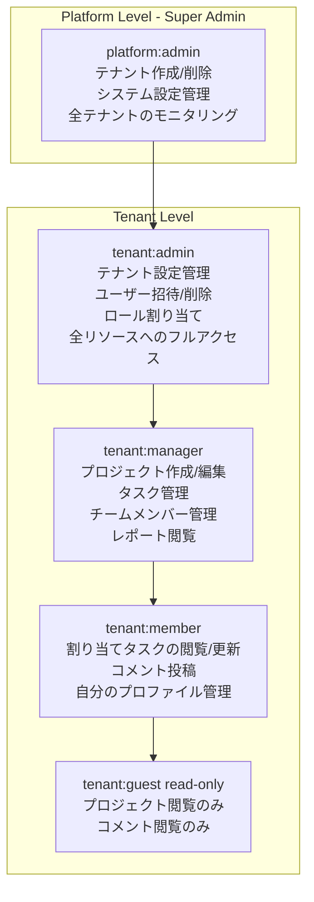
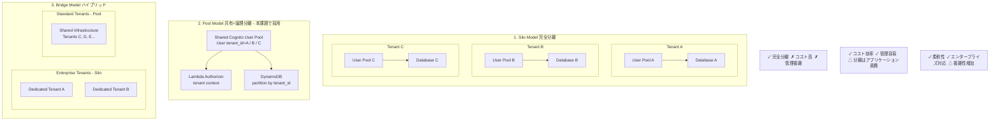

# 課題33: TeamHub - マルチテナントSaaS認証基盤

**難易度: 🟡 中級**

---

## 1. 分類情報

| 項目 | 内容 |
|------|------|
| 難易度 | 中級 |
| カテゴリ | 認証・認可 / セキュリティ |
| 処理タイプ | リアルタイム |
| 使用IaC | CDK |
| 想定所要時間 | 5-6時間 |

---

## 2. シナリオ

BtoB SaaS「〇〇株式会社」のマルチテナント認証・認可システムを AWS CDK で構築します。テナント分離、ロールベースアクセス制御（RBAC）、テナント管理機能を実装し、セキュアなマルチテナントSaaSアーキテクチャを学びます。

### 企業プロファイル

| 項目 | 内容 |
|------|------|
| 企業名 | 〇〇株式会社 |
| 業種 | BtoB SaaS（プロジェクト管理ツール） |
| テナント数 | 100社 |
| 総ユーザー数 | 5,000名 |
| テナント規模 | 小規模（10名以下）〜大規模（500名） |
| 課題 | テナント間のデータ分離とセキュリティ確保 |

### 達成目標（white hat KPI）

| KPI | 目標値 | 測定方法 |
|-----|--------|----------|
| テナント分離 | 100% | クロステナントアクセス試行のブロック率 |
| 認証成功率 | 99.9% | 正当なリクエストの認証成功率 |
| 認可レイテンシ | < 50ms | カスタム認可処理の平均応答時間 |
| テナントオンボーディング | < 5分 | 新規テナント作成の所要時間 |

---

## 2. アーキテクチャ図


**Custom Attributes:** tenant_id (必須), tenant_role (admin/manager/member), tenant_tier (free/standard/enterprise)

**Lambda Authorizer:** JWT検証、テナントコンテキスト抽出、RBAC権限チェック、リソースレベル認可

**DynamoDB Single Table Design:** PK: TENANT#X, SK: PROJECT#/TASK# (Tenant Partition)

### RBACモデル



---

## 3. 前提知識

### 3.1 マルチテナントアーキテクチャ

GCPでのマルチテナント経験がある方向けの比較：

| 観点 | GCP | AWS |
|------|-----|-----|
| 認証基盤 | Firebase Authentication | Cognito User Pool |
| カスタムクレーム | Custom Claims | Custom Attributes + Pre Token Generation |
| テナント分離 | Identity Platform Multi-tenancy | Cognito + Custom Lambda |
| RBAC | Custom Claims based | Groups + Custom Attributes |

### 3.2 テナント分離パターン



---

## 6. 課題

### 6.1 ハンズオン課題

#### 課題1: テナントティア別の機能制限（難易度：初級）

**目標**: テナントの契約プランに応じて利用可能な機能を制限する

**要件**:
- Freeプラン: 基本機能のみ
- Standardプラン: レポート機能追加
- Enterpriseプラン: 監査ログ、SSO対応

**実装ポイント**:
```typescript
// テナントティアによる機能フラグの例
const TIER_FEATURES: Record<string, string[]> = {
  free: ['projects', 'tasks', 'basic-reports'],
  standard: ['projects', 'tasks', 'advanced-reports', 'integrations'],
  enterprise: ['projects', 'tasks', 'advanced-reports', 'integrations', 'audit-logs', 'sso', 'custom-branding'],
};
```

**確認方法**:
- Freeプランのテナントが高度なレポート機能にアクセスしようとすると403エラーが返ること
- Enterpriseプランのテナントは全機能にアクセスできること

---

#### 課題2: ユーザー招待フロー（難易度：中級）

**目標**: テナント管理者が新規ユーザーを招待するフローを実装する

**要件**:
- 招待メールの送信
- 招待リンクの有効期限管理（48時間）
- 招待の承認/拒否
- 招待状況のトラッキング

**実装の流れ**:
1. 招待レコードをDynamoDBに作成
2. 招待コード付きのリンクを含むメールを送信
3. ユーザーがリンクをクリックしてパスワード設定
4. Cognito Pre-SignUpトリガーで招待コードを検証

---

#### 課題3: リソースレベル認可（難易度：中級〜上級）

**目標**: プロジェクト単位でのアクセス制御を実装する

**要件**:
- プロジェクトごとにアクセス可能なユーザーを設定
- プロジェクトオーナー、メンバー、閲覧者の権限レベル
- チーム単位でのアクセス権付与

**データモデル**:
```
PK: TENANT#A#PROJECT#001
SK: ACCESS#USER#alice
Data: { role: "owner", grantedAt: "...", grantedBy: "..." }

PK: TENANT#A#PROJECT#001
SK: ACCESS#TEAM#engineering
Data: { role: "member", grantedAt: "...", grantedBy: "..." }
```

---

### 6.2 トラブルシューティング課題

#### 問題1: クロステナントアクセス

**症状**: テナントAのユーザーがテナントBのデータを取得できてしまう

**調査のヒント**:
1. Lambda Authorizerのログを確認
2. トークンに含まれるtenant_idクレームを確認
3. APIバックエンドのテナントIDフィルタリングを確認

<details>
<summary>原因と解決策</summary>

**原因**: バックエンドのLambda関数でテナントIDのフィルタリングが漏れていた

```typescript
// 問題のあるコード
const result = await dynamodb.send(new QueryCommand({
  TableName: TABLE_NAME,
  KeyConditionExpression: 'PK = :pk',
  ExpressionAttributeValues: {
    ':pk': { S: `PROJECT#${projectId}` }, // テナントIDがない
  },
}));

// 修正後
const tenantId = event.requestContext.authorizer?.tenantId;
const result = await dynamodb.send(new QueryCommand({
  TableName: TABLE_NAME,
  KeyConditionExpression: 'PK = :pk',
  ExpressionAttributeValues: {
    ':pk': { S: `TENANT#${tenantId}#PROJECT#${projectId}` },
  },
}));
```
</details>

---

#### 問題2: トークン内のカスタムクレームが欠落

**症状**: ログイン後のトークンにtenant_idやpermissionsが含まれていない

**調査のヒント**:
1. Pre-Token Generationトリガーのログを確認
2. トリガーがUser Poolに正しく設定されているか確認
3. トリガー関数の実行ロールを確認

<details>
<summary>原因と解決策</summary>

**原因1**: Pre-Token Generationトリガーの設定ミス
```bash
# トリガーの設定確認
aws cognito-idp describe-user-pool \
  --user-pool-id $USER_POOL_ID \
  --query 'UserPool.LambdaConfig'
```

**原因2**: Lambda関数の戻り値形式が不正
```typescript
// 不正な形式
event.response.claimsOverrideDetails = {
  claimsToAddOrOverride: {
    tenant_id: tenantId, // IDトークンには追加されるがアクセストークンには追加されない
  }
};

// 正しい形式（アクセストークンにも追加）
event.response.claimsOverrideDetails = {
  claimsToAddOrOverride: {
    tenant_id: tenantId,
  },
  // V2トリガーを使用している場合
  accessTokenGeneration: {
    claimsToAddOrOverride: {
      tenant_id: tenantId,
    },
  },
};
```
</details>

---

#### 問題3: 認可エラーでAPIが403を返す

**症状**: 正しい権限を持つユーザーでも403エラーが返される

**調査のヒント**:
1. Authorizerのキャッシュを確認
2. 権限マッピングの定義を確認
3. パスパラメータの正規化ロジックを確認

<details>
<summary>原因と解決策</summary>

**原因**: Authorizerのキャッシュが古いポリシーを返している

```bash
# キャッシュの無効化（API Gateway設定変更）
aws apigateway update-authorizer \
  --rest-api-id <api-id> \
  --authorizer-id <authorizer-id> \
  --patch-operations op=replace,path=/authorizerResultTtlInSeconds,value=0

# 本番では適切なTTLを設定
aws apigateway update-authorizer \
  --rest-api-id <api-id> \
  --authorizer-id <authorizer-id> \
  --patch-operations op=replace,path=/authorizerResultTtlInSeconds,value=300
```
</details>

---

### 6.3 設計課題

#### 課題: エンタープライズテナント向けSAML SSO統合

**シナリオ**: 大企業テナントから「自社のIdP（Okta/Azure AD）でSSOしたい」という要望がありました。

**検討事項**:
1. Cognito User Pool + SAML Identity Providerの構成
2. テナントごとに異なるIdPを設定する方法
3. Just-In-Timeプロビジョニングの実装
4. 属性マッピング（tenant_id、roleの引き継ぎ）

**設計案を作成してください**:

```
┌─────────────────────────────────────────────────────────────────┐
│                     SSO Integration Design                       │
│                                                                 │
│  [ここに設計図を作成]                                            │
│                                                                 │
│  考慮点：                                                        │
│  - テナントドメインとIdPのマッピング                              │
│  - JIT プロビジョニング時の初期ロール設定                         │
│  - 既存ユーザーとのリンク                                        │
│  - セッション管理（SLO対応）                                      │
│                                                                 │
└─────────────────────────────────────────────────────────────────┘
```

---

## 7. 学習リソース

### 公式ドキュメント
- [Amazon Cognito User Pools](https://docs.aws.amazon.com/cognito/latest/developerguide/cognito-user-pools.html)
- [Cognito Lambda Triggers](https://docs.aws.amazon.com/cognito/latest/developerguide/cognito-user-identity-pools-working-with-aws-lambda-triggers.html)
- [API Gateway Lambda Authorizers](https://docs.aws.amazon.com/apigateway/latest/developerguide/apigateway-use-lambda-authorizer.html)
- [Multi-tenant SaaS Best Practices](https://docs.aws.amazon.com/wellarchitected/latest/saas-lens/saas-lens.html)

### 参考記事
- [Building Multi-Tenant Solutions on AWS](https://aws.amazon.com/blogs/apn/building-a-multi-tenant-saas-solution-using-amazon-cognito-and-aws-identity-and-access-management/)
- [SaaS Identity and Isolation with Amazon Cognito](https://aws.amazon.com/blogs/apn/saas-identity-and-isolation-with-amazon-cognito-on-the-aws-cloud/)

---

## 8. 解答例

### 課題1: テナントティア別の機能制限

```typescript
// lib/lambda/middleware/feature-gate.ts
interface FeatureGateResult {
  allowed: boolean;
  reason?: string;
}

const TIER_FEATURES: Record<string, Set<string>> = {
  free: new Set(['projects', 'tasks', 'basic-reports']),
  standard: new Set(['projects', 'tasks', 'advanced-reports', 'integrations', 'api-access']),
  enterprise: new Set(['projects', 'tasks', 'advanced-reports', 'integrations', 'api-access', 'audit-logs', 'sso', 'custom-branding', 'data-export']),
};

export function checkFeatureAccess(tenantTier: string, feature: string): FeatureGateResult {
  const allowedFeatures = TIER_FEATURES[tenantTier] || TIER_FEATURES['free'];

  if (allowedFeatures.has(feature)) {
    return { allowed: true };
  }

  // どのティアで利用可能かを提案
  const availableIn = Object.entries(TIER_FEATURES)
    .filter(([_, features]) => features.has(feature))
    .map(([tier]) => tier);

  return {
    allowed: false,
    reason: `Feature '${feature}' is not available in '${tenantTier}' plan. Available in: ${availableIn.join(', ')}`,
  };
}

// Lambda関数での使用例
export const handler = async (event: APIGatewayProxyEvent) => {
  const tenantTier = event.requestContext.authorizer?.tenant_tier || 'free';

  // 高度なレポート機能へのアクセスチェック
  const featureCheck = checkFeatureAccess(tenantTier, 'advanced-reports');

  if (!featureCheck.allowed) {
    return {
      statusCode: 403,
      body: JSON.stringify({
        error: 'Feature not available',
        message: featureCheck.reason,
        upgradeUrl: 'https://teamhub.example.com/pricing',
      }),
    };
  }

  // 機能の処理を続行
  // ...
};
```

### 課題2: ユーザー招待フロー

```typescript
// lib/lambda/api/invite-user.ts
import { APIGatewayProxyEvent, APIGatewayProxyResult } from 'aws-lambda';
import { DynamoDBClient, PutItemCommand, GetItemCommand } from '@aws-sdk/client-dynamodb';
import { SESClient, SendEmailCommand } from '@aws-sdk/client-ses';
import { randomBytes } from 'crypto';

const dynamodb = new DynamoDBClient({});
const ses = new SESClient({});
const TABLE_NAME = process.env.TENANT_TABLE_NAME!;
const INVITATION_TTL_HOURS = 48;

interface InviteUserRequest {
  email: string;
  name: string;
  role: 'admin' | 'manager' | 'member' | 'guest';
}

export const handler = async (event: APIGatewayProxyEvent): Promise<APIGatewayProxyResult> => {
  const tenantId = event.pathParameters?.tenantId;
  const authContext = event.requestContext.authorizer;
  const inviterId = authContext?.principalId;
  const inviterName = authContext?.name || 'Team Administrator';

  const body: InviteUserRequest = JSON.parse(event.body || '{}');

  // 招待コードの生成
  const inviteCode = randomBytes(32).toString('hex');
  const expiresAt = new Date(Date.now() + INVITATION_TTL_HOURS * 60 * 60 * 1000);
  const now = new Date().toISOString();

  // テナント情報の取得
  const tenantResult = await dynamodb.send(new GetItemCommand({
    TableName: TABLE_NAME,
    Key: {
      PK: { S: `TENANT#${tenantId}` },
      SK: { S: 'METADATA' },
    },
  }));

  const tenantName = tenantResult.Item?.name?.S || 'TeamHub';

  // 招待レコードの作成
  await dynamodb.send(new PutItemCommand({
    TableName: TABLE_NAME,
    Item: {
      PK: { S: `TENANT#${tenantId}#INVITATION#${inviteCode}` },
      SK: { S: 'METADATA' },
      tenantId: { S: tenantId! },
      inviteCode: { S: inviteCode },
      email: { S: body.email },
      name: { S: body.name },
      role: { S: body.role },
      status: { S: 'pending' },
      invitedBy: { S: inviterId },
      createdAt: { S: now },
      expiresAt: { S: expiresAt.toISOString() },
      ttl: { N: String(Math.floor(expiresAt.getTime() / 1000)) },
      // メールでの検索用
      GSI1PK: { S: `INVITATION#EMAIL#${body.email}` },
      GSI1SK: { S: now },
    },
  }));

  // 招待メールの送信
  const inviteUrl = `https://app.teamhub.example.com/accept-invite?code=${inviteCode}`;

  await ses.send(new SendEmailCommand({
    Source: 'noreply@teamhub.example.com',
    Destination: {
      ToAddresses: [body.email],
    },
    Message: {
      Subject: {
        Data: `You've been invited to join ${tenantName} on TeamHub`,
      },
      Body: {
        Html: {
          Data: `
            <h2>You're invited!</h2>
            <p>${inviterName} has invited you to join <strong>${tenantName}</strong> on TeamHub.</p>
            <p>Your role will be: <strong>${body.role}</strong></p>
            <p>Click the button below to accept the invitation:</p>
            <p>
              <a href="${inviteUrl}" style="background-color: #4CAF50; color: white; padding: 14px 20px; text-decoration: none; border-radius: 4px;">
                Accept Invitation
              </a>
            </p>
            <p><small>This invitation expires in ${INVITATION_TTL_HOURS} hours.</small></p>
          `,
        },
      },
    },
  }));

  return {
    statusCode: 201,
    body: JSON.stringify({
      message: 'Invitation sent successfully',
      email: body.email,
      expiresAt: expiresAt.toISOString(),
    }),
  };
};

// lib/lambda/api/accept-invite.ts
export const acceptInviteHandler = async (event: APIGatewayProxyEvent): Promise<APIGatewayProxyResult> => {
  const { code, password } = JSON.parse(event.body || '{}');

  // 招待コードの検証
  const inviteResult = await dynamodb.send(new GetItemCommand({
    TableName: TABLE_NAME,
    Key: {
      PK: { S: `INVITATION#${code}` },
      SK: { S: 'METADATA' },
    },
  }));

  if (!inviteResult.Item) {
    return {
      statusCode: 404,
      body: JSON.stringify({ error: 'Invalid or expired invitation' }),
    };
  }

  const invitation = inviteResult.Item;
  const expiresAt = new Date(invitation.expiresAt.S!);

  if (new Date() > expiresAt) {
    return {
      statusCode: 410,
      body: JSON.stringify({ error: 'This invitation has expired' }),
    };
  }

  if (invitation.status.S !== 'pending') {
    return {
      statusCode: 409,
      body: JSON.stringify({ error: 'This invitation has already been used' }),
    };
  }

  // Cognitoユーザーの作成と招待ステータスの更新は
  // 前述のcreate-user.tsと同様の処理を実行
  // ...

  return {
    statusCode: 200,
    body: JSON.stringify({ message: 'Invitation accepted. Welcome to TeamHub!' }),
  };
};
```

---

## 9. 追加学習

### マルチテナントパターンの深掘り

1. **テナント分離レベルの選択**
   - Silo: 完全分離（高コスト、高セキュリティ）
   - Pool: 共有インフラ（低コスト、アプリケーション責務）
   - Bridge: ハイブリッド（柔軟性重視）

2. **ノイジーネイバー問題への対処**
   - テナント単位のレート制限
   - リソースクォータの設定
   - 優先度に基づくリソース配分

3. **コンプライアンス対応**
   - データレジデンシー要件
   - 監査ログの保持
   - GDPR/個人情報保護法対応

### 次のステップ
- 課題40でIAM Identity Center（AWS SSO）を使った従業員認証を学習
- より高度なIdP統合パターンの実装
- ゼロトラストアーキテクチャへの拡張

---

## 10. 参考情報

### GCPとの比較まとめ

| 機能 | GCP | AWS |
|------|-----|-----|
| ユーザー認証 | Firebase Auth / Identity Platform | Cognito User Pool |
| マルチテナント | Identity Platform Multi-tenancy | Cognito + Custom Implementation |
| カスタムクレーム | Firebase Admin SDK | Pre-Token Generation Trigger |
| SAML/OIDC | Identity Platform | Cognito Identity Provider |
| 認可 | Cloud IAM + Custom | Lambda Authorizer + Custom |
| SSO | Cloud Identity | IAM Identity Center |

### セキュリティチェックリスト

- [ ] テナントIDは変更不可（immutable）として設定
- [ ] 全てのAPIエンドポイントでテナントコンテキストを検証
- [ ] データベースクエリでテナントIDフィルタリングを必須化
- [ ] トークンの有効期限を適切に設定（アクセストークン: 1時間以内）
- [ ] 監査ログで全ての認証・認可イベントを記録
- [ ] 定期的なセキュリティレビューの実施

---

## 11. FAQ

**Q: なぜCognitoのマルチテナント機能ではなくカスタム実装を選択したのですか？**

A: Cognitoには直接的なマルチテナント機能がないため、カスタム属性とLambdaトリガーを組み合わせた実装が必要です。この方法により、以下の柔軟性が得られます：
- テナント固有のビジネスロジックの実装
- 細かい権限制御（RBAC）
- テナントメタデータの管理

**Q: テナント数が1000を超えた場合のスケーラビリティは？**

A: Pool モデルでは以下の対策を検討してください：
- DynamoDBのパーティション設計の最適化
- Lambda Authorizerのキャッシュ戦略
- 大規模テナント向けのSilo移行オプション

**Q: Cognito User Poolの制限に達した場合はどうすれば？**

A: Cognito User Poolには以下のデフォルト制限があります：
- 1ユーザープールあたりの最大ユーザー数: 無制限（ただしAPIレート制限あり）
- 1ユーザープールあたりのグループ数: 10,000

制限に近づいた場合は、リージョン分散または複数User Poolの管理を検討してください。

---

## 12. 振り返りチェックリスト

以下の項目を確認して、学習内容の定着度を確認してください：

- [ ] Cognito User Poolのカスタム属性を設定できる
- [ ] Lambda Triggersを使ってトークンにカスタムクレームを追加できる
- [ ] Lambda Authorizerでテナントコンテキストを抽出・検証できる
- [ ] RBACの権限モデルを設計できる
- [ ] DynamoDBでテナント分離を実現するキー設計ができる
- [ ] テナントのオンボーディングフローを実装できる
- [ ] クロステナントアクセスを防ぐセキュリティ対策を説明できる
