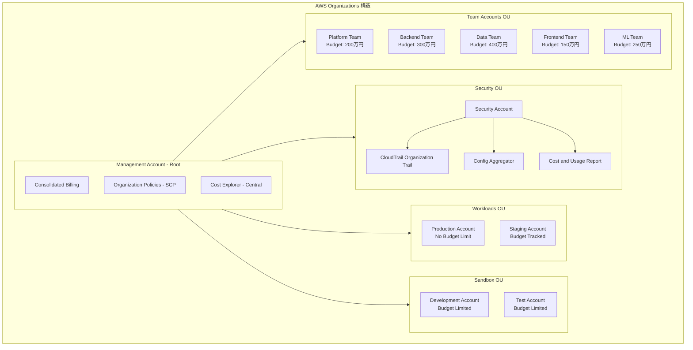

# 課題34: マーケティングSaaSのAWSコスト最適化

**難易度: 🟡 中級**

---

## 1. 分類情報

| 項目 | 内容 |
|------|------|
| 難易度 | 中級 |
| カテゴリ | コスト管理・最適化 |
| 処理タイプ | バッチ |
| 使用IaC | CloudFormation |
| 想定所要時間 | 4-5時間 |

---

## 2. ビジネスシナリオ

### 企業プロファイル
- **企業名**: AdMetrics株式会社
- **業種**: マーケティングSaaS（広告効果測定・分析）
- **規模**: 従業員80名、エンジニア20名
- **顧客数**: 500社、月間データ処理量50TB
- **現状インフラ**: AWS（月額コスト300万円）

### 現状の課題
AdMetrics株式会社は急成長に伴いAWSコストが急増しています。
CFO から「コストを30%削減しつつ、パフォーマンスを維持せよ」という指示が出ました。

1. **コスト可視性の欠如**
   - 部門・プロジェクト別のコストが把握できていない
   - 無駄なリソースの特定ができない
   - 予算超過の早期検知ができない

2. **リソースの非効率な利用**
   - EC2インスタンスの平均CPU使用率が15%
   - 開発環境が24時間稼働
   - 未使用のEBSボリューム・EIPが多数存在

3. **購入オプションの未活用**
   - すべてオンデマンド課金
   - Reserved Instances/Savings Plans 未導入
   - Spot インスタンス未活用

### 現状のAWSコスト内訳
```
月額コスト: 300万円（$20,000相当）

┌────────────────────────────────────────┐
│           コスト内訳                    │
├────────────────────────────────────────┤
│ EC2 (コンピュート)      : 120万円 (40%) │
│ RDS (データベース)      :  60万円 (20%) │
│ S3 (ストレージ)         :  45万円 (15%) │
│ Data Transfer           :  30万円 (10%) │
│ ElastiCache             :  15万円  (5%) │
│ その他                  :  30万円 (10%) │
└────────────────────────────────────────┘
```

### ビジネス要件
```
機能要件:
- コストの部門・プロジェクト別可視化
- 異常コストの自動検知・通知
- 最適化推奨の自動生成
- 月次コストレポートの自動化

非機能要件:
- コスト30%削減（300万円 → 210万円）
- パフォーマンス維持（レイテンシ悪化なし）
- 可用性維持（99.9%）
- 実装期間：3ヶ月
```

### 成功指標（KPI）
| 指標 | 現状 | 目標 |
|------|------|------|
| 月額AWSコスト | 300万円 | 210万円（30%削減） |
| EC2 CPU使用率 | 15% | 50-70% |
| Reserved/Savings カバレッジ | 0% | 60% |
| コスト可視性（タグ付け率） | 30% | 95% |
| 無駄リソース数 | 50+ | 0 |

---

## 3. 学習目標

### 本課題で習得するスキル

```
1. コスト可視化（理解度：詳細）
   - AWS Cost Explorer の活用
   - コスト配分タグの設計・実装
   - Cost and Usage Report (CUR) の分析

2. コスト最適化（理解度：実装）
   - Compute Optimizer によるサイジング
   - Reserved Instances / Savings Plans
   - Spot インスタンスの活用

3. コストガバナンス（理解度：実装）
   - AWS Budgets によるアラート
   - Trusted Advisor の活用
   - 自動停止・削除の実装
```

### GCPエンジニア向け補足
```
GCP → AWS マッピング:
- Billing Reports → Cost Explorer
- Committed Use Discounts → Reserved Instances / Savings Plans
- Preemptible VMs → Spot Instances
- Recommender → Compute Optimizer / Trusted Advisor
- Budget Alerts → AWS Budgets

主な違い:
1. AWS は購入オプションが豊富
   - Reserved Instances（1年/3年、全額/一部前払い）
   - Savings Plans（Compute/EC2/SageMaker）
   - Spot Instances（中断あり、最大90%割引）

2. タグベースのコスト配分が詳細
   - Cost Allocation Tags で部門別管理
   - Cost Categories でグルーピング

3. Cost and Usage Report (CUR) で詳細分析
   - S3 + Athena で SQL クエリ可能
   - QuickSight で可視化
```

---

## 4. 使用するAWSサービス

### メインサービス
| サービス | 役割 | 使用機能 |
|----------|------|----------|
| **AWS Cost Explorer** | コスト分析 | 可視化、予測、推奨 |
| **AWS Compute Optimizer** | リソース最適化 | EC2/Lambda/EBS推奨 |
| **AWS Trusted Advisor** | ベストプラクティス | コスト最適化チェック |
| **AWS Budgets** | 予算管理 | アラート、アクション |

### サポートサービス
| サービス | 用途 |
|----------|------|
| **Cost and Usage Report** | 詳細コストデータ |
| **AWS Organizations** | 一括請求、SCP |
| **Amazon S3** | CUR保存 |
| **Amazon Athena** | CUR分析 |
| **Amazon QuickSight** | ダッシュボード |
| **AWS Lambda** | 自動化処理 |
| **Amazon EventBridge** | スケジュール実行 |

### アーキテクチャ図


---

## 5. 前提条件と事前準備

### 必要な環境
```bash
# AWS CLI v2
aws --version  # 2.x以上

# Python 3.9以上
python3 --version

# jq（JSON処理）
jq --version

# Excel/スプレッドシート（レポート確認用）
```

### AWSアカウント要件
```
- Cost Explorer が有効化されていること
- Cost and Usage Report が設定済み（推奨）
- IAM 権限：Billing管理、Cost Explorer、Compute Optimizer
- Trusted Advisor：Business または Enterprise Support プラン（推奨）
```

### 事前準備スクリプト
```bash
#!/bin/bash
# setup-cost-optimization.sh

# ディレクトリ構造の作成
mkdir -p admetrics-cost/{analysis,automation,reports,dashboards}
cd admetrics-cost

# Cost Explorer の有効化確認
echo "=== Checking Cost Explorer Status ==="
aws ce get-cost-and-usage \
    --time-period Start=2024-01-01,End=2024-01-02 \
    --granularity MONTHLY \
    --metrics "BlendedCost" \
    2>/dev/null && echo "Cost Explorer is enabled" || echo "Enable Cost Explorer in Billing Console"

# Compute Optimizer の有効化
echo "=== Enabling Compute Optimizer ==="
aws compute-optimizer update-enrollment-status \
    --status Active \
    --include-member-accounts

# Trusted Advisor の確認
echo "=== Checking Trusted Advisor ==="
aws support describe-trusted-advisor-checks \
    --language en \
    --query 'checks[?category==`cost_optimizing`].name' \
    --output table 2>/dev/null || echo "Trusted Advisor requires Business/Enterprise Support"

# Cost Allocation Tags の確認
echo "=== Checking Cost Allocation Tags ==="
aws ce list-cost-allocation-tags \
    --query 'CostAllocationTags[*].[TagKey,Status]' \
    --output table
```

---

## 6. アーキテクチャ設計

### コスト配分タグ設計
```yaml
# cost-allocation-tags.yaml
cost_allocation_tags:
  # 必須タグ（全リソース）
  required:
    - key: Environment
      values: [production, staging, development, test]
      description: "環境識別"

    - key: Project
      values: [analytics, api, data-pipeline, infrastructure]
      description: "プロジェクト識別"

    - key: Team
      values: [platform, backend, data, frontend]
      description: "担当チーム"

    - key: CostCenter
      values: [engineering, marketing, sales, operations]
      description: "コストセンター"

  # 推奨タグ（追加情報）
  recommended:
    - key: Owner
      description: "リソース所有者（メールアドレス）"

    - key: Application
      description: "アプリケーション名"

    - key: AutoStop
      values: ["true", "false"]
      description: "自動停止対象"

# タグ付けポリシー（Organizations Tag Policy）
tag_policy:
  enforce_required_tags: true
  allowed_values_only: true
  non_compliant_action: report  # report | deny
```

### コスト最適化戦略
```yaml
# cost-optimization-strategy.yaml
optimization_targets:
  # Phase 1: Quick Wins（即効性のある最適化）
  quick_wins:
    target_savings: 15%  # 45万円/月
    timeline: 1週間
    actions:
      - type: unused_resources
        items:
          - Unattached EBS volumes
          - Unused Elastic IPs
          - Idle load balancers
          - Old snapshots (>90 days)
        estimated_savings: 10万円/月

      - type: development_scheduling
        items:
          - Stop dev/test EC2 at night (19:00-08:00)
          - Stop dev/test RDS at night
          - Weekend shutdown
        estimated_savings: 20万円/月

      - type: s3_optimization
        items:
          - Enable Intelligent-Tiering
          - Delete incomplete multipart uploads
          - Lifecycle policies for old data
        estimated_savings: 15万円/月

  # Phase 2: Right-sizing（適正サイジング）
  right_sizing:
    target_savings: 10%  # 30万円/月
    timeline: 1ヶ月
    actions:
      - type: ec2_right_sizing
        criteria:
          - CPU utilization < 40% for 14 days
          - Memory utilization < 40%
        approach: downsize_one_generation

      - type: rds_right_sizing
        criteria:
          - CPU utilization < 30% for 14 days
          - Connection count < 50% of max
        approach: consider_aurora_serverless

      - type: ebs_optimization
        criteria:
          - IOPS utilization < 50%
          - Throughput utilization < 50%
        approach: gp3_migration

  # Phase 3: Commitment（コミットメント購入）
  commitment:
    target_savings: 5%  # 15万円/月
    timeline: 3ヶ月
    actions:
      - type: savings_plans
        coverage_target: 60%
        type: Compute Savings Plans
        term: 1_year
        payment: no_upfront

      - type: reserved_instances
        coverage_target: 40%
        term: 1_year
        payment: partial_upfront
        targets:
          - RDS (stable workloads)
          - ElastiCache (stable workloads)
```

---

## 8. トラブルシューティング課題

### 課題1: Cost Explorer のデータが表示されない

**症状**:
```
Cost Explorer を開いたが、コストデータが表示されない。
「Data is not available」というメッセージが表示される。
```

**調査コマンド**:
```bash
# Cost Explorer の有効化状態確認
aws ce get-cost-and-usage \
    --time-period Start=2024-01-01,End=2024-01-31 \
    --granularity MONTHLY \
    --metrics "BlendedCost"

# IAM 権限の確認
aws iam get-user
aws iam list-attached-user-policies --user-name YOUR_USER_NAME
```

**原因と解決**:
<details>
<summary>解答を見る</summary>

**原因**: 複数の原因が考えられる

**パターン1: Cost Explorer が有効化されていない**
```bash
# Cost Explorer は Billing コンソールで有効化が必要
# AWS マネジメントコンソール → Billing → Cost Explorer → Enable Cost Explorer

# 有効化後、データが表示されるまで24時間かかる場合がある
```

**パターン2: IAM 権限不足**
```bash
# 必要な権限
# - ce:GetCostAndUsage
# - ce:GetCostForecast
# - ce:GetReservationPurchaseRecommendation

# IAM ポリシーの例
aws iam attach-user-policy \
    --user-name YOUR_USER_NAME \
    --policy-arn arn:aws:iam::aws:policy/AWSBillingReadOnlyAccess
```

**パターン3: 組織アカウントでのアクセス制限**
```bash
# Organizations を使用している場合、
# 管理アカウントで以下を有効化する必要がある：
# - IAM User and Role Access to Billing Information

# AWS Organizations → Policies → Service Control Policies
# Billing へのアクセスを許可する SCP が必要
```

**パターン4: リージョン設定**
```bash
# Cost Explorer は us-east-1 リージョンで API を呼び出す
aws ce get-cost-and-usage \
    --region us-east-1 \
    --time-period Start=2024-01-01,End=2024-01-31 \
    --granularity MONTHLY \
    --metrics "BlendedCost"
```
</details>

### 課題2: Compute Optimizer の推奨が表示されない

**症状**:
```
Compute Optimizer を有効化したが、EC2 インスタンスの推奨が
「推奨なし」と表示される。
```

**調査コマンド**:
```bash
# Compute Optimizer の状態確認
aws compute-optimizer get-enrollment-status

# EC2 インスタンスの推奨取得
aws compute-optimizer get-ec2-instance-recommendations \
    --query 'instanceRecommendations[*].[instanceArn,finding,findingReasonCodes]' \
    --output table
```

**原因と解決**:
<details>
<summary>解答を見る</summary>

**原因**: データ収集期間が不足している

**解決手順**:
```bash
# 1. Compute Optimizer は最低14日間のデータが必要
# 新規インスタンスの場合は14日待つ必要がある

# 2. CloudWatch Agent がインストールされているか確認
# メモリメトリクスの収集には Agent が必要
aws ssm describe-instance-information \
    --query 'InstanceInformationList[*].[InstanceId,PingStatus]' \
    --output table

# 3. 詳細モニタリングの有効化（オプション）
aws ec2 monitor-instances --instance-ids i-1234567890abcdef0

# 4. インスタンスの状態確認
# 停止中のインスタンスは分析対象外
aws ec2 describe-instances \
    --query 'Reservations[*].Instances[*].[InstanceId,State.Name]' \
    --output table

# 5. Finding Reason Codes の確認
aws compute-optimizer get-ec2-instance-recommendations \
    --query 'instanceRecommendations[?finding==`NotOptimized`].[instanceArn,findingReasonCodes]'

# 主な Reason Codes:
# - CPUOverprovisioned: CPU が過剰プロビジョニング
# - MemoryOverprovisioned: メモリが過剰（Agent 必要）
# - EBSThroughputOverprovisioned: EBS スループットが過剰
```
</details>

### 課題3: Budget アラートが送信されない

**症状**:
```
AWS Budget で予算を設定し、閾値を超えたはずだが、
通知メールが届かない。
```

**調査コマンド**:
```bash
# Budget の設定確認
aws budgets describe-budget \
    --account-id $(aws sts get-caller-identity --query Account --output text) \
    --budget-name "Monthly-Total-Cost"

# 通知設定の確認
aws budgets describe-notifications-for-budget \
    --account-id $(aws sts get-caller-identity --query Account --output text) \
    --budget-name "Monthly-Total-Cost"
```

**原因と解決**:
<details>
<summary>解答を見る</summary>

**原因**: 複数の原因が考えられる

**パターン1: メールアドレスの確認が未完了**
```bash
# SNS サブスクリプションの場合、確認メールのリンクをクリックする必要がある
aws sns list-subscriptions-by-topic \
    --topic-arn arn:aws:sns:REGION:ACCOUNT_ID:cost-alerts
```

**パターン2: 閾値の設定ミス**
```bash
# FORECASTED vs ACTUAL の違い
# - FORECASTED: 予測値が閾値を超えた場合
# - ACTUAL: 実際のコストが閾値を超えた場合

# 確認
aws budgets describe-notifications-for-budget \
    --account-id $(aws sts get-caller-identity --query Account --output text) \
    --budget-name "Monthly-Total-Cost" \
    --query 'Notifications[*].[NotificationType,Threshold,ThresholdType]'
```

**パターン3: SNS トピックの権限**
```bash
# Budget から SNS へのパブリッシュ権限を確認
aws sns get-topic-attributes \
    --topic-arn arn:aws:sns:REGION:ACCOUNT_ID:cost-alerts \
    --query 'Attributes.Policy'

# 必要な権限を付与
aws sns set-topic-attributes \
    --topic-arn arn:aws:sns:REGION:ACCOUNT_ID:cost-alerts \
    --attribute-name Policy \
    --attribute-value '{
        "Statement": [{
            "Effect": "Allow",
            "Principal": {"Service": "budgets.amazonaws.com"},
            "Action": "SNS:Publish",
            "Resource": "arn:aws:sns:REGION:ACCOUNT_ID:cost-alerts"
        }]
    }'
```

**パターン4: Budget アラートの遅延**
```bash
# Budget アラートは最大24時間の遅延がある場合がある
# Cost Explorer のデータ更新タイミングに依存

# テスト用に低い閾値で Budget を作成
aws budgets create-budget \
    --account-id $(aws sts get-caller-identity --query Account --output text) \
    --budget '{
        "BudgetName": "Test-Alert",
        "BudgetLimit": {"Amount": "1", "Unit": "USD"},
        "BudgetType": "COST",
        "TimeUnit": "MONTHLY"
    }' \
    --notifications-with-subscribers '[{
        "Notification": {
            "NotificationType": "ACTUAL",
            "ComparisonOperator": "GREATER_THAN",
            "Threshold": 1,
            "ThresholdType": "ABSOLUTE_VALUE"
        },
        "Subscribers": [{
            "SubscriptionType": "EMAIL",
            "Address": "your-email@example.com"
        }]
    }]'
```
</details>

---

## 9. 設計課題

### 設計課題: エンタープライズ規模のコストガバナンス体制

**シナリオ**:
AdMetrics社は急成長に伴い、AWS アカウントが10個に増加しました。
全社的なコストガバナンス体制を設計してください。

**現状**:
```
- 10 AWS アカウント（本番、開発、テスト、各チーム用など）
- 月額総コスト：1,500万円
- コスト可視性：各アカウント個別管理
- 購入オプション：未活用
```

**要件**:
```
1. ガバナンス要件
   - 全アカウントのコスト一元管理
   - 部門・プロジェクト別のコスト配分
   - 予算超過の自動検知・対応
   - 月次レポートの自動生成

2. 最適化要件
   - 全アカウント合計で20%コスト削減
   - Savings Plans の組織レベル活用
   - 未使用リソースの自動検出・削除

3. セキュリティ要件
   - コスト情報へのアクセス制御
   - 高額リソース作成の承認フロー
   - 監査ログの保持
```

**設計すべき項目**:
```
1. Organizations 設計（OU 構造）
2. コスト配分タグ戦略
3. Budget・アラート設計
4. 自動化・レポート設計
```

<details>
<summary>設計例を見る</summary>

### エンタープライズコストガバナンスアーキテクチャ



### コスト配分タグ戦略

```yaml
tagging_strategy:
  # 必須タグ（SCP で強制）
  mandatory_tags:
    - key: Environment
      allowed_values: [production, staging, development, test, sandbox]
      enforcement: deny_if_missing

    - key: CostCenter
      allowed_values: [platform, backend, data, frontend, ml, shared]
      enforcement: deny_if_missing

    - key: Project
      description: プロジェクトコード（自由入力）
      enforcement: report_if_missing

    - key: Owner
      description: リソース所有者のメールアドレス
      enforcement: report_if_missing

  # 自動タグ付け
  auto_tagging:
    - source: IAM User/Role
      target_tag: CreatedBy
    - source: AWS Service Catalog
      target_tag: ProvisionedProduct

  # コストカテゴリ（Cost Categories）
  cost_categories:
    - name: BusinessUnit
      rules:
        - value: Engineering
          match: CostCenter IN [platform, backend, data, frontend, ml]
        - value: Operations
          match: CostCenter = shared

    - name: Environment
      rules:
        - value: Production
          match: Environment = production
        - value: Non-Production
          match: Environment IN [staging, development, test]
        - value: Sandbox
          match: Environment = sandbox
```

### Budget 階層設計

```yaml
budget_hierarchy:
  # 組織全体予算
  organization_level:
    - name: Total-Monthly-Cost
      amount: 10000000  # 1,000万円
      alerts:
        - threshold: 80%
          type: forecasted
          action: notify_cfo
        - threshold: 100%
          type: actual
          action: [notify_all_managers, create_incident]

  # OU レベル予算
  ou_level:
    workloads:
      amount: 7000000  # 700万円
      alerts:
        - threshold: 90%
          action: notify_platform_manager

    sandbox:
      amount: 1500000  # 150万円
      alerts:
        - threshold: 100%
          action: auto_stop_non_essential

  # アカウントレベル予算
  account_level:
    per_team_account:
      amount: varies_by_team
      alerts:
        - threshold: 80%
          action: notify_team_lead
        - threshold: 100%
          action: [notify_team_lead, restrict_ec2_launch]

  # 自動アクション
  budget_actions:
    - trigger: sandbox_over_budget
      action:
        type: lambda
        function: stop_non_production_resources

    - trigger: team_over_budget
      action:
        type: scp_attach
        policy: DenyEC2Launch
```

### 推定コスト削減効果

| 最適化施策 | 対象 | 削減見込み |
|-----------|------|-----------|
| Savings Plans (組織レベル) | EC2/Fargate | 150万円 (20%) |
| 開発環境スケジューリング | Dev/Test | 50万円 |
| ライトサイジング | 全アカウント | 50万円 |
| 未使用リソース削除 | 全アカウント | 30万円 |
| データ転送最適化 | 全アカウント | 20万円 |
| **合計** | | **300万円 (20%)** |

</details>

---

## 10. 発展課題

### 発展課題1: FinOps プラクティスの導入（難易度：上級）

**課題内容**:
FinOps Foundation のフレームワークに基づき、組織的なクラウドコスト管理プラクティスを導入してください。

**要件**:
- Inform（情報提供）: リアルタイムコスト可視化
- Optimize（最適化）: 継続的な最適化サイクル
- Operate（運用）: コスト責任の分散

### 発展課題2: 機械学習によるコスト予測（難易度：上級）

**課題内容**:
Amazon Forecast を使用して、より精度の高いコスト予測モデルを構築してください。

**要件**:
- CUR データを使用した予測モデル
- 季節性・イベント要因の考慮
- 異常検知の実装

### 発展課題3: マルチクラウドコスト管理（難易度：中級）

**課題内容**:
AWS + GCP のマルチクラウド環境でのコスト統合管理ダッシュボードを構築してください。

**要件**:
- 両クラウドのコストデータ統合
- 統一されたタグ体系
- 比較分析ダッシュボード

---

## 11. 振り返りと次のステップ

### 学習のまとめ

```
本課題で学んだこと:
□ Cost Explorer によるコスト分析と予測
□ Compute Optimizer によるライトサイジング
□ Trusted Advisor による未使用リソース検出
□ AWS Budgets によるコスト管理とアラート
□ コスト配分タグの設計と実装
□ 自動化によるコスト最適化

GCP との主な違い:
- AWS は購入オプションが豊富（RI, SP, Spot）
- タグベースのコスト配分がより詳細
- CUR による詳細なコストデータ分析が可能
- Trusted Advisor は Business Support 以上で本領発揮
```

### GCP経験者向けポイント

| 観点 | GCP | AWS | 移行時の注意 |
|------|-----|-----|-------------|
| コスト分析 | Billing Reports | Cost Explorer | UIとクエリ方法が異なる |
| コミットメント | CUD | RI / Savings Plans | AWSはより柔軟なオプション |
| スポット | Preemptible/Spot VM | Spot Instances | 中断通知の仕組みが異なる |
| 推奨 | Recommender | Compute Optimizer | カバー範囲が異なる |
| 予算管理 | Budget Alerts | AWS Budgets | アクション機能がAWSは豊富 |

### 推奨される次のステップ

```
1. AWS Certified Cloud Practitioner の学習
   - コスト管理の基礎を体系的に理解

2. FinOps Foundation 認定の取得
   - クラウドコスト管理のベストプラクティス

3. 実環境での最適化実施
   - 本課題の手法を実際の環境に適用
   - 効果測定と継続的改善

4. 関連課題への挑戦
   - 課題28: オブザーバビリティ（コストとパフォーマンスの相関）
   - 課題30: 統合課題（コスト効率の良いアーキテクチャ設計）
```

---

## 12. 推定コストと注意事項

### 本課題の推定コスト

| サービス | 使用量 | 推定コスト（演習時） |
|----------|--------|---------------------|
| Cost Explorer | 分析 | 無料 |
| Compute Optimizer | 分析 | 無料 |
| Trusted Advisor | 基本 | 無料（Business以上は別途） |
| AWS Budgets | 予算設定 | 無料（最初の2つ） |
| Lambda | 自動化 | < $1 |
| S3 (CUR) | 保存 | < $1 |
| **合計** | | **< $5** |

### コスト最適化の ROI 計算

```
本課題での学習投資:
- 所要時間: 4-5時間
- AWSコスト: ~$5
- 合計コスト: 約 $50（時間コスト含む）

期待される効果（AdMetrics のケース）:
- 月額削減額: 90万円（30%削減）
- 年間削減額: 1,080万円
- ROI: 21,600倍
```

### 注意事項

```
⚠️ Reserved Instances / Savings Plans 購入
- 1年/3年のコミットメントが必要
- 購入前に十分な使用量分析を実施
- 返金不可のため慎重に判断

⚠️ 自動停止・削除の実装
- 本番環境への適用は慎重に
- DRY_RUN モードでの十分なテスト
- 保護タグ（DoNotDelete）の活用

⚠️ Trusted Advisor の制限
- 基本サポートでは一部チェックのみ
- 全機能利用には Business Support 以上が必要
```

---

**課題作成日**: 2024年1月
**最終更新日**: 2024年1月
**作成者**: AWS学習プログラム
