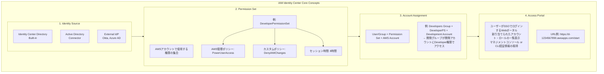

# 課題37: TechCorp - IAM Identity Center (AWS SSO) 構築

**難易度: 🟡 中級**

---

## 1. 分類情報

| 項目 | 内容 |
|------|------|
| 難易度 | 中級 |
| カテゴリ | 認証・認可 / セキュリティ |
| 処理タイプ | リアルタイム |
| 使用IaC | CloudFormation |
| 想定所要時間 | 5-6時間 |

---

## 2. シナリオ

ITコンサルティング会社「TechCorp株式会社」の従業員向けシングルサインオン（SSO）基盤を AWS IAM Identity Center で構築します。複数AWSアカウントへのアクセス管理、外部IdP連携、権限セットの設計を通じて、エンタープライズ向けアイデンティティ管理を学びます。

### 企業プロファイル

| 項目 | 内容 |
|------|------|
| 企業名 | TechCorp株式会社 |
| 業種 | ITコンサルティング |
| 従業員数 | 500名 |
| AWSアカウント数 | 15アカウント（開発/本番/共有サービス等） |
| 部門数 | 6部門（開発、インフラ、セキュリティ、営業、管理、経営） |
| 課題 | 複数アカウントへのアクセス管理の複雑化、セキュリティ強化 |

### 達成目標（white hat KPI）

| KPI | 目標値 | 測定方法 |
|-----|--------|----------|
| SSO認証成功率 | 99.9% | CloudWatch メトリクス |
| アクセス権プロビジョニング | < 5分 | 権限変更の反映時間 |
| セキュリティコンプライアンス | 100% | MFA必須、監査ログ完全性 |
| 運用負荷削減 | 80%削減 | アカウント管理作業時間 |

---

## 2. アーキテクチャ図


**Identity Store Groups:**
- 開発部門 (80 users) / インフラ部門 (40 users) / セキュリティ部門 (20 users)
- 営業部門 (200 users) / 管理部門 (100 users) / 経営層 (60 users)

**Permission Sets:**
- AdministratorPS (Full Admin) / DeveloperPS (Dev Resources) / ReadOnlyPS (View Only)
- SecurityAuditPS / NetworkAdminPS / BillingViewerPS

**Access Portal:** https://techcorp.awsapps.com/start

### アクセス管理マトリクス

| 部門 | Production | Staging | Development | Sandbox | Security |
|------|------------|---------|-------------|---------|----------|
| 開発部門 | Developer, ReadOnly | Admin | Admin | Admin | - |
| インフラ部門 | Admin, Network | Admin, Network | Admin, Network | Admin | ReadOnly |
| セキュリティ部門 | SecAudit, ReadOnly | SecAudit, ReadOnly | SecAudit, ReadOnly | SecAudit, ReadOnly | Admin |
| 営業部門 | - | - | - | - | - |
| 管理部門 | Billing, ReadOnly | Billing | - | - | - |
| 経営層 | ReadOnly, Billing | ReadOnly | ReadOnly | - | ReadOnly |

---

## 3. 前提知識

### 3.1 IAM Identity Center の概念

GCPでのアイデンティティ管理経験がある方向けの比較：

| 観点 | GCP | AWS |
|------|-----|-----|
| SSO基盤 | Cloud Identity | IAM Identity Center |
| IdP連携 | Cloud Identity + SAML | Identity Center + SAML/SCIM |
| 権限管理 | IAM Roles | Permission Sets |
| ディレクトリ | Cloud Identity Directory | Identity Center Directory |
| マルチプロジェクト | Project IAM Bindings | Account Assignments |

### 3.2 IAM Identity Center の主要概念



**📝 補足**: 本課題では Built-in Directory を使用します。

---

## 6. 課題

### 6.1 ハンズオン課題

#### 課題1: 緊急アクセス用 Break Glass アカウント（難易度：初級）

**目標**: 緊急時用の高権限アカウントを設定する

**要件**:
- 緊急時のみ使用する管理者アカウント
- 使用時にアラート通知
- 使用履歴の完全な監査ログ

**実装ポイント**:
```hcl
# Break Glass用のPermission Set
resource "aws_ssoadmin_permission_set" "break_glass" {
  name             = "BreakGlassAccess"
  description      = "Emergency access - use only in critical situations"
  instance_arn     = local.instance_arn
  session_duration = "PT1H" # 緊急アクセスは1時間に制限
}

# 使用時のCloudWatch Alarm設定
# ...
```

---

#### 課題2: 外部IdP（Okta）との連携（難易度：中級）

**目標**: OktaをIdentity Providerとして設定し、SCIM自動同期を構成する

**要件**:
- SAML 2.0による認証連携
- SCIMによるユーザー・グループの自動プロビジョニング
- 属性マッピングの設定

**設定手順の概要**:
1. Okta側でAWS IAM Identity Centerアプリケーションを追加
2. SAMLメタデータの交換
3. SCIM APIトークンの発行
4. 属性マッピングの設定

---

#### 課題3: 一時的アクセス権限の付与（難易度：中級〜上級）

**目標**: 限定的な期間だけ追加権限を付与する仕組みを作る

**要件**:
- 申請・承認ワークフロー
- 自動的な権限の付与・削除
- 監査証跡の記録

**実装アプローチ**:
```
┌─────────────────────────────────────────────────────────────────┐
│              Temporary Access Workflow                          │
│                                                                 │
│  1. 申請  →  2. 承認  →  3. 権限付与  →  4. 自動削除           │
│     │           │            │              │                   │
│     ▼           ▼            ▼              ▼                   │
│  ┌─────────┐ ┌─────────┐ ┌──────────┐ ┌──────────────┐         │
│  │API GW   │ │Step     │ │Lambda    │ │EventBridge   │         │
│  │+ Lambda │ │Functions│ │+ SSO API │ │Scheduled     │         │
│  └─────────┘ └─────────┘ └──────────┘ └──────────────┘         │
│                                                                 │
└─────────────────────────────────────────────────────────────────┘
```

---

### 6.2 トラブルシューティング課題

#### 問題1: Permission Set が反映されない

**症状**: Permission Setを更新したが、ユーザーの権限に反映されない

**調査のヒント**:
1. Permission Setのプロビジョニング状態を確認
2. アカウント割り当ての状態を確認
3. IAMロールの更新状態を確認

<details>
<summary>原因と解決策</summary>

**原因**: Permission Setの変更後、アカウントへの再プロビジョニングが必要

```bash
# Permission Setのプロビジョニング状態確認
aws sso-admin list-permission-sets-provisioned-to-account \
  --instance-arn $INSTANCE_ARN \
  --account-id $ACCOUNT_ID

# 手動でプロビジョニング実行
aws sso-admin provision-permission-set \
  --instance-arn $INSTANCE_ARN \
  --permission-set-arn $PERMISSION_SET_ARN \
  --target-type ALL_PROVISIONED_ACCOUNTS

# プロビジョニングステータスの確認
aws sso-admin describe-permission-set-provisioning-status \
  --instance-arn $INSTANCE_ARN \
  --provision-request-id $REQUEST_ID
```

**Terraformでの対策**:
```hcl
# プロビジョニングのトリガー（null_resource使用）
resource "null_resource" "provision_permission_set" {
  triggers = {
    permission_set_arn = aws_ssoadmin_permission_set.developer.arn
    inline_policy      = md5(aws_ssoadmin_permission_set_inline_policy.developer_deny_iam.inline_policy)
  }

  provisioner "local-exec" {
    command = <<-EOF
      aws sso-admin provision-permission-set \
        --instance-arn ${local.instance_arn} \
        --permission-set-arn ${aws_ssoadmin_permission_set.developer.arn} \
        --target-type ALL_PROVISIONED_ACCOUNTS
    EOF
  }
}
```
</details>

---

#### 問題2: SSOログインでエラーが発生

**症状**: アクセスポータルでログイン後、「An error occurred」と表示される

**調査のヒント**:
1. CloudTrail でSSO関連イベントを確認
2. ブラウザのCookieとキャッシュをクリア
3. セッション設定を確認

<details>
<summary>原因と解決策</summary>

**原因1**: MFAデバイスの時刻ずれ
```bash
# TOTPは30秒の時刻ウィンドウを使用
# デバイスの時刻同期を確認
```

**原因2**: セッションタイムアウト
```bash
# セッション設定の確認
aws sso-admin describe-permission-set \
  --instance-arn $INSTANCE_ARN \
  --permission-set-arn $PERMISSION_SET_ARN \
  --query 'PermissionSet.SessionDuration'
```

**原因3**: ブラウザのサードパーティCookie設定
- シークレットモードでテスト
- awsapps.comドメインのCookieを許可
</details>

---

#### 問題3: SCIMプロビジョニングが失敗

**症状**: 外部IdPからのユーザー同期が完了しない

**調査のヒント**:
1. SCIM APIのエラーログを確認
2. 属性マッピングを確認
3. ネットワーク設定を確認

<details>
<summary>原因と解決策</summary>

**原因1**: SCIM APIトークンの有効期限切れ
```bash
# 新しいトークンを生成
# IAM Identity Center コンソール → 設定 → プロビジョニング → トークンを再生成
```

**原因2**: 必須属性の欠落
```json
// SCIM リクエストに必要な属性
{
  "schemas": ["urn:ietf:params:scim:schemas:core:2.0:User"],
  "userName": "user@example.com",
  "name": {
    "givenName": "First",
    "familyName": "Last"
  },
  "emails": [{
    "value": "user@example.com",
    "primary": true
  }],
  "displayName": "First Last",
  "active": true
}
```

**原因3**: IdP側のエラー
- Okta/Azure AD のプロビジョニングログを確認
- リトライ設定を調整
</details>

---

### 6.3 設計課題

#### 課題: ゼロトラストアーキテクチャへの拡張

**シナリオ**: 経営層から「ゼロトラストセキュリティモデルに移行したい」という要望がありました。

**検討事項**:
1. デバイス信頼の検証（AWS Verified Access との連携）
2. 継続的な認証（セッション中の再認証）
3. コンテキストベースのアクセス制御
4. マイクロセグメンテーション

**設計案を作成してください**:

```
┌─────────────────────────────────────────────────────────────────┐
│                Zero Trust Architecture Design                    │
│                                                                 │
│  [ここに設計図を作成]                                            │
│                                                                 │
│  考慮点：                                                        │
│  - 「Never trust, always verify」の原則                          │
│  - デバイスポスチャの評価                                        │
│  - 最小権限の原則の徹底                                          │
│  - リアルタイムのリスク評価                                      │
│                                                                 │
└─────────────────────────────────────────────────────────────────┘
```

---

## 7. 学習リソース

### 公式ドキュメント
- [IAM Identity Center User Guide](https://docs.aws.amazon.com/singlesignon/latest/userguide/what-is.html)
- [IAM Identity Center API Reference](https://docs.aws.amazon.com/singlesignon/latest/APIReference/welcome.html)
- [AWS Organizations User Guide](https://docs.aws.amazon.com/organizations/latest/userguide/orgs_introduction.html)
- [Terraform AWS SSO Admin Provider](https://registry.terraform.io/providers/hashicorp/aws/latest/docs/resources/ssoadmin_permission_set)

### ベストプラクティス
- [AWS Security Best Practices for IAM Identity Center](https://docs.aws.amazon.com/singlesignon/latest/userguide/security-best-practices.html)
- [Multi-Account Strategy](https://docs.aws.amazon.com/whitepapers/latest/organizing-your-aws-environment/organizing-your-aws-environment.html)

---

## 8. 解答例

### 課題1: Break Glass アカウント

```hcl
# break-glass.tf

# Break Glass グループ
resource "aws_identitystore_group" "break_glass" {
  identity_store_id = local.identity_store_id
  display_name      = "BreakGlass-Admins"
  description       = "Emergency access administrators - use only in critical situations"
}

# Break Glass Permission Set
resource "aws_ssoadmin_permission_set" "break_glass" {
  name             = "BreakGlassAccess"
  description      = "EMERGENCY USE ONLY - Full administrative access for critical incidents"
  instance_arn     = local.instance_arn
  session_duration = "PT1H"

  tags = {
    Purpose     = "emergency-access"
    ManagedBy   = "terraform"
    AlertOnUse  = "true"
  }
}

resource "aws_ssoadmin_managed_policy_attachment" "break_glass_admin" {
  instance_arn       = local.instance_arn
  permission_set_arn = aws_ssoadmin_permission_set.break_glass.arn
  managed_policy_arn = "arn:aws:iam::aws:policy/AdministratorAccess"
}

# Break Glassの使用を検知するCloudWatch Alarm
resource "aws_cloudwatch_log_metric_filter" "break_glass_usage" {
  name           = "BreakGlassUsageFilter"
  pattern        = "{ ($.eventName = AssumeRole) && ($.requestParameters.roleSessionName = \"*BreakGlass*\") }"
  log_group_name = "aws-cloudtrail-logs"

  metric_transformation {
    name      = "BreakGlassUsageCount"
    namespace = "Security/BreakGlass"
    value     = "1"
  }
}

resource "aws_cloudwatch_metric_alarm" "break_glass_alert" {
  alarm_name          = "BreakGlassAccessUsed"
  comparison_operator = "GreaterThanThreshold"
  evaluation_periods  = 1
  metric_name         = "BreakGlassUsageCount"
  namespace           = "Security/BreakGlass"
  period              = 60
  statistic           = "Sum"
  threshold           = 0
  alarm_description   = "CRITICAL: Break Glass access has been used"
  treat_missing_data  = "notBreaching"

  alarm_actions = [aws_sns_topic.security_alerts.arn]
  ok_actions    = [aws_sns_topic.security_alerts.arn]
}

# SNS Topic for security alerts
resource "aws_sns_topic" "security_alerts" {
  name = "security-break-glass-alerts"
}

resource "aws_sns_topic_subscription" "security_email" {
  topic_arn = aws_sns_topic.security_alerts.arn
  protocol  = "email"
  endpoint  = "security-team@techcorp.example.com"
}

# 使用記録用のDynamoDBテーブル
resource "aws_dynamodb_table" "break_glass_log" {
  name         = "break-glass-usage-log"
  billing_mode = "PAY_PER_REQUEST"
  hash_key     = "sessionId"
  range_key    = "timestamp"

  attribute {
    name = "sessionId"
    type = "S"
  }

  attribute {
    name = "timestamp"
    type = "S"
  }

  attribute {
    name = "userId"
    type = "S"
  }

  global_secondary_index {
    name            = "UserIdIndex"
    hash_key        = "userId"
    range_key       = "timestamp"
    projection_type = "ALL"
  }

  point_in_time_recovery {
    enabled = true
  }

  tags = {
    Purpose = "break-glass-audit"
  }
}
```

### 課題3: 一時的アクセス権限の付与

```hcl
# temporary-access.tf

# 一時アクセス申請用API Gateway
resource "aws_apigatewayv2_api" "temp_access" {
  name          = "temporary-access-api"
  protocol_type = "HTTP"
}

# Step Functions ワークフロー定義
resource "aws_sfn_state_machine" "temp_access_workflow" {
  name     = "temporary-access-workflow"
  role_arn = aws_iam_role.sfn_role.arn

  definition = jsonencode({
    Comment = "Temporary access request workflow"
    StartAt = "ValidateRequest"
    States = {
      ValidateRequest = {
        Type     = "Task"
        Resource = aws_lambda_function.validate_request.arn
        Next     = "NotifyApprover"
        Catch = [{
          ErrorEquals = ["ValidationError"]
          Next        = "RequestDenied"
        }]
      }
      NotifyApprover = {
        Type     = "Task"
        Resource = "arn:aws:states:::sns:publish.waitForTaskToken"
        Parameters = {
          TopicArn = aws_sns_topic.approval_requests.arn
          Message = {
            "taskToken.$"  = "$$.Task.Token"
            "requestId.$"  = "$.requestId"
            "requester.$"  = "$.requester"
            "reason.$"     = "$.reason"
            "duration.$"   = "$.duration"
            "permissions.$" = "$.permissions"
          }
        }
        Next           = "CheckApproval"
        TimeoutSeconds = 86400 # 24時間で自動拒否
        Catch = [{
          ErrorEquals = ["States.Timeout"]
          Next        = "RequestExpired"
        }]
      }
      CheckApproval = {
        Type = "Choice"
        Choices = [{
          Variable      = "$.approved"
          BooleanEquals = true
          Next          = "GrantAccess"
        }]
        Default = "RequestDenied"
      }
      GrantAccess = {
        Type     = "Task"
        Resource = aws_lambda_function.grant_access.arn
        Next     = "WaitForExpiry"
      }
      WaitForExpiry = {
        Type           = "Wait"
        TimestampPath = "$.expiryTime"
        Next           = "RevokeAccess"
      }
      RevokeAccess = {
        Type     = "Task"
        Resource = aws_lambda_function.revoke_access.arn
        End      = true
      }
      RequestDenied = {
        Type     = "Task"
        Resource = aws_lambda_function.notify_denial.arn
        End      = true
      }
      RequestExpired = {
        Type     = "Task"
        Resource = aws_lambda_function.notify_expiry.arn
        End      = true
      }
    }
  })
}

# 権限付与Lambda
resource "aws_lambda_function" "grant_access" {
  filename         = "${path.module}/lambda/grant-access.zip"
  function_name    = "temp-access-grant"
  role             = aws_iam_role.lambda_temp_access.arn
  handler          = "index.handler"
  runtime          = "nodejs20.x"
  timeout          = 60

  environment {
    variables = {
      INSTANCE_ARN       = local.instance_arn
      IDENTITY_STORE_ID  = local.identity_store_id
    }
  }
}

# Lambda実装例（JavaScript）
# lambda/grant-access/index.js
/*
const { SSOAdminClient, CreateAccountAssignmentCommand } = require("@aws-sdk/client-sso-admin");

exports.handler = async (event) => {
  const client = new SSOAdminClient({});

  const { userId, accountId, permissionSetArn, duration } = event;

  // アカウント割り当ての作成
  await client.send(new CreateAccountAssignmentCommand({
    InstanceArn: process.env.INSTANCE_ARN,
    TargetId: accountId,
    TargetType: "AWS_ACCOUNT",
    PermissionSetArn: permissionSetArn,
    PrincipalType: "USER",
    PrincipalId: userId,
  }));

  // 有効期限の計算
  const expiryTime = new Date(Date.now() + duration * 60 * 60 * 1000).toISOString();

  return {
    ...event,
    expiryTime,
    status: "granted"
  };
};
*/
```

---

## 9. 追加学習

### IAM Identity Center の高度な機能

1. **カスタムSAMLアプリケーション**
   - 非AWSアプリケーションへのSSO
   - カスタム属性マッピング

2. **AWS Verified Access との連携**
   - デバイス信頼の検証
   - ゼロトラストネットワークアクセス

3. **Service Catalog との統合**
   - セルフサービスポータル
   - 承認済みリソースのプロビジョニング

### 次のステップ
- 課題38-39で学んだCognito認証との使い分けを理解
- マルチリージョン展開の検討
- AWS Control Tower との統合

---

## 10. 参考情報

### GCPとの比較まとめ

| 機能 | GCP | AWS |
|------|-----|-----|
| 企業SSO | Cloud Identity | IAM Identity Center |
| マルチプロジェクトアクセス | Organization IAM | Account Assignments |
| 権限テンプレート | Custom Roles | Permission Sets |
| IdP連携 | Cloud Identity SAML | Identity Center SAML/SCIM |
| ディレクトリ同期 | GCDS | AD Connector / SCIM |
| 監査ログ | Cloud Audit Logs | CloudTrail |

### セキュリティチェックリスト

- [ ] MFAが全ユーザーで必須化されている
- [ ] Permission Setで最小権限の原則が適用されている
- [ ] セッション時間が適切に設定されている（本番は短く）
- [ ] Break Glassアカウントが設定され、監視されている
- [ ] CloudTrailで全SSOイベントが記録されている
- [ ] 定期的なアクセス権レビューが実施されている
- [ ] 退職者のアクセス無効化プロセスが確立されている

---

## 11. FAQ

**Q: IAM Identity CenterとCognitoの使い分けは？**

A:
- **IAM Identity Center**: 従業員がAWSリソースにアクセスする場合（内部向け）
- **Cognito**: アプリケーションのエンドユーザー認証（外部向け）

両者は異なるユースケースのため、同じ組織で両方使用することが一般的です。

**Q: Identity CenterのIdentity Storeと外部IdPどちらを使うべき？**

A:
- **Identity Store（ビルトイン）**: 小規模組織、AWSのみの環境
- **外部IdP**: 既存の企業ディレクトリ（AD/Okta/Azure AD）がある場合

既存のIdPがある場合は、SCIMで同期することで一元管理できます。

**Q: Permission SetはどのAWSアカウントに作成される？**

A: Permission Set自体はIAM Identity Center（管理アカウント）に存在しますが、アカウント割り当て時に各メンバーアカウントにIAMロールが自動作成されます。

**Q: セッション時間の推奨値は？**

A:
- 本番環境: 1-4時間
- 開発環境: 8時間
- サンドボックス: 4時間
- Break Glass: 1時間

---

## 12. 振り返りチェックリスト

以下の項目を確認して、学習内容の定着度を確認してください：

- [ ] IAM Identity Centerの基本概念（Identity Source, Permission Set, Account Assignment）を説明できる
- [ ] Terraformでユーザー・グループを作成できる
- [ ] 適切なPermission Setを設計・作成できる
- [ ] アカウント割り当てを設定できる
- [ ] ABAC（属性ベースアクセス制御）の設定ができる
- [ ] 外部IdP連携の概念を理解している
- [ ] Break Glassアカウントの設計ができる
- [ ] 一時的アクセス権限の付与フローを設計できる
- [ ] トラブルシューティングの基本手順を理解している
