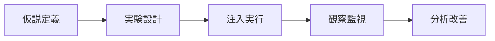

# 課題40: AWS FIS によるカオスエンジニアリング

**難易度: 🟡 中級**

---

## 分類情報

| 項目 | 内容 |
|------|------|
| 難易度 | 中級 |
| カテゴリ | 信頼性エンジニアリング / カオスエンジニアリング |
| 処理タイプ | バッチ |
| 使用IaC | Terraform |
| 想定所要時間 | 5-6時間 |

---

## シナリオ

### 企業プロファイル

| 項目 | 内容 |
|------|------|
| **企業名** | 〇〇株式会社 |
| **業種** | 大規模ECプラットフォーム |
| **設立** | 2015年 |
| **従業員** | 500名 |
| **事業** | BtoC総合EC（年間取扱高1000億円） |
| **月間PV** | 5億 |
| **会員数** | 1500万人 |
| **DAU** | 200万人 |

**システム規模:**
- API Gateway + Lambda + ECS Fargate (300+ tasks)
- Aurora MySQL (Multi-AZ) + ElastiCache (6 nodes)
- OpenSearch (6 nodes) + S3 + CloudFront
- 3 AZ構成、マイクロサービス50+

**過去のインシデント:**

| 時期 | 障害内容 | 影響 |
|------|----------|------|
| 2023/01 | AZ障害でDB failover遅延 | 2時間のダウンタイム |
| 2023/06 | キャッシュノード障害 | 30分の性能劣化 |
| 2023/09 | デプロイ時のメモリリーク | 段階的サービス停止 |
| 2023/11 | 外部API障害の伝播 | 決済システム全停止 |

**年間損失**: 推定5000万円（売上機会損失 + 対応工数）

**目指す姿 - Chaos Engineering による継続的な耐障害性検証:**
- 計画的な障害注入による弱点の発見
- 自動回復メカニズムの検証
- GameDay演習による運用チームの訓練
- SLO/SLI に基づく信頼性の定量化

### カオスエンジニアリングの原則

**5つの原則:**

| # | 原則 | 説明 |
|---|------|------|
| 1 | 定常状態の仮説を立てる | "システムは正常な状態でどう振る舞うか" |
| 2 | 実世界のイベントを模倣する | サーバー停止、ネットワーク遅延、依存サービス障害 |
| 3 | 本番環境で実験する | 可能な限り本番に近い環境で |
| 4 | 継続的に自動化する | CI/CDパイプラインに組み込む |
| 5 | 影響範囲を最小化する | 段階的に、すぐ中止できるように |

**実験の流れ:**



**仮説の例:** "ECSタスクが50%停止しても、レスポンスタイムは2秒以内を維持し、エラー率は1%未満である"

### ビジネス要件と KPI

**信頼性目標（SLO）:**

| 指標 | 現状 | 目標 | SLO |
|------|------|------|-----|
| 可用性 | 99.5% | 99.95% | 99.9% |
| P99レイテンシ | 3秒 | 1秒 | < 2秒 |
| エラー率 | 2% | 0.1% | < 0.5% |
| MTTR（復旧時間） | 60分 | 10分 | < 15分 |
| MTTD（検知時間） | 15分 | 2分 | < 5分 |

**カオス実験目標:**

| 項目 | 目標 |
|------|------|
| 月間実験回数 | 20回以上 |
| 発見した脆弱性 | 毎月3件以上 |
| 改善実施率 | 90%以上 |
| GameDay頻度 | 四半期ごと |

**検証対象の障害パターン:**

| カテゴリ | 障害パターン |
|----------|--------------|
| インスタンス | EC2/ECS停止、CPU高負荷、メモリ枯渇 |
| ネットワーク | 遅延注入、パケットロス、DNS障害 |
| データベース | フェイルオーバー、接続数枯渇 |
| キャッシュ | ノード障害、キャッシュクリア |
| 外部依存 | API遅延、タイムアウト、503エラー |
| AZ障害 | 単一AZ完全停止 |

---

## 達成目標

### 習得スキル

**主要スキル:**

| スキル領域 | 習得内容 |
|-----------|----------|
| **AWS FIS** | 実験テンプレート設計、アクション（障害注入）の種類、ターゲット選択（タグ、ARN、フィルタ）、停止条件（Stop Conditions） |
| **障害シナリオ設計** | EC2/ECS障害、RDS/Aurora障害、ネットワーク障害、AZ障害 |
| **定常状態の定義と監視** | SLI/SLO設計、CloudWatch Synthetics、CloudWatch Alarms、ダッシュボード設計 |
| **Terraformによる実装** | FIS実験テンプレート、IAMロール設計、監視リソース、モジュール化 |

**副次スキル:**
- 信頼性エンジニアリングの原則
- GameDay企画・運営
- インシデント対応改善
- ポストモーテム文化

---

## 使用するAWSサービス

### コアサービス

| サービス | 用途 | 重要度 |
|----------|------|--------|
| **FIS** | 障害注入実験 | ★★★★★ |
| **CloudWatch** | 監視・アラート | ★★★★★ |
| **Systems Manager** | EC2/ECS操作 | ★★★★☆ |
| **EventBridge** | 実験スケジューリング | ★★★☆☆ |

### 対象サービス（障害注入先）

| サービス | 障害パターン | 重要度 |
|----------|--------------|--------|
| **EC2** | 停止、CPU負荷、メモリ | ★★★★☆ |
| **ECS** | タスク停止 | ★★★★★ |
| **RDS/Aurora** | フェイルオーバー | ★★★★★ |
| **ElastiCache** | ノードリブート | ★★★★☆ |
| **VPC** | ネットワーク遅延 | ★★★☆☆ |

---

## 前提条件

### 必要な環境

```bash
# Terraform バージョン確認
terraform --version
# Terraform v1.5.0 以上

# AWS CLI バージョン確認
aws --version
# aws-cli/2.x.x 以上

# jq（JSON処理用）
jq --version
```

### AWS環境の準備

```bash
# 環境変数設定
export AWS_REGION=ap-northeast-1
export PROJECT_NAME=chaos-engineering
export ENVIRONMENT=chaos

# 作業ディレクトリ作成
mkdir -p ~/chaos-engineering/{terraform,experiments,scripts,dashboards}
cd ~/chaos-engineering/terraform
```

### 実験対象環境の前提

```
この課題では、以下のような環境が既に存在することを前提とします：
- ECS Fargateクラスター（複数タスク）
- Aurora MySQLクラスター（Multi-AZ）
- ElastiCacheクラスター
- ALB + ターゲットグループ
- CloudWatch監視設定

※実際の環境がない場合は、簡易的なサンプル環境を構築します
```

---

## アーキテクチャ設計

### カオスエンジニアリング基盤


| コンポーネント | 役割 |
|----------------|------|
| **EventBridge Scheduler** | カオス実験のスケジュール実行 |
| **AWS FIS Conductor** | 障害注入実験の統制・実行 |
| **CloudWatch Monitor** | 実験中のメトリクス監視・Stop Condition判定 |
| **IAM Role for FIS** | FISが各リソースを操作するための権限 |
| **ECS Fargate** | 障害注入対象（タスク停止実験） |
| **Aurora MySQL** | 障害注入対象（フェイルオーバー実験） |
| **ElastiCache Redis** | 障害注入対象（ノード障害実験） |
| **EC2 Fleet** | 障害注入対象（インスタンス停止/CPU負荷実験） |
| **AZ-a/c/d** | マルチAZ構成（AZ障害シミュレーション対象） |

**実験パターン:**
1. ECS Task停止 → Auto Recovery検証
2. Aurora Failover → DB切り替え時間検証
3. Cache Node障害 → Fallback動作検証
4. Network遅延 → タイムアウト設定検証
5. AZ障害 → マルチAZ回復力検証

### FIS実験テンプレート構造

**Experiment Template 構成要素:**

| 要素 | 説明 |
|------|------|
| **Description** | 実験の説明 |
| **StopConditions** | 緊急停止条件（CloudWatch Alarm ARN） |
| **Targets** | 障害注入対象 |
| - ResourceType | aws:ecs:task / aws:ec2:instance |
| - ResourceTags | {"Environment": "chaos"} |
| - Filters | タスク数、インスタンス状態等 |
| - SelectionMode | COUNT(n) / PERCENT(p) |
| **Actions** | 障害注入アクション |
| - ActionId | aws:ecs:stop-task |
| - Parameters | 停止タスク数等 |
| - Targets | 対象リソース参照 |
| - StartAfter | 前のアクション依存 |
| - Duration | 実行時間 |
| **RoleArn** | FIS実行用IAMロール |

**アクション種類:**

| カテゴリ | アクション |
|----------|-----------|
| **EC2** | `aws:ec2:stop-instances`, `aws:ec2:terminate-instances` |
| **ECS** | `aws:ecs:stop-task`, `aws:ecs:drain-container-instances` |
| **RDS** | `aws:rds:failover-db-cluster`, `aws:rds:reboot-db-instances` |
| **Network** | `aws:network:route-table-disrupt`, `aws:network:transit-gateway-disrupt` |
| **SSM** | `aws:ssm:send-command` (CPU負荷等) |
| **ElastiCache** | `aws:elasticache:reboot-cache-cluster` |

---

## トラブルシューティング演習

### 演習8-1: 実験が予期せず停止

```
┌─────────────────────────────────────────────────────────────────┐
│              トラブルシューティング演習 8-1                      │
│                実験が予期せず停止                                │
├─────────────────────────────────────────────────────────────────┤
│                                                                  │
│  【状況】                                                        │
│  ECSタスク停止実験を開始したところ、すぐに実験が                 │
│  「stopped」状態になり、障害注入が完了していない。               │
│                                                                  │
│  【エラーログ】                                                  │
│  ┌─────────────────────────────────────────────────────────────┐│
│  │  Experiment stopped: Stop condition triggered                ││
│  │  Alarm: shopnow-chaos-fis-stop-condition                     ││
│  │  State: ALARM                                                ││
│  └─────────────────────────────────────────────────────────────┘│
│                                                                  │
│  【課題】                                                        │
│  1. Stop Conditionが発動した原因を調査してください               │
│  2. 適切なStop Condition閾値を検討してください                   │
│  3. 既存のエラーと実験由来のエラーを区別する方法を提案           │
│                                                                  │
└─────────────────────────────────────────────────────────────────┘
```

**解決策例**

```bash
# 1. Stop Conditionアラームの状態履歴を確認
aws cloudwatch describe-alarm-history \
  --alarm-name "shopnow-chaos-fis-stop-condition" \
  --start-date $(date -d "1 hour ago" --iso-8601=seconds) \
  --query 'AlarmHistoryItems[*].[Timestamp,HistorySummary]' \
  --output table

# 2. 実験前のベースラインエラー率を確認
aws cloudwatch get-metric-statistics \
  --namespace AWS/ApplicationELB \
  --metric-name HTTPCode_Target_5XX_Count \
  --start-time $(date -d "1 hour ago" --iso-8601=seconds) \
  --end-time $(date --iso-8601=seconds) \
  --period 60 \
  --statistics Sum \
  --dimensions Name=LoadBalancer,Value=app/shopnow-chaos-alb/xxxxx

# 3. 改善案: Anomaly Detection ベースのStop Condition
```

```hcl
# 異常検知ベースのStop Condition
resource "aws_cloudwatch_metric_alarm" "stop_condition_anomaly" {
  alarm_name          = "${var.name_prefix}-fis-stop-condition-anomaly"
  comparison_operator = "GreaterThanUpperThreshold"
  evaluation_periods  = 2
  threshold_metric_id = "ad1"

  metric_query {
    id          = "m1"
    return_data = true
    metric {
      metric_name = "HTTPCode_Target_5XX_Count"
      namespace   = "AWS/ApplicationELB"
      period      = 60
      stat        = "Sum"
      dimensions = {
        LoadBalancer = var.alb_arn_suffix
      }
    }
  }

  metric_query {
    id          = "ad1"
    expression  = "ANOMALY_DETECTION_BAND(m1, 2)"
    label       = "ErrorRateAnomalyBand"
    return_data = true
  }

  alarm_description = "Stop FIS if error rate shows anomalous increase"
  actions_enabled   = false
}
```

### 演習8-2: 自動回復が機能しない

**状況:**
ECSタスクを30%停止した後、新しいタスクが起動せず、サービスが縮退したままになっている。

**観測されている状態:**
```
Desired tasks: 10
Running tasks: 7
Pending tasks: 3 (30分以上)

Recent events:
- service unable to place task
- Reason: no container instance met all requirements
```

**課題:**
1. 新しいタスクが起動しない原因を特定してください
2. ECSサービスの設定を改善してください
3. 自動回復を検証する手順を策定してください

### 演習8-3: フェイルオーバー時間の超過

**状況:**
Aurora Failover実験を実施したところ、フェイルオーバー自体は成功したが、アプリケーションの復旧に5分以上かかった。SLO目標は30秒以内。

**観測されたタイムライン:**

| 経過時間 | イベント |
|----------|----------|
| T+0s | Failover開始 |
| T+15s | 新Writer昇格完了 |
| T+30s | DNSエンドポイント更新 |
| T+180s | アプリケーション接続再開始 |
| T+300s | 全コネクション復旧 |

**課題:**
1. アプリケーション復旧に時間がかかった原因を特定
2. 接続プール設定の改善案を提案
3. より迅速な復旧を実現する方法を検討

---

## 設計課題

### 設計課題9-1: GameDay計画書の作成

**課題:**
運用チーム向けに、四半期ごとに実施するGameDay（障害対応訓練）の計画書を作成してください。

**含めるべき内容:**
- 目的と学習目標
- 参加者と役割（司会、オブザーバー、対応者）
- シナリオ（3段階の障害エスカレーション）
- タイムライン（準備→実施→振り返り）
- 成功基準（MTTR、コミュニケーション、手順遵守）
- 安全措置（中止条件、ロールバック手順）

**成果物:**
1. GameDay計画書（Markdownドキュメント）
2. 障害シナリオシート（3シナリオ）
3. 振り返りテンプレート

### 設計課題9-2: SLO/SLIダッシュボード設計

**課題:**
カオス実験の効果を定量的に測定するためのSLO/SLIダッシュボードを設計してください。

**要件:**
- 可用性SLI（99.9%目標）のリアルタイム表示
- レイテンシSLI（p99 < 2秒）のヒストグラム
- エラーバジェット残量の可視化
- 過去30日間のSLO達成状況
- カオス実験実施履歴との相関

**成果物:**
1. SLO/SLI定義書
2. CloudWatchダッシュボードのTerraformコード
3. エラーバジェット計算ロジック

---

## 発展課題

### 発展課題10-1: CI/CDパイプラインへの統合

**シナリオ:**
デプロイパイプラインにカオス実験を組み込み、本番デプロイ前に自動で耐障害性テストを実施したい。

**技術要件:**
- CodePipeline/GitHub Actionsとの統合
- ステージング環境での自動実験実行
- 実験結果による承認ゲート
- 失敗時の自動ロールバック

**成果物:**
1. パイプライン設計図
2. GitHub Actions ワークフローYAML
3. 結果判定ロジック

### 発展課題10-2: マルチリージョン障害訓練

**シナリオ:**
マルチリージョン構成に拡大した場合のリージョン障害訓練を設計してください。

**技術要件:**
- 東京リージョン完全停止のシミュレーション
- Route 53フェイルオーバーの検証
- データレプリケーション整合性の確認
- 復旧手順の自動化

**成果物:**
1. マルチリージョン障害対応手順書
2. リージョンフェイルオーバー実験テンプレート
3. RPO/RTO検証レポートテンプレート

---

## 学習のまとめ

### 学習チェックリスト

**カオスエンジニアリング基礎:**
- [ ] カオスエンジニアリングの5原則を説明できる
- [ ] 定常状態の仮説を立てることができる
- [ ] 実験の影響範囲を制御する方法を理解した
- [ ] GameDayの企画・運営ができる

**AWS FIS:**
- [ ] 実験テンプレートを設計・作成できる
- [ ] 適切なStop Conditionを設定できる
- [ ] 各種アクション（EC2, ECS, RDS等）を使い分けられる
- [ ] TerraformでFISリソースを管理できる

**監視と分析:**
- [ ] SLO/SLIを定義できる
- [ ] CloudWatch Syntheticsで外形監視を設定できる
- [ ] 実験結果を分析し、改善点を特定できる
- [ ] ダッシュボードで可視化できる

**運用:**
- [ ] 安全に本番環境で実験を実施できる
- [ ] インシデント対応手順を改善できる
- [ ] ポストモーテムを作成できる
- [ ] 継続的な改善サイクルを回せる

### カオスエンジニアリング成熟度モデル

| Level | 段階 | 内容 |
|-------|------|------|
| **Level 1** | 初期段階 | 手動での障害テスト、開発環境のみ、ドキュメント化されていない |
| **Level 2** | 管理段階 | FISによる自動化された実験、ステージング環境での定期実行、実験結果のドキュメント化 |
| **Level 3** | 定義段階 ← 本課題の目標 | 本番環境での安全な実験、SLO/SLIに基づく評価、GameDayの定期開催 |
| **Level 4** | 最適化段階 | CI/CDパイプラインへの統合、継続的な実験と改善、組織全体への展開 |

---

## コスト見積もり

### 想定コスト（月額）

**FIS実験コスト:**

| 項目 | 数量 | 月額（USD） |
|------|------|-------------|
| FIS実験（アクション分） | 100アクション | $10 |
| CloudWatch Logs | 5GB | $2.50 |
| **小計** | | **約 $12.50** |

**監視コスト:**

| 項目 | 数量 | 月額（USD） |
|------|------|-------------|
| CloudWatch Alarms | 10アラーム | $1.00 |
| CloudWatch Dashboards | 3ダッシュボード | $9.00 |
| CloudWatch Synthetics | 1 canary/1min | $7.92 |
| CloudWatch Metrics | カスタム10個 | $3.00 |
| **小計** | | **約 $20.92** |

**サンプルワークロード（オプション）:**

| 項目 | 数量 | 月額（USD） |
|------|------|-------------|
| ECS Fargate | 2 vCPU × 3タスク | $88 |
| Aurora Serverless v2 | 最小ACU | $43 |
| ALB | 1 ALB | $22 |
| NAT Gateway | 1 NAT | $32 |
| **小計** | | **約 $185** |

**総計:**
- FIS + 監視のみ: 約 $33/月 (約 ¥5,000)
- サンプル環境込み: 約 $218/月 (約 ¥33,000)

**📝 補足:**
- FISの料金はアクション分単位で課金
- 本番環境への適用時は追加コストなし

---

## リソースのクリーンアップ

```bash
# Terraformリソース削除
cd ~/chaos-engineering/terraform
terraform destroy -auto-approve

# 確認
aws fis list-experiment-templates \
  --query "experimentTemplates[?contains(tags.Name, 'chaos')]"

# S3バケット（Syntheticsアーティファクト）の手動削除が必要な場合
aws s3 rb s3://chaos-synthetics-$(aws sts get-caller-identity --query Account --output text) --force

echo "Cleanup completed!"
```

---

**次の課題**: [課題41](exercise-41.md)

**前の課題**: [課題39: AWS コスト最適化](exercise-39.md)
