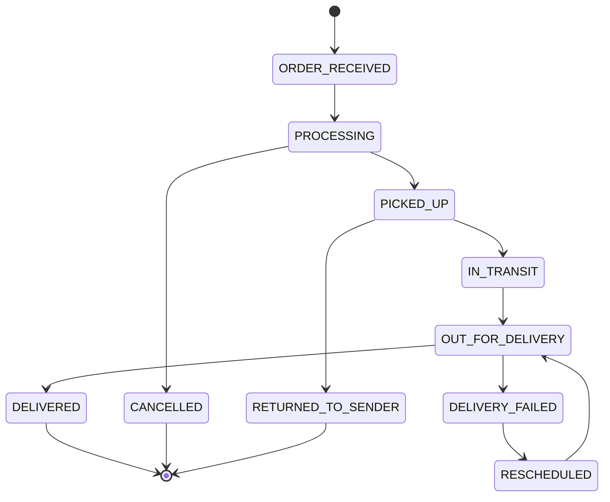

# 課題42: 物流企業のイベント駆動配送管理

**難易度: 🟡 中級**

---

## 1. 分類情報

| 項目 | 内容 |
|------|------|
| 難易度 | 中級 |
| カテゴリ | マイクロサービス・API |
| 処理タイプ | 非同期 |
| 使用IaC | CDK |
| 想定所要時間 | 5-6時間 |

---

## 2. シナリオ

### 企業プロフィール
**〇〇株式会社**は、EC事業者向けの配送代行サービスを提供する物流企業です。日次配送件数は1万件を超え、荷主、倉庫、配送ドライバー、エンドユーザーなど多くのステークホルダーと連携しています。

### 現状の課題
配送状況の通知システムが各所に分散し、リアルタイム性と一貫性に問題があります：

1. **通知の遅延**：配送状況の更新がバッチ処理のため、30分〜1時間遅れる
2. **通知漏れ**：システム間連携の不整合で、通知が届かないケースが発生
3. **拡張性の低さ**：新しい通知チャネル（LINE、アプリプッシュ）の追加が困難
4. **トレーサビリティ不足**：配送の状態遷移履歴が追跡しにくい

### 数値で見る問題
- 通知遅延：平均 **45分**
- 通知漏れ率：**2%**（月200件）
- 顧客問い合わせ：月 **500件**（「荷物はどこ？」）
- 新チャネル追加：**3ヶ月**かかる

### 成功指標（KPI）
| 指標 | 現状 | 目標 |
|------|------|------|
| 通知遅延 | 45分 | 1分以内 |
| 通知漏れ率 | 2% | 0.1%以下 |
| 顧客問い合わせ | 500件/月 | 100件/月 |
| 新チャネル追加 | 3ヶ月 | 1週間 |

---

## 3. 達成目標

### 技術的な学習ポイント
1. EventBridgeを使ったイベント駆動アーキテクチャの構築
2. Fan-outパターンによる複数通知チャネルへの配信
3. DynamoDB Streamsによるイベント発行
4. デッドレターキューによるエラーハンドリング

### 実務で活かせる知識
- EventBridge Rules / Event Bus の設計
- Lambda と SQS / SNS の連携
- イベントスキーマの設計
- 冪等性の実装

---

## 4. 学習するAWSサービス

### コアサービス
| サービス | 用途 | 重要度 |
|----------|------|--------|
| EventBridge | イベントバス・ルーティング | 高 |
| Lambda | イベント処理 | 高 |
| SQS | メッセージキューイング | 高 |
| SNS | Fan-out配信 | 高 |
| DynamoDB | 配送データ・イベント履歴 | 高 |

### 補助サービス
| サービス | 用途 |
|----------|------|
| API Gateway | 外部システム連携API |
| SES | メール通知 |
| CloudWatch | ログ・メトリクス・アラーム |
| X-Ray | 分散トレーシング |
| Step Functions | 複雑なワークフロー |

---

## 5. 前提条件

### 必要な知識
- イベント駆動アーキテクチャの基本概念
- AWS Lambda の基本操作
- TypeScript の基礎

### 事前準備
1. AWSアカウント
2. AWS CLI v2
3. Node.js 18.x
4. AWS CDK CLI

---

## 6. アーキテクチャ概要

### システム構成図

| コンポーネント | 役割 |
|----------------|------|
| **WMS Warehouse** | 倉庫管理システム（イベントソース） |
| **TMS Transport** | 輸送管理システム（イベントソース） |
| **Driver App** | 配達員モバイルアプリ（イベントソース） |
| **External API** | 外部システム連携API |
| **API Gateway** | イベント受信エンドポイント |
| **Lambda EventIngestion** | イベント検証・正規化 |
| **EventBridge Custom Event Bus** | イベントルーティング・フィルタリング |
| **SNS Customer** | 顧客向け通知のFan-out |
| **SQS Shipper** | 荷主向け通知キュー |
| **Lambda Dashboard** | ダッシュボード更新処理 |
| **S3 Archive** | イベント履歴保存 |
| **Lambda Email/SMS/Push** | 各通知チャネル処理 |
| **SES/SNS SMS/Pinpoint** | 通知送信サービス |

**EventBridge Rules:**
- NotifyCustomer: status = OUT_FOR_DELIVERY, DELIVERED
- NotifyShipper: status = *
- UpdateDashboard: status = *
- Archive: status = *

### イベントフロー

---

## 7. トラブルシューティング課題

### Challenge 1: イベントの重複処理
**状況**: 同じ配送ステータス更新が複数回処理されている

**調査ポイント**:
1. Lambda の冪等性実装を確認
2. SQS のVisibility Timeoutを確認
3. DynamoDB の条件付き書き込みを確認

### Challenge 2: 通知の順序保証
**状況**: OUT_FOR_DELIVERY より先に DELIVERED の通知が届く

**調査ポイント**:
1. SQS FIFO キューの利用を検討
2. イベントにシーケンス番号を付与
3. 消費側での順序制御

### Challenge 3: 外部Webhookのタイムアウト
**状況**: 荷主のWebhookが応答しない場合にLambdaがタイムアウト

**調査ポイント**:
1. Webhook呼び出しのタイムアウト設定
2. 非同期呼び出しへの変更
3. Circuit Breakerパターンの導入

---

## 8. 設計考慮ポイント

### ディスカッション1: イベントスキーマの設計
**テーマ**: スキーマバージョニングと互換性

| 戦略 | メリット | デメリット |
|------|----------|------------|
| バージョン埋め込み | 明示的 | スキーマ増加 |
| 後方互換性維持 | シンプル | 制約が多い |
| イベントストア | 完全な履歴 | 複雑性増加 |

### ディスカッション2: At-least-once vs Exactly-once
**テーマ**: メッセージ配信保証

**考慮点**:
- SQS標準キューは At-least-once
- 冪等性の実装が必須
- FIFO キューでの重複排除

### ディスカッション3: Fan-outパターン
**テーマ**: SNS vs EventBridge

| 観点 | SNS | EventBridge |
|------|-----|-------------|
| フィルタリング | シンプル | 高度 |
| ターゲット数 | 多い | 5ルール/バス |
| スキーマレジストリ | なし | あり |

---

## 9. 発展課題

### Advanced 1: Event Replay 機能
**課題**: EventBridge Archive を使って、特定期間のイベントを再処理

### Advanced 2: CQRS + Event Sourcing
**課題**: イベントストアを構築し、配送状態を完全に再構築可能に

### Advanced 3: Step Functions Saga
**課題**: 複雑な配送ワークフロー（ピックアップ→配送→返品）をStep Functionsで実装

---

## 10. コスト見積もり

### 月額コスト概算

| サービス | 使用量 | 月額コスト |
|----------|--------|------------|
| EventBridge | 100万イベント | $1 |
| Lambda | 100万回 × 1秒 × 256MB | $2 |
| SQS | 100万メッセージ | $0.40 |
| SNS | 100万通知 | $0.50 |
| DynamoDB | 10GB + 100万WCU/RCU | $30 |
| SES | 10万通 | $1 |
| CloudWatch | ログ10GB | $5 |

**合計**: 約 **$40/月**（約6,000円）

---

## 11. 学習のポイント

### 重要な概念の整理

1. **イベント駆動アーキテクチャ**
   - 疎結合で拡張性が高い
   - 新しい消費者を簡単に追加
   - 障害の分離

2. **冪等性**
   - 同じイベントを複数回処理しても結果が同じ
   - DynamoDBの条件付き書き込み活用
   - イベントIDでの重複チェック

3. **Fan-outパターン**
   - 1つのイベントを複数の消費者に配信
   - SNS + SQSの組み合わせ
   - フィルタリングによる効率化

### 次のステップ
1. リアルタイムダッシュボードの構築
2. 機械学習による配送時間予測
3. 異常検知アラートの実装
