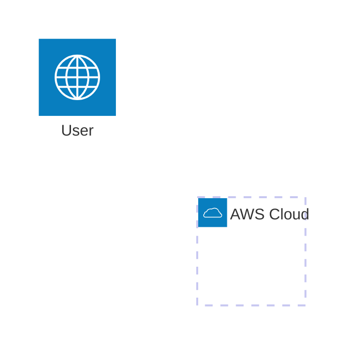

# 課題N: {課題タイトル}

<!-- 難易度バッジ: 以下から選択 -->
<!-- 🟢 初級 | 🟡 中級 | 🔴 上級 | 🟣 エキスパート -->

**難易度: 🟡 中級**

---

## 分類情報

| 項目 | 内容 |
|------|------|
| 難易度 | 初級〜中級 |
| カテゴリ | {AI / データ分析 / Web / セキュリティ / DevOps など} |
| 処理タイプ | {リアルタイム / バッチ / 非同期 / ストリーミング} |
| 使用IaC | {CloudFormation / CDK / Terraform / SAM} |
| 想定所要時間 | {目安時間} |

---

## 学習するAWSサービス

この演習では以下のAWSサービスを実践的に学習します。

### メインサービス

| サービス | 役割 | 学習ポイント |
|----------|------|-------------|
| **{サービス名}** | {このシステムでの役割} | {何を学べるか} |
| **{サービス名}** | {このシステムでの役割} | {何を学べるか} |

### 補助サービス

| サービス | 役割 |
|----------|------|
| **Amazon CloudWatch** | ログ・メトリクス・アラート監視 |
| **AWS IAM** | サービス間の権限管理 |

---

## 最終構成図

<!-- mermaid記法で構成図を記載 -->
<!-- 参考: https://mermaid.js.org/syntax/architecture.html -->



### システム構成の説明

| レイヤー | コンポーネント | 説明 |
|----------|----------------|------|
| **{レイヤー名}** | {コンポーネント} | {説明} |

---

## シナリオ

### 企業プロフィール

**{企業名}**は、{企業の簡単な説明}。

| 項目 | 内容 |
|------|------|
| 業種 | {業種} |
| 従業員数 | {人数}（関連スタッフ数も） |
| 月間アクティブユーザー | {ユーザー数} |
| インフラ予算 | {月額予算} |

### 現状の課題

{現状の課題を2-3文で説明}

### 数値で示された問題

| 指標 | 現状 | 目標/業界平均 |
|------|------|---------------|
| {指標1} | {現状値} | {目標値} |
| {指標2} | {現状値} | {目標値} |

### 解決したいこと

1. {解決したいこと1}
2. {解決したいこと2}
3. {解決したいこと3}

### 成功指標（KPI）

| KPI | 現状 | 目標 |
|-----|------|------|
| {KPI1} | {現状} | {目標} |
| {KPI2} | {現状} | {目標} |

---

## 達成目標

この演習で習得できるスキル：

### 技術的な学習ポイント

1. **{学習ポイント1}**
   - {詳細}
   - {詳細}

2. **{学習ポイント2}**
   - {詳細}

### 実務で活かせる知識

- {知識1}
- {知識2}

---

## 前提条件

### 必要な事前知識

- {知識1}
- {知識2}

### 準備するもの

1. **AWSアカウント**
   - {必要な設定やモデルアクセスなど}

2. **開発環境**
   - AWS CLI v2（設定済み）
   - {その他必要なツール}

### 必要なIAM権限

以下の権限が必要です（事前に確認してください）：

```
- {サービス}:{アクション}
- {サービス}:{アクション}
```

---

<!-- ============================================== -->
<!-- ここから下はオプションセクション -->
<!-- 必要に応じて追加・削除してください -->
<!-- ============================================== -->

## 使用するAWSサービス（詳細）

<!-- オプション: より詳細な選定理由を記載したい場合 -->

### メインサービス

| サービス | 役割 | 選定理由 |
|----------|------|----------|
| **{サービス名}** | {役割} | {なぜこのサービスを選んだか} |

### 補助サービス

| サービス | 役割 |
|----------|------|
| **{サービス名}** | {役割} |

---

## ヒント

<!-- オプション: 詰まったときのヒントを段階的に提供 -->

<details>
<summary>ヒント1: {ヒントのタイトル}</summary>

{ヒントの内容}

</details>

<details>
<summary>ヒント2: {ヒントのタイトル}</summary>

{ヒントの内容}

</details>

<details>
<summary>ヒント3: アーキテクチャの参考</summary>

```
{テキストベースの構成図やデータフロー}
```

</details>

---

## よくある間違い

<!-- オプション: 初心者が陥りやすいミス -->

| ミス | 原因 | 対処法 |
|------|------|--------|
| {ミス1} | {原因} | {対処法} |
| {ミス2} | {原因} | {対処法} |

---

## トラブルシューティング課題

<!-- オプション: 意図的にトラブルを経験させる課題 -->

### 問題1: {問題タイトル}

**症状:**
```
{エラーメッセージや症状}
```

**ヒント:**
1. {ヒント1}
2. {ヒント2}

<details>
<summary>解決方法を見る</summary>

{解決方法}

</details>

---

## 設計の考察ポイント

<!-- オプション: なぜこの設計なのか考えさせる -->

### 1. {考察ポイント1}

**考えてみよう:**
- {質問1}
- {質問2}

**代替案:**
- {代替案1}: {メリット/デメリット}

---

## 発展課題

<!-- オプション: 余力がある人向けの追加課題 -->

### 1. {発展課題1}
- {概要}

### 2. {発展課題2}
- {概要}

---

## 想定コストと削減方法

<!-- オプション: コスト意識を持たせる -->

### 月額概算コスト（{想定利用量}）

| サービス | 内訳 | 月額コスト |
|----------|------|------------|
| {サービス} | {内訳} | ${金額} |
| **合計** | | **${合計}（約{円}円）** |

### コスト削減のポイント

1. **{削減ポイント1}**
   - {説明}

---

## クリーンアップチェックリスト

<!-- オプション: リソース削除漏れ防止 -->

演習終了後、以下のリソースを削除してください：

- [ ] {リソース1}
- [ ] {リソース2}
- [ ] {リソース3}
- [ ] CloudWatchロググループ
- [ ] IAMロール・ポリシー

---

## 学習のポイント

<!-- オプション: 演習後のまとめ -->

### 1. {ポイント1}
{説明}

### 2. {ポイント2}
{説明}

---

## 次のステップ

<!-- オプション: 関連演習への誘導 -->

この演習を終えたら、以下の演習に挑戦してみましょう：

- [課題X: {関連課題}](../exercise-XX.md) - {どんな学びがあるか}
- [課題Y: {関連課題}](../exercise-YY.md) - {どんな学びがあるか}
